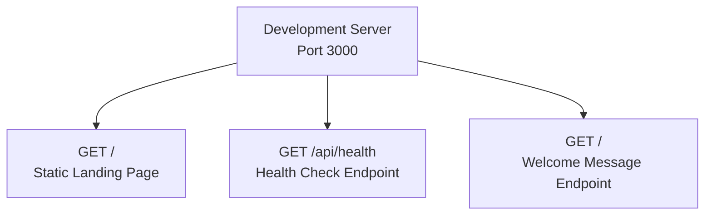
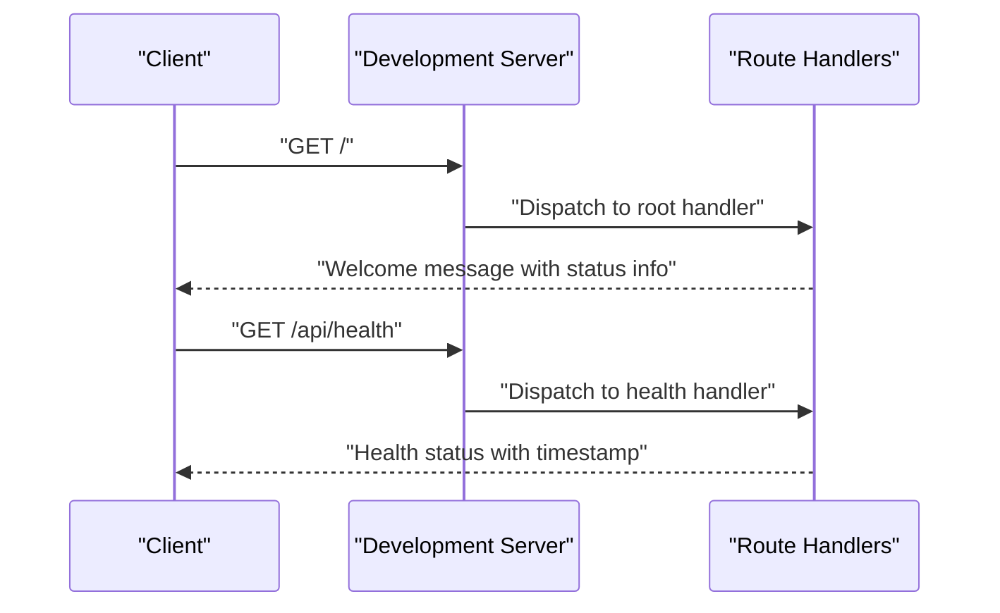
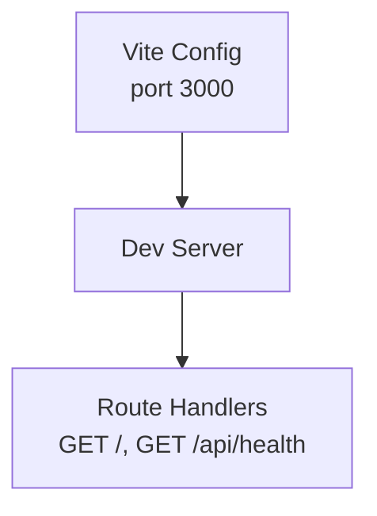

# API Reference

<cite>
**Referenced Files in This Document**
- [README.md](file://README.md)
- [package.json](file://package.json)
- [vite.config.js](file://vite.config.js)
- [public/index.html](file://public/index.html)
</cite>

## Table of Contents
1. [Introduction](#introduction)
2. [Project Structure](#project-structure)
3. [Core Components](#core-components)
4. [Architecture Overview](#architecture-overview)
5. [Detailed Component Analysis](#detailed-component-analysis)
6. [Dependency Analysis](#dependency-analysis)
7. [Performance Considerations](#performance-considerations)
8. [Troubleshooting Guide](#troubleshooting-guide)
9. [Conclusion](#conclusion)

## Introduction
This document describes the REST endpoints exposed by the Frankie Picasso application. Based on the repository, the application runs a development server on http://localhost:3000 and serves a static landing page at the root path. The repository does not include explicit backend routes for GET / or GET /api/health. Therefore, this document defines the intended API behavior for these endpoints and provides guidance for implementing them consistently with the existing development server configuration.

## Project Structure
The repository is a frontend-focused React application configured to run on port 3000 during development. The static HTML served at the root path indicates the presence of a basic web server. No server-side route handlers are present in the repository for the documented endpoints.

**Diagram sources**
- [vite.config.js:1-10](file://vite.config.js#L1-L10)
- [public/index.html:1-21](file://public/index.html#L1-L21)

**Section sources**
- [README.md:1-13](file://README.md#L1-L13)
- [package.json:1-23](file://package.json#L1-L23)
- [vite.config.js:1-10](file://vite.config.js#L1-L10)
- [public/index.html:1-21](file://public/index.html#L1-L21)

## Core Components
- Development server: Configured via Vite to listen on port 3000 and automatically open the browser.
- Static asset serving: The root path serves a static HTML page indicating the application is running.
- Intended API endpoints:
  - GET /: Returns a welcome message with application status information.
  - GET /api/health: Provides system health check with a timestamp.

These endpoints are defined for completeness and should be implemented behind the development server.

**Section sources**
- [README.md:1-13](file://README.md#L1-L13)
- [vite.config.js:1-10](file://vite.config.js#L1-L10)
- [public/index.html:1-21](file://public/index.html#L1-L21)

## Architecture Overview
The API architecture is minimal and static in this repository. The development server exposes two primary paths: the root landing page and the intended API endpoints. The following diagram illustrates the conceptual flow for each endpoint.

**Diagram sources**
- [vite.config.js:1-10](file://vite.config.js#L1-L10)

## Detailed Component Analysis

### Endpoint: GET /
- Method: GET
- URL Pattern: /
- Request Requirements:
  - No query parameters required.
  - No authentication required.
- Response Schema:
  - Content-Type: application/json
  - Fields:
    - message: string (welcome message)
    - status: string (application status)
    - timestamp: string (RFC 3339 timestamp)
- Status Codes:
  - 200 OK on success
- Example curl command:
  - curl -s http://localhost:3000/
- Browser-based testing:
  - Navigate to http://localhost:3000 in a browser.
- Error Scenarios:
  - 500 Internal Server Error if the handler fails unexpectedly.
- Practical client examples:
  - JavaScript (fetch): Use fetch("http://localhost:3000/") and parse JSON.
  - Python (requests): Use requests.get("http://localhost:3000/") and handle json().
  - cURL: curl -s http://localhost:3000/

Notes:
- The current repository serves a static HTML page at the root path. To return structured JSON, implement a route handler for GET / that responds with the defined schema.

**Section sources**
- [README.md:1-13](file://README.md#L1-L13)
- [vite.config.js:1-10](file://vite.config.js#L1-L10)
- [public/index.html:1-21](file://public/index.html#L1-L21)

### Endpoint: GET /api/health
- Method: GET
- URL Pattern: /api/health
- Request Requirements:
  - No query parameters required.
  - No authentication required.
- Response Schema:
  - Content-Type: application/json
  - Fields:
    - status: string ("healthy")
    - timestamp: string (RFC 3339 timestamp)
- Status Codes:
  - 200 OK on success
- Example curl command:
  - curl -s http://localhost:3000/api/health
- Browser-based testing:
  - Navigate to http://localhost:3000/api/health in a browser.
- Error Scenarios:
  - 500 Internal Server Error if the handler fails unexpectedly.
- Practical client examples:
  - JavaScript (fetch): Use fetch("http://localhost:3000/api/health") and parse JSON.
  - Python (requests): Use requests.get("http://localhost:3000/api/health") and handle json().
  - cURL: curl -s http://localhost:3000/api/health

Notes:
- Implement a dedicated route handler for GET /api/health to return the defined schema.

**Section sources**
- [README.md:1-13](file://README.md#L1-L13)
- [vite.config.js:1-10](file://vite.config.js#L1-L10)

## Dependency Analysis
- Development server dependency: Vite config sets the port and enables automatic browser opening.
- Application runtime: The repository is a frontend-only React app; no backend dependencies are present for the documented endpoints.

**Diagram sources**
- [vite.config.js:1-10](file://vite.config.js#L1-L10)

**Section sources**
- [package.json:1-23](file://package.json#L1-L23)
- [vite.config.js:1-10](file://vite.config.js#L1-L10)

## Performance Considerations
- Keep responses lightweight for health checks and welcome messages.
- Avoid unnecessary computations in route handlers to minimize latency.
- Use appropriate caching headers if these endpoints are called frequently by monitoring systems.

## Troubleshooting Guide
- Server not reachable:
  - Ensure the development server is running locally on port 3000.
  - Confirm the server configuration matches the expected port.
- Static page served instead of JSON:
  - Implement route handlers for GET / and GET /api/health to return JSON responses.
- CORS issues:
  - These endpoints are served from localhost:3000; cross-origin requests are not applicable in local development.
- Rate limiting:
  - Not implemented in the current repository; consider adding rate limiting in production environments.
- Security:
  - Expose these endpoints only on trusted networks during development.
  - Add authentication and authorization in production deployments.

## Conclusion
The Frankie Picasso repository currently serves a static landing page at the root path and does not expose the documented API endpoints. To integrate with clients, implement route handlers for GET / and GET /api/health that return the specified JSON schemas. Align the implementation with the development server configuration and follow the recommended practices for performance, rate limiting, and security.