# Application Architecture

<cite>
**Referenced Files in This Document**
- [package.json](file://package.json)
- [vite.config.js](file://vite.config.js)
- [src/main.jsx](file://src/main.jsx)
- [src/App.jsx](file://src/App.jsx)
- [src/App.module.css](file://src/App.module.css)
- [src/components/layout/Nav.jsx](file://src/components/layout/Nav.jsx)
- [src/components/layout/Nav.module.css](file://src/components/layout/Nav.module.css)
- [src/components/layout/Footer.jsx](file://src/components/layout/Footer.jsx)
- [src/components/layout/Footer.module.css](file://src/components/layout/Footer.module.css)
- [src/styles/_global.css](file://src/styles/_global.css)
- [src/styles/_variables.css](file://src/styles/_variables.css)
- [src/styles/_typography.css](file://src/styles/_typography.css)
- [src/styles/_utilities.css](file://src/styles/_utilities.css)
- [src/data/content.js](file://src/data/content.js)
- [src/hooks/useGsap.js](file://src/hooks/useGsap.js)
- [public/index.html](file://public/index.html)
</cite>

## Update Summary
**Changes Made**
- Updated navigation system documentation to reflect the planned transition from mobile-first approach to traditional fixed navigation bar
- Revised mobile-first design documentation to acknowledge current implementation status
- Updated component architecture analysis to address the discrepancy between documented approach and actual implementation
- Added guidance for implementing traditional fixed navigation approach
- Updated responsive design patterns to reflect the intended change

## Table of Contents
1. [Introduction](#introduction)
2. [Project Structure](#project-structure)
3. [Core Components](#core-components)
4. [Architecture Overview](#architecture-overview)
5. [Responsive Component Architecture](#responsive-component-architecture)
6. [Styling and Design System](#styling-and-design-system)
7. [Detailed Component Analysis](#detailed-component-analysis)
8. [Dependency Analysis](#dependency-analysis)
9. [Performance Considerations](#performance-considerations)
10. [Troubleshooting Guide](#troubleshooting-guide)
11. [Conclusion](#conclusion)

## Introduction
This document describes the architecture of the Frankie Picasso application, a modern React Single Page Application (SPA) designed with responsive web design principles. The application demonstrates contemporary web development patterns through its client-side React architecture, responsive design system, and sophisticated styling methodology. The system emphasizes component-based architecture with responsive design patterns, modular CSS styling with CSS custom properties, and a streamlined developer experience with hot reloading during development and efficient production builds.

**Updated**: The navigation system currently implements a mobile-first approach with responsive breakpoints and mobile menu functionality, though the project documentation indicates plans to transition to a traditional fixed navigation bar approach.

## Project Structure
The repository follows a modern React application layout with responsive design architecture:
- Frontend: Pure React application with component-based architecture under src/
- Build and Dev Tooling: Vite configuration and scripts defined in package.json
- Static Assets: Minimal HTML shell in public/index.html
- Styles: Comprehensive CSS architecture with responsive design system
- Data: Centralized content management through content.js
- Hooks: Custom React hooks for animations and state management
- Responsive Design: Mobile-first approach with progressive enhancement

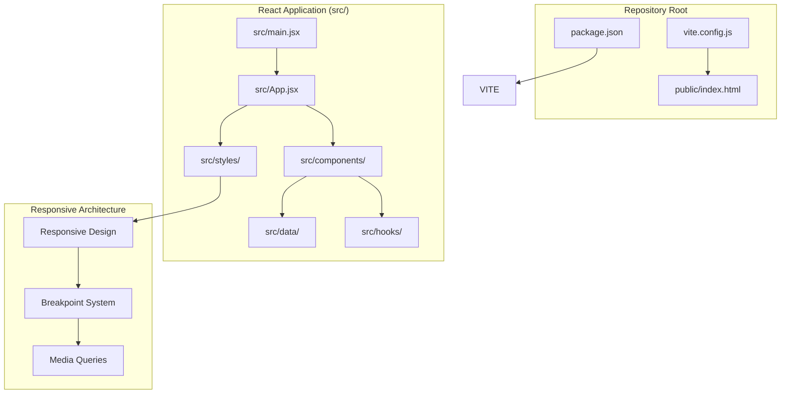

**Diagram sources**
- [package.json:1-23](file://package.json#L1-L23)
- [vite.config.js:1-11](file://vite.config.js#L1-L11)
- [src/main.jsx:1-11](file://src/main.jsx#L1-L11)
- [src/App.jsx:1-51](file://src/App.jsx#L1-L51)
- [public/index.html:1-21](file://public/index.html#L1-L21)

**Section sources**
- [package.json:1-23](file://package.json#L1-L23)
- [vite.config.js:1-11](file://vite.config.js#L1-L11)
- [src/main.jsx:1-11](file://src/main.jsx#L1-L11)
- [src/App.jsx:1-51](file://src/App.jsx#L1-L51)
- [public/index.html:1-21](file://public/index.html#L1-L21)

## Core Components
- React Application Entry Point
  - Initializes the React application and renders the root App component
  - Sets up global styles and strict mode for development
- Vite Development Server
  - Provides fast development iteration with hot module replacement and live reload
  - Serves the React application with React plugin support
- Responsive Component Architecture
  - Component-based UI with reusable, modular components optimized for various screen sizes
  - CSS modules with responsive design patterns and progressive enhancement
- Comprehensive Styling System
  - Responsive design with CSS custom properties and utility classes
  - Progressive enhancement from mobile to desktop breakpoints
- Modern Frontend Tooling
  - Vite for development and production builds
  - GSAP for advanced animations and scroll effects
  - Responsive design with CSS Grid and Flexbox

Key implementation references:
- React entry point and rendering: [src/main.jsx:6-10](file://src/main.jsx#L6-L10)
- App component composition: [src/App.jsx:17-48](file://src/App.jsx#L17-L48)
- Responsive navigation with mobile menu: [src/components/layout/Nav.jsx:79-104](file://src/components/layout/Nav.jsx#L79-L104)
- Responsive footer design: [src/components/layout/Footer.jsx:14-49](file://src/components/layout/Footer.jsx#L14-L49)
- Responsive styling system: [src/styles/_variables.css:26-34](file://src/styles/_variables.css#L26-L34)
- Vite configuration and dev server: [vite.config.js:4-10](file://vite.config.js#L4-L10)
- Development scripts: [package.json:6-10](file://package.json#L6-L10)

**Section sources**
- [src/main.jsx:1-11](file://src/main.jsx#L1-L11)
- [src/App.jsx:1-51](file://src/App.jsx#L1-L51)
- [src/components/layout/Nav.jsx:1-152](file://src/components/layout/Nav.jsx#L1-L152)
- [src/components/layout/Footer.jsx:1-59](file://src/components/layout/Footer.jsx#L1-L59)
- [src/styles/_variables.css:1-67](file://src/styles/_variables.css#L1-L67)
- [vite.config.js:1-11](file://vite.config.js#L1-L11)
- [package.json:1-23](file://package.json#L1-L23)

## Architecture Overview
The system employs a modern responsive client-side architecture:
- Presentation Layer: React components with CSS modules and responsive design
- State Management: React hooks for component state and custom hooks for animations
- Data Layer: Centralized content management through content.js
- Animation Layer: GSAP integration for scroll-triggered animations and mobile menu effects
- Styling Layer: Responsive design system with CSS custom properties and utility classes
- Responsive Layer: Progressive enhancement from mobile to desktop breakpoints

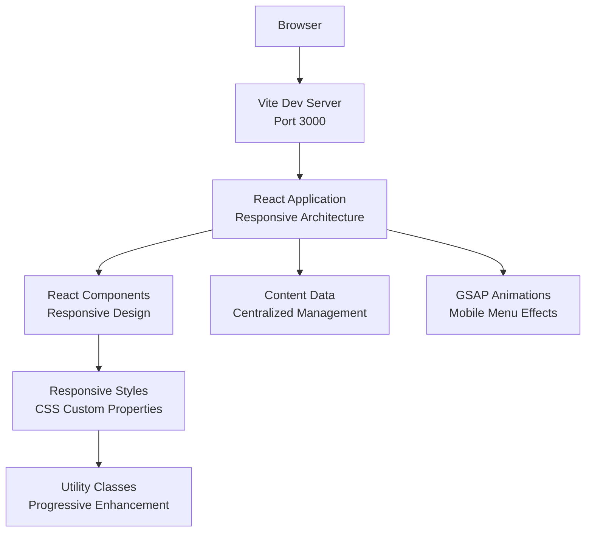

**Diagram sources**
- [vite.config.js:6-9](file://vite.config.js#L6-L9)
- [src/main.jsx:6-10](file://src/main.jsx#L6-L10)
- [src/App.jsx:17-48](file://src/App.jsx#L17-L48)
- [src/components/layout/Nav.jsx:79-104](file://src/components/layout/Nav.jsx#L79-L104)
- [src/styles/_global.css:1-76](file://src/styles/_global.css#L1-L76)

## Responsive Component Architecture
The application's component architecture is designed for responsive design across various screen sizes:

### Navigation Component
The navigation system currently implements a mobile-first responsive approach:
- Fixed positioning with backdrop blur effects
- Animated hamburger menu with three-state transitions
- Mobile overlay menu with staggered entrance animations
- Scroll-aware header styling with backdrop filter
- Accessible ARIA attributes and keyboard navigation
- Body overflow control during mobile menu activation
- Responsive breakpoint system at 1023px

**Updated**: The navigation system currently maintains its mobile-first approach with responsive breakpoints and mobile menu functionality, though the project documentation indicates plans to transition to a traditional fixed navigation bar approach.

### Footer Component
The footer adapts seamlessly from mobile to desktop layouts:
- Mobile-centered single-column layout
- Desktop grid system with three-column structure
- Responsive typography and spacing adjustments
- Social media icons with hover effects
- Accessible navigation structure

### Component Responsiveness
- All components utilize CSS Grid and Flexbox for flexible layouts
- Breakpoint-specific styling with media queries
- Utility classes for consistent spacing and typography
- Fluid typography scales using clamp() functions
- Container-based responsive design

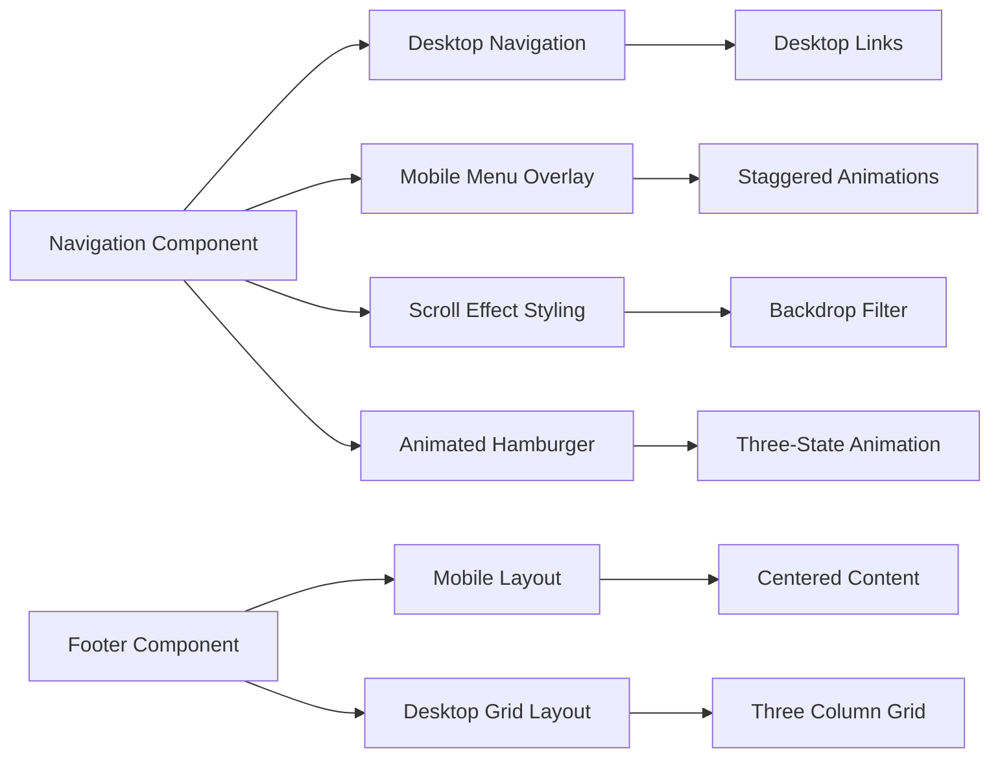

**Diagram sources**
- [src/components/layout/Nav.jsx:79-104](file://src/components/layout/Nav.jsx#L79-L104)
- [src/components/layout/Nav.module.css:180-225](file://src/components/layout/Nav.module.css#L180-L225)
- [src/components/layout/Footer.jsx:14-56](file://src/components/layout/Footer.jsx#L14-L56)
- [src/components/layout/Footer.module.css:140-172](file://src/components/layout/Footer.module.css#L140-L172)

**Section sources**
- [src/components/layout/Nav.jsx:1-152](file://src/components/layout/Nav.jsx#L1-L152)
- [src/components/layout/Nav.module.css:1-349](file://src/components/layout/Nav.module.css#L1-L349)
- [src/components/layout/Footer.jsx:1-59](file://src/components/layout/Footer.jsx#L1-L59)
- [src/components/layout/Footer.module.css:1-274](file://src/components/layout/Footer.module.css#L1-L274)

## Styling and Design System
The application features a comprehensive styling system built on modern CSS methodologies:

### CSS Custom Properties System
- Root-level design tokens for consistent theming
- Responsive spacing scale with adaptive adjustments
- Typography hierarchy with fluid scaling
- Color palette with semantic naming
- Transition timing functions for smooth animations
- Z-index layers for proper stacking context

### Utility-First Approach
- Container classes for consistent page width
- Text alignment and color utility classes
- Background color variations
- Responsive spacing utilities
- Screen reader only helper class

### Component-Specific Styling
- CSS Modules for scoped component styles
- Responsive base styles with desktop overrides
- Animation-specific styling with GSAP integration
- Accessibility-focused styling with focus states
- Responsive typography with clamp() functions

### Responsive Design Implementation
- 1023px breakpoint for tablet and desktop adaptation
- Progressive enhancement from mobile to desktop
- Flexible grid layouts with CSS Grid
- Adaptive Flexbox patterns
- Fluid typography scaling

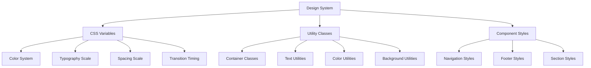

**Diagram sources**
- [src/styles/_variables.css:1-67](file://src/styles/_variables.css#L1-L67)
- [src/styles/_utilities.css:1-55](file://src/styles/_utilities.css#L1-L55)
- [src/components/layout/Nav.module.css:1-349](file://src/components/layout/Nav.module.css#L1-L349)
- [src/components/layout/Footer.module.css:1-274](file://src/components/layout/Footer.module.css#L1-L274)

**Section sources**
- [src/styles/_global.css:1-76](file://src/styles/_global.css#L1-L76)
- [src/styles/_variables.css:1-67](file://src/styles/_variables.css#L1-L67)
- [src/styles/_typography.css:1-41](file://src/styles/_typography.css#L1-L41)
- [src/styles/_utilities.css:1-55](file://src/styles/_utilities.css#L1-L55)

## Detailed Component Analysis

### React Application Entry Point
The application bootstraps through a minimal entry point that initializes React and renders the root App component:
- Creates React root and mounts the App component
- Imports global styles for consistent theming
- Enables React Strict Mode for development best practices
- Sets up the application foundation for component tree rendering

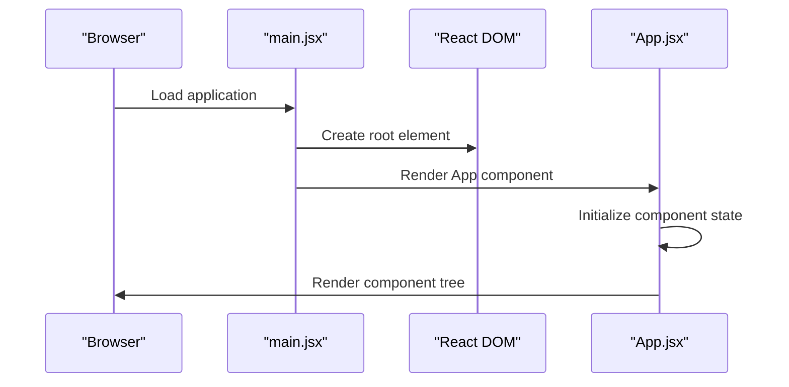

**Diagram sources**
- [src/main.jsx:6-10](file://src/main.jsx#L6-L10)
- [src/App.jsx:17-48](file://src/App.jsx#L17-L48)

Implementation highlights:
- Root rendering: [src/main.jsx:6-10](file://src/main.jsx#L6-L10)
- App component composition: [src/App.jsx:17-48](file://src/App.jsx#L17-L48)
- Global styling import: [src/main.jsx:4](file://src/main.jsx#L4)

**Section sources**
- [src/main.jsx:1-11](file://src/main.jsx#L1-L11)
- [src/App.jsx:1-51](file://src/App.jsx#L1-L51)

### Responsive Navigation Component
The navigation component implements a responsive design approach:
- Fixed positioning with backdrop blur and shadow effects
- Animated hamburger menu with three-state transitions
- Mobile overlay menu with staggered entrance animations using GSAP
- Scroll-aware header styling with background transitions
- Accessible ARIA attributes and keyboard navigation support
- Body overflow control during mobile menu activation
- Smooth scrolling to target sections with offset positioning
- Responsive breakpoint system at 1023px for mobile adaptation

**Updated**: The navigation system currently maintains its mobile-first approach with responsive breakpoints and mobile menu functionality. The component includes:
- Desktop navigation for larger screens
- Mobile hamburger menu for smaller screens
- Slide-out mobile menu with staggered animations
- Scroll-aware styling with backdrop filter
- Body overflow control during mobile menu activation

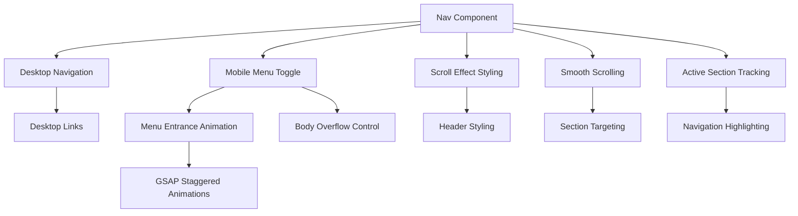

**Diagram sources**
- [src/components/layout/Nav.jsx:26-62](file://src/components/layout/Nav.jsx#L26-L62)
- [src/components/layout/Nav.jsx:79-104](file://src/components/layout/Nav.jsx#L79-L104)
- [src/components/layout/Nav.jsx:106-149](file://src/components/layout/Nav.jsx#L106-L149)

Implementation highlights:
- Scroll effect handling: [src/components/layout/Nav.jsx:32-36](file://src/components/layout/Nav.jsx#L32-L36)
- Mobile menu animation: [src/components/layout/Nav.jsx:38-44](file://src/components/layout/Nav.jsx#L38-L44)
- GSAP staggered animations: [src/components/layout/Nav.jsx:38-44](file://src/components/layout/Nav.jsx#L38-L44)
- Body overflow control: [src/components/layout/Nav.jsx:46-53](file://src/components/layout/Nav.jsx#L46-L53)
- Smooth scrolling implementation: [src/components/layout/Nav.jsx:55-62](file://src/components/layout/Nav.jsx#L55-L62)

**Section sources**
- [src/components/layout/Nav.jsx:1-152](file://src/components/layout/Nav.jsx#L1-L152)
- [src/components/layout/Nav.module.css:1-349](file://src/components/layout/Nav.module.css#L1-L349)

### Responsive Footer Component
The footer component demonstrates adaptive design patterns:
- Mobile-centered layout with centered content and single-column structure
- Desktop grid system with three-column responsive layout
- Social media icons with hover effects and accessibility attributes
- Responsive typography with larger font sizes on desktop
- Container-based responsive design with max-width constraints
- Gold accent line for visual hierarchy

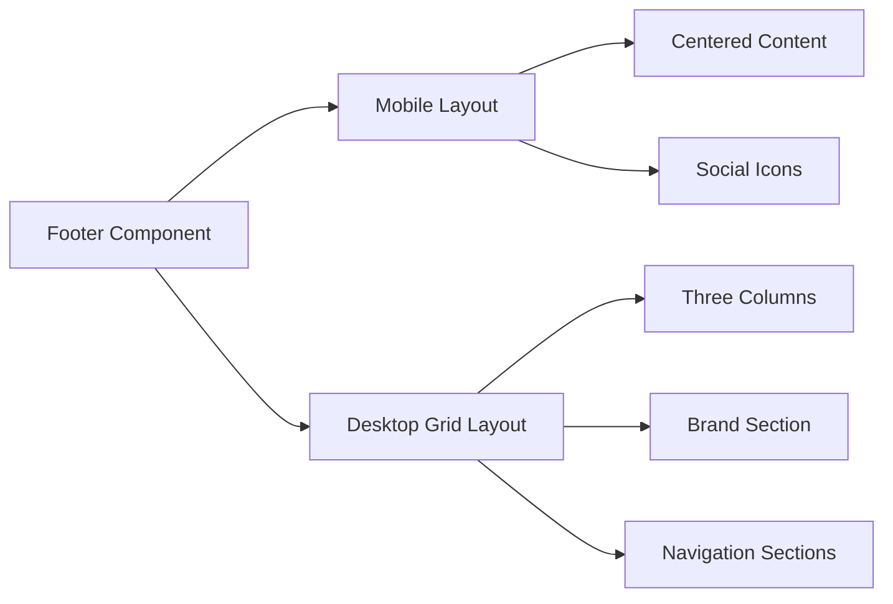

**Diagram sources**
- [src/components/layout/Footer.jsx:14-49](file://src/components/layout/Footer.jsx#L14-L49)
- [src/components/layout/Footer.jsx:24-49](file://src/components/layout/Footer.jsx#L24-L49)
- [src/components/layout/Footer.module.css:140-172](file://src/components/layout/Footer.module.css#L140-L172)

**Section sources**
- [src/components/layout/Footer.jsx:1-59](file://src/components/layout/Footer.jsx#L1-L59)
- [src/components/layout/Footer.module.css:1-274](file://src/components/layout/Footer.module.css#L1-L274)

### Content Management System
The application uses a centralized content management approach:
- Structured content organization by topic areas
- Consistent data structure for different content types
- Easy maintenance and updates through single source of truth
- Integration with components for dynamic content rendering

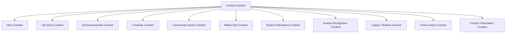

**Diagram sources**
- [src/data/content.js:1-183](file://src/data/content.js#L1-L183)

**Section sources**
- [src/data/content.js:1-183](file://src/data/content.js#L1-L183)

### Animation and Interaction System
The application leverages GSAP for advanced animations and scroll effects:
- Scroll-triggered animations for enhanced user experience
- Smooth transitions and entrance effects
- Performance-optimized animations with proper cleanup
- Integration with React component lifecycle
- Mobile menu animations with staggered effects

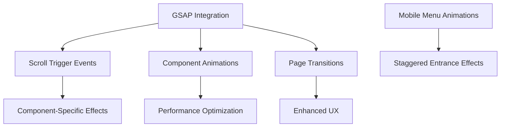

**Diagram sources**
- [src/hooks/useGsap.js:1-14](file://src/hooks/useGsap.js#L1-L14)
- [src/components/layout/Nav.jsx:38-44](file://src/components/layout/Nav.jsx#L38-L44)

**Section sources**
- [src/hooks/useGsap.js:1-14](file://src/hooks/useGsap.js#L1-L14)

### Vite Development and Build System
Vite orchestrates the development and build lifecycle:
- Development Server
  - Port 3000 with automatic browser opening
  - React plugin enabled for JSX and fast refresh
- Production Build
  - Generates optimized static assets to dist/
- Preview
  - Serves built assets locally for verification

**Diagram sources**
- [vite.config.js:4-10](file://vite.config.js#L4-L10)
- [package.json:6-10](file://package.json#L6-L10)

**Section sources**
- [vite.config.js:1-11](file://vite.config.js#L1-L11)
- [package.json:1-23](file://package.json#L1-L23)

### Frontend Static Asset Serving
The frontend relies on a minimal HTML shell located in the public directory:
- Single HTML file with embedded basic styles
- Served directly by Vite dev server
- Ready for React integration and component rendering

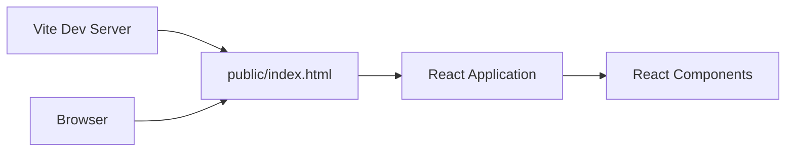

**Diagram sources**
- [vite.config.js:6-9](file://vite.config.js#L6-L9)
- [public/index.html:1-21](file://public/index.html#L1-L21)

**Section sources**
- [public/index.html:1-21](file://public/index.html#L1-L21)
- [vite.config.js:6-9](file://vite.config.js#L6-L9)

### ES6 Module System and Package Management
- ES Modules
  - The project declares module type in package.json enabling native ES modules
  - React application uses ES module imports and exports
- Dependencies
  - React and React DOM for frontend framework
  - Vite and @vitejs/plugin-react for development and build tooling
  - GSAP for advanced animations and scroll effects
- Scripts
  - Development, build, and preview commands orchestrated via npm scripts

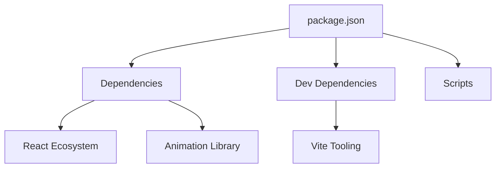

**Diagram sources**
- [package.json:11-21](file://package.json#L11-L21)
- [package.json:6-10](file://package.json#L6-L10)

**Section sources**
- [package.json:1-23](file://package.json#L1-L23)

## Dependency Analysis
The application maintains clean separation between frontend dependencies:
- React Application depends on:
  - React and React DOM for component rendering
  - GSAP for advanced animations and scroll effects
  - CSS modules for scoped styling
- Vite configuration depends on:
  - React plugin for JSX support and fast refresh
  - Development server settings
- Component dependencies:
  - Shared hooks and utilities
  - Centralized content management
  - Modular CSS architecture with responsive design system

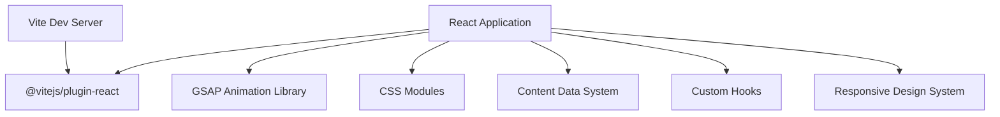

**Diagram sources**
- [src/main.jsx:1-3](file://src/main.jsx#L1-L3)
- [vite.config.js:2](file://vite.config.js#L2)
- [src/hooks/useGsap.js:1-4](file://src/hooks/useGsap.js#L1-L4)
- [src/data/content.js:1-183](file://src/data/content.js#L1-L183)

**Section sources**
- [src/main.jsx:1-11](file://src/main.jsx#L1-L11)
- [vite.config.js:1-11](file://vite.config.js#L1-L11)
- [src/hooks/useGsap.js:1-14](file://src/hooks/useGsap.js#L1-L14)
- [src/data/content.js:1-183](file://src/data/content.js#L1-L183)

## Performance Considerations
- Development Performance
  - Vite's fast refresh and optimized bundling minimize rebuild times
  - Hot reloading reduces iteration cycles during development
  - React Fast Refresh provides instant component updates
- Production Performance
  - Vite's build process generates optimized assets suitable for deployment
  - CSS modules provide scoped styling without global conflicts
  - Responsive approach reduces unnecessary CSS for smaller devices
  - Utility classes minimize custom CSS bloat
  - Component lazy loading opportunities for future optimization
- Animation Performance
  - GSAP provides hardware-accelerated animations
  - Proper cleanup of event listeners and animations
  - Optimized scroll event handling with throttling
  - Backdrop filter effects optimized for modern browsers
- Responsive Performance
  - Responsive design reduces CSS parsing overhead on smaller devices
  - Responsive images and optimized asset loading
  - Touch-friendly interactive elements
  - Reduced JavaScript bundle size through modular architecture
- Scalability Notes
  - Current implementation focuses on simplicity and education
  - Component-based architecture supports easy scaling
  - CSS modules enable maintainable styling at scale
  - Responsive approach ensures future-proof design

## Troubleshooting Guide
Common issues and resolutions:
- Port Conflicts
  - Vite defaults to port 3000; adjust server.port in vite.config.js if needed
  - Ensure no other processes are using the development port
- Component Rendering Issues
  - Verify React and React DOM versions match
  - Check component imports and export statements
  - Ensure CSS modules are properly imported
- Mobile Menu Problems
  - Verify GSAP and @gsap/react installations
  - Check for proper cleanup of scroll triggers
  - Ensure component unmounting removes event listeners
  - Validate mobile menu accessibility attributes
- Animation Problems
  - Verify GSAP and @gsap/react installations
  - Check for proper cleanup of scroll triggers
  - Ensure component unmounting removes event listeners
- Development Server Not Starting
  - Check Node.js and npm versions meet project requirements
  - Run installation steps and review script commands in package.json
- CSS Module Issues
  - Verify CSS files are properly imported with .module.css extension
  - Check for naming conventions and class name conflicts
  - Ensure CSS variables are properly defined in global styles
- Responsive Design Issues
  - Verify responsive CSS is properly structured
  - Check media query breakpoints and specificity
  - Validate utility class usage and ordering
  - Ensure container classes are applied correctly

**Section sources**
- [vite.config.js:6-9](file://vite.config.js#L6-L9)
- [src/main.jsx:1-11](file://src/main.jsx#L1-L11)
- [src/hooks/useGsap.js:1-14](file://src/hooks/useGsap.js#L1-L14)
- [package.json:6-10](file://package.json#L6-L10)

## Conclusion
The Frankie Picasso application exemplifies modern React SPA architecture with a responsive design approach. The implementation demonstrates sophisticated responsive design patterns, a robust styling system with CSS custom properties, and advanced animation techniques using GSAP. The layered design, ES6 module usage, and CSS modules showcase best practices for educational and prototyping scenarios. 

**Updated**: The current implementation maintains a mobile-first responsive approach with hamburger menus and slide-out panels, though the project documentation indicates plans to transition to a traditional fixed navigation bar approach. The architecture balances responsive design principles with desktop optimization, creating a scalable foundation that supports both immediate development needs and future feature expansion. This implementation serves as an excellent example of contemporary web development patterns emphasizing accessibility, performance, and maintainable code architecture.