# Application Architecture

<cite>
**Referenced Files in This Document**
- [package.json](file://package.json)
- [vite.config.js](file://vite.config.js)
- [src/main.jsx](file://src/main.jsx)
- [src/App.jsx](file://src/App.jsx)
- [src/App.module.css](file://src/App.module.css)
- [src/components/layout/Nav.jsx](file://src/components/layout/Nav.jsx)
- [src/components/layout/Footer.jsx](file://src/components/layout/Footer.jsx)
- [src/styles/_global.css](file://src/styles/_global.css)
- [src/data/content.js](file://src/data/content.js)
- [src/hooks/useGsap.js](file://src/hooks/useGsap.js)
- [public/index.html](file://public/index.html)
</cite>

## Update Summary
**Changes Made**
- Complete rewrite of backend architecture section to reflect migration from Express.js to React SPA
- Updated project structure to show modern React application with component-based architecture
- Revised architecture overview to show client-side rendering instead of server-side routing
- Added detailed component analysis for React-based UI architecture
- Updated dependency analysis to reflect React ecosystem instead of Express dependencies
- Removed all references to Express server configuration, middleware, and backend routes
- Added new sections covering React component patterns, CSS modules, and modern frontend tooling

## Table of Contents
1. [Introduction](#introduction)
2. [Project Structure](#project-structure)
3. [Core Components](#core-components)
4. [Architecture Overview](#architecture-overview)
5. [Detailed Component Analysis](#detailed-component-analysis)
6. [Dependency Analysis](#dependency-analysis)
7. [Performance Considerations](#performance-considerations)
8. [Troubleshooting Guide](#troubleshooting-guide)
9. [Conclusion](#conclusion)

## Introduction
This document describes the architecture of the Frankie Picasso application, a modern React Single Page Application (SPA) designed for educational purposes. The application demonstrates contemporary web development patterns by implementing a client-side React application powered by Vite's development server and build toolchain. The system emphasizes component-based architecture, modular CSS styling, and a streamlined developer experience with hot reloading during development and efficient production builds.

## Project Structure
The repository follows a modern React application layout:
- Frontend: Pure React application with component-based architecture under src/
- Build and Dev Tooling: Vite configuration and scripts defined in package.json
- Static Assets: Minimal HTML shell in public/index.html
- Styles: Modular CSS architecture with CSS modules for scoped styling
- Data: Centralized content management through content.js
- Hooks: Custom React hooks for animations and state management

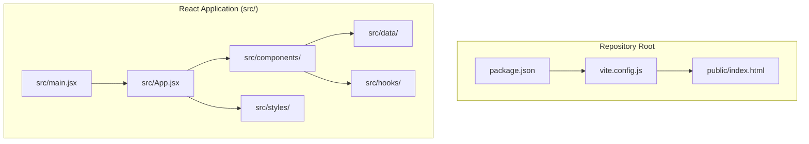

**Diagram sources**
- [package.json:1-23](file://package.json#L1-L23)
- [vite.config.js:1-11](file://vite.config.js#L1-L11)
- [src/main.jsx:1-11](file://src/main.jsx#L1-L11)
- [src/App.jsx:1-51](file://src/App.jsx#L1-L51)
- [public/index.html:1-21](file://public/index.html#L1-L21)

**Section sources**
- [package.json:1-23](file://package.json#L1-L23)
- [vite.config.js:1-11](file://vite.config.js#L1-L11)
- [src/main.jsx:1-11](file://src/main.jsx#L1-L11)
- [src/App.jsx:1-51](file://src/App.jsx#L1-L51)
- [public/index.html:1-21](file://public/index.html#L1-L21)

## Core Components
- React Application Entry Point
  - Initializes the React application and renders the root App component
  - Sets up global styles and strict mode for development
- Vite Development Server
  - Provides fast development iteration with hot module replacement and live reload
  - Serves the React application with React plugin support
- React Component Architecture
  - Component-based UI with reusable, modular components
  - CSS modules for scoped styling and maintainable design systems
- Modern Frontend Tooling
  - Vite for development and production builds
  - React Router for client-side navigation
  - GSAP for advanced animations and scroll effects

Key implementation references:
- React entry point and rendering: [src/main.jsx:6-10](file://src/main.jsx#L6-L10)
- App component composition: [src/App.jsx:17-48](file://src/App.jsx#L17-L48)
- Navigation component with scroll effects: [src/components/layout/Nav.jsx:7-101](file://src/components/layout/Nav.jsx#L7-L101)
- Footer component with navigation: [src/components/layout/Footer.jsx:4-51](file://src/components/layout/Footer.jsx#L4-L51)
- Vite configuration and dev server: [vite.config.js:4-10](file://vite.config.js#L4-L10)
- Development scripts: [package.json:6-10](file://package.json#L6-L10)

**Section sources**
- [src/main.jsx:1-11](file://src/main.jsx#L1-L11)
- [src/App.jsx:1-51](file://src/App.jsx#L1-L51)
- [src/components/layout/Nav.jsx:1-102](file://src/components/layout/Nav.jsx#L1-L102)
- [src/components/layout/Footer.jsx:1-52](file://src/components/layout/Footer.jsx#L1-L52)
- [vite.config.js:1-11](file://vite.config.js#L1-L11)
- [package.json:1-23](file://package.json#L1-L23)

## Architecture Overview
The system employs a modern client-side architecture:
- Presentation Layer: React components with CSS modules and responsive design
- State Management: React hooks for component state and custom hooks for animations
- Data Layer: Centralized content management through content.js
- Animation Layer: GSAP integration for scroll-triggered animations and transitions
- Build Layer: Vite for development server and production optimization

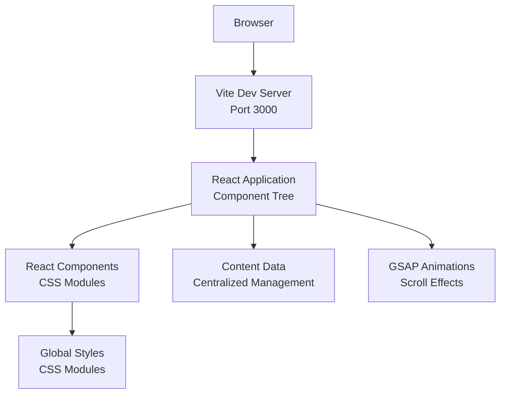

**Diagram sources**
- [vite.config.js:6-9](file://vite.config.js#L6-L9)
- [src/main.jsx:6-10](file://src/main.jsx#L6-L10)
- [src/App.jsx:17-48](file://src/App.jsx#L17-L48)
- [src/components/layout/Nav.jsx:20-26](file://src/components/layout/Nav.jsx#L20-L26)
- [src/styles/_global.css:1-46](file://src/styles/_global.css#L1-L46)

## Detailed Component Analysis

### React Application Entry Point
The application bootstraps through a minimal entry point that initializes React and renders the root App component:
- Creates React root and mounts the App component
- Imports global styles for consistent theming
- Enables React Strict Mode for development best practices
- Sets up the application foundation for component tree rendering

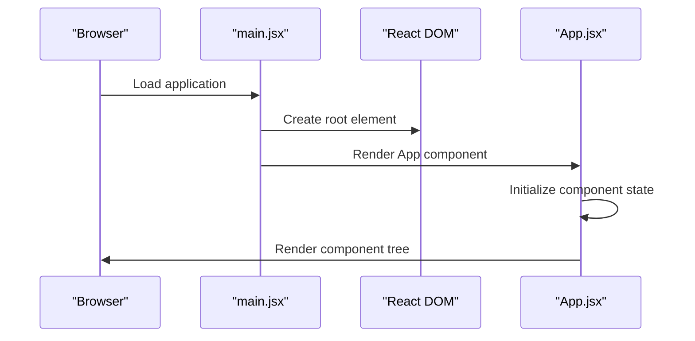

**Diagram sources**
- [src/main.jsx:6-10](file://src/main.jsx#L6-L10)
- [src/App.jsx:17-48](file://src/App.jsx#L17-L48)

Implementation highlights:
- Root rendering: [src/main.jsx:6-10](file://src/main.jsx#L6-L10)
- App component composition: [src/App.jsx:17-48](file://src/App.jsx#L17-L48)
- Global styling import: [src/main.jsx:4](file://src/main.jsx#L4)

**Section sources**
- [src/main.jsx:1-11](file://src/main.jsx#L1-L11)
- [src/App.jsx:1-51](file://src/App.jsx#L1-L51)

### Navigation Component with Advanced Interactions
The navigation component demonstrates modern React patterns with scroll effects and responsive design:
- Dynamic scroll detection with visual feedback
- Mobile-responsive hamburger menu with animated transitions
- Active section highlighting based on scroll position
- Smooth scrolling to target sections
- GSAP integration for entrance animations

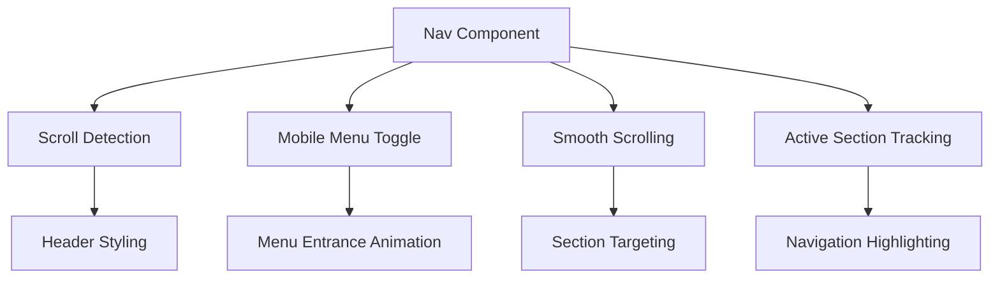

**Diagram sources**
- [src/components/layout/Nav.jsx:8-18](file://src/components/layout/Nav.jsx#L8-L18)
- [src/components/layout/Nav.jsx:20-26](file://src/components/layout/Nav.jsx#L20-L26)
- [src/components/layout/Nav.jsx:37-44](file://src/components/layout/Nav.jsx#L37-L44)
- [src/components/layout/Nav.jsx:10-11](file://src/components/layout/Nav.jsx#L10-L11)

Implementation highlights:
- Scroll effect handling: [src/components/layout/Nav.jsx:14-18](file://src/components/layout/Nav.jsx#L14-L18)
- Mobile menu animation: [src/components/layout/Nav.jsx:20-26](file://src/components/layout/Nav.jsx#L20-L26)
- Smooth scrolling implementation: [src/components/layout/Nav.jsx:37-44](file://src/components/layout/Nav.jsx#L37-L44)
- Active section tracking: [src/components/layout/Nav.jsx:10](file://src/components/layout/Nav.jsx#L10)

**Section sources**
- [src/components/layout/Nav.jsx:1-102](file://src/components/layout/Nav.jsx#L1-L102)

### Footer Component with Content Navigation
The footer component provides secondary navigation and brand information:
- Organized navigation links grouped by categories
- Smooth scrolling integration for quick navigation
- Responsive design with accessible markup
- Brand identity and copyright information

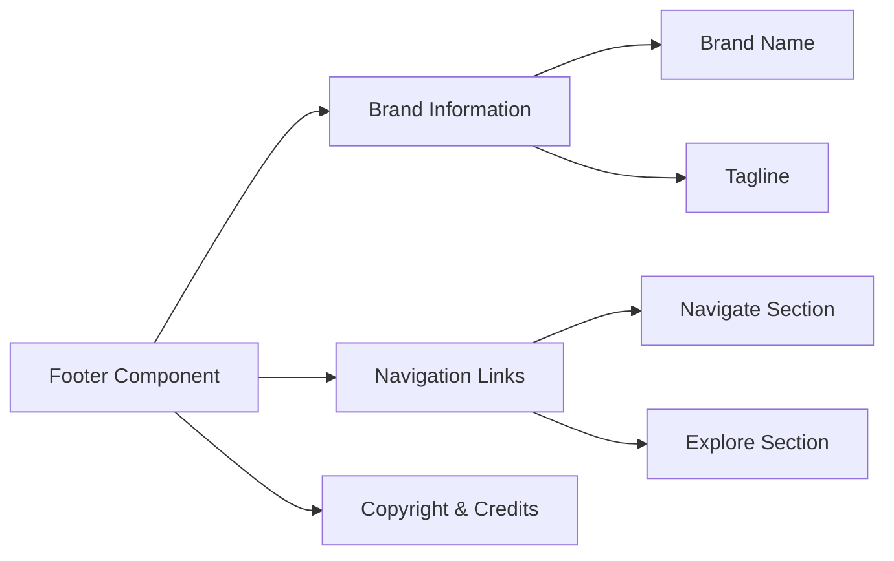

**Diagram sources**
- [src/components/layout/Footer.jsx:14-49](file://src/components/layout/Footer.jsx#L14-L49)
- [src/components/layout/Footer.jsx:22-42](file://src/components/layout/Footer.jsx#L22-L42)

**Section sources**
- [src/components/layout/Footer.jsx:1-52](file://src/components/layout/Footer.jsx#L1-L52)

### Content Management System
The application uses a centralized content management approach:
- Structured content organization by topic areas
- Consistent data structure for different content types
- Easy maintenance and updates through single source of truth
- Integration with components for dynamic content rendering

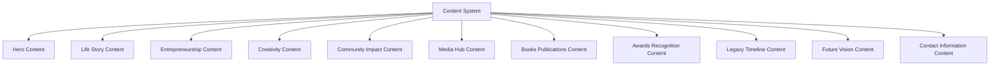

**Diagram sources**
- [src/data/content.js:1-185](file://src/data/content.js#L1-L185)

**Section sources**
- [src/data/content.js:1-185](file://src/data/content.js#L1-L185)

### Animation and Interaction System
The application leverages GSAP for advanced animations and scroll effects:
- Scroll-triggered animations for enhanced user experience
- Smooth transitions and entrance effects
- Performance-optimized animations with proper cleanup
- Integration with React component lifecycle

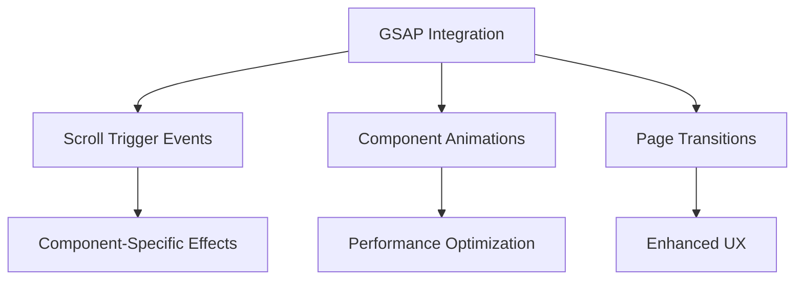

**Diagram sources**
- [src/hooks/useGsap.js:1-14](file://src/hooks/useGsap.js#L1-L14)
- [src/components/layout/Nav.jsx:20-26](file://src/components/layout/Nav.jsx#L20-L26)

**Section sources**
- [src/hooks/useGsap.js:1-14](file://src/hooks/useGsap.js#L1-L14)

### Vite Development and Build System
Vite orchestrates the development and build lifecycle:
- Development Server
  - Port 3000 with automatic browser opening
  - React plugin enabled for JSX and fast refresh
- Production Build
  - Generates optimized static assets to dist/
- Preview
  - Serves built assets locally for verification

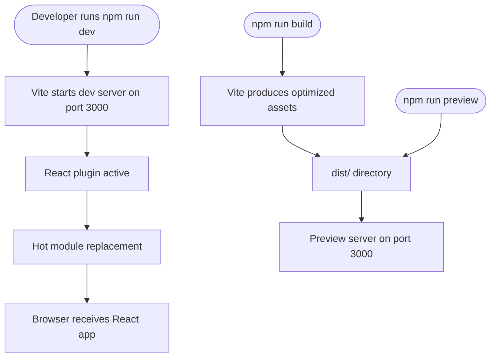

**Diagram sources**
- [vite.config.js:4-10](file://vite.config.js#L4-L10)
- [package.json:6-10](file://package.json#L6-L10)

**Section sources**
- [vite.config.js:1-11](file://vite.config.js#L1-L11)
- [package.json:1-23](file://package.json#L1-L23)

### Frontend Static Asset Serving
The frontend relies on a minimal HTML shell located in the public directory:
- Single HTML file with embedded basic styles
- Served directly by Vite dev server
- Ready for React integration and component rendering

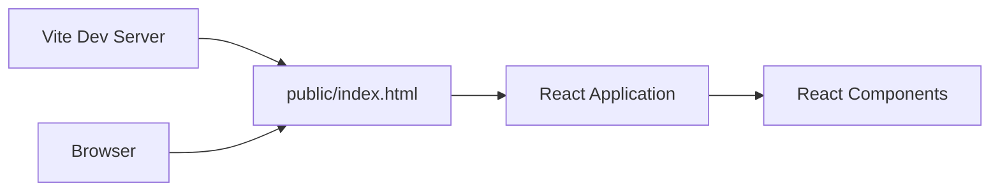

**Diagram sources**
- [vite.config.js:6-9](file://vite.config.js#L6-L9)
- [public/index.html:1-21](file://public/index.html#L1-L21)

**Section sources**
- [public/index.html:1-21](file://public/index.html#L1-L21)
- [vite.config.js:6-9](file://vite.config.js#L6-L9)

### ES6 Module System and Package Management
- ES Modules
  - The project declares module type in package.json enabling native ES modules
  - React application uses ES module imports and exports
- Dependencies
  - React and React DOM for frontend framework
  - Vite and @vitejs/plugin-react for development and build tooling
  - GSAP for advanced animations and scroll effects
- Scripts
  - Development, build, and preview commands orchestrated via npm scripts

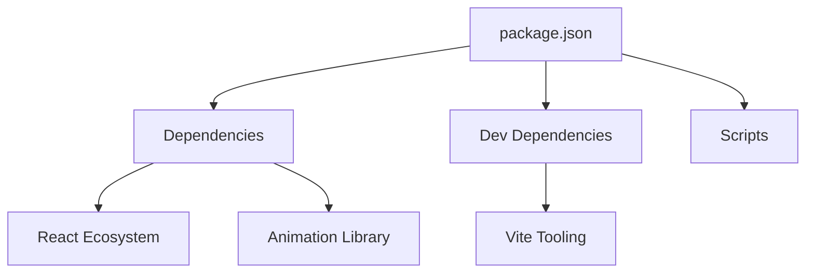

**Diagram sources**
- [package.json:11-21](file://package.json#L11-L21)
- [package.json:6-10](file://package.json#L6-L10)

**Section sources**
- [package.json:1-23](file://package.json#L1-L23)

## Dependency Analysis
The application maintains clean separation between frontend dependencies:
- React Application depends on:
  - React and React DOM for component rendering
  - GSAP for advanced animations and scroll effects
  - CSS modules for scoped styling
- Vite configuration depends on:
  - React plugin for JSX support and fast refresh
  - Development server settings
- Component dependencies:
  - Shared hooks and utilities
  - Centralized content management
  - Modular CSS architecture

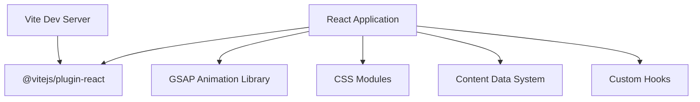

**Diagram sources**
- [src/main.jsx:1-3](file://src/main.jsx#L1-L3)
- [vite.config.js:2](file://vite.config.js#L2)
- [src/hooks/useGsap.js:1-4](file://src/hooks/useGsap.js#L1-L4)
- [src/data/content.js:1-185](file://src/data/content.js#L1-L185)

**Section sources**
- [src/main.jsx:1-11](file://src/main.jsx#L1-L11)
- [vite.config.js:1-11](file://vite.config.js#L1-L11)
- [src/hooks/useGsap.js:1-14](file://src/hooks/useGsap.js#L1-L14)
- [src/data/content.js:1-185](file://src/data/content.js#L1-L185)

## Performance Considerations
- Development Performance
  - Vite's fast refresh and optimized bundling minimize rebuild times
  - Hot reloading reduces iteration cycles during development
  - React Fast Refresh provides instant component updates
- Production Performance
  - Vite's build process generates optimized assets suitable for deployment
  - CSS modules provide scoped styling without global conflicts
  - Component lazy loading opportunities for future optimization
- Animation Performance
  - GSAP provides hardware-accelerated animations
  - Proper cleanup of event listeners and animations
  - Optimized scroll event handling with throttling
- Scalability Notes
  - Current implementation focuses on simplicity and education
  - Component-based architecture supports easy scaling
  - CSS modules enable maintainable styling at scale

## Troubleshooting Guide
Common issues and resolutions:
- Port Conflicts
  - Vite defaults to port 3000; adjust server.port in vite.config.js if needed
  - Ensure no other processes are using the development port
- Component Rendering Issues
  - Verify React and React DOM versions match
  - Check component imports and export statements
  - Ensure CSS modules are properly imported
- Animation Problems
  - Verify GSAP and @gsap/react installations
  - Check for proper cleanup of scroll triggers
  - Ensure component unmounting removes event listeners
- Development Server Not Starting
  - Check Node.js and npm versions meet project requirements
  - Run installation steps and review script commands in package.json
- CSS Module Issues
  - Verify CSS files are properly imported with .module.css extension
  - Check for naming conventions and class name conflicts
  - Ensure CSS variables are properly defined in global styles

**Section sources**
- [vite.config.js:6-9](file://vite.config.js#L6-L9)
- [src/main.jsx:1-11](file://src/main.jsx#L1-L11)
- [src/hooks/useGsap.js:1-14](file://src/hooks/useGsap.js#L1-L14)
- [package.json:6-10](file://package.json#L6-L10)

## Conclusion
The Frankie Picasso application exemplifies modern React SPA architecture by implementing a component-based design with Vite for a smooth development experience and efficient production builds. Its layered design, ES6 module usage, and CSS modules demonstrate best practices for educational and prototyping scenarios. The architecture is intentionally straightforward to highlight core concepts while remaining extensible for future enhancements, showcasing contemporary web development patterns for educational purposes.