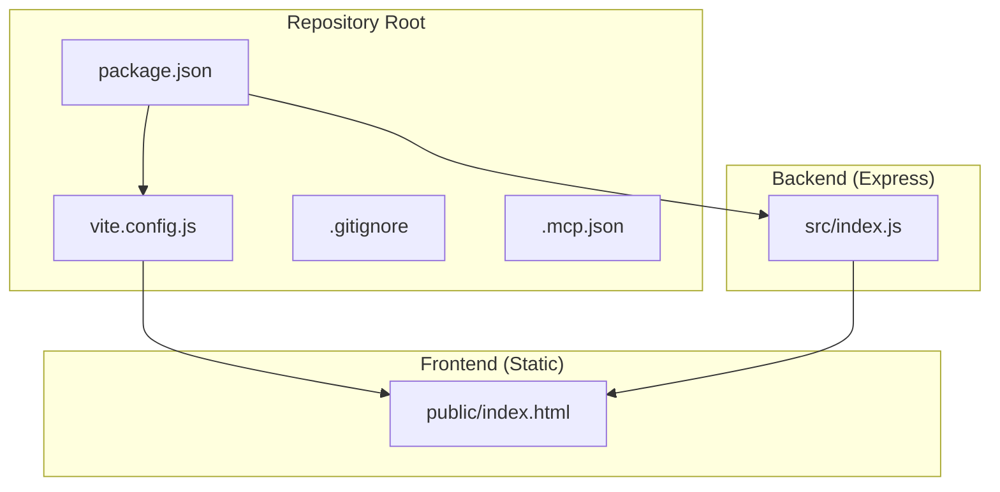
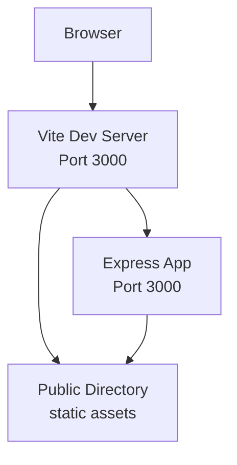
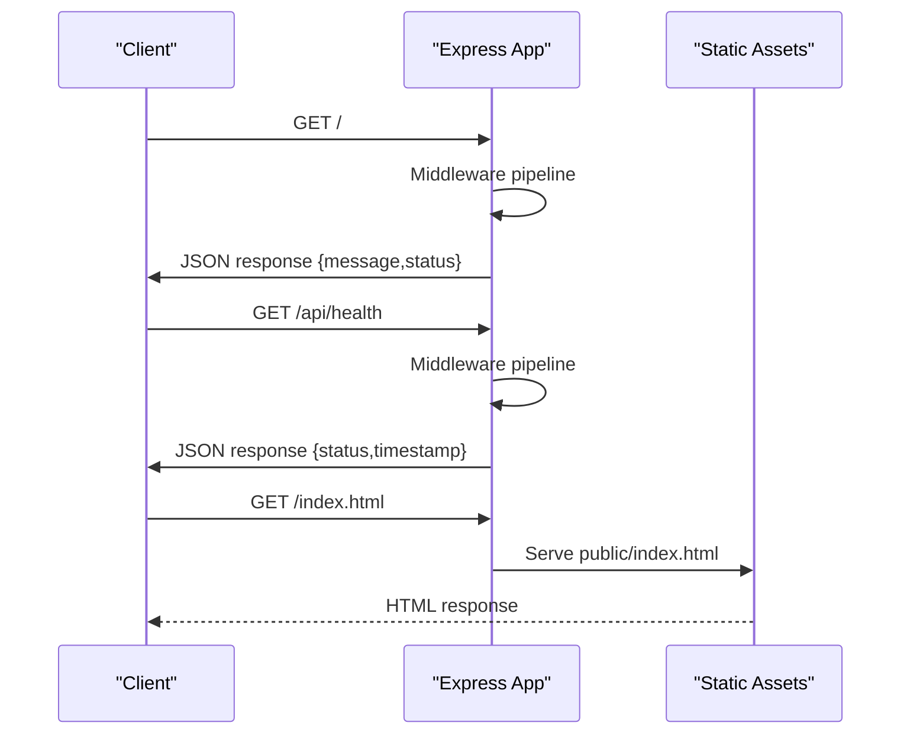
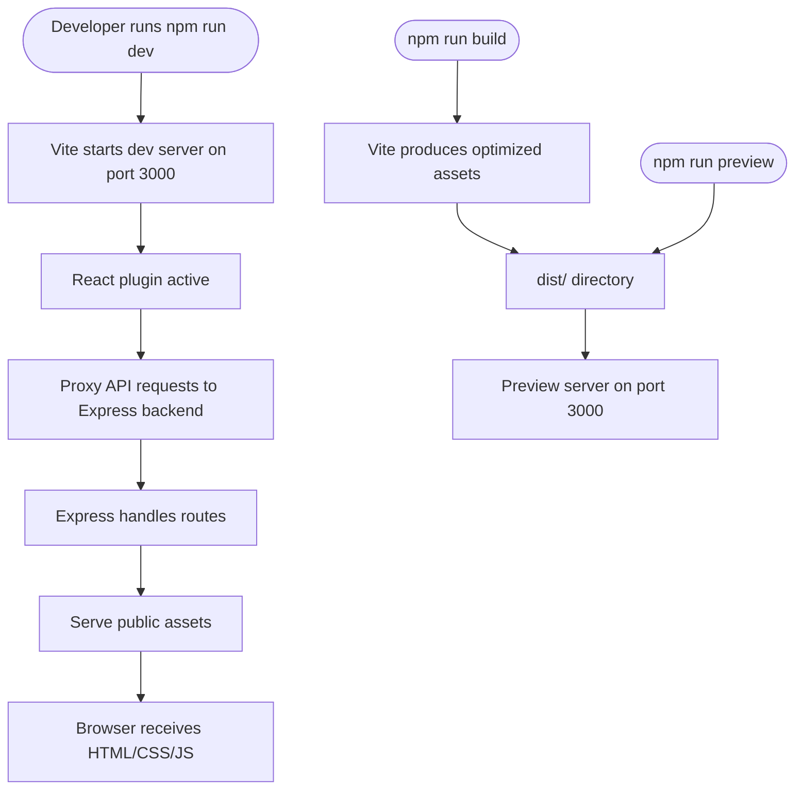
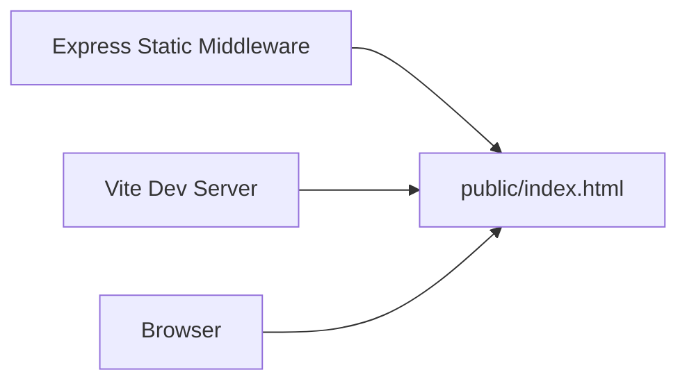
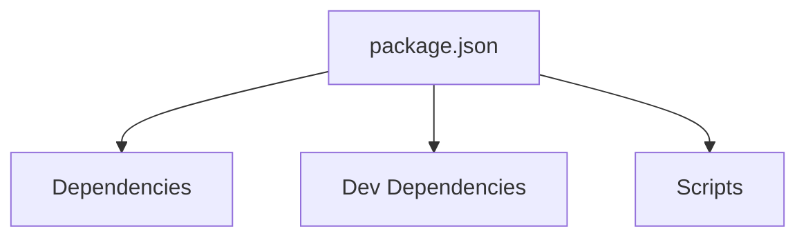
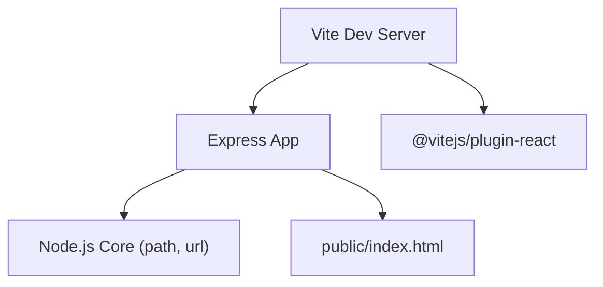

# Application Architecture

<cite>
**Referenced Files in This Document**
- [package.json](file://package.json)
- [vite.config.js](file://vite.config.js)
- [README.md](file://README.md)
- [.gitignore](file://.gitignore)
- [.mcp.json](file://.mcp.json)
- [src/index.js](file://src/index.js)
- [public/index.html](file://public/index.html)
</cite>

## Table of Contents
1. [Introduction](#introduction)
2. [Project Structure](#project-structure)
3. [Core Components](#core-components)
4. [Architecture Overview](#architecture-overview)
5. [Detailed Component Analysis](#detailed-component-analysis)
6. [Dependency Analysis](#dependency-analysis)
7. [Performance Considerations](#performance-considerations)
8. [Troubleshooting Guide](#troubleshooting-guide)
9. [Conclusion](#conclusion)

## Introduction
This document describes the architecture of the Frankie Picasso application, a modern full-stack web application designed for educational purposes. It demonstrates contemporary web development patterns by combining an Express.js backend server with a React frontend application, powered by Vite’s development server and build toolchain. The system emphasizes clear separation of concerns, modular ES6 imports, and a streamlined developer experience with hot reloading during development and efficient production builds.

## Project Structure
The repository follows a minimal yet instructive layout:
- Backend: Express.js server implemented in a single module under src/index.js
- Frontend: Static HTML served from public/index.html and managed by Vite
- Build and Dev Tooling: Vite configuration and scripts defined in package.json
- Configuration: Development server settings in vite.config.js
- Environment and Ignored Artifacts: .gitignore and .mcp.json for secrets and MCP integration

**Diagram sources**
- [package.json:1-20](file://package.json#L1-L20)
- [vite.config.js:1-11](file://vite.config.js#L1-L11)
- [src/index.js:1-31](file://src/index.js#L1-L31)
- [public/index.html:1-21](file://public/index.html#L1-L21)

**Section sources**
- [package.json:1-20](file://package.json#L1-L20)
- [vite.config.js:1-11](file://vite.config.js#L1-L11)
- [README.md:1-13](file://README.md#L1-L13)
- [.gitignore:1-25](file://.gitignore#L1-L25)
- [.mcp.json:1-12](file://.mcp.json#L1-L12)

## Core Components
- Express.js Server
  - Initializes the server, sets up middleware, defines routes, and serves static assets from the public directory.
  - Exports the Express app instance for potential reuse or testing.
- Vite Development Server
  - Provides fast development iteration with hot module replacement and live reload.
  - Serves the React application and proxies API requests to the Express backend during development.
- React Frontend
  - Minimal static HTML shell with embedded styles; React is present as a dependency for future frontend enhancements.
- Build Scripts
  - npm scripts orchestrate development, production build, and preview commands via Vite.

Key implementation references:
- Express server initialization and middleware pipeline: [src/index.js:8-14](file://src/index.js#L8-L14)
- Route handlers: [src/index.js:17-23](file://src/index.js#L17-L23)
- Static asset serving: [src/index.js:14](file://src/index.js#L14)
- Vite configuration and dev server port: [vite.config.js:6-9](file://vite.config.js#L6-L9)
- Development scripts: [package.json:6-10](file://package.json#L6-L10)

**Section sources**
- [src/index.js:1-31](file://src/index.js#L1-L31)
- [vite.config.js:1-11](file://vite.config.js#L1-L11)
- [package.json:1-20](file://package.json#L1-L20)

## Architecture Overview
The system employs a layered architecture:
- Presentation Layer: Static HTML and React application served from the public directory
- Application Layer: Express.js routes and middleware handling HTTP requests
- Data Layer: In-memory JSON responses for demonstration purposes

**Diagram sources**
- [vite.config.js:6-9](file://vite.config.js#L6-L9)
- [src/index.js:8-14](file://src/index.js#L8-L14)
- [public/index.html:1-21](file://public/index.html#L1-L21)

## Detailed Component Analysis

### Express.js Backend
The backend is implemented as a single module exporting an Express application instance. It establishes:
- Middleware Pipeline
  - JSON parsing
  - URL-encoded form parsing
  - Static asset serving from the public directory
- Route Handlers
  - Root endpoint returning a welcome message
  - Health check endpoint returning service status and timestamp
- Server Startup
  - Listens on the configured port and logs startup confirmation

**Diagram sources**
- [src/index.js:11-28](file://src/index.js#L11-L28)
- [public/index.html:1-21](file://public/index.html#L1-L21)

Implementation highlights:
- Middleware chain: [src/index.js:12-14](file://src/index.js#L12-L14)
- Root route: [src/index.js:17-19](file://src/index.js#L17-L19)
- Health route: [src/index.js:21-23](file://src/index.js#L21-L23)
- Static serving: [src/index.js:14](file://src/index.js#L14)
- Exported app: [src/index.js:30](file://src/index.js#L30)

**Section sources**
- [src/index.js:1-31](file://src/index.js#L1-L31)

### Vite Development and Build System
Vite orchestrates the development and build lifecycle:
- Development Server
  - Port 3000 with automatic browser opening
  - React plugin enabled for JSX and fast refresh
- Production Build
  - Generates optimized static assets to dist/
- Preview
  - Serves built assets locally for verification

**Diagram sources**
- [vite.config.js:4-10](file://vite.config.js#L4-L10)
- [package.json:6-10](file://package.json#L6-L10)

**Section sources**
- [vite.config.js:1-11](file://vite.config.js#L1-L11)
- [package.json:1-20](file://package.json#L1-L20)

### Frontend Static Asset Serving
The frontend relies on a minimal HTML shell located in the public directory:
- Single HTML file with embedded basic styles
- Served directly by Express static middleware and Vite dev server
- Ready for React integration in future iterations

**Diagram sources**
- [src/index.js:14](file://src/index.js#L14)
- [public/index.html:1-21](file://public/index.html#L1-L21)

**Section sources**
- [public/index.html:1-21](file://public/index.html#L1-L21)
- [src/index.js:14](file://src/index.js#L14)

### ES6 Module System and Package Management
- ES Modules
  - The project declares module type in package.json enabling native ES modules
  - Express server uses ES module imports and exports
- Dependencies
  - React and React DOM for frontend framework readiness
  - Vite and @vitejs/plugin-react for development and build tooling
- Scripts
  - Development, build, and preview commands orchestrated via npm scripts

**Diagram sources**
- [package.json:11-18](file://package.json#L11-L18)
- [package.json:6-10](file://package.json#L6-L10)

**Section sources**
- [package.json:1-20](file://package.json#L1-L20)

## Dependency Analysis
The application maintains low coupling and clear boundaries:
- Express server depends on:
  - Express runtime
  - Node.js core utilities for path resolution
- Vite configuration depends on:
  - React plugin for JSX support
  - Development server settings
- Frontend static assets depend on:
  - Public directory structure
  - Express static middleware for serving

**Diagram sources**
- [src/index.js:1-6](file://src/index.js#L1-L6)
- [vite.config.js:1-2](file://vite.config.js#L1-L2)
- [public/index.html:1-21](file://public/index.html#L1-L21)

**Section sources**
- [src/index.js:1-31](file://src/index.js#L1-L31)
- [vite.config.js:1-11](file://vite.config.js#L1-L11)

## Performance Considerations
- Development Performance
  - Vite’s fast refresh and optimized bundling minimize rebuild times
  - Hot reloading reduces iteration cycles during development
- Production Performance
  - Vite’s build process generates optimized assets suitable for deployment
  - Static asset serving from Express reduces latency for public resources
- Scalability Notes
  - Current implementation focuses on simplicity and education
  - Future enhancements could include caching, compression, and CDN integration

[No sources needed since this section provides general guidance]

## Troubleshooting Guide
Common issues and resolutions:
- Port Conflicts
  - Both Vite and Express default to port 3000; ensure only one process uses the port
  - Adjust Vite server.port or Express PORT environment variable accordingly
- Static Assets Not Loading
  - Verify Express static middleware is configured and public directory exists
  - Confirm the HTML file path and asset URLs match the configured static route
- Development Server Not Starting
  - Check Node.js and npm versions meet project requirements
  - Run installation steps and review script commands in package.json
- Secrets and MCP Configuration
  - The MCP configuration file contains sensitive tokens; keep it out of version control
  - Ensure .gitignore excludes .mcp.json and other secrets

**Section sources**
- [vite.config.js:6-9](file://vite.config.js#L6-L9)
- [src/index.js:14](file://src/index.js#L14)
- [README.md:5-12](file://README.md#L5-L12)
- [.gitignore:23-25](file://.gitignore#L23-L25)
- [.mcp.json:1-12](file://.mcp.json#L1-L12)

## Conclusion
The Frankie Picasso application exemplifies modern web architecture by cleanly separating the Express.js backend from the React frontend, leveraging Vite for a smooth development experience and efficient production builds. Its layered design, ES6 module usage, and static asset serving demonstrate best practices for educational and prototyping scenarios. The architecture is intentionally straightforward to highlight core concepts while remaining extensible for future enhancements.