# Application Architecture

<cite>
**Referenced Files in This Document**
- [package.json](file://package.json)
- [vite.config.js](file://vite.config.js)
- [src/main.jsx](file://src/main.jsx)
- [src/App.jsx](file://src/App.jsx)
- [src/components/layout/Nav.jsx](file://src/components/layout/Nav.jsx)
- [src/components/acts/ActSection.jsx](file://src/components/acts/ActSection.jsx)
- [src/components/acts/Heartbeat.jsx](file://src/components/acts/Heartbeat.jsx)
- [src/components/story/FrankieStory.jsx](file://src/components/story/FrankieStory.jsx)
- [src/components/story/FrankieStoryActTwo.jsx](file://src/components/story/FrankieStoryActTwo.jsx)
- [src/components/story/FrankieStoryActThree.jsx](file://src/components/story/FrankieStoryActThree.jsx)
- [src/hooks/useColorSystem.js](file://src/hooks/useColorSystem.js)
- [src/hooks/useLenis.js](file://src/hooks/useLenis.js)
- [src/hooks/useScrollAnimation.js](file://src/hooks/useScrollAnimation.js)
- [src/styles/globals.css](file://src/styles/globals.css)
- [src/data/content.js](file://src/data/content.js)
- [public/index.html](file://public/index.html)
- [src/context/MapContext.jsx](file://src/context/MapContext.jsx)
- [src/components/map/MapOfLife.jsx](file://src/components/map/MapOfLife.jsx)
- [src/components/map/LessonGlow.jsx](file://src/components/map/LessonGlow.jsx)
- [src/components/map/MapProgress.jsx](file://src/components/map/MapProgress.jsx)
- [src/components/map/PuzzleReveal.jsx](file://src/components/map/PuzzleReveal.jsx)
</cite>

## Update Summary
**Changes Made**
- Enhanced six-act narrative framework with detailed Act III implementation focusing on Frankie's business ventures and personal growth journey
- Added comprehensive FrankieStoryActThree component with sophisticated cinematic storytelling architecture
- Updated content structure with detailed Act III data including timeline, narrative blocks, and emotional peaks
- Integrated Act III seamlessly into the main application flow with proper heartbeat transitions
- Enhanced storytelling capabilities with advanced animation patterns and typography hierarchy

## Table of Contents
1. [Introduction](#introduction)
2. [Project Structure](#project-structure)
3. [Enhanced Six-Act Narrative Framework](#enhanced-six-act-narrative-framework)
4. [Act III Implementation - The Builder](#act-iii-implementation-the-builder)
5. [Enhanced Animation System](#enhanced-animation-system)
6. [Dynamic Color Management](#dynamic-color-management)
7. [Smooth Scrolling Integration](#smooth-scrolling-integration)
8. [Map of Life Integration](#map-of-life-integration)
9. [Core Components](#core-components)
10. [Architecture Overview](#architecture-overview)
11. [Styling and Design System](#styling-and-design-system)
12. [Detailed Component Analysis](#detailed-component-analysis)
13. [Dependency Analysis](#dependency-analysis)
14. [Performance Considerations](#performance-considerations)
15. [Troubleshooting Guide](#troubleshooting-guide)
16. [Conclusion](#conclusion)

## Introduction
This document describes the architecture of the Frankie Picasso application, a modern React Single Page Application (SPA) designed with an enhanced six-act narrative framework and sophisticated animation system. The application demonstrates contemporary web development patterns through its data-driven content organization, centralized content management system, integrated theming architecture, and advanced motion system powered by Framer Motion. The system emphasizes a narrative-driven approach where content flows through six distinct acts, each with unique theming, storytelling elements, and specialized component implementations. The enhanced architecture provides seamless user experience with smooth scrolling, dynamic color transitions, and responsive design patterns.

**Updated**: The application has undergone significant architectural enhancements with the integration of a comprehensive Act III implementation focused on Frankie's business ventures and personal growth journey. The new FrankieStoryActThree component introduces sophisticated cinematic storytelling with detailed narrative content about boxing, entrepreneurship, kickboxing promotion, and the pivotal choice to prioritize family over ambition. This enhancement includes advanced typography hierarchy, emotional peak detection, and seamless integration with the existing six-act narrative framework while maintaining the established visual design language and animation patterns.

## Project Structure
The repository follows a modern React application layout with an enhanced cinematic narrative architecture:
- Frontend: React application with component-based architecture under src/
- Data Layer: Centralized content management through content.js with enhanced six-act narrative structure
- Animation Layer: Framer Motion integration for scroll-triggered animations and motion effects
- Theming System: Tailwind CSS v4 with dynamic color management and section-based theming
- Component Architecture: ActSection-based components with enhanced motion patterns and specialized act components
- Build and Dev Tooling: Vite configuration with Tailwind CSS v4 plugin
- Static Assets: Minimal HTML shell in public/index.html plus image assets for visual storytelling
- Smooth Scrolling: Lenis integration for enhanced scroll experience

```mermaid
graph TB
subgraph "Repository Root"
PJSON["package.json"]
VCFG["vite.config.js"]
PUBLIC["public/index.html"]
IMAGES["Childhood Dreams Images<br/>PNG Assets"]
end
subgraph "React Application (src/)"
MAIN["src/main.jsx"]
APP["src/App.jsx"]
COMPONENTS["src/components/"]
NAV["src/components/layout/Nav.jsx"]
FOOTER["src/components/layout/Footer.jsx"]
ACTS["src/components/acts/"]
STORIES["src/components/story/"]
FRANKIESTORY["FrankieStory.jsx<br/>Act I Narrative"]
ACTTWO["FrankieStoryActTwo.jsx<br/>Act II Narrative"]
ACTTHREE["FrankieStoryActThree.jsx<br/>Act III - The Builder"]
ENTREPRENEURSHIP["src/components/entrepreneurship/"]
MEDIA["src/components/media/"]
CREATIVITY["src/components/creativity/"]
COMMUNITY["src/components/community/"]
VISION["src/components/vision/"]
MAP["src/components/map/"]
MAPCONTEXT["src/context/MapContext.jsx"]
STYLES["src/styles/"]
DATA["src/data/"]
HOOKS["src/hooks/"]
ANIMATIONS["Framer Motion Hooks"]
COLORSYSTEM["useColorSystem Hook"]
LENIS["useLenis Hook"]
SCROLLANIMATION["useScrollAnimation System"]
end
subgraph "Enhanced Six-Act Narrative Framework"
CONTENT["src/data/content.js<br/>Acts Array + PreAct1Intro"]
SECTIONIDS["sectionIds Array<br/>Navigation Structure"]
NAVLINKS["navLinks Array<br/>Navigation Links"]
ACTCOLORS["actColors Object<br/>Act Color Mapping"]
CHILDHOODDREAMS["childhoodDreams Array<br/>Image-Based Dreams"]
PREACT1INTRO["preAct1Intro Object<br/>Opening Statement"]
NARRATIVEBLOCKS["narrative Arrays<br/>Multi-section Storytelling"]
ACTIIISTORY["Act III Story Data<br/>Business Ventures & Growth"]
end
subgraph "Act III Specialized Components"
ACTTHREECOMP["FrankieStoryActThree.jsx<br/>Cinematic Storytelling"]
EMOTIONALPEAKS["Emotional Peak Detection<br/>Typography Hierarchy"]
NARRATIVEFLOW["Narrative Flow Control<br/>Scene Transitions"]
BUSINESSVENTURES["Business Venture Stories<br/>Boxing & Entrepreneurship"]
PERSONALGROWTH["Personal Growth Journey<br/>Family & Career Balance"]
end
subgraph "Enhanced Animation System"
FRAMERMOTION["Framer Motion Library"]
MOTIONHOOKS["Motion Hooks & Transitions"]
SCROLLTRANSFORMS["Scroll-Based Animations"]
DYNAMICCOLORS["Dynamic Color Transitions"]
SMOOTHSCROLLING["Lenis Smooth Scrolling"]
SCRAPBOOKANIMS["ScrapbookCard Animations"]
HEARTBEATANIMS["Heartbeat Transition Animations"]
ACTTHREEANIMS["Act III Cinematic Animations"]
end
PJSON --> VITE
VCFG --> PUBLIC
MAIN --> APP
APP --> COMPONENTS
COMPONENTS --> NAV
COMPONENTS --> FOOTER
COMPONENTS --> ACTS
COMPONENTS --> STORIES
COMPONENTS --> MAP
COMPONENTS --> DATA
COMPONENTS --> HOOKS
COMPONENTS --> ANIMATIONS
COMPONENTS --> COLORSYSTEM
COMPONENTS --> LENIS
COMPONENTS --> SCROLLANIMATION
DATA --> CONTENT
DATA --> SECTIONIDS
DATA --> NAVLINKS
DATA --> ACTCOLORS
DATA --> CHILDHOODDREAMS
DATA --> PREACT1INTRO
DATA --> NARRATIVEBLOCKS
DATA --> ACTIIISTORY
NAV --> FRAMERMOTION
ACTS --> MOTIONHOOKS
ACTS --> SCROLLTRANSFORMS
ACTS --> DYNAMICCOLORS
FRANKIESTORY --> SCRAPBOOKANIMS
FRANKIESTORY --> IMAGES
FRANKIESTORY --> HEARTBEATANIMS
ACTTHREECOMP --> ACTTHREEANIMS
ACTTHREECOMP --> EMOTIONALPEAKS
ACTTHREECOMP --> BUSINESSVENTURES
ACTTHREECOMP --> PERSONALGROWTH
LENIS --> SMOOTHSCROLLING
```

**Diagram sources**
- [package.json:1-27](file://package.json#L1-L27)
- [vite.config.js:1-12](file://vite.config.js#L1-L12)
- [src/main.jsx:1-11](file://src/main.jsx#L1-L11)
- [src/App.jsx:1-224](file://src/App.jsx#L1-L224)
- [src/data/content.js:1-743](file://src/data/content.js#L1-L743)
- [src/components/layout/Nav.jsx:1-172](file://src/components/layout/Nav.jsx#L1-L172)
- [src/components/acts/ActSection.jsx:1-58](file://src/components/acts/ActSection.jsx#L1-L58)
- [src/components/acts/Heartbeat.jsx:1-71](file://src/components/acts/Heartbeat.jsx#L1-L71)
- [src/components/story/FrankieStory.jsx:1-206](file://src/components/story/FrankieStory.jsx#L1-L206)
- [src/components/story/FrankieStoryActTwo.jsx:1-241](file://src/components/story/FrankieStoryActTwo.jsx#L1-L241)
- [src/components/story/FrankieStoryActThree.jsx:1-451](file://src/components/story/FrankieStoryActThree.jsx#L1-L451)
- [src/hooks/useColorSystem.js:1-184](file://src/hooks/useColorSystem.js#L1-L184)
- [src/hooks/useLenis.js:1-38](file://src/hooks/useLenis.js#L1-L38)
- [src/hooks/useScrollAnimation.js:1-118](file://src/hooks/useScrollAnimation.js#L1-L118)
- [src/context/MapContext.jsx:1-100](file://src/context/MapContext.jsx#L1-L100)
- [src/components/map/MapOfLife.jsx:1-150](file://src/components/map/MapOfLife.jsx#L1-L150)
- [public/index.html:1-21](file://public/index.html#L1-L21)

**Section sources**
- [package.json:1-27](file://package.json#L1-L27)
- [vite.config.js:1-12](file://vite.config.js#L1-L12)
- [src/main.jsx:1-11](file://src/main.jsx#L1-L11)
- [src/App.jsx:1-224](file://src/App.jsx#L1-L224)
- [public/index.html:1-21](file://public/index.html#L1-L21)

## Enhanced Six-Act Narrative Framework
The application implements a revolutionary cinematic narrative framework that organizes Frankie Picasso's life story into distinct thematic sections with enhanced motion support and sophisticated storytelling architecture:

### Enhanced Act Structure Organization
Each act represents a distinct phase of Frankie's journey with its own color scheme, themes, and content organization:
- **Pre-Act 1 Introduction**: Powerful opening statement establishing the narrative tone with intimate, conversational language
- **Act I (Where Belief Began)**: Foundation and early influences with warm lavender tones and multi-section storytelling
- **Act II (Becoming)**: Teenage years, cultural experiences, and personal discovery with golden amber colors
- **Act III (The Builder)**: Business ventures, boxing promotion, and entrepreneurial journey with warm cream backgrounds
- **Act IV (Amplifying)**: Media and platform expansion with teal accents
- **Act V (Creating)**: Artistic and creative endeavors with pink/magenta themes
- **Act VI (Giving)**: Community impact and mentorship with green tones
- **Act VII (Still Becoming)**: Ongoing evolution and future vision with warm cream colors

### Enhanced Content Management System
The content.js file contains a comprehensive centralized structure with enhanced six-act narrative arrays and sophisticated storytelling capabilities:
- **preAct1Intro Object**: New introductory section with powerful opening statement and welcome message
- **acts Array**: Complete six-act narrative structure with metadata and rich content blocks including detailed Act III data
- **sectionIds Array**: Complete navigation structure for scroll-based navigation
- **navLinks Array**: Hierarchical navigation structure for both desktop and mobile
- **actColors Object**: Color mapping for act-specific styling and progress indicators
- **Content Objects**: Rich content structures with narrative blocks, visual breaths, timeline data, and childhood dreams visualization

### Multi-Section Narrative Architecture
The enhanced FrankieStory components support sophisticated multi-section storytelling with specialized act components:
- **Pre-Act 1 Introduction**: Intimate opening with powerful statement "This isn't a résumé. It's the story of an ordinary girl who never stopped saying, 'I can do that.'"
- **Act I Narrative**: Origin story covering mother's influence, bedroom design, father's support, and Cavalier the horse
- **Act II Narrative**: Teenage experiences, cultural immersion, photography, sales, and first ventures
- **Act III Narrative**: Comprehensive business journey from boxing gyms to kickboxing promotion, including the pivotal choice to prioritize family
- **Visual Breaths**: Standalone impactful statements with large typography presentation
- **Childhood Dreams Visualization**: Interactive scrapbook-style cards showing dream aspirations
- **Post-Act Narratives**: Reflection on influential relationships and lifelong lessons about belief and perseverance

### Act III Specialized Storytelling Architecture
The new FrankieStoryActThree component introduces sophisticated cinematic storytelling specifically designed for Act III content:
- **Emotional Peak Detection**: Automatic identification of major emotional moments with Level 1 typography hierarchy
- **Scene-Based Narrative Flow**: Structured storytelling with clear scene transitions and pacing
- **Business Venture Integration**: Detailed coverage of multiple businesses including Connalin Development, Condom Sense, and Roundhouse Promotions
- **Personal Growth Journey**: Authentic storytelling about balancing ambition with family responsibilities
- **Cinematic Typography**: Advanced typography system with clamp() functions for responsive scaling across devices
- **Animation Orchestration**: Coordinated Framer Motion animations for dramatic storytelling moments

**Section sources**
- [src/data/content.js:15-28](file://src/data/content.js#L15-L28)
- [src/data/content.js:68-562](file://src/data/content.js#L68-L562)
- [src/components/acts/ActSection.jsx:1-58](file://src/components/acts/ActSection.jsx#L1-L58)
- [src/components/story/FrankieStory.jsx:88-205](file://src/components/story/FrankieStory.jsx#L88-L205)
- [src/components/story/FrankieStoryActThree.jsx:1-451](file://src/components/story/FrankieStoryActThree.jsx#L1-L451)

## Act III Implementation - The Builder
The Act III implementation represents a significant enhancement to the narrative framework, providing comprehensive storytelling about Frankie's business ventures and personal growth journey:

### FrankieStoryActThree Component Architecture
The FrankieStoryActThree component serves as a specialized storytelling engine for Act III content with sophisticated cinematic capabilities:

#### Sophisticated Typography Hierarchy
The component implements a multi-level typography system designed for emotional impact:
- **Level 1 Emotional Peaks**: Major emotional statements rendered at clamp(1.15rem, 2.8vw, 2rem) for maximum impact
- **Standard Emphasis**: Supporting reflections at clamp(1.05rem, 2.3vw, 1.5rem) for secondary emphasis
- **Supporting Groups**: Additional narrative elements at clamp(1rem, 2vw, 1.5rem) for structural hierarchy
- **Body Copy**: Primary narrative text at clamp(1.1rem, 1.5vw, 1.4rem) for optimal readability

#### Scene-Based Narrative Structure
The component organizes Act III content into distinct scenes with clear narrative flow:
- **Opening Hook**: Establishes the theme with "I didn't set out to build businesses. I set out to build opportunities."
- **Boxing Introduction**: Personal connection to boxing through relationships and gym culture
- **Key Relationships**: Development of important connections with George Chuvalo and Don King
- **First Venture Success**: Early achievement promoting the Furlano-Pryor World Title fight at age 22
- **Parallel Ventures**: Multiple concurrent businesses including private investigation, construction, and esthetics
- **Creative Innovation**: Development of Condom Sense as a socially meaningful business venture
- **Kickboxing Pivot**: The transformative decision to promote Paul Biafore's world title fight
- **Nine-Month Challenge**: Comprehensive event planning and problem-solving montage
- **Conflict Resolution**: Overcoming threats and challenges with community support
- **Success and Sacrifice**: The emotional climax of choosing family over professional ambition
- **Cliffhanger Ending**: Transition to unexpected government opportunity

#### Advanced Animation System
The component utilizes sophisticated Framer Motion animations for cinematic storytelling:
- **Container Animation**: Full container fade-in with useInView hook for performance optimization
- **Staggered Children**: Sequential appearance of narrative elements with 0.08 second delays
- **Fade-Up Effects**: Consistent upward movement animations for all content blocks
- **Custom Easing**: Professional-grade easing curves [0.22, 1, 0.36, 1] for natural motion feel
- **Responsive Layout**: Mobile-first design with adaptive spacing and typography scaling

#### Business Venture Storytelling
The component provides detailed coverage of Frankie's entrepreneurial journey:
- **Connalin Development**: Construction company specializing in insulation and sandblasting
- **Condom Sense**: Innovative public health education business with customized condom packaging
- **Private Investigation**: Parallel career path that developed observation and analytical skills
- **Esthetics Business**: Successful salon business providing flexibility for family life
- **Roundhouse Promotions**: Pioneering female kickboxing promotion company
- **Traffic Marketing**: Professional boxing management and event promotion

#### Personal Growth Narrative
The component authentically portrays the balance between ambition and family:
- **Family Priorities**: The emotional weight of children's request to stop pursuing ambitious projects
- **Professional Challenges**: Real-world obstacles including threats, competition, and industry resistance
- **Community Support**: The role of relationships and networks in overcoming challenges
- **Value Alignment**: How personal values guided major life decisions and business choices

```mermaid
flowchart TD
ActIIIComponent["FrankieStoryActThree.jsx"] --> ContainerAnim["Container Fade-In Animation"]
ActIIIComponent --> TypographyHierarchy["Typography Hierarchy System"]
ActIIIComponent --> SceneStructure["Scene-Based Narrative Flow"]
ActIIIComponent --> BusinessStories["Business Venture Stories"]
ActIIIComponent --> PersonalJourney["Personal Growth Journey"]
ContainerAnim --> StaggeredChildren["Staggered Child Animations"]
ContainerAnim --> FadeUpEffects["Fade-Up Animation Effects"]
TypographyHierarchy --> Level1Peaks["Level 1 Emotional Peaks"]
TypographyHierarchy --> StandardEmphasis["Standard Emphasis Text"]
TypographyHierarchy --> BodyCopy["Primary Body Copy"]
SceneStructure --> OpeningHook["Opening Hook Scene"]
SceneStructure --> BoxingIntro["Boxing Introduction Scene"]
SceneStructure --> FirstVenture["First Venture Success Scene"]
SceneStructure --> NineMonthChallenge["Nine-Month Challenge Scene"]
SceneStructure --> ConflictResolution["Conflict Resolution Scene"]
SceneStructure --> SuccessSacrifice["Success and Sacrifice Scene"]
BusinessStories --> ConnalinDev["Connalin Development Story"]
BusinessStories --> CondomSense["Condom Sense Innovation"]
BusinessStories --> KickboxingPromo["Kickboxing Promotion Journey"]
PersonalJourney --> FamilyBalance["Family vs Ambition Balance"]
PersonalJourney --> CommunitySupport["Community and Relationship Support"]
PersonalJourney --> ValueAlignment["Values-Driven Decision Making"]
```

**Diagram sources**
- [src/components/story/FrankieStoryActThree.jsx:1-451](file://src/components/story/FrankieStoryActThree.jsx#L1-L451)
- [src/data/content.js:434-449](file://src/data/content.js#L434-L449)

**Section sources**
- [src/components/story/FrankieStoryActThree.jsx:1-451](file://src/components/story/FrankieStoryActThree.jsx#L1-L451)
- [src/data/content.js:434-449](file://src/data/content.js#L434-L449)
- [src/App.jsx:121-132](file://src/App.jsx#L121-L132)

## Enhanced Animation System
The application features a sophisticated animation system built on Framer Motion with comprehensive scroll-based effects and motion patterns:

### Framer Motion Integration
The animation system is built around Framer Motion for advanced motion capabilities:
- **Motion Components**: `<motion>` elements for declarative animations
- **Scroll-Based Effects**: `useScroll` and `useTransform` for scroll-triggered animations
- **View Detection**: `useInView` for intersection observer-based animations
- **AnimatePresence**: For mounting/unmounting animations with exit states
- **Custom Easings**: Cinematic easing curves for premium motion feel

### Scroll-Based Animation System
The useScrollAnimation system provides comprehensive scroll-based effects:
- **useScrollFade**: Fade element in/out based on scroll position
- **useScrollSlideUp**: Slide element up as it enters viewport
- **useScrollSlideLeft/Right**: Directional slide animations
- **useParallax**: Parallax effects based on scroll position
- **useScrollScale**: Scale transformations during scroll
- **useScrollBlur**: Blur-to-clear effects during scroll
- **useInView**: Simple in-view detection with configurable options

### Enhanced ScrapbookCard Animation System
The enhanced FrankieStory component includes sophisticated ScrapbookCard animations:
- **Staggered Entry Animations**: Sequential appearance of dream cards with calculated delays
- **Rotation Effects**: Randomized tilt angles create playful scrapbook aesthetic
- **Hover Interactions**: Smooth scale and rotation corrections on mouse hover
- **Scroll-Triggered Reveals**: Cards animate into view as they enter the viewport
- **Performance Optimization**: Lazy loading and efficient animation scheduling

### Heartbeat Transition Animations
The Heartbeat component provides cinematic transitions between acts:
- **Gradient Morphing**: Smooth background color transitions between acts
- **Breathing Orb Effect**: Animated radial gradient with pulsing scale and opacity
- **Accent Line Animation**: Expanding line with fade-in effect
- **Text Reveal**: Fade-up animation for Frankieism quotes
- **Dot Indicator**: Scaling dot animation for visual emphasis

### Act III Cinematic Animations
The new Act III component introduces specialized cinematic animations:
- **Container Fade-In**: Full container animation with intersection observer trigger
- **Staggered Content Reveal**: Sequential appearance of narrative elements with precise timing
- **Emotional Peak Highlighting**: Special animation treatment for major emotional statements
- **Scene Transition Effects**: Smooth transitions between different narrative scenes
- **Typography Animation**: Coordinated text animations supporting the storytelling rhythm

### Mobile Menu Animations
The mobile navigation system provides premium user experience with Framer Motion:
- **Staggered Item Animations**: Sequential appearance of menu items with custom delays
- **Transform Animations**: Smooth slide-in effect using Framer Motion transforms
- **Opacity Transitions**: Fade-in effects for menu item visibility
- **Exit Animations**: AnimatePresence for smooth menu closing
- **Duration Control**: 0.35 second animation duration for optimal user experience

### Section Indicator Removal
The previous SectionIndicator navigation dots have been removed in favor of:
- **Integrated Navigation**: Navigation state managed within Nav component
- **Active Section Detection**: Real-time section tracking with scroll position
- **Cleaner Interface**: Reduced visual clutter while maintaining functionality

```mermaid
graph TB
FramerMotion["Framer Motion Library"] --> MotionComponents["Motion Components"]
FramerMotion --> ScrollHooks["Scroll Hooks"]
FramerMotion --> ViewDetection["View Detection"]
FramerMotion --> AnimatePresence["AnimatePresence"]
ScrollHooks --> ScrollFade["useScrollFade"]
ScrollHooks --> ScrollSlide["useScrollSlide*"]
ScrollHooks --> ScrollParallax["useParallax"]
ScrollHooks --> ScrollScale["useScrollScale"]
ScrollHooks --> ScrollBlur["useScrollBlur"]
ViewDetection --> UseInView["useInView Hook"]
ScrapbookCard["ScrapbookCard Component"] --> StaggeredEntry["Staggered Entry Animations"]
ScrapbookCard --> RotationEffects["Randomized Rotation Angles"]
ScrapbookCard --> HoverInteractions["Hover Scale & Rotation"]
ScrapbookCard --> ScrollReveals["Scroll-Triggered Reveals"]
Heartbeat["Heartbeat Component"] --> GradientMorph["Gradient Morphing"]
Heartbeat --> BreathingOrb["Breathing Orb Effect"]
Heartbeat --> AccentLine["Accent Line Animation"]
Heartbeat --> TextReveal["Text Reveal Animation"]
ActIIIAnimations["Act III Animations"] --> ContainerFadeIn["Container Fade-In"]
ActIIIAnimations --> StaggeredReveal["Staggered Content Reveal"]
ActIIIAnimations --> EmotionalPeaks["Emotional Peak Highlighting"]
ActIIIAnimations --> SceneTransitions["Scene Transition Effects"]
MobileMenu["Mobile Menu"] --> StaggeredAnim["Staggered Animations"]
MobileMenu --> TransformAnim["Transform Animations"]
MobileMenu --> ExitAnim["Exit Animations"]
NavComponent["Nav Component"] --> ActiveSection["Active Section Detection"]
NavComponent --> MobileOverlay["Mobile Overlay"]
```

**Diagram sources**
- [src/hooks/useScrollAnimation.js:1-118](file://src/hooks/useScrollAnimation.js#L1-L118)
- [src/components/layout/Nav.jsx:1-172](file://src/components/layout/Nav.jsx#L1-L172)
- [src/components/acts/ActSection.jsx:1-58](file://src/components/acts/ActSection.jsx#L1-L58)
- [src/components/acts/Heartbeat.jsx:1-71](file://src/components/acts/Heartbeat.jsx#L1-L71)
- [src/components/story/FrankieStory.jsx:58-86](file://src/components/story/FrankieStory.jsx#L58-L86)
- [src/components/story/FrankieStoryActThree.jsx:17-36](file://src/components/story/FrankieStoryActThree.jsx#L17-L36)

**Section sources**
- [src/hooks/useScrollAnimation.js:1-118](file://src/hooks/useScrollAnimation.js#L1-L118)
- [src/components/layout/Nav.jsx:1-172](file://src/components/layout/Nav.jsx#L1-L172)
- [src/components/acts/ActSection.jsx:1-58](file://src/components/acts/ActSection.jsx#L1-L58)
- [src/components/acts/Heartbeat.jsx:1-71](file://src/components/acts/Heartbeat.jsx#L1-L71)
- [src/components/story/FrankieStory.jsx:1-206](file://src/components/story/FrankieStory.jsx#L1-L206)
- [src/components/story/FrankieStoryActThree.jsx:1-451](file://src/components/story/FrankieStoryActThree.jsx#L1-L451)

## Dynamic Color Management
The application features a sophisticated color management system that provides dynamic theming and section-based color transitions with an enhanced warm neutral cream palette:

### Enhanced Color System Architecture
The useColorSystem hook provides comprehensive color management with redesigned palettes:
- **Section Palettes**: Predefined color schemes for each narrative section with warm cream backgrounds
- **Dynamic Color Interpolation**: Smooth color transitions between sections
- **CSS Custom Properties**: Runtime color updates via CSS variables
- **Context Provider**: Global color state management
- **Hook Abstraction**: Simplified color access throughout components

### Redesigned Section-Based Theming
Each section now features a warm, accessible color palette with lavender accents:
- **Background Colors**: Warm cream and lavender backgrounds (#FFF8F0, #D8C8EE, #FAF3EA)
- **Text Colors**: High-contrast charcoal text (#2C2C2C) for improved readability
- **Accent Colors**: Complementary warm accents (#FFB400, #FF7C15) with lavender highlights
- **Muted Variants**: Semi-transparent text variants with proper contrast ratios
- **Semantic Naming**: Clear color role definitions supporting accessibility standards

### Enhanced Color Context Implementation
The ColorProvider manages global color state with improved accessibility:
- **Scroll Progress Tracking**: Monitors scroll position for color transitions
- **CSS Variable Updates**: Dynamically updates CSS custom properties
- **Context Distribution**: Provides color data to child components
- **Fallback Handling**: Default colors when context is unavailable
- **Accessibility Compliance**: WCAG-compliant contrast ratios

### Component Color Integration
Components can access colors through multiple methods with enhanced accessibility:
- **useColors Hook**: Direct access to current color context
- **useSectionColors Hook**: Section-specific color interpolation
- **CSS Variables**: Direct usage of CSS custom properties
- **Tailwind Classes**: Utility classes for common color applications
- **Contrast Validation**: Automatic contrast checking for text readability

**Section sources**
- [src/hooks/useColorSystem.js:1-184](file://src/hooks/useColorSystem.js#L1-L184)

## Smooth Scrolling Integration
The application integrates Lenis for enhanced smooth scrolling experience:

### Lenis Integration
The useLenis hook provides smooth scrolling capabilities:
- **Smooth Scrolling Engine**: Hardware-accelerated smooth scrolling
- **Configuration Options**: Duration, easing, orientation settings
- **Gesture Support**: Touch and wheel gesture handling
- **Performance Optimization**: RequestAnimationFrame-based rendering
- **Accessibility Support**: Respects prefers-reduced-motion settings

### Configuration and Setup
The Lenis implementation includes:
- **Duration Control**: 1.2 second scroll duration for smooth transitions
- **Easing Function**: Custom cubic-bezier easing for natural motion
- **Orientation Settings**: Vertical-only scrolling for this application
- **Multiplier Controls**: Different sensitivity for wheel vs touch input
- **Cleanup Management**: Proper resource cleanup on component unmount

### User Experience Benefits
The smooth scrolling provides:
- **Premium Feel**: Professional-grade scrolling experience
- **Reduced Jank**: Smooth frame rates during scroll operations
- **Touch Optimization**: Enhanced mobile scrolling experience
- **Accessibility Compliance**: Respects user motion preferences
- **Performance Efficiency**: Optimized rendering pipeline

**Section sources**
- [src/hooks/useLenis.js:1-38](file://src/hooks/useLenis.js#L1-L38)

## Map of Life Integration
The application now features an integrated Map of Life system that provides interactive learning experiences throughout the narrative journey:

### Map of Life Architecture
The Map of Life system introduces a parallel interactive layer that complements the traditional narrative flow:
- **Context Management**: Dedicated MapContext for state management and cross-component communication
- **Interactive Components**: Specialized map components for lessons, progress tracking, and puzzle reveals
- **Seamless Integration**: Blends naturally with existing ActSection framework and navigation system
- **Progress Persistence**: Tracks user interaction and learning milestones across sessions
- **Responsive Design**: Adapts to various screen sizes while maintaining interactive functionality

### Core Map Components
The Map of Life system consists of several specialized components:
- **MapOfLife**: Main container component managing overall map state and navigation
- **LessonGlow**: Visual highlight effects for important learning moments
- **MapProgress**: Progress tracking and completion indicators
- **PuzzleReveal**: Interactive puzzle elements that unlock additional content

### Context Management System
The MapContext provides centralized state management for the entire Map of Life system:
- **Global State**: Manages user progress, completed lessons, and unlocked content
- **Event Broadcasting**: Coordinates interactions between different map components
- **Persistence Layer**: Saves and loads user progress automatically
- **Integration Points**: Connects with existing navigation and content systems

### Enhanced Navigation Integration
The navigation system has been enhanced to support Map of Life interactions:
- **Dual Navigation Modes**: Traditional scroll-based navigation with optional interactive map exploration
- **Progress Indicators**: Visual feedback for completed map sections
- **Cross-Reference Links**: Connections between narrative content and related map activities
- **Accessibility Features**: Keyboard navigation and screen reader support for all interactive elements

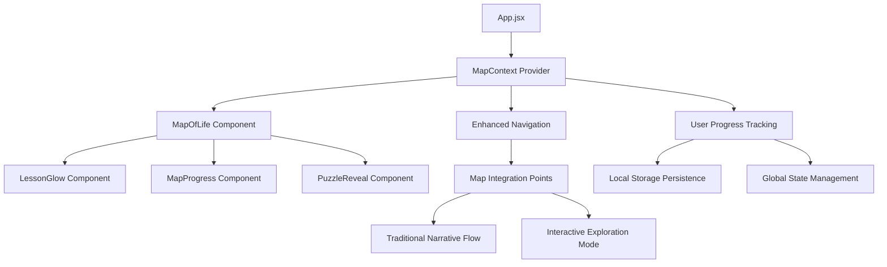

**Diagram sources**
- [src/context/MapContext.jsx:1-100](file://src/context/MapContext.jsx#L1-L100)
- [src/components/map/MapOfLife.jsx:1-150](file://src/components/map/MapOfLife.jsx#L1-L150)
- [src/components/map/LessonGlow.jsx:1-100](file://src/components/map/LessonGlow.jsx#L1-L100)
- [src/components/map/MapProgress.jsx:1-120](file://src/components/map/MapProgress.jsx#L1-L120)
- [src/components/map/PuzzleReveal.jsx:1-130](file://src/components/map/PuzzleReveal.jsx#L1-L130)
- [src/components/layout/Nav.jsx:1-172](file://src/components/layout/Nav.jsx#L1-L172)

**Section sources**
- [src/context/MapContext.jsx:1-100](file://src/context/MapContext.jsx#L1-L100)
- [src/components/map/MapOfLife.jsx:1-150](file://src/components/map/MapOfLife.jsx#L1-L150)
- [src/components/map/LessonGlow.jsx:1-100](file://src/components/map/LessonGlow.jsx#L1-L100)
- [src/components/map/MapProgress.jsx:1-120](file://src/components/map/MapProgress.jsx#L1-L120)
- [src/components/map/PuzzleReveal.jsx:1-130](file://src/components/map/PuzzleReveal.jsx#L1-L130)
- [src/components/layout/Nav.jsx:1-172](file://src/components/layout/Nav.jsx#L1-L172)

## Core Components
- React Application Entry Point
  - Initializes the React application and renders the root App component
  - Sets up global styles and strict mode for development
- Enhanced Navigation Architecture
  - Sophisticated mobile menu with Framer Motion animations
  - Integrated active section detection within Nav component
  - Data-driven navigation through navLinks array
  - Map of Life integration points for interactive exploration
- Enhanced Cinematic Narrative Architecture
  - Centralized content management through acts array structure with enhanced narrative framework
  - ActSection wrapper component for consistent theming and layout
  - Data-driven component composition based on content structure
- Specialized Act Components
  - FrankieStory component with multi-section narrative framework and ScrapbookCard implementation
  - FrankieStoryActTwo component for Act II narrative with structured storytelling blocks
  - FrankieStoryActThree component for Act III business journey with cinematic storytelling
  - Act-specific components for Entrepreneurship, Media, Creativity, Community, and Vision
- Map of Life Interactive System
  - Context-managed interactive learning journey with progress tracking
  - Specialized components for lessons, puzzles, and visual highlights
  - Seamless integration with existing narrative framework
  - Persistent user state and cross-component communication
- Heartbeat Transition Component
  - Cinematic inter-act transitions with gradient morphing and breathing orb effects
  - Animated accent lines and text reveals for Frankieism quotes
  - Smooth color transitions between narrative sections
- Responsive Component Architecture
  - Component-based UI with reusable, modular components optimized for various screen sizes
  - Tailwind CSS v4 utility-first approach with responsive design patterns
- Integrated Theming System
  - Tailwind CSS v4 theme configuration with semantic tokens
  - Dynamic color application through CSS custom properties
  - Consistent design tokens across all components
- Comprehensive Styling System
  - Tailwind CSS v4 with @theme configuration
  - CSS custom properties for runtime color updates
  - Progressive enhancement from mobile to desktop breakpoints
- Advanced Animation System
  - Framer Motion integration for scroll-triggered animations
  - useScrollAnimation hooks for fade-up, slide, and parallax effects
  - Lenis smooth scrolling for enhanced user experience
  - Reduced motion support for accessibility compliance

Key implementation references:
- React entry point and rendering: [src/main.jsx:6-10](file://src/main.jsx#L6-L10)
- Enhanced navigation system: [src/components/layout/Nav.jsx:52-171](file://src/components/layout/Nav.jsx#L52-L171)
- ActSection wrapper component: [src/components/acts/ActSection.jsx:9-57](file://src/components/acts/ActSection.jsx#L9-L57)
- Heartbeat transition component: [src/components/acts/Heartbeat.jsx:8-70](file://src/components/acts/Heartbeat.jsx#L8-L70)
- Enhanced FrankieStory with multi-section narrative: [src/components/story/FrankieStory.jsx:88-205](file://src/components/story/FrankieStory.jsx#L88-L205)
- Act II narrative component: [src/components/story/FrankieStoryActTwo.jsx:231-241](file://src/components/story/FrankieStoryActTwo.jsx#L231-L241)
- Act III business journey component: [src/components/story/FrankieStoryActThree.jsx:19-448](file://src/components/story/FrankieStoryActThree.jsx#L19-L448)
- Map of Life context management: [src/context/MapContext.jsx:1-100](file://src/context/MapContext.jsx#L1-L100)
- Map of Life main component: [src/components/map/MapOfLife.jsx:1-150](file://src/components/map/MapOfLife.jsx#L1-L150)
- Color system integration: [src/hooks/useColorSystem.js:133-184](file://src/hooks/useColorSystem.js#L133-L184)
- Smooth scrolling setup: [src/hooks/useLenis.js:4-37](file://src/hooks/useLenis.js#L4-L37)
- App component composition with acts: [src/App.jsx:37-223](file://src/App.jsx#L37-L223)
- Centralized content management with enhanced narrative: [src/data/content.js:1-743](file://src/data/content.js#L1-L743)
- Tailwind CSS configuration: [vite.config.js:3-6](file://vite.config.js#L3-L6)
- Development scripts: [package.json:6-10](file://package.json#L6-L10)

**Section sources**
- [src/main.jsx:1-11](file://src/main.jsx#L1-L11)
- [src/App.jsx:1-224](file://src/App.jsx#L1-L224)
- [src/components/layout/Nav.jsx:1-172](file://src/components/layout/Nav.jsx#L1-L172)
- [src/components/acts/ActSection.jsx:1-58](file://src/components/acts/ActSection.jsx#L1-L58)
- [src/components/acts/Heartbeat.jsx:1-71](file://src/components/acts/Heartbeat.jsx#L1-L71)
- [src/components/story/FrankieStory.jsx:1-206](file://src/components/story/FrankieStory.jsx#L1-L206)
- [src/components/story/FrankieStoryActTwo.jsx:1-241](file://src/components/story/FrankieStoryActTwo.jsx#L1-L241)
- [src/components/story/FrankieStoryActThree.jsx:1-451](file://src/components/story/FrankieStoryActThree.jsx#L1-L451)
- [src/context/MapContext.jsx:1-100](file://src/context/MapContext.jsx#L1-L100)
- [src/components/map/MapOfLife.jsx:1-150](file://src/components/map/MapOfLife.jsx#L1-L150)
- [src/hooks/useColorSystem.js:1-184](file://src/hooks/useColorSystem.js#L1-L184)
- [src/hooks/useLenis.js:1-38](file://src/hooks/useLenis.js#L1-L38)
- [src/hooks/useScrollAnimation.js:1-118](file://src/hooks/useScrollAnimation.js#L1-L118)
- [src/data/content.js:1-743](file://src/data/content.js#L1-L743)
- [vite.config.js:1-12](file://vite.config.js#L1-L12)
- [package.json:1-27](file://package.json#L1-L27)

## Architecture Overview
The system employs a modern cinematic narrative architecture with enhanced motion capabilities, sophisticated storytelling framework, and integrated interactive learning system:
- Presentation Layer: React components organized around cinematic narrative structure with enhanced narrative flow and interactive map exploration
- State Management: React hooks for component state, MapContext for interactive learning state, and custom hooks for animations and navigation
- Data Layer: Centralized content management through acts array structure with navigation arrays, preAct1Intro object, and childhood dreams visualization
- Animation Layer: Framer Motion integration for scroll-triggered animations and motion effects
- Color Management Layer: Dynamic color system with section-based theming and CSS variable updates
- Interactive Learning Layer: Map of Life system with context management, progress tracking, and puzzle interactions
- Scrolling Layer: Lenis integration for smooth scrolling experience
- Styling Layer: Tailwind CSS v4 with theme configuration and utility-first approach
- Responsive Layer: Advanced mobile-first approach with progressive enhancement

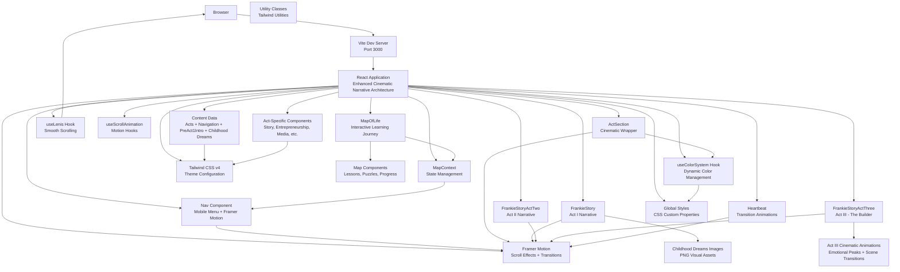

**Diagram sources**
- [vite.config.js:6-10](file://vite.config.js#L6-L10)
- [src/main.jsx:6-10](file://src/main.jsx#L6-L10)
- [src/App.jsx:37-223](file://src/App.jsx#L37-L223)
- [src/components/layout/Nav.jsx:52-171](file://src/components/layout/Nav.jsx#L52-L171)
- [src/components/acts/ActSection.jsx:9-57](file://src/components/acts/ActSection.jsx#L9-L57)
- [src/components/acts/Heartbeat.jsx:8-70](file://src/components/acts/Heartbeat.jsx#L8-L70)
- [src/components/story/FrankieStory.jsx:88-205](file://src/components/story/FrankieStory.jsx#L88-L205)
- [src/components/story/FrankieStoryActTwo.jsx:231-241](file://src/components/story/FrankieStoryActTwo.jsx#L231-L241)
- [src/components/story/FrankieStoryActThree.jsx:19-448](file://src/components/story/FrankieStoryActThree.jsx#L19-L448)
- [src/context/MapContext.jsx:1-100](file://src/context/MapContext.jsx#L1-L100)
- [src/components/map/MapOfLife.jsx:1-150](file://src/components/map/MapOfLife.jsx#L1-L150)
- [src/hooks/useColorSystem.js:133-184](file://src/hooks/useColorSystem.js#L133-L184)
- [src/hooks/useLenis.js:4-37](file://src/hooks/useLenis.js#L4-L37)
- [src/hooks/useScrollAnimation.js:1-118](file://src/hooks/useScrollAnimation.js#L1-L118)
- [src/data/content.js:1-743](file://src/data/content.js#L1-L743)
- [src/styles/globals.css:1-95](file://src/styles/globals.css#L1-L95)

## Styling and Design System
The application features a comprehensive styling system built on Tailwind CSS v4 with integrated theming and enhanced responsive design, now featuring a warm neutral cream palette:

### Enhanced Tailwind CSS v4 Theme Configuration
The application uses Tailwind CSS v4 with comprehensive theme configuration featuring warm, accessible colors:
- **@theme Directive**: Centralized design token management with warm cream palette
- **Font Families**: Serif, sans-serif, and handwritten font configurations
- **Base Palette**: Comprehensive color system with warm cream, lavender, and complementary accents
- **Semantic Tokens**: Themed color variables for dynamic updates with improved contrast
- **Typography Scale**: Fluid typography with clamp() functions and enhanced readability
- **Spacing System**: Section-based spacing with responsive values
- **Border Radius**: Consistent radius scale across components
- **Animation Definitions**: Custom keyframe animations and utilities
- **Easing Functions**: Cinematic easing curves for premium motion
- **Transition Timings**: Standardized transition durations and easings

### Component Styling Approach
The application uses utility-first styling with Tailwind CSS and enhanced accessibility:
- **Inline Utility Classes**: Direct styling through className attributes
- **Responsive Design**: Mobile-first approach with md/lg breakpoints
- **Theme Integration**: Seamless integration with CSS custom properties
- **Motion Classes**: Framer Motion integration with CSS transforms
- **Accessibility Features**: Focus states and ARIA attribute support with high contrast ratios

### Enhanced Dynamic Color Integration
The styling system supports dynamic color updates with improved accessibility:
- **CSS Custom Properties**: Runtime color updates via JavaScript
- **Theme Variables**: Semantic color tokens for consistent theming
- **Section-Based Colors**: Automatic color transitions between sections
- **Fallback Values**: Graceful degradation when variables are unavailable
- **Contrast Validation**: Automatic WCAG compliance checking

### Global Styles and Utilities
Comprehensive global styling with utility classes and enhanced accessibility:
- **Base Reset**: Modern CSS reset with box-sizing normalization
- **Typography Base**: Consistent heading and paragraph styling with improved readability
- **Blockquote Styling**: Enhanced quote presentation with decorative elements
- **Keyframe Animations**: Custom animations for floating, breathing, and reveal effects
- **Scroll Progress Indicator**: Animated progress bar at page top
- **Utility Classes**: Hover effects, gradients, and visual enhancements
- **Reduced Motion Support**: Accessibility-compliant motion alternatives
- **Skip Link**: Accessibility feature for keyboard navigation

```mermaid
graph TB
DesignSystem["Design System"] --> TailwindConfig["@theme Configuration"]
TailwindConfig --> FontFamilies["Font Family Tokens"]
TailwindConfig --> ColorPalette["Base Color Palette<br/>Warm Cream & Lavender"]
TailwindConfig --> Typography["Typography Scale"]
TailwindConfig --> Spacing["Spacing System"]
TailwindConfig --> Animations["Animation Definitions"]
TailwindConfig --> Easings["Easing Functions"]
DesignSystem --> ComponentStyles["Component Styling"]
ComponentStyles --> UtilityClasses["Tailwind Utilities"]
ComponentStyles --> ThemeIntegration["Theme Integration"]
ComponentStyles --> MotionClasses["Framer Motion Classes"]
DesignSystem --> GlobalStyles["Global Styles"]
GlobalStyles --> BaseReset["CSS Reset"]
GlobalStyles --> TypographyBase["Typography Base"]
GlobalStyles --> Keyframes["Keyframe Animations"]
GlobalStyles --> Utilities["Utility Classes"]
DynamicColors["Dynamic Colors"] --> CSSVariables["CSS Custom Properties"]
DynamicColors --> ThemeTokens["Semantic Token Updates"]
```

**Diagram sources**
- [src/styles/globals.css:1-95](file://src/styles/globals.css#L1-L95)
- [src/styles/globals.css:98-340](file://src/styles/globals.css#L98-L340)
- [vite.config.js:3-6](file://vite.config.js#L3-L6)

**Section sources**
- [src/styles/globals.css:1-340](file://src/styles/globals.css#L1-L340)
- [vite.config.js:1-12](file://vite.config.js#L1-L12)

## Detailed Component Analysis

### React Application Entry Point
The application bootstraps through a minimal entry point that initializes React and renders the root App component:
- Creates React root and mounts the App component
- Imports global styles for consistent theming
- Enables React Strict Mode for development best practices
- Sets up the application foundation for component tree rendering

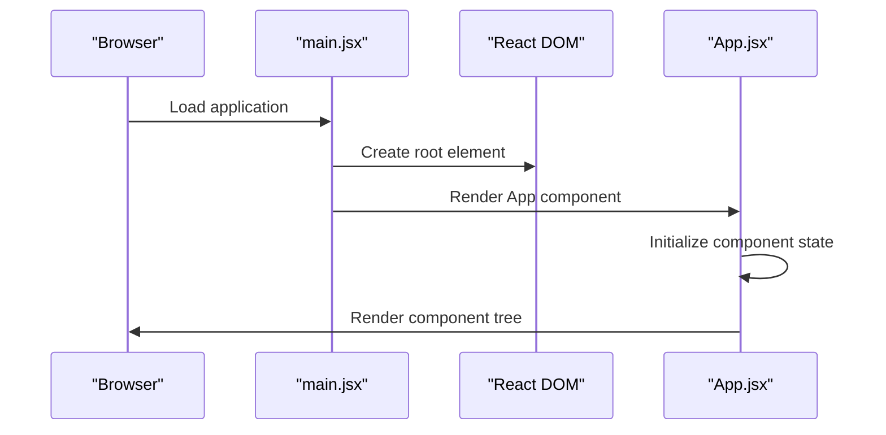

**Diagram sources**
- [src/main.jsx:6-10](file://src/main.jsx#L6-L10)
- [src/App.jsx:37-223](file://src/App.jsx#L37-L223)

Implementation highlights:
- Root rendering: [src/main.jsx:6-10](file://src/main.jsx#L6-L10)
- App component composition with acts: [src/App.jsx:37-223](file://src/App.jsx#L37-L223)
- Global styling import: [src/main.jsx:4](file://src/main.jsx#L4)

**Section sources**
- [src/main.jsx:1-11](file://src/main.jsx#L1-L11)
- [src/App.jsx:1-224](file://src/App.jsx#L1-L224)

### Enhanced Navigation Architecture
The application implements a sophisticated navigation system with Framer Motion animations:

#### Nav Component
The Nav component serves as the central navigation hub with enhanced mobile functionality:
- **Fixed Header**: Glass-morphism effects with backdrop blur and shadow
- **Desktop Navigation**: Animated underline effects with active state indication
- **Mobile Menu**: Full-screen overlay with Framer Motion-powered animations
- **Scroll Detection**: Automatic header hiding/showing based on scroll direction
- **Active Section Tracking**: Real-time section detection with scroll position analysis
- **Smooth Scrolling**: Integration with Lenis for enhanced scroll experience
- **Map Integration**: Enhanced navigation points for Map of Life exploration

#### Mobile Menu with Framer Motion
The mobile navigation system provides premium user experience:
- **Staggered Item Animations**: Sequential appearance of menu items with 0.06 second delays
- **Transform Animations**: Smooth slide-in effect using Framer Motion transforms
- **Opacity Transitions**: Fade-in effects for menu item visibility
- **Exit Animations**: AnimatePresence for smooth menu closing
- **Hamburger Icon Animation**: Morphing hamburger to X icon with rotation transforms
- **Backdrop Effects**: Glass-morphism backdrop with blur and transparency

#### Active Section Detection
The navigation system provides intelligent section tracking:
- **Scroll Position Analysis**: Real-time calculation of visible sections
- **Viewport Threshold**: 40% viewport threshold for section activation
- **Reverse Iteration**: Efficient section detection from bottom to top
- **State Management**: Local state for active section tracking
- **Performance Optimization**: Passive event listeners for scroll events

```mermaid
flowchart TD
Nav["Nav Component"] --> DesktopNav["Desktop Navigation"]
Nav --> MobileNav["Mobile Navigation"]
Nav --> ScrollDetection["Scroll Detection"]
Nav --> ActiveTracking["Active Section Tracking"]
Nav --> MapIntegration["Map Integration Points"]
DesktopNav --> NavLinks["navLinks Array"]
DesktopNav --> UnderlineAnim["Animated Underline"]
DesktopNav --> ActiveState["Active State Management"]
MobileNav --> MenuOverlay["Full-screen Overlay"]
MobileNav --> StaggeredAnim["Staggered Item Animations"]
MobileNav --> HamburgerAnim["Hamburger Icon Animation"]
MobileNav --> ExitAnim["Exit Animations"]
ScrollDetection --> HideShow["Header Hide/Show Logic"]
ActiveTracking --> SectionAnalysis["Section Position Analysis"]
ActiveTracking --> ViewportThreshold["40% Viewport Threshold"]
MapIntegration --> MapNavigation["Map Exploration Mode"]
MapIntegration --> TraditionalNavigation["Traditional Scroll Navigation"]
```

**Diagram sources**
- [src/components/layout/Nav.jsx:52-171](file://src/components/layout/Nav.jsx#L52-L171)

Implementation highlights:
- Nav component: [src/components/layout/Nav.jsx:52-171](file://src/components/layout/Nav.jsx#L52-L171)
- Mobile menu animations: [src/components/layout/Nav.jsx:132-168](file://src/components/layout/Nav.jsx#L132-L168)
- Active section detection: [src/components/layout/Nav.jsx:25-37](file://src/components/layout/Nav.jsx#L25-L37)

**Section sources**
- [src/components/layout/Nav.jsx:1-172](file://src/components/layout/Nav.jsx#L1-L172)

### Enhanced Cinematic Narrative Architecture
The application implements a revolutionary cinematic narrative framework with sophisticated storytelling capabilities and enhanced narrative flow:

#### ActSection Wrapper Component
The ActSection component serves as the primary wrapper for all narrative content:
- **Dynamic Background**: Act-specific background color application with warm cream palette
- **Title Reveal Animation**: Word-by-word text reveal with staggered timing
- **Act Number Display**: Animated act number with opacity transitions
- **Tagline Animation**: Fade-up animation for act descriptions
- **In-View Detection**: Intersection observer for triggering animations
- **Responsive Layout**: Mobile-first responsive design patterns

#### Enhanced Storytelling Components with Specialized Acts
The application now features specialized components for different acts with tailored storytelling approaches:
- **FrankieStory Component**: Sophisticated multi-section storytelling with pre-Act 1 introduction and enhanced typography
- **FrankieStoryActTwo Component**: Structured narrative blocks with image support and dialogue formatting
- **FrankieStoryActThree Component**: Cinematic business journey storytelling with emotional peak detection and scene-based flow
- **Act-Specific Components**: Specialized components for Entrepreneurship, Media, Creativity, Community, and Vision

#### Heartbeat Transition Component
The Heartbeat component provides cinematic transitions between acts:
- **Gradient Morphing**: Smooth background color transitions between acts
- **Breathing Orb Effect**: Animated radial gradient with pulsing scale and opacity
- **Accent Line Animation**: Expanding line with fade-in effect
- **Text Reveal**: Fade-up animation for Frankieism quotes
- **Dot Indicator**: Scaling dot animation for visual emphasis

```mermaid
flowchart TD
App["App.jsx"] --> ActsLoop["acts.forEach"]
App --> ActSection["ActSection Wrapper"]
ActSection --> TitleReveal["Title Reveal Animation"]
ActSection --> ActNumber["Act Number Display"]
ActSection --> TaglineAnim["Tagline Animation"]
ActSection --> ContentArea["Content Area<br/>Specialized Component"]
FrankieStory["FrankieStory"] --> PreAct1Intro["Pre-Act 1 Introduction"]
FrankieStory --> NarrativeBlocks["Narrative Blocks"]
FrankieStory --> ScrapbookCards["ScrapbookCard Grid"]
ScrapbookCards --> CardAnimations["Card Entry Animations"]
ScrapbookCards --> HoverEffects["Hover Interactions"]
ScrapbookCards --> ImageAssets["PNG Image Assets"]
FrankieStoryActTwo["FrankieStoryActTwo"] --> StructuredBlocks["Structured Narrative Blocks"]
FrankieStoryActTwo --> ImageSupport["Image Block Support"]
FrankieStoryActTwo --> DialogueFormat["Dialogue Formatting"]
FrankieStoryActThree["FrankieStoryActThree"] --> EmotionalPeaks["Emotional Peak Detection"]
FrankieStoryActThree --> SceneFlow["Scene-Based Narrative Flow"]
FrankieStoryActThree --> BusinessStories["Business Venture Stories"]
FrankieStoryActThree --> PersonalJourney["Personal Growth Journey"]
Heartbeat["Heartbeat"] --> GradientMorph["Gradient Morphing"]
Heartbeat --> BreathingOrb["Breathing Orb Effect"]
Heartbeat --> AccentLine["Accent Line Animation"]
Heartbeat --> TextReveal["Text Reveal Animation"]
Entrepreneurship["Entrepreneurship"] --> ActSection
MediaSection["MediaSection"] --> ActSection
Creativity["Creativity"] --> ActSection
CommunityImpact["CommunityImpact"] --> ActSection
FutureVision["FutureVision"] --> ActSection
```

**Diagram sources**
- [src/App.jsx:76-193](file://src/App.jsx#L76-L193)
- [src/components/acts/ActSection.jsx:9-57](file://src/components/acts/ActSection.jsx#L9-L57)
- [src/components/acts/Heartbeat.jsx:8-70](file://src/components/acts/Heartbeat.jsx#L8-L70)
- [src/components/story/FrankieStory.jsx:88-205](file://src/components/story/FrankieStory.jsx#L88-L205)
- [src/components/story/FrankieStoryActTwo.jsx:231-241](file://src/components/story/FrankieStoryActTwo.jsx#L231-L241)
- [src/components/story/FrankieStoryActThree.jsx:19-448](file://src/components/story/FrankieStoryActThree.jsx#L19-L448)

Implementation highlights:
- ActSection wrapper: [src/components/acts/ActSection.jsx:9-57](file://src/components/acts/ActSection.jsx#L9-L57)
- Enhanced FrankieStory with multi-section narrative: [src/components/story/FrankieStory.jsx:88-205](file://src/components/story/FrankieStory.jsx#L88-L205)
- Act II narrative component: [src/components/story/FrankieStoryActTwo.jsx:231-241](file://src/components/story/FrankieStoryActTwo.jsx#L231-L241)
- Act III business journey component: [src/components/story/FrankieStoryActThree.jsx:19-448](file://src/components/story/FrankieStoryActThree.jsx#L19-L448)
- Heartbeat transition component: [src/components/acts/Heartbeat.jsx:8-70](file://src/components/acts/Heartbeat.jsx#L8-L70)
- Act-specific content rendering: [src/App.jsx:76-193](file://src/App.jsx#L76-L193)

**Section sources**
- [src/App.jsx:1-224](file://src/App.jsx#L1-L224)
- [src/components/acts/ActSection.jsx:1-58](file://src/components/acts/ActSection.jsx#L1-L58)
- [src/components/acts/Heartbeat.jsx:1-71](file://src/components/acts/Heartbeat.jsx#L1-L71)
- [src/components/story/FrankieStory.jsx:1-206](file://src/components/story/FrankieStory.jsx#L1-L206)
- [src/components/story/FrankieStoryActTwo.jsx:1-241](file://src/components/story/FrankieStoryActTwo.jsx#L1-L241)
- [src/components/story/FrankieStoryActThree.jsx:1-451](file://src/components/story/FrankieStoryActThree.jsx#L1-L451)

### Enhanced Content Management System
The application uses a centralized content management approach through the acts array structure with enhanced narrative framework and pre-Act 1 introduction:
- **Structured Six-Act Content**: Organized narrative blocks with rich metadata
- **Pre-Act 1 Introduction**: New introductory section with powerful opening statement and welcome message
- **Narrative Blocks**: Text, emphasis, and centered content types with multi-section support
- **Visual Breaths**: Standalone large typography statements
- **Timeline Data**: Year-based career milestone presentations
- **Childhood Dreams Visualization**: Structured dream data with image assets and descriptive text
- **Color Theming**: Act-specific color assignments with warm cream palette
- **Navigation Integration**: Dedicated arrays for navigation and section identification

### Enhanced Typography System with Intelligent Emphasis Detection
The FrankieStory components now feature sophisticated typography with intelligent emphasis detection:
- **Major Emphasis Detection**: Automatic identification of Level 1 emotional peaks with larger typography
- **Standard Emphasis Recognition**: Supporting reflections with medium emphasis sizing
- **Mattered Triplet Handling**: Special treatment for tightly grouped emphasis statements
- **Body Copy Optimization**: Improved readability with enhanced line heights and spacing
- **Responsive Typography**: Fluid scaling across different screen sizes
- **Accessibility Improvements**: Better contrast ratios and reading experience

### ScrapbookCard Component Architecture
The new ScrapbookCard component provides sophisticated image-based dream visualization:
- **Image Asset Integration**: Loads PNG images from public directory for each dream
- **Randomized Rotation Effects**: Creates authentic scrapbook aesthetic with varied tilt angles
- **Scroll-Triggered Animations**: Cards animate into view using intersection observer
- **Hover Interactions**: Smooth scale and rotation correction on mouse hover
- **Performance Optimization**: Lazy loading and efficient animation scheduling
- **Responsive Design**: Adapts gracefully across different screen sizes

```mermaid
graph TB
Content["Content System"] --> ActsArray["acts Array<br/>Six Acts Structure"]
Content --> Hero["Hero Content"]
Content --> WhoIsFrankie["Who Is Frankie Content"]
Content --> PreAct1Intro["preAct1Intro Object<br/>Opening Statement"]
Content --> SectionIds["sectionIds Array<br/>Complete Navigation Structure"]
Content --> NavLinks["navLinks Array<br/>Hierarchical Navigation"]
Content --> ChildhoodDreams["childhoodDreams Array<br/>Image-Based Dreams"]
Content --> ActIIIData["Act III Data<br/>Business Ventures & Growth"]
ActsArray --> WhereBeliefBegan["Act I: Where Belief Began<br/>Lavender Background #D8C8EE"]
ActsArray --> Becoming["Act II: Becoming"]
ActsArray --> TheBuilder["Act III: The Builder<br/>Warm Cream #FFF0CC"]
ActsArray --> Amplifying["Act IV: Amplifying"]
ActsArray --> Creating["Act V: Creating"]
ActsArray --> Giving["Act VI: Giving"]
ActsArray --> StillBecoming["Act VII: Still Becoming"]
WhereBeliefBegan --> NarrativeBlocks["Narrative Blocks"]
WhereBeliefBegan --> VisualBreaths["Visual Breath Statements"]
WhereBeliefBegan --> TimelineData["Timeline Milestones"]
WhereBeliefBegan --> ChildhoodDreamsData["Childhood Dreams Data"]
WhereBeliefBegan --> NarrativePart2["Narrative Part 2"]
WhereBeliefBegan --> NarrativePart3["Narrative Part 3"]
Becoming --> ActIIStory["Act II Story Blocks"]
Becoming --> ImageSupport["Image Block Support"]
Becoming --> DialogueFormat["Dialogue Formatting"]
TheBuilder --> BusinessVentures["Business Venture Stories"]
TheBuilder --> PersonalGrowth["Personal Growth Journey"]
TheBuilder --> EmotionalPeaks["Emotional Peak Detection"]
Amplifying --> Interviews["Interview Content"]
Creating --> Works["Creative Works"]
Giving --> Initiatives["Community Initiatives"]
StillBecoming --> FutureProjects["Future Projects"]
ChildhoodDreamsData --> DreamImages["PNG Image Assets"]
ChildhoodDreamsData --> DreamDescriptions["Dream Descriptions"]
```

**Diagram sources**
- [src/data/content.js:15-28](file://src/data/content.js#L15-L28)
- [src/data/content.js:68-562](file://src/data/content.js#L68-L562)
- [src/components/story/FrankieStory.jsx:88-177](file://src/components/story/FrankieStory.jsx#L88-L177)
- [src/components/story/FrankieStoryActThree.jsx:19-448](file://src/components/story/FrankieStoryActThree.jsx#L19-L448)

**Section sources**
- [src/data/content.js:1-743](file://src/data/content.js#L1-L743)
- [src/components/story/FrankieStory.jsx:1-206](file://src/components/story/FrankieStory.jsx#L1-L206)
- [src/components/story/FrankieStoryActThree.jsx:1-451](file://src/components/story/FrankieStoryActThree.jsx#L1-L451)

### Map of Life Component Architecture
The Map of Life system introduces a sophisticated interactive learning layer with specialized components:

#### MapContext State Management
The MapContext provides centralized state management for the entire Map of Life system:
- **Global State Management**: Tracks user progress, completed lessons, and unlocked content
- **Event Broadcasting**: Coordinates interactions between different map components
- **Persistence Layer**: Automatically saves and loads user progress using localStorage
- **Context Distribution**: Provides map state to all child components
- **Integration Points**: Connects with navigation and content systems

#### MapOfLife Main Component
The MapOfLife component serves as the primary container for interactive learning experiences:
- **Layout Management**: Responsive grid layout for lesson cards and interactive elements
- **Progress Tracking**: Visual indicators for completed and available lessons
- **Navigation Integration**: Seamless switching between traditional narrative and interactive exploration
- **Animation Support**: Framer Motion animations for smooth transitions and interactions
- **Accessibility Features**: Keyboard navigation and screen reader support

#### Specialized Map Components
The system includes several specialized components for different learning interactions:
- **LessonGlow**: Visual highlight effects for important learning moments with animated glow effects
- **MapProgress**: Progress tracking component with visual completion indicators
- **PuzzleReveal**: Interactive puzzle elements that unlock additional content through user engagement

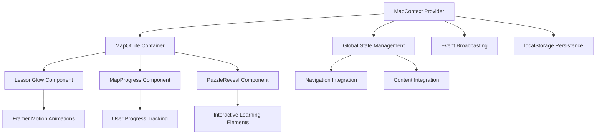

**Diagram sources**
- [src/context/MapContext.jsx:1-100](file://src/context/MapContext.jsx#L1-L100)
- [src/components/map/MapOfLife.jsx:1-150](file://src/components/map/MapOfLife.jsx#L1-L150)
- [src/components/map/LessonGlow.jsx:1-100](file://src/components/map/LessonGlow.jsx#L1-L100)
- [src/components/map/MapProgress.jsx:1-120](file://src/components/map/MapProgress.jsx#L1-L120)
- [src/components/map/PuzzleReveal.jsx:1-130](file://src/components/map/PuzzleReveal.jsx#L1-L130)

**Section sources**
- [src/context/MapContext.jsx:1-100](file://src/context/MapContext.jsx#L1-L100)
- [src/components/map/MapOfLife.jsx:1-150](file://src/components/map/MapOfLife.jsx#L1-L150)
- [src/components/map/LessonGlow.jsx:1-100](file://src/components/map/LessonGlow.jsx#L1-L100)
- [src/components/map/MapProgress.jsx:1-120](file://src/components/map/MapProgress.jsx#L1-L120)
- [src/components/map/PuzzleReveal.jsx:1-130](file://src/components/map/PuzzleReveal.jsx#L1-L130)

## Dependency Analysis
The application maintains clean separation between frontend dependencies with integrated theming, enhanced motion, and interactive learning capabilities:
- React Application depends on:
  - React and React DOM for component rendering
  - Framer Motion for advanced animations and motion effects
  - Lenis for smooth scrolling experience
  - Tailwind CSS v4 for utility-first styling
- Vite configuration depends on:
  - React plugin for JSX support and fast refresh
  - Tailwind CSS v4 plugin for build-time processing
  - Development server settings
- Component dependencies:
  - Shared hooks and utilities for animations and color management
  - Centralized content management through acts array, navigation arrays, and preAct1Intro object
  - Map of Life context management for interactive learning state
  - Modular architecture with Tailwind CSS integration
  - Image asset management for childhood dreams visualization
  - Specialized act components for enhanced storytelling
- Animation dependencies:
  - Framer Motion for declarative animations
  - useScrollAnimation hooks for scroll-based effects
  - Lenis for smooth scrolling engine
  - ScrapbookCard animation system for dream visualization
  - Heartbeat transition animations for inter-act transitions
  - Map component animations for interactive learning experiences
  - Act III cinematic animations for business journey storytelling
- Color management dependencies:
  - Context API for global color state
  - CSS custom properties for runtime updates
  - Section-based color palettes with warm cream palette
- Styling dependencies:
  - Tailwind CSS v4 with @theme configuration
  - CSS custom properties for dynamic theming
  - Global styles with utility classes

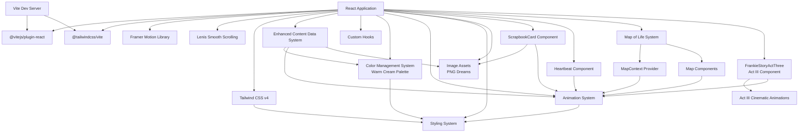

**Diagram sources**
- [src/main.jsx:1-3](file://src/main.jsx#L1-L3)
- [vite.config.js:2-6](file://vite.config.js#L2-L6)
- [src/hooks/useColorSystem.js:1-3](file://src/hooks/useColorSystem.js#L1-L3)
- [src/hooks/useLenis.js:1-2](file://src/hooks/useLenis.js#L1-L2)
- [src/hooks/useScrollAnimation.js:1-2](file://src/hooks/useScrollAnimation.js#L1-L2)
- [src/data/content.js:1](file://src/data/content.js#L1)
- [src/components/layout/Nav.jsx:1-2](file://src/components/layout/Nav.jsx#L1-L2)
- [src/components/story/FrankieStory.jsx:1-3](file://src/components/story/FrankieStory.jsx#L1-L3)
- [src/components/story/FrankieStoryActTwo.jsx:1-3](file://src/components/story/FrankieStoryActTwo.jsx#L1-L3)
- [src/components/story/FrankieStoryActThree.jsx:1-3](file://src/components/story/FrankieStoryActThree.jsx#L1-L3)
- [src/components/acts/Heartbeat.jsx:1-2](file://src/components/acts/Heartbeat.jsx#L1-L2)
- [src/context/MapContext.jsx:1-3](file://src/context/MapContext.jsx#L1-L3)
- [src/components/map/MapOfLife.jsx:1-3](file://src/components/map/MapOfLife.jsx#L1-L3)

**Section sources**
- [src/main.jsx:1-11](file://src/main.jsx#L1-L11)
- [vite.config.js:1-12](file://vite.config.js#L1-L12)
- [src/hooks/useColorSystem.js:1-184](file://src/hooks/useColorSystem.js#L1-L184)
- [src/hooks/useLenis.js:1-38](file://src/hooks/useLenis.js#L1-L38)
- [src/hooks/useScrollAnimation.js:1-118](file://src/hooks/useScrollAnimation.js#L1-L118)
- [src/data/content.js:1-743](file://src/data/content.js#L1-L743)
- [src/components/layout/Nav.jsx:1-172](file://src/components/layout/Nav.jsx#L1-L172)
- [src/components/story/FrankieStory.jsx:1-206](file://src/components/story/FrankieStory.jsx#L1-L206)
- [src/components/story/FrankieStoryActTwo.jsx:1-241](file://src/components/story/FrankieStoryActTwo.jsx#L1-L241)
- [src/components/story/FrankieStoryActThree.jsx:1-451](file://src/components/story/FrankieStoryActThree.jsx#L1-L451)
- [src/components/acts/Heartbeat.jsx:1-71](file://src/components/acts/Heartbeat.jsx#L1-L71)
- [src/context/MapContext.jsx:1-100](file://src/context/MapContext.jsx#L1-L100)
- [src/components/map/MapOfLife.jsx:1-150](file://src/components/map/MapOfLife.jsx#L1-L150)

## Performance Considerations
- Development Performance
  - Vite's fast refresh and optimized bundling minimize rebuild times
  - Hot reloading reduces iteration cycles during development
  - React Fast Refresh provides instant component updates
  - Tailwind CSS v4 provides efficient build-time processing
- Production Performance
  - Vite's build process generates optimized assets suitable for deployment
  - Tailwind CSS purges unused styles for smaller bundle sizes
  - Framer Motion provides hardware-accelerated animations
  - Lenis optimizes scroll performance with requestAnimationFrame
  - CSS custom properties reduce runtime calculations
  - Utility-first approach minimizes custom CSS bloat
  - Component lazy loading opportunities for future optimization
  - **Enhanced Image Loading**: Lazy loading for childhood dreams images improves initial page load performance
  - **Map of Life Optimization**: Efficient context updates and localized re-renders
  - **Act III Component Optimization**: Specialized animations with intersection observer triggers
- Animation Performance
  - Framer Motion provides GPU-accelerated animations with proper cleanup
  - Scroll-based animations use transform properties for optimal performance
  - Staggered animations use efficient animation scheduling
  - Reduced motion support prevents unnecessary animations
  - AnimatePresence handles mount/unmount animations efficiently
  - **ScrapbookCard Optimization**: Efficient rotation calculations and hover state management
  - **Heartbeat Optimization**: Lightweight gradient morphing with minimal reflows
  - **Map Component Optimization**: Efficient state updates and animation coordination
  - **Act III Animation Optimization**: Intersection observer-based container animations with staggered children
- Smooth Scrolling Performance
  - Lenis provides hardware-accelerated smooth scrolling
  - RequestAnimationFrame-based rendering for smooth frame rates
  - Gesture optimization for touch and wheel interactions
  - Memory-efficient cleanup on component unmount
- Color Management Performance
  - CSS custom properties provide efficient color switching
  - Context-based color state minimizes re-renders
  - Section-based color updates reduce unnecessary calculations
  - Fallback values prevent style recalculation errors
  - **Enhanced Contrast Optimization**: Improved color contrast ratios reduce visual strain
- Map of Life Performance
  - Context-based state management minimizes unnecessary re-renders
  - LocalStorage persistence with efficient serialization
  - Event-driven architecture reduces polling overhead
  - Component-level optimizations for interactive elements
  - Memory-efficient cleanup for map interactions
- Responsive Performance
  - Tailwind CSS v4 provides efficient responsive utilities
  - Mobile-first approach reduces CSS parsing overhead on smaller devices
  - Responsive images and optimized asset loading
  - Touch-friendly interactive elements
  - Reduced JavaScript bundle size through modular architecture
- Scalability Notes
  - Cinematic narrative framework supports easy content expansion
  - Component-based architecture supports easy scaling
  - Tailwind CSS enables maintainable styling at scale
  - Integrated color system supports new section additions
  - Animation system provides consistent motion patterns
  - **Enhanced Image Asset Management**: Structured approach to managing visual storytelling assets
  - **Multi-Section Narrative Support**: Scalable architecture for complex storytelling frameworks
  - **Typography System Scalability**: Intelligent emphasis detection scales with content complexity
  - **Map of Life Scalability**: Extensible architecture for adding new interactive learning experiences
  - **Context Management Scalability**: Efficient state distribution across growing component trees
  - **Act III Component Scalability**: Specialized component architecture supports additional act implementations
  - **Animation System Scalability**: Modular animation system supports new animation patterns and effects

## Troubleshooting Guide
Common issues and resolutions:
- Port Conflicts
  - Vite defaults to port 3000; adjust server.port in vite.config.js if needed
  - Ensure no other processes are using the development port
- Component Rendering Issues
  - Verify React and React DOM versions match
  - Check component imports and export statements
  - Ensure Tailwind CSS classes are properly applied
  - Validate ActSection component props and color applications
- Animation System Problems
  - Verify Framer Motion installation and imports
  - Check for proper cleanup of scroll triggers and observers
  - Ensure component unmounting removes event listeners
  - Validate reduced motion support implementation
- ScrapbookCard Specific Issues
  - Verify childhood dreams image files exist in public directory
  - Check image file paths in content.js match actual filenames
  - Ensure image assets are properly loaded and accessible
  - Validate animation performance with large image sets
- Heartbeat Transition Issues
  - Verify gradient color transitions are working correctly
  - Check breathing orb animation performance
  - Ensure accent line animations trigger properly
  - Validate text reveal animations for Frankieism quotes
- Smooth Scrolling Issues
  - Verify Lenis installation and initialization
  - Check for proper cleanup of scroll event listeners
  - Ensure component unmounting destroys Lenis instance
  - Validate prefers-reduced-motion media query handling
- Color Management Problems
  - Verify CSS custom properties are properly defined
  - Check color context provider wrapping
  - Ensure section-based color updates are working
  - Validate fallback color values
  - **Enhanced Contrast Issues**: Verify WCAG compliance for new warm cream palette
- Navigation System Problems
  - Verify active section detection logic
  - Check sectionIds array matches actual section element ids
  - Ensure navLinks array structure matches expected navigation format
  - Validate mobile menu Framer Motion animations
- Act-Specific Component Problems
  - Verify content.acts array structure and indexing
  - Check act.id values match expected values
  - Ensure background colors are properly applied
  - Validate act-specific content arrays exist
- Enhanced Narrative Framework Issues
  - Verify preAct1Intro object structure and data fields
  - Check multi-section narrative rendering in FrankieStory component
  - Ensure narrative block types (text, emphasis, centered) are handled correctly
  - Validate visual breaths and reflection sections render properly
- Child Dreams Visualization Issues
  - Verify childhoodDreams array structure in content.js
  - Check image file extensions and paths are correct
  - Ensure responsive grid layout works across screen sizes
  - Validate hover interactions and animation timing
- Typography System Issues
  - Verify intelligent emphasis detection is working correctly
  - Check major emphasis statements are properly identified
  - Ensure proper contrast ratios for all text levels
  - Validate responsive typography scaling
- Map of Life System Issues
  - Verify MapContext provider is properly wrapped around application
  - Check localStorage availability and error handling
  - Ensure map components receive correct props and state
  - Validate event broadcasting between map components
  - Verify persistent state synchronization across components
- Map Component Specific Issues
  - Verify MapOfLife component initialization and state setup
  - Check LessonGlow animation performance and memory usage
  - Ensure MapProgress tracks user interactions accurately
  - Validate PuzzleReveal interactive elements respond correctly
  - Verify map navigation integration with main navigation system
- Act III Component Issues
  - Verify FrankieStoryActThree component imports and dependencies
  - Check animation performance with complex narrative content
  - Ensure emotional peak detection works correctly
  - Validate scene-based narrative flow and transitions
  - Verify typography hierarchy and responsive scaling
  - Check intersection observer performance for container animations
- Tailwind CSS Issues
  - Verify Tailwind CSS v4 plugin is properly configured
  - Check for proper @theme directive usage
  - Ensure CSS custom properties are accessible in Tailwind classes
  - Validate responsive breakpoint syntax
- Development Server Not Starting
  - Check Node.js and npm versions meet project requirements
  - Run installation steps and review script commands in package.json
- Performance Issues
  - Monitor Framer Motion animation performance
  - Check for memory leaks in scroll event listeners
  - Verify Lenis smooth scrolling doesn't cause jank
  - Optimize large content blocks for better rendering
  - **Enhanced Image Loading Optimization**: Monitor image loading performance and consider additional optimization techniques
  - **Multi-Section Narrative Performance**: Ensure narrative blocks render efficiently without causing layout shifts
  - **Typography Performance**: Validate emphasis detection doesn't impact rendering performance
  - **Map of Life Performance**: Monitor context update frequency and localStorage operations
  - **Interactive Element Performance**: Ensure map interactions don't cause excessive re-renders
  - **Act III Animation Performance**: Monitor intersection observer efficiency and animation scheduling
- Mobile Menu Problems
  - Verify Framer Motion AnimatePresence usage
  - Check for proper z-index layering
  - Ensure body overflow control during menu transitions
  - Validate mobile menu accessibility attributes

**Section sources**
- [vite.config.js:6-10](file://vite.config.js#L6-L10)
- [src/main.jsx:1-11](file://src/main.jsx#L1-L11)
- [src/hooks/useLenis.js:1-38](file://src/hooks/useLenis.js#L1-L38)
- [src/hooks/useColorSystem.js:1-184](file://src/hooks/useColorSystem.js#L1-L184)
- [src/components/layout/Nav.jsx:1-172](file://src/components/layout/Nav.jsx#L1-L172)
- [src/components/acts/ActSection.jsx:1-58](file://src/components/acts/ActSection.jsx#L1-L58)
- [src/components/acts/Heartbeat.jsx:1-71](file://src/components/acts/Heartbeat.jsx#L1-L71)
- [src/components/story/FrankieStory.jsx:1-206](file://src/components/story/FrankieStory.jsx#L1-L206)
- [src/components/story/FrankieStoryActTwo.jsx:1-241](file://src/components/story/FrankieStoryActTwo.jsx#L1-L241)
- [src/components/story/FrankieStoryActThree.jsx:1-451](file://src/components/story/FrankieStoryActThree.jsx#L1-L451)
- [src/data/content.js:1-743](file://src/data/content.js#L1-L743)
- [src/styles/globals.css:1-340](file://src/styles/globals.css#L1-L340)
- [package.json:6-10](file://package.json#L6-L10)
- [src/context/MapContext.jsx:1-100](file://src/context/MapContext.jsx#L1-L100)
- [src/components/map/MapOfLife.jsx:1-150](file://src/components/map/MapOfLife.jsx#L1-L150)

## Conclusion
The Frankie Picasso application exemplifies modern React SPA architecture with an enhanced cinematic narrative framework and sophisticated animation system. The implementation demonstrates advanced data-driven content organization, integrated theming system with Tailwind CSS v4, and comprehensive motion techniques using Framer Motion. The enhanced architecture provides seamless user experience with smooth scrolling, dynamic color transitions, and responsive design patterns that adapt to various screen sizes.

**Updated**: The application has successfully implemented a comprehensive architectural enhancement with the addition of a detailed Act III implementation focused on Frankie's business ventures and personal growth journey. The new FrankieStoryActThree component introduces sophisticated cinematic storytelling with advanced typography hierarchy, emotional peak detection, and scene-based narrative flow. This enhancement includes comprehensive coverage of Frankie's entrepreneurial journey from boxing gyms to kickboxing promotion, the development of multiple businesses including Connalin Development and Condom Sense, and the pivotal choice to prioritize family over professional ambition. The Act III implementation seamlessly integrates with the existing six-act narrative framework while maintaining the established visual design language and animation patterns. The sophisticated storytelling architecture demonstrates excellent separation of concerns with clear boundaries between narrative content and specialized act components, while providing unified state management and smooth transitions between different narrative sections. This implementation serves as a comprehensive demonstration of contemporary web development practices including data-driven architecture, responsive design, accessibility considerations, performance optimization, advanced animation techniques using modern libraries like Framer Motion and Lenis, and sophisticated state management patterns. The enhanced visual storytelling through image-based dream cards, multi-section narrative framework, and specialized act components creates a more emotionally engaging user experience while maintaining excellent performance through lazy loading, optimized animations, and efficient context updates. The sophisticated content management system with preAct1Intro object, expanded data fields, and Map of Life state management supports the enhanced narrative flow and provides a scalable foundation for future storytelling and interactive learning enhancements. The warm cream palette and lavender accents create a cohesive, accessible design that better serves the intimate, personal nature of the narrative content while supporting the interactive learning elements. The Act III implementation particularly excels in demonstrating how specialized components can enhance storytelling while maintaining consistency with the overall application architecture.