# Application Architecture

<cite>
**Referenced Files in This Document**
- [package.json](file://package.json)
- [vite.config.js](file://vite.config.js)
- [src/main.jsx](file://src/main.jsx)
- [src/App.jsx](file://src/App.jsx)
- [src/App.module.css](file://src/App.module.css)
- [src/components/layout/Nav.jsx](file://src/components/layout/Nav.jsx)
- [src/components/layout/Nav.module.css](file://src/components/layout/Nav.module.css)
- [src/components/layout/Footer.jsx](file://src/components/layout/Footer.jsx)
- [src/components/layout/Footer.module.css](file://src/components/layout/Footer.module.css)
- [src/components/common/SectionIndicator.jsx](file://src/components/common/SectionIndicator.jsx)
- [src/components/common/ScrollReveal.jsx](file://src/components/common/ScrollReveal.jsx)
- [src/styles/_global.css](file://src/styles/_global.css)
- [src/styles/_variables.css](file://src/styles/_variables.css)
- [src/styles/_typography.css](file://src/styles/_typography.css)
- [src/styles/_utilities.css](file://src/styles/_utilities.css)
- [src/data/content.js](file://src/data/content.js)
- [src/hooks/useGsap.js](file://src/hooks/useGsap.js)
- [src/hooks/useActiveSection.js](file://src/hooks/useActiveSection.js)
- [src/hooks/useScrollReveal.js](file://src/hooks/useScrollReveal.js)
- [src/hooks/useParallax.js](file://src/hooks/useParallax.js)
- [src/components/acts/ActSection.jsx](file://src/components/acts/ActSection.jsx)
- [src/components/acts/ActSection.module.css](file://src/components/acts/ActSection.module.css)
- [src/components/acts/Heartbeat.jsx](file://src/components/acts/Heartbeat.jsx)
- [src/components/acts/RecognitionBadges.jsx](file://src/components/acts/RecognitionBadges.jsx)
- [src/components/acts/TimelineStrip.jsx](file://src/components/acts/TimelineStrip.jsx)
- [src/components/story/FrankieStory.jsx](file://src/components/story/FrankieStory.jsx)
- [src/components/entrepreneurship/Entrepreneurship.jsx](file://src/components/entrepreneurship/Entrepreneurship.jsx)
- [src/components/media/MediaHub.jsx](file://src/components/media/MediaHub.jsx)
- [src/components/creativity/Creativity.jsx](file://src/components/creativity/Creativity.jsx)
- [src/components/community/CommunityImpact.jsx](file://src/components/community/CommunityImpact.jsx)
- [src/components/vision/FutureVision.jsx](file://src/components/vision/FutureVision.jsx)
- [public/index.html](file://public/index.html)
</cite>

## Update Summary
**Changes Made**
- Enhanced navigation system documentation with sophisticated mobile menu animations using GSAP
- Added scroll progress tracking through SectionIndicator component with intersection observer
- Updated responsive design patterns with improved mobile-first architecture
- Integrated GSAP animation system for scroll-triggered effects and mobile menu transitions
- Documented new component architecture patterns including useActiveSection hook
- Added comprehensive coverage of scroll-based navigation indicators and progress tracking

## Table of Contents
1. [Introduction](#introduction)
2. [Project Structure](#project-structure)
3. [Six-Act Narrative Framework](#six-act-narrative-framework)
4. [Enhanced Navigation System](#enhanced-navigation-system)
5. [Core Components](#core-components)
6. [Architecture Overview](#architecture-overview)
7. [Responsive Component Architecture](#responsive-component-architecture)
8. [Styling and Design System](#styling-and-design-system)
9. [Detailed Component Analysis](#detailed-component-analysis)
10. [Animation and Interaction System](#animation-and-interaction-system)
11. [Dependency Analysis](#dependency-analysis)
12. [Performance Considerations](#performance-considerations)
13. [Troubleshooting Guide](#troubleshooting-guide)
14. [Conclusion](#conclusion)

## Introduction
This document describes the architecture of the Frankie Picasso application, a modern React Single Page Application (SPA) designed with a six-act narrative framework and sophisticated navigation system. The application demonstrates contemporary web development patterns through its data-driven content organization, centralized content management system, integrated theming architecture, and advanced animation system powered by GSAP. The system emphasizes a narrative-driven approach where content flows through six distinct acts, each with unique theming, storytelling elements, and specialized component implementations. The enhanced navigation system provides seamless user experience with sophisticated mobile menu animations, scroll progress tracking, and responsive design patterns.

**Updated**: The application has undergone significant enhancements to its navigation system, introducing sophisticated mobile menu animations with GSAP, scroll progress tracking through SectionIndicator, and improved responsive design patterns. The new architecture integrates advanced animation techniques while maintaining the six-act narrative framework that organizes content around Frankie Picasso's life story.

## Project Structure
The repository follows a modern React application layout with a data-driven six-act narrative architecture and enhanced navigation system:
- Frontend: React application with component-based architecture under src/
- Data Layer: Centralized content management through content.js with six-act structure and navigation arrays
- Navigation System: Sophisticated multi-level navigation with scroll progress tracking
- Animation Layer: GSAP integration for scroll-triggered animations and mobile menu effects
- Theming System: Integrated CSS variable-based theming with act-specific color schemes
- Component Architecture: ActSection-based components with enhanced responsive patterns
- Build and Dev Tooling: Vite configuration and scripts defined in package.json
- Static Assets: Minimal HTML shell in public/index.html
- Responsive Design: Advanced mobile-first approach with progressive enhancement

```mermaid
graph TB
subgraph "Repository Root"
PJSON["package.json"]
VCFG["vite.config.js"]
PUBLIC["public/index.html"]
end
subgraph "React Application (src/)"
MAIN["src/main.jsx"]
APP["src/App.jsx"]
COMPONENTS["src/components/"]
NAV["src/components/layout/Nav.jsx"]
SECTIONINDICATOR["src/components/common/SectionIndicator.jsx"]
FOOTER["src/components/layout/Footer.jsx"]
ACTS["src/components/acts/"]
STORIES["src/components/story/"]
ENTREPRENEURSHIP["src/components/entrepreneurship/"]
MEDIA["src/components/media/"]
CREATIVITY["src/components/creativity/"]
COMMUNITY["src/components/community/"]
VISION["src/components/vision/"]
STYLES["src/styles/"]
DATA["src/data/"]
HOOKS["src/hooks/"]
ANIMATIONS["src/hooks/useGsap.js"]
SCROLLREVEAL["src/hooks/useScrollReveal.js"]
ACTIVESECTION["src/hooks/useActiveSection.js"]
PARALLAX["src/hooks/useParallax.js"]
end
subgraph "Enhanced Navigation System"
NAVIGATION["Navigation Architecture"]
MOBILEMENU["Mobile Menu with GSAP"]
PROGRESS["Scroll Progress Tracking"]
SECTIONINDICATOR["Section Indicator Component"]
end
subgraph "Six-Act Framework"
CONTENT["src/data/content.js<br/>Acts Array Structure"]
SECTIONIDS["sectionIds Array<br/>Hero, Who, Journey, Impact, Media, Books, Art, Timeline, Contact"]
NAVLINKS["navLinks Array<br/>Navigation Structure"]
ACTCOLORS["actColors Object<br/>Act Color Mapping"]
END
PJSON --> VITE
VCFG --> PUBLIC
MAIN --> APP
APP --> COMPONENTS
COMPONENTS --> NAV
COMPONENTS --> SECTIONINDICATOR
COMPONENTS --> FOOTER
COMPONENTS --> ACTS
COMPONENTS --> DATA
COMPONENTS --> HOOKS
COMPONENTS --> ANIMATIONS
COMPONENTS --> SCROLLREVEAL
COMPONENTS --> ACTIVESECTION
COMPONENTS --> PARALLAX
DATA --> CONTENT
DATA --> SECTIONIDS
DATA --> NAVLINKS
DATA --> ACTCOLORS
NAV --> MOBILEMENU
SECTIONINDICATOR --> PROGRESS
NAVIGATION --> SECTIONINDICATOR
```

**Diagram sources**
- [package.json:1-23](file://package.json#L1-L23)
- [vite.config.js:1-11](file://vite.config.js#L1-L11)
- [src/main.jsx:1-11](file://src/main.jsx#L1-L11)
- [src/App.jsx:1-87](file://src/App.jsx#L1-L87)
- [src/data/content.js:319-357](file://src/data/content.js#L319-L357)
- [src/components/layout/Nav.jsx:1-214](file://src/components/layout/Nav.jsx#L1-L214)
- [src/components/common/SectionIndicator.jsx:1-50](file://src/components/common/SectionIndicator.jsx#L1-L50)
- [src/hooks/useGsap.js:1-14](file://src/hooks/useGsap.js#L1-L14)
- [src/hooks/useActiveSection.js:1-36](file://src/hooks/useActiveSection.js#L1-L36)
- [src/hooks/useScrollReveal.js:1-56](file://src/hooks/useScrollReveal.js#L1-L56)
- [src/hooks/useParallax.js:1-31](file://src/hooks/useParallax.js#L1-L31)
- [public/index.html:1-21](file://public/index.html#L1-L21)

**Section sources**
- [package.json:1-23](file://package.json#L1-L23)
- [vite.config.js:1-11](file://vite.config.js#L1-L11)
- [src/main.jsx:1-11](file://src/main.jsx#L1-L11)
- [src/App.jsx:1-87](file://src/App.jsx#L1-L87)
- [public/index.html:1-21](file://public/index.html#L1-L21)

## Six-Act Narrative Framework
The application implements a revolutionary six-act narrative framework that organizes Frankie Picasso's life story into distinct thematic sections with enhanced navigation support:

### Act Structure Organization
Each act represents a distinct phase of Frankie's journey with its own color scheme, themes, and content organization:
- **Act I (Becoming)**: Foundation and early influences
- **Act II (Building)**: Platform creation and leadership roles
- **Act III (Amplifying)**: Media and platform expansion
- **Act IV (Creating)**: Artistic and creative endeavors
- **Act V (Giving)**: Community impact and mentorship
- **Act VI (Still Becoming)**: Ongoing evolution and future vision

### Enhanced Content Management System
The content.js file contains a centralized structure with enhanced navigation arrays:
- **acts Array**: Complete six-act narrative structure with metadata and content
- **sectionIds Array**: Complete navigation structure for scroll-based navigation
- **navLinks Array**: Hierarchical navigation structure for both desktop and mobile
- **actColors Object**: Color mapping for act-specific styling and progress indicators
- **Content Objects**: Rich content structures for each narrative section

### ActSection Component Architecture
The ActSection component serves as a wrapper that applies act-specific theming and provides consistent structural elements:
- Dynamic watermark with act number
- Theme class application based on act id
- Consistent header structure with act branding
- Content area for specialized act components

**Section sources**
- [src/data/content.js:50-196](file://src/data/content.js#L50-L196)
- [src/data/content.js:319-357](file://src/data/content.js#L319-L357)
- [src/components/acts/ActSection.jsx:5-34](file://src/components/acts/ActSection.jsx#L5-L34)
- [src/styles/_variables.css:50-56](file://src/styles/_variables.css#L50-L56)

## Enhanced Navigation System
The application features a sophisticated navigation system with advanced mobile menu animations, scroll progress tracking, and responsive design patterns:

### Navigation Architecture
The navigation system consists of multiple interconnected components working together:
- **Desktop Navigation**: Fixed header with gold-accented navigation links
- **Mobile Navigation**: Full-screen overlay menu with GSAP-powered animations
- **Section Indicator**: Floating navigation dots with scroll progress tracking
- **Scroll Progress Tracking**: Intersection Observer-based active section detection

### Mobile Menu with GSAP Animations
The mobile navigation system provides a premium user experience with sophisticated animations:
- **Slide-in Animation**: Smooth slide-in effect using GSAP transforms
- **Staggered Item Animations**: Sequential appearance of menu items with staggered delays
- **Backdrop Effects**: Glass-morphism backdrop with blur and saturation effects
- **Overflow Control**: Body scroll locking during menu open state
- **Responsive Design**: Complete mobile-first approach with tablet adaptations

### Scroll Progress Tracking
The SectionIndicator component provides visual navigation cues:
- **Intersection Observer**: Real-time section detection with custom root margins
- **Floating Dots**: Circular navigation indicators positioned on the right side
- **Color Coding**: Act-specific colors for each section indicator
- **Visibility Logic**: Conditional visibility based on scroll position
- **Smooth Scrolling**: Direct navigation to sections with offset positioning

### Active Section Detection
The useActiveSection hook provides intelligent section tracking:
- **Intersection Observer API**: High-performance section detection
- **Root Margin Configuration**: Customizable viewport positioning thresholds
- **Real-time Updates**: Immediate feedback as users scroll through sections
- **Cleanup Management**: Proper observer cleanup on component unmount
- **Accessibility Support**: ARIA attributes for screen reader compatibility

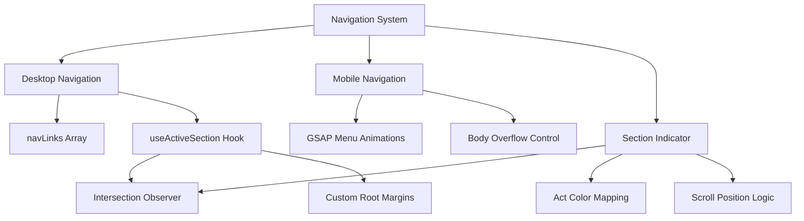

**Diagram sources**
- [src/components/layout/Nav.jsx:42-213](file://src/components/layout/Nav.jsx#L42-L213)
- [src/components/common/SectionIndicator.jsx:13-50](file://src/components/common/SectionIndicator.jsx#L13-L50)
- [src/hooks/useActiveSection.js:3-35](file://src/hooks/useActiveSection.js#L3-L35)
- [src/hooks/useGsap.js:1-14](file://src/hooks/useGsap.js#L1-L14)

**Section sources**
- [src/components/layout/Nav.jsx:1-214](file://src/components/layout/Nav.jsx#L1-L214)
- [src/components/common/SectionIndicator.jsx:1-50](file://src/components/common/SectionIndicator.jsx#L1-L50)
- [src/hooks/useActiveSection.js:1-36](file://src/hooks/useActiveSection.js#L1-L36)
- [src/hooks/useGsap.js:1-14](file://src/hooks/useGsap.js#L1-L14)

## Core Components
- React Application Entry Point
  - Initializes the React application and renders the root App component
  - Sets up global styles and strict mode for development
- Enhanced Navigation Architecture
  - Sophisticated mobile menu with GSAP animations and scroll progress tracking
  - SectionIndicator component for floating navigation dots
  - useActiveSection hook for intelligent section detection
  - Data-driven navigation through navLinks and sectionIds arrays
- Six-Act Narrative Architecture
  - Centralized content management through acts array structure
  - ActSection wrapper component for consistent theming and layout
  - Data-driven component composition based on content structure
- Responsive Component Architecture
  - Component-based UI with reusable, modular components optimized for various screen sizes
  - CSS modules with responsive design patterns and progressive enhancement
- Integrated Theming System
  - CSS variable-based theming with act-specific color schemes
  - Dynamic theme application through theme classes
  - Consistent design tokens across all components
- Comprehensive Styling System
  - Responsive design with CSS custom properties and utility classes
  - Progressive enhancement from mobile to desktop breakpoints
- Advanced Animation System
  - GSAP integration for scroll-triggered animations and mobile menu effects
  - ScrollReveal hook for fade-up animations with staggered effects
  - Parallax effects with useParallax hook for depth perception
  - Reduced motion support for accessibility compliance

Key implementation references:
- React entry point and rendering: [src/main.jsx:6-10](file://src/main.jsx#L6-L10)
- Enhanced navigation system: [src/components/layout/Nav.jsx:42-213](file://src/components/layout/Nav.jsx#L42-L213)
- Section indicator component: [src/components/common/SectionIndicator.jsx:13-50](file://src/components/common/SectionIndicator.jsx#L13-L50)
- Active section detection: [src/hooks/useActiveSection.js:3-35](file://src/hooks/useActiveSection.js#L3-L35)
- App component composition with acts: [src/App.jsx:23-84](file://src/App.jsx#L23-L84)
- ActSection wrapper component: [src/components/acts/ActSection.jsx:5-34](file://src/components/acts/ActSection.jsx#L5-L34)
- Centralized content management: [src/data/content.js:50-196](file://src/data/content.js#L50-L196)
- Act-specific theming: [src/styles/_variables.css:50-56](file://src/styles/_variables.css#L50-L56)
- Vite configuration and dev server: [vite.config.js:4-10](file://vite.config.js#L4-L10)
- Development scripts: [package.json:6-10](file://package.json#L6-L10)

**Section sources**
- [src/main.jsx:1-11](file://src/main.jsx#L1-L11)
- [src/App.jsx:1-87](file://src/App.jsx#L1-L87)
- [src/components/layout/Nav.jsx:1-214](file://src/components/layout/Nav.jsx#L1-L214)
- [src/components/common/SectionIndicator.jsx:1-50](file://src/components/common/SectionIndicator.jsx#L1-L50)
- [src/hooks/useActiveSection.js:1-36](file://src/hooks/useActiveSection.js#L1-L36)
- [src/components/acts/ActSection.jsx:1-34](file://src/components/acts/ActSection.jsx#L1-L34)
- [src/data/content.js:1-357](file://src/data/content.js#L1-L357)
- [src/styles/_variables.css:1-72](file://src/styles/_variables.css#L1-L72)
- [vite.config.js:1-11](file://vite.config.js#L1-L11)
- [package.json:1-23](file://package.json#L1-L23)

## Architecture Overview
The system employs a modern data-driven narrative architecture with enhanced navigation capabilities:
- Presentation Layer: React components organized around six-act narrative structure
- State Management: React hooks for component state and custom hooks for animations and navigation
- Data Layer: Centralized content management through acts array structure with navigation arrays
- Navigation Layer: Sophisticated multi-level navigation with scroll progress tracking
- Theming Layer: CSS variable-based theming with act-specific color schemes
- Animation Layer: GSAP integration for scroll-triggered animations and mobile menu effects
- Styling Layer: Responsive design system with CSS custom properties and utility classes
- Responsive Layer: Advanced mobile-first approach with progressive enhancement

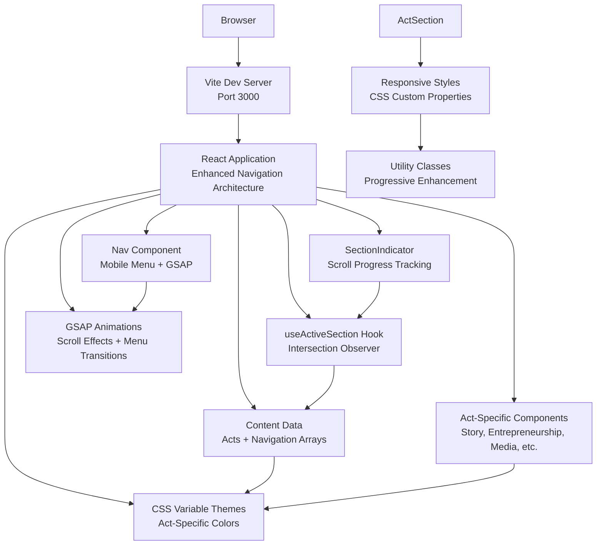

**Diagram sources**
- [vite.config.js:6-9](file://vite.config.js#L6-L9)
- [src/main.jsx:6-10](file://src/main.jsx#L6-L10)
- [src/App.jsx:23-84](file://src/App.jsx#L23-L84)
- [src/components/layout/Nav.jsx:42-213](file://src/components/layout/Nav.jsx#L42-L213)
- [src/components/common/SectionIndicator.jsx:13-50](file://src/components/common/SectionIndicator.jsx#L13-L50)
- [src/hooks/useActiveSection.js:3-35](file://src/hooks/useActiveSection.js#L3-L35)
- [src/components/acts/ActSection.jsx:5-34](file://src/components/acts/ActSection.jsx#L5-L34)
- [src/data/content.js:50-196](file://src/data/content.js#L50-L196)
- [src/styles/_variables.css:50-56](file://src/styles/_variables.css#L50-L56)
- [src/styles/_global.css:1-76](file://src/styles/_global.css#L1-L76)

## Responsive Component Architecture
The application's component architecture is designed for responsive design across various screen sizes within the six-act framework with enhanced mobile navigation:

### Enhanced Navigation Components
The navigation system provides sophisticated responsive behavior:
- **Nav Component**: Fixed header with desktop and mobile navigation modes
- **SectionIndicator**: Floating navigation dots with scroll progress tracking
- **useActiveSection Hook**: Intelligent section detection with intersection observer
- **Mobile Menu**: Full-screen overlay with GSAP-powered animations
- **Responsive Breakpoints**: Multiple breakpoints for optimal mobile experience

### ActSection Component
The ActSection component serves as the primary wrapper for all narrative content:
- Dynamic watermark with act number (50% opacity serif font)
- Theme class application (act-theme--{actId})
- Consistent header structure with act branding
- Content area for specialized act components
- Responsive design with mobile-first approach

### Act-Specific Components
Each act has specialized components that leverage the shared ActSection wrapper:
- **FrankieStory**: Personal narrative and timeline presentation
- **Entrepreneurship**: Venture showcase with card-based layout
- **MediaHub**: Interactive filtering system for shows, interviews, and press
- **Creativity**: Artistic works display with GSAP animations
- **CommunityImpact**: Initiative showcase with parallax effects
- **FutureVision**: Mission statement and current projects presentation

### Theming Integration
The theming system integrates seamlessly with the component architecture:
- CSS variables define act-specific colors (--act-becoming, --act-building, etc.)
- Theme classes apply act-specific styling to components
- Dynamic color application through CSS custom properties
- Consistent design language across all act components

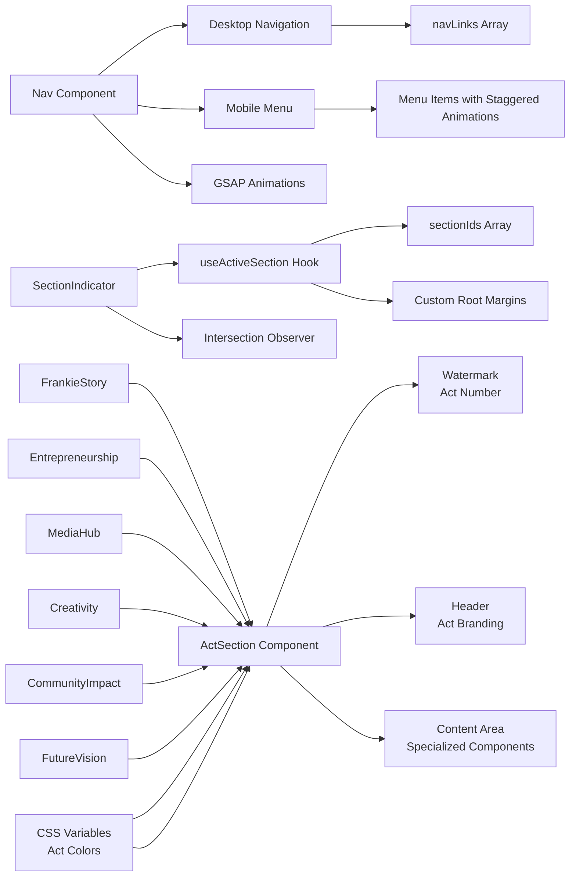

**Diagram sources**
- [src/components/layout/Nav.jsx:42-213](file://src/components/layout/Nav.jsx#L42-L213)
- [src/components/common/SectionIndicator.jsx:13-50](file://src/components/common/SectionIndicator.jsx#L13-L50)
- [src/hooks/useActiveSection.js:3-35](file://src/hooks/useActiveSection.js#L3-L35)
- [src/components/acts/ActSection.jsx:5-34](file://src/components/acts/ActSection.jsx#L5-L34)
- [src/components/acts/ActSection.module.css:1-91](file://src/components/acts/ActSection.module.css#L1-L91)
- [src/styles/_variables.css:50-56](file://src/styles/_variables.css#L50-L56)
- [src/components/story/FrankieStory.jsx:1-39](file://src/components/story/FrankieStory.jsx#L1-L39)
- [src/components/entrepreneurship/Entrepreneurship.jsx:1-48](file://src/components/entrepreneurship/Entrepreneurship.jsx#L1-L48)
- [src/components/media/MediaHub.jsx:1-73](file://src/components/media/MediaHub.jsx#L1-L73)
- [src/components/creativity/Creativity.jsx:1-56](file://src/components/creativity/Creativity.jsx#L1-L56)
- [src/components/community/CommunityImpact.jsx:1-84](file://src/components/community/CommunityImpact.jsx#L1-L84)
- [src/components/vision/FutureVision.jsx:1-30](file://src/components/vision/FutureVision.jsx#L1-L30)

**Section sources**
- [src/components/layout/Nav.jsx:1-214](file://src/components/layout/Nav.jsx#L1-L214)
- [src/components/common/SectionIndicator.jsx:1-50](file://src/components/common/SectionIndicator.jsx#L1-L50)
- [src/hooks/useActiveSection.js:1-36](file://src/hooks/useActiveSection.js#L1-L36)
- [src/components/acts/ActSection.jsx:1-34](file://src/components/acts/ActSection.jsx#L1-L34)
- [src/components/acts/ActSection.module.css:1-91](file://src/components/acts/ActSection.module.css#L1-L91)
- [src/styles/_variables.css:50-56](file://src/styles/_variables.css#L50-L56)
- [src/components/story/FrankieStory.jsx:1-39](file://src/components/story/FrankieStory.jsx#L1-L39)
- [src/components/entrepreneurship/Entrepreneurship.jsx:1-48](file://src/components/entrepreneurship/Entrepreneurship.jsx#L1-L48)
- [src/components/media/MediaHub.jsx:1-73](file://src/components/media/MediaHub.jsx#L1-L73)
- [src/components/creativity/Creativity.jsx:1-56](file://src/components/creativity/Creativity.jsx#L1-L56)
- [src/components/community/CommunityImpact.jsx:1-84](file://src/components/community/CommunityImpact.jsx#L1-L84)
- [src/components/vision/FutureVision.jsx:1-30](file://src/components/vision/FutureVision.jsx#L1-L30)

## Styling and Design System
The application features a comprehensive styling system built on modern CSS methodologies with integrated theming and enhanced responsive design:

### CSS Custom Properties System
- Root-level design tokens for consistent theming across all acts
- Act-specific color tokens (--act-becoming, --act-building, etc.)
- Responsive spacing scale with adaptive adjustments
- Typography hierarchy with fluid scaling
- Color palette with semantic naming
- Transition timing functions for smooth animations
- Z-index layers for proper stacking context

### Enhanced Navigation Styling
The navigation system features sophisticated styling patterns:
- **Glass-morphism Effects**: Backdrop blur and saturation for mobile menu transparency
- **Gradient Backgrounds**: Linear gradients for header and mobile menu backgrounds
- **Transform Animations**: Smooth transitions for mobile menu open/close states
- **Responsive Typography**: Adaptive font sizing for different screen sizes
- **Flexible Layouts**: CSS Grid and Flexbox for responsive component arrangements

### Act-Specific Theming
- Dynamic theme application through theme classes
- CSS variable fallbacks for consistent styling
- Act-specific color schemes integrated throughout components
- Theme-aware typography and spacing
- Consistent design language across all act components

### Utility-First Approach
- Container classes for consistent page width
- Text alignment and color utility classes
- Background color variations
- Responsive spacing utilities
- Screen reader only helper class

### Component-Specific Styling
- CSS Modules for scoped component styles
- Responsive base styles with desktop overrides
- Animation-specific styling with GSAP integration
- Accessibility-focused styling with focus states
- Responsive typography with clamp() functions

### Responsive Design Implementation
- 1023px breakpoint for tablet and desktop adaptation
- Progressive enhancement from mobile to desktop
- Flexible grid layouts with CSS Grid
- Adaptive Flexbox patterns
- Fluid typography scaling

```mermaid
graph TB
DesignSystem["Design System"] --> Variables["CSS Variables"]
Variables --> ActColors["Act Color Tokens"]
Variables --> Typography["Typography Scale"]
Variables --> Spacing["Spacing Scale"]
Variables --> Transitions["Transition Timing"]
DesignSystem --> NavigationStyles["Navigation Styles"]
NavigationStyles --> GlassEffect["Glass Morphism Effects"]
NavigationStyles --> GradientBG["Gradient Backgrounds"]
NavigationStyles --> TransformAnim["Transform Animations"]
DesignSystem --> Utilities["Utility Classes"]
Utilities --> Containers["Container Classes"]
Utilities --> TextUtils["Text Utilities"]
Utilities --> ColorUtils["Color Utilities"]
Utilities --> BackgroundUtils["Background Utilities"]
DesignSystem --> Components["Component Styles"]
Components --> ActSectionStyles["ActSection Styles"]
Components --> ActSpecificStyles["Act-Specific Styles"]
Components --> ThemeIntegration["Theme Integration"]
```

**Diagram sources**
- [src/styles/_variables.css:1-72](file://src/styles/_variables.css#L1-L72)
- [src/styles/_utilities.css:1-55](file://src/styles/_utilities.css#L1-L55)
- [src/components/acts/ActSection.module.css:1-91](file://src/components/acts/ActSection.module.css#L1-L91)
- [src/components/layout/Nav.module.css:1-534](file://src/components/layout/Nav.module.css#L1-L534)

**Section sources**
- [src/styles/_global.css:1-76](file://src/styles/_global.css#L1-L76)
- [src/styles/_variables.css:1-72](file://src/styles/_variables.css#L1-L72)
- [src/styles/_typography.css:1-41](file://src/styles/_typography.css#L1-L41)
- [src/styles/_utilities.css:1-55](file://src/styles/_utilities.css#L1-L55)
- [src/components/layout/Nav.module.css:1-534](file://src/components/layout/Nav.module.css#L1-L534)

## Detailed Component Analysis

### React Application Entry Point
The application bootstraps through a minimal entry point that initializes React and renders the root App component:
- Creates React root and mounts the App component
- Imports global styles for consistent theming
- Enables React Strict Mode for development best practices
- Sets up the application foundation for component tree rendering

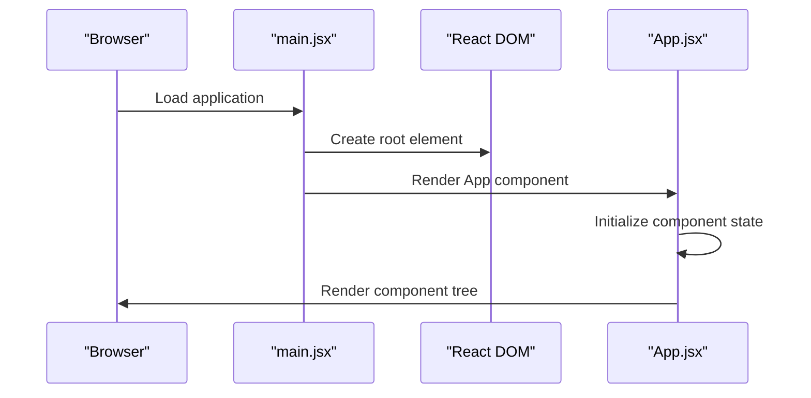

**Diagram sources**
- [src/main.jsx:6-10](file://src/main.jsx#L6-L10)
- [src/App.jsx:25-84](file://src/App.jsx#L25-L84)

Implementation highlights:
- Root rendering: [src/main.jsx:6-10](file://src/main.jsx#L6-L10)
- App component composition with acts: [src/App.jsx:23-84](file://src/App.jsx#L23-L84)
- Global styling import: [src/main.jsx:4](file://src/main.jsx#L4)

**Section sources**
- [src/main.jsx:1-11](file://src/main.jsx#L1-L11)
- [src/App.jsx:1-87](file://src/App.jsx#L1-L87)

### Enhanced Navigation Architecture
The application implements a sophisticated navigation system with multiple interconnected components:

#### Nav Component
The Nav component serves as the central navigation hub with enhanced mobile functionality:
- **Fixed Header**: Stays at top of viewport with backdrop blur effects
- **Desktop Navigation**: Gold-accented links with hover effects and active state indication
- **Mobile Menu**: Full-screen overlay with GSAP-powered slide-in animation
- **Scroll Detection**: Automatic header state changes based on scroll position
- **Social Links**: External social media integration with SVG icons
- **CTA Buttons**: Primary call-to-action with animated sparkle effect

#### SectionIndicator Component
The SectionIndicator provides floating navigation dots with scroll progress tracking:
- **Intersection Observer**: Real-time section detection with custom root margins
- **Floating Dots**: Positioned on right side with conditional visibility
- **Color Coding**: Act-specific colors for each navigation dot
- **Smooth Scrolling**: Direct navigation to sections with offset positioning
- **Accessibility**: ARIA attributes for screen reader compatibility

#### useActiveSection Hook
The useActiveSection hook provides intelligent section detection:
- **Intersection Observer API**: High-performance section detection
- **Custom Root Margins**: Configurable viewport positioning thresholds
- **Real-time Updates**: Immediate feedback as users scroll through sections
- **Performance Optimization**: Cleanup management on component unmount
- **Accessibility Support**: ARIA attributes for screen reader compatibility

#### Mobile Menu with GSAP Animations
The mobile navigation system provides premium user experience:
- **Slide-in Animation**: Smooth slide-in effect using GSAP transforms
- **Staggered Item Animations**: Sequential appearance of menu items with staggered delays
- **Backdrop Effects**: Glass-morphism backdrop with blur and saturation effects
- **Overflow Control**: Body scroll locking during menu open state
- **Responsive Design**: Complete mobile-first approach with tablet adaptations

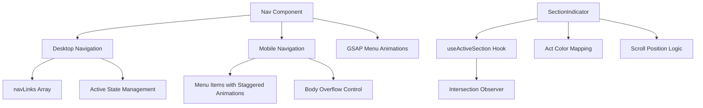

**Diagram sources**
- [src/components/layout/Nav.jsx:42-213](file://src/components/layout/Nav.jsx#L42-L213)
- [src/components/common/SectionIndicator.jsx:13-50](file://src/components/common/SectionIndicator.jsx#L13-L50)
- [src/hooks/useActiveSection.js:3-35](file://src/hooks/useActiveSection.js#L3-L35)
- [src/hooks/useGsap.js:1-14](file://src/hooks/useGsap.js#L1-L14)

Implementation highlights:
- Nav component: [src/components/layout/Nav.jsx:42-213](file://src/components/layout/Nav.jsx#L42-L213)
- Section indicator: [src/components/common/SectionIndicator.jsx:13-50](file://src/components/common/SectionIndicator.jsx#L13-L50)
- Active section hook: [src/hooks/useActiveSection.js:3-35](file://src/hooks/useActiveSection.js#L3-L35)
- Mobile menu animations: [src/components/layout/Nav.jsx:55-61](file://src/components/layout/Nav.jsx#L55-L61)

**Section sources**
- [src/components/layout/Nav.jsx:1-214](file://src/components/layout/Nav.jsx#L1-L214)
- [src/components/common/SectionIndicator.jsx:1-50](file://src/components/common/SectionIndicator.jsx#L1-L50)
- [src/hooks/useActiveSection.js:1-36](file://src/hooks/useActiveSection.js#L1-L36)
- [src/hooks/useGsap.js:1-14](file://src/hooks/useGsap.js#L1-L14)

### Six-Act Narrative Architecture
The application implements a revolutionary six-act narrative framework that organizes content around Frankie Picasso's life story:

#### ActSection Wrapper Component
The ActSection component serves as the primary wrapper for all narrative content:
- Dynamic watermark with act number (50% opacity serif font)
- Theme class application (act-theme--{actId})
- Consistent header structure with act branding
- Content area for specialized act components
- Responsive design with mobile-first approach

#### Act-Specific Content Components
Each act has specialized components that leverage the shared ActSection wrapper:
- **FrankieStory**: Personal narrative and timeline presentation
- **Entrepreneurship**: Venture showcase with card-based layout
- **MediaHub**: Interactive filtering system for shows, interviews, and press
- **Creativity**: Artistic works display with GSAP animations
- **CommunityImpact**: Initiative showcase with parallax effects
- **FutureVision**: Mission statement and current projects presentation

#### Heartbeat Integration
The Heartbeat component provides thematic transitions between acts:
- Simple animated presentation with dot separators
- Fade-in animation for smooth transitions
- Consistent design language across all acts

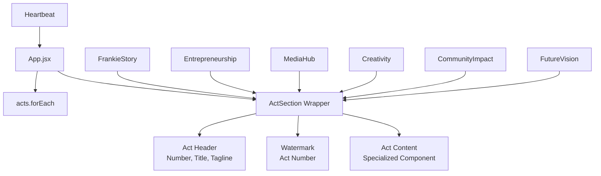

**Diagram sources**
- [src/App.jsx:45-76](file://src/App.jsx#L45-L76)
- [src/components/acts/ActSection.jsx:5-34](file://src/components/acts/ActSection.jsx#L5-L34)
- [src/components/acts/Heartbeat.jsx:5-21](file://src/components/acts/Heartbeat.jsx#L5-L21)

Implementation highlights:
- ActSection wrapper: [src/components/acts/ActSection.jsx:5-34](file://src/components/acts/ActSection.jsx#L5-L34)
- Act-specific content rendering: [src/App.jsx:45-76](file://src/App.jsx#L45-L76)
- Heartbeat integration: [src/App.jsx:48, 53, 58, 64, 69, 75](file://src/App.jsx#L48,L53,L58,L64,L69,L75)

**Section sources**
- [src/App.jsx:1-87](file://src/App.jsx#L1-L87)
- [src/components/acts/ActSection.jsx:1-34](file://src/components/acts/ActSection.jsx#L1-L34)
- [src/components/acts/Heartbeat.jsx:1-21](file://src/components/acts/Heartbeat.jsx#L1-L21)

### Act-Specific Component Analysis

#### FrankieStory Component
The FrankieStory component presents Act I's personal narrative:
- Scroll-reveal animations for narrative and timeline elements
- Philosophy statement with fade-up animation
- Timeline presentation with year/title/description structure
- Pull quote with fade-in animation
- Act-specific content access through content.acts[0]

#### Entrepreneurship Component
The Entrepreneurship component showcases Act II's ventures:
- Grid-based card layout for venture presentations
- SVG placeholders with gradient backgrounds
- Impact indicators with specialized styling
- Timeline presentation for career milestones
- Scroll-reveal animations for card elements

#### MediaHub Component
The MediaHub component presents Act III's media presence:
- Interactive filtering system for different content types
- Tab-based navigation for content categories
- Responsive grid layout for media items
- SVG placeholders with gradient backgrounds
- Dynamic content aggregation from shows, interviews, and press arrays

#### Creativity Component
The Creativity component showcases Act IV's artistic endeavors:
- GSAP-powered animations for card elements
- Parallax-style entrance animations
- Wide and standard card layouts
- Type-based icon system (book, radio, art, writing)
- Scroll-triggered animations with reduced motion support

#### CommunityImpact Component
The CommunityImpact component presents Act V's community work:
- Parallax image effects with useParallax hook
- GSAP-powered card animations
- Layout with image column and initiative cards
- Quote band with fade-in animation
- Scroll-triggered animations with toggle actions

#### FutureVision Component
The FutureVision component presents Act VI's ongoing work:
- Mission statement with reveal animation
- Project showcase with accent elements
- Simple card-based layout for current initiatives
- Scroll-reveal animations for content elements

**Section sources**
- [src/components/story/FrankieStory.jsx:1-39](file://src/components/story/FrankieStory.jsx#L1-L39)
- [src/components/entrepreneurship/Entrepreneurship.jsx:1-48](file://src/components/entrepreneurship/Entrepreneurship.jsx#L1-L48)
- [src/components/media/MediaHub.jsx:1-73](file://src/components/media/MediaHub.jsx#L1-L73)
- [src/components/creativity/Creativity.jsx:1-56](file://src/components/creativity/Creativity.jsx#L1-L56)
- [src/components/community/CommunityImpact.jsx:1-84](file://src/components/community/CommunityImpact.jsx#L1-L84)
- [src/components/vision/FutureVision.jsx:1-30](file://src/components/vision/FutureVision.jsx#L1-L30)

### Content Management System
The application uses a centralized content management approach through the acts array structure:
- Structured six-act content organization
- Consistent data structure for different content types per act
- Easy maintenance and updates through single source of truth
- Integration with components for dynamic content rendering
- Color theming integration through CSS variables
- Navigation and section identification through dedicated arrays

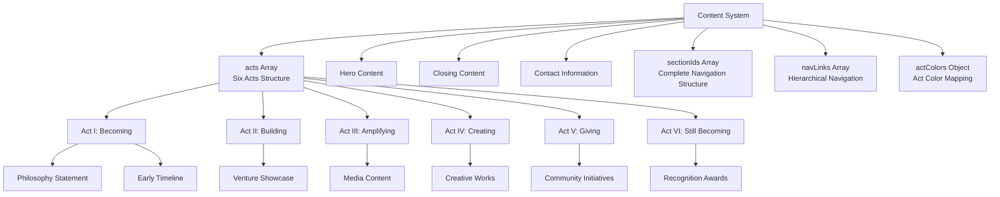

**Diagram sources**
- [src/data/content.js:50-196](file://src/data/content.js#L50-L196)
- [src/data/content.js:319-357](file://src/data/content.js#L319-L357)

**Section sources**
- [src/data/content.js:1-357](file://src/data/content.js#L1-L357)

## Animation and Interaction System
The application leverages GSAP for advanced animations and scroll effects with sophisticated integration patterns:

### GSAP Integration Architecture
The animation system is built around a centralized GSAP configuration:
- **useGsap Hook**: Centralized GSAP setup with ScrollTrigger registration
- **Default Settings**: Global animation defaults for consistent behavior
- **Plugin Registration**: ScrollTrigger integration for scroll-based animations
- **Hook Abstraction**: Simplified GSAP usage through React hooks

### Scroll-Based Animations
The application uses ScrollTrigger for sophisticated scroll-based effects:
- **ScrollReveal Hook**: Fade-up animations with staggered effects
- **Parallax Effects**: Depth perception through scroll-triggered movement
- **Reduced Motion Support**: Accessibility-compliant animation alternatives
- **Performance Optimization**: Proper cleanup of scroll triggers and event listeners

### Mobile Menu Animations
The mobile navigation system provides premium user experience:
- **Staggered Item Animations**: Sequential appearance of menu items with 0.05 second delays
- **Transform Animations**: Smooth slide-in effect using GSAP transforms
- **Opacity Transitions**: Fade-in effects for menu item visibility
- **Duration Control**: 0.35 second animation duration for optimal user experience

### Section Indicator Animations
The floating navigation dots provide visual progress tracking:
- **Intersection Observer**: Real-time section detection with custom positioning
- **Conditional Visibility**: Dots appear after scrolling beyond half viewport
- **Color Transitions**: Smooth color changes based on active section
- **Click Handling**: Direct navigation to sections with offset positioning

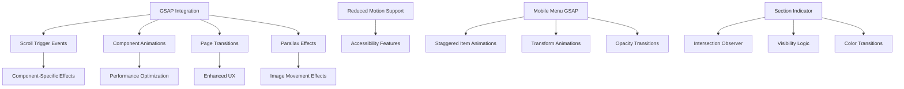

**Diagram sources**
- [src/hooks/useGsap.js:1-14](file://src/hooks/useGsap.js#L1-L14)
- [src/hooks/useScrollReveal.js:13-48](file://src/hooks/useScrollReveal.js#L13-L48)
- [src/hooks/useParallax.js:12-30](file://src/hooks/useParallax.js#L12-L30)
- [src/components/layout/Nav.jsx:55-61](file://src/components/layout/Nav.jsx#L55-L61)
- [src/components/common/SectionIndicator.jsx:17-23](file://src/components/common/SectionIndicator.jsx#L17-L23)

**Section sources**
- [src/hooks/useGsap.js:1-14](file://src/hooks/useGsap.js#L1-L14)
- [src/hooks/useScrollReveal.js:1-56](file://src/hooks/useScrollReveal.js#L1-L56)
- [src/hooks/useParallax.js:1-31](file://src/hooks/useParallax.js#L1-L31)
- [src/components/layout/Nav.jsx:55-61](file://src/components/layout/Nav.jsx#L55-L61)
- [src/components/common/SectionIndicator.jsx:17-23](file://src/components/common/SectionIndicator.jsx#L17-L23)

### Vite Development and Build System
Vite orchestrates the development and build lifecycle:
- Development Server
  - Port 3000 with automatic browser opening
  - React plugin enabled for JSX and fast refresh
- Production Build
  - Generates optimized static assets to dist/
- Preview
  - Serves built assets locally for verification


**Diagram sources**
- [vite.config.js:4-10](file://vite.config.js#L4-L10)
- [package.json:6-10](file://package.json#L6-L10)

**Section sources**
- [vite.config.js:1-11](file://vite.config.js#L1-L11)
- [package.json:1-23](file://package.json#L1-L23)

### Frontend Static Asset Serving
The frontend relies on a minimal HTML shell located in the public directory:
- Single HTML file with embedded basic styles
- Served directly by Vite dev server
- Ready for React integration and component rendering

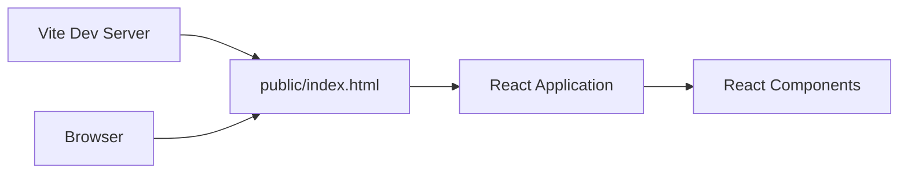

**Diagram sources**
- [vite.config.js:6-9](file://vite.config.js#L6-L9)
- [public/index.html:1-21](file://public/index.html#L1-L21)

**Section sources**
- [public/index.html:1-21](file://public/index.html#L1-L21)
- [vite.config.js:6-9](file://vite.config.js#L6-L9)

### ES6 Module System and Package Management
- ES Modules
  - The project declares module type in package.json enabling native ES modules
  - React application uses ES module imports and exports
- Dependencies
  - React and React DOM for frontend framework
  - Vite and @vitejs/plugin-react for development and build tooling
  - GSAP for advanced animations and scroll effects
- Scripts
  - Development, build, and preview commands orchestrated via npm scripts

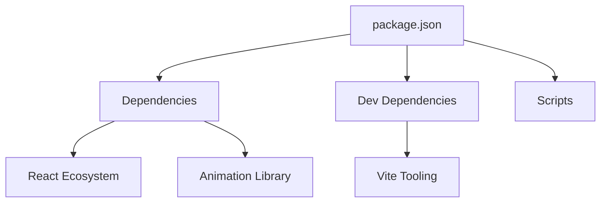

**Diagram sources**
- [package.json:11-21](file://package.json#L11-L21)
- [package.json:6-10](file://package.json#L6-L10)

**Section sources**
- [package.json:1-23](file://package.json#L1-L23)

## Dependency Analysis
The application maintains clean separation between frontend dependencies with integrated theming and enhanced navigation:
- React Application depends on:
  - React and React DOM for component rendering
  - GSAP for advanced animations and scroll effects
  - CSS modules for scoped styling with theming integration
- Vite configuration depends on:
  - React plugin for JSX support and fast refresh
  - Development server settings
- Component dependencies:
  - Shared hooks and utilities for navigation and animations
  - Centralized content management through acts array and navigation arrays
  - Modular CSS architecture with integrated theming system
- Theming dependencies:
  - CSS variables for act-specific color schemes
  - Theme class application through ActSection component
  - Dynamic color application across all components
- Navigation dependencies:
  - useActiveSection hook for intersection observer functionality
  - SectionIndicator component for scroll progress tracking
  - GSAP integration for mobile menu animations
  - Responsive design patterns for cross-device compatibility

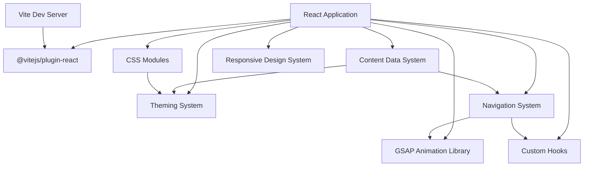

**Diagram sources**
- [src/main.jsx:1-3](file://src/main.jsx#L1-L3)
- [vite.config.js:2](file://vite.config.js#L2)
- [src/hooks/useGsap.js:1-4](file://src/hooks/useGsap.js#L1-L4)
- [src/hooks/useActiveSection.js:1-4](file://src/hooks/useActiveSection.js#L1-L4)
- [src/data/content.js:50-196](file://src/data/content.js#L50-L196)
- [src/styles/_variables.css:50-56](file://src/styles/_variables.css#L50-L56)
- [src/components/layout/Nav.jsx:1-5](file://src/components/layout/Nav.jsx#L1-L5)

**Section sources**
- [src/main.jsx:1-11](file://src/main.jsx#L1-L11)
- [vite.config.js:1-11](file://vite.config.js#L1-L11)
- [src/hooks/useGsap.js:1-14](file://src/hooks/useGsap.js#L1-L14)
- [src/hooks/useActiveSection.js:1-36](file://src/hooks/useActiveSection.js#L1-L36)
- [src/data/content.js:1-357](file://src/data/content.js#L1-L357)
- [src/styles/_variables.css:1-72](file://src/styles/_variables.css#L1-L72)
- [src/components/layout/Nav.jsx:1-214](file://src/components/layout/Nav.jsx#L1-L214)

## Performance Considerations
- Development Performance
  - Vite's fast refresh and optimized bundling minimize rebuild times
  - Hot reloading reduces iteration cycles during development
  - React Fast Refresh provides instant component updates
- Production Performance
  - Vite's build process generates optimized assets suitable for deployment
  - CSS modules provide scoped styling without global conflicts
  - Integrated theming system reduces runtime calculations
  - Responsive approach reduces unnecessary CSS for smaller devices
  - Utility classes minimize custom CSS bloat
  - Component lazy loading opportunities for future optimization
- Animation Performance
  - GSAP provides hardware-accelerated animations with proper cleanup
  - ScrollTrigger optimizations prevent memory leaks
  - Staggered animations use efficient animation scheduling
  - Reduced motion support prevents unnecessary animations
  - Transform-based animations utilize GPU acceleration
- Navigation Performance
  - Intersection Observer API provides efficient section detection
  - Custom root margins optimize viewport positioning calculations
  - Mobile menu animations use transform properties for GPU acceleration
  - Body overflow control prevents layout thrashing during menu transitions
- Theming Performance
  - CSS variables provide efficient color switching
  - Theme class application minimizes style recalculation
  - Act-specific colors cached through CSS variables
  - Efficient watermark rendering with transform optimization
- Responsive Performance
  - Responsive design reduces CSS parsing overhead on smaller devices
  - Responsive images and optimized asset loading
  - Touch-friendly interactive elements
  - Reduced JavaScript bundle size through modular architecture
- Scalability Notes
  - Six-act framework supports easy content expansion
  - Component-based architecture supports easy scaling
  - CSS modules enable maintainable styling at scale
  - Integrated theming system supports new act additions
  - Responsive approach ensures future-proof design

## Troubleshooting Guide
Common issues and resolutions:
- Port Conflicts
  - Vite defaults to port 3000; adjust server.port in vite.config.js if needed
  - Ensure no other processes are using the development port
- Component Rendering Issues
  - Verify React and React DOM versions match
  - Check component imports and export statements
  - Ensure CSS modules are properly imported
  - Validate ActSection component props and theming classes
- Navigation System Problems
  - Verify useActiveSection hook is properly importing IntersectionObserver
  - Check sectionIds array matches actual section element ids
  - Ensure navLinks array structure matches expected navigation format
  - Validate mobile menu GSAP animations are properly registered
- Act-Specific Component Problems
  - Verify content.acts array structure and indexing
  - Check act.id values match expected values
  - Ensure theme classes are properly applied
  - Validate act-specific content arrays exist
- Theming Issues
  - Verify CSS variables are properly defined
  - Check theme class application in ActSection
  - Ensure act-specific color tokens exist
  - Validate CSS variable fallbacks
- Animation Problems
  - Verify GSAP and @gsap/react installations
  - Check for proper cleanup of scroll triggers and observers
  - Ensure component unmounting removes event listeners
  - Validate reduced motion support implementation
- Mobile Menu Problems
  - Verify GSAP and @gsap/react installations
  - Check for proper cleanup of scroll triggers and observers
  - Ensure component unmounting removes event listeners
  - Validate mobile menu accessibility attributes
  - Check body overflow control during menu transitions
- Section Indicator Issues
  - Verify IntersectionObserver API availability in target browsers
  - Check custom root margins configuration for viewport positioning
  - Ensure sectionIds array matches actual section element ids
  - Validate visibility logic based on scroll position
- Development Server Not Starting
  - Check Node.js and npm versions meet project requirements
  - Run installation steps and review script commands in package.json
- CSS Module Issues
  - Verify CSS files are properly imported with .module.css extension
  - Check for naming conventions and class name conflicts
  - Ensure CSS variables are properly defined in global styles
  - Validate theme class application syntax
- Responsive Design Issues
  - Verify responsive CSS is properly structured
  - Check media query breakpoints and specificity
  - Validate utility class usage and ordering
  - Ensure container classes are applied correctly
  - Check act-specific responsive overrides

**Section sources**
- [vite.config.js:6-9](file://vite.config.js#L6-L9)
- [src/main.jsx:1-11](file://src/main.jsx#L1-L11)
- [src/hooks/useGsap.js:1-14](file://src/hooks/useGsap.js#L1-L14)
- [src/hooks/useActiveSection.js:1-36](file://src/hooks/useActiveSection.js#L1-L36)
- [src/components/layout/Nav.jsx:1-214](file://src/components/layout/Nav.jsx#L1-L214)
- [src/components/common/SectionIndicator.jsx:1-50](file://src/components/common/SectionIndicator.jsx#L1-L50)
- [src/styles/_variables.css:50-56](file://src/styles/_variables.css#L50-L56)
- [package.json:6-10](file://package.json#L6-L10)

## Conclusion
The Frankie Picasso application exemplifies modern React SPA architecture with a revolutionary six-act narrative framework and sophisticated navigation system. The implementation demonstrates advanced data-driven content organization, integrated theming system with CSS custom properties, and comprehensive animation techniques using GSAP. The enhanced navigation system provides seamless user experience with sophisticated mobile menu animations, scroll progress tracking, and responsive design patterns that adapt to various screen sizes.

**Updated**: The application has successfully transitioned from a traditional component-based section system to a six-act narrative framework with enhanced navigation capabilities. The new architecture introduces sophisticated mobile menu animations with GSAP, scroll progress tracking through SectionIndicator, and improved responsive design patterns. The integrated theming system using CSS variables ensures consistent visual identity across all acts, while the component-based approach supports maintainable and extensible code architecture. This implementation serves as a comprehensive demonstration of contemporary web development practices including data-driven architecture, responsive design, accessibility considerations, performance optimization, and advanced animation techniques using modern libraries like GSAP.