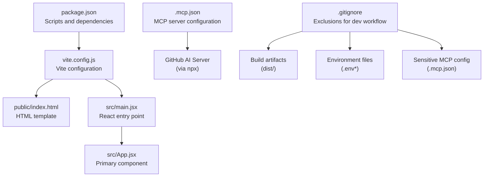
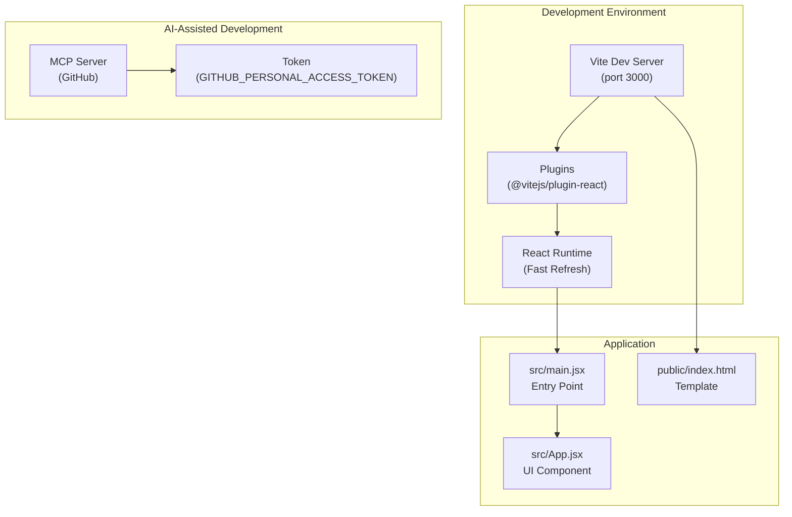
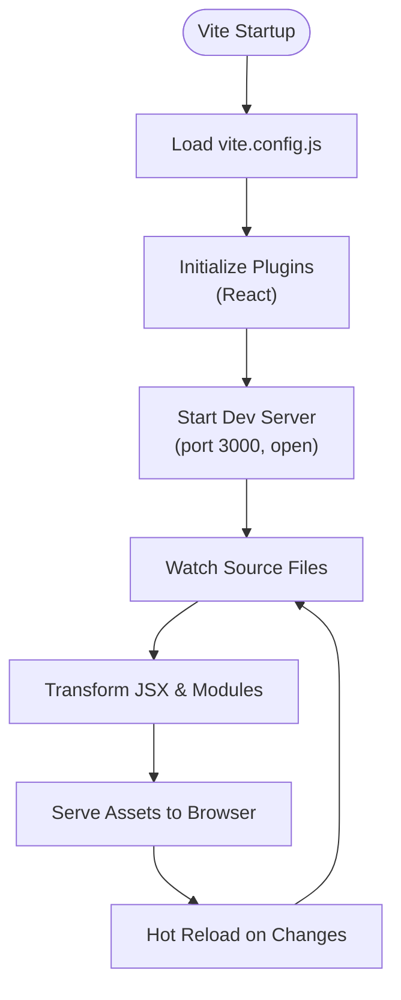
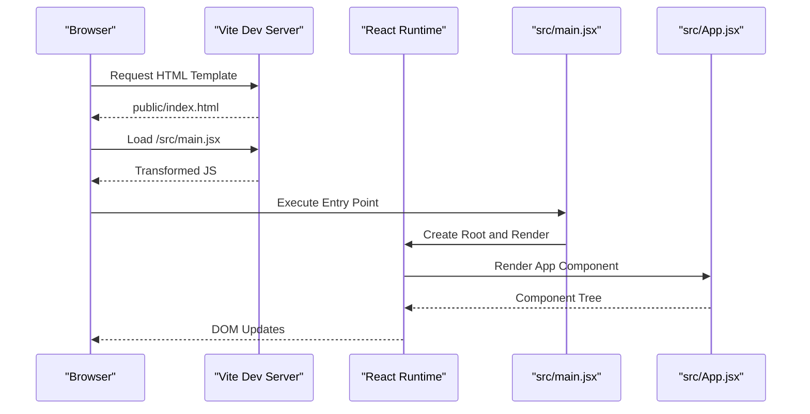
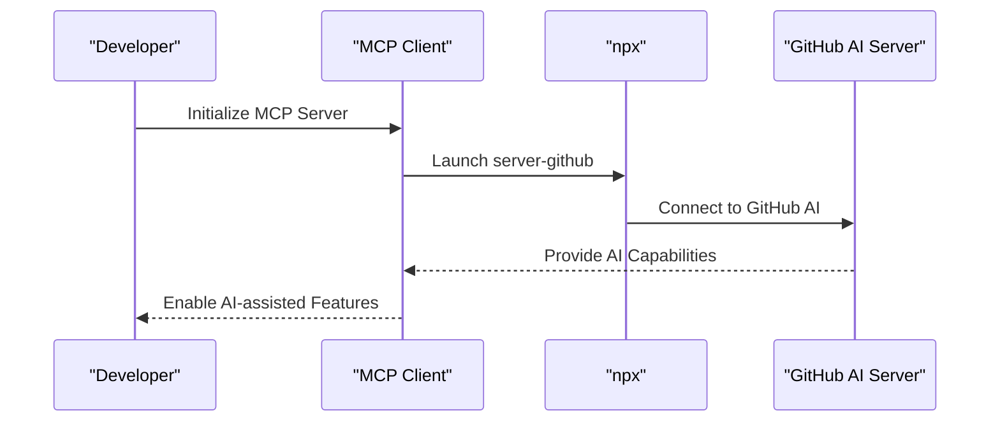
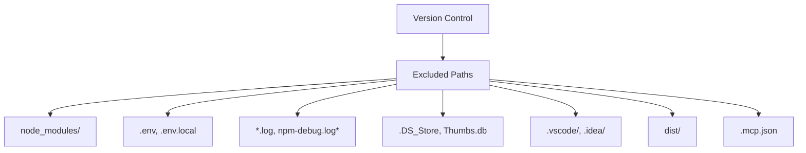
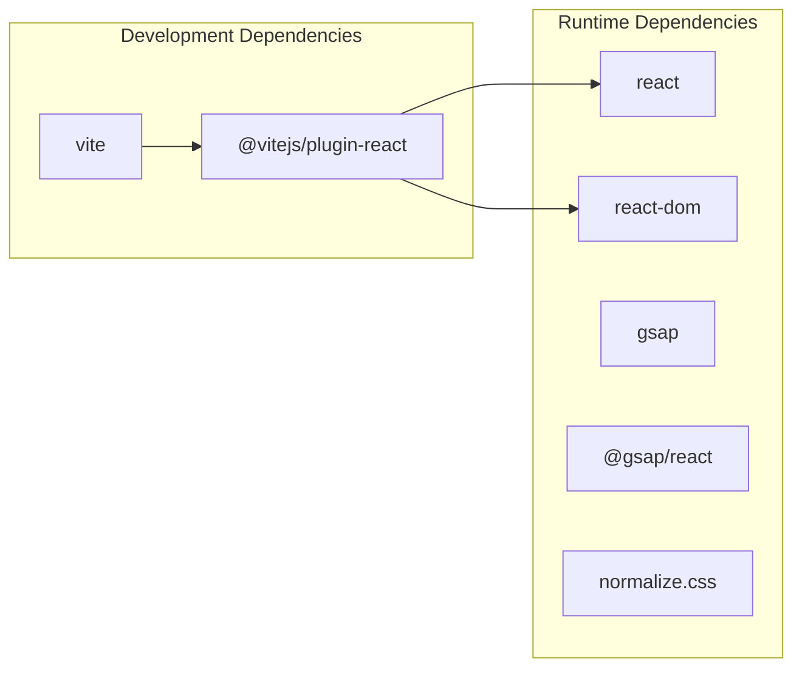

# Development Tools

<cite>
**Referenced Files in This Document**
- [package.json](file://package.json)
- [vite.config.js](file://vite.config.js)
- [.mcp.json](file://.mcp.json)
- [.gitignore](file://.gitignore)
- [README.md](file://README.md)
- [public/index.html](file://public/index.html)
- [src/main.jsx](file://src/main.jsx)
- [src/App.jsx](file://src/App.jsx)
</cite>

## Table of Contents
1. [Introduction](#introduction)
2. [Project Structure](#project-structure)
3. [Core Components](#core-components)
4. [Architecture Overview](#architecture-overview)
5. [Detailed Component Analysis](#detailed-component-analysis)
6. [Dependency Analysis](#dependency-analysis)
7. [Performance Considerations](#performance-considerations)
8. [Troubleshooting Guide](#troubleshooting-guide)
9. [Conclusion](#conclusion)

## Introduction
This document provides comprehensive documentation for the development tools and configuration used in the project. It covers Vite configuration for development server settings, build optimization, and plugin integration; the Model Context Protocol (MCP) configuration for GitHub AI-assisted development features; .gitignore configuration and its impact on development workflow; environment variable usage; development server hot reloading capabilities; debugging techniques; and the relationship between Vite and React development, build process optimization, and production deployment preparation. It also addresses common development workflows, troubleshooting tools, and best practices for maintaining the development environment.

## Project Structure
The project follows a standard React + Vite setup with minimal configuration. Key files and their roles:
- package.json defines scripts, dependencies, and devDependencies for development and build tasks.
- vite.config.js configures Vite with React plugin and development server settings.
- .mcp.json configures Model Context Protocol servers for AI-assisted development.
- .gitignore excludes build artifacts, environment files, and sensitive MCP configuration.
- public/index.html serves as the HTML template for the application.
- src/main.jsx is the React application entry point.
- src/App.jsx is the primary React component.

**Diagram sources**
- [package.json:1-23](file://package.json#L1-L23)
- [vite.config.js:1-11](file://vite.config.js#L1-L11)
- [.mcp.json:1-12](file://.mcp.json#L1-L12)
- [.gitignore:1-25](file://.gitignore#L1-L25)
- [public/index.html:1-21](file://public/index.html#L1-L21)
- [src/main.jsx:1-11](file://src/main.jsx#L1-L11)
- [src/App.jsx:1-12](file://src/App.jsx#L1-L12)

**Section sources**
- [package.json:1-23](file://package.json#L1-L23)
- [vite.config.js:1-11](file://vite.config.js#L1-L11)
- [.mcp.json:1-12](file://.mcp.json#L1-L12)
- [.gitignore:1-25](file://.gitignore#L1-L25)
- [public/index.html:1-21](file://public/index.html#L1-L21)
- [src/main.jsx:1-11](file://src/main.jsx#L1-L11)
- [src/App.jsx:1-12](file://src/App.jsx#L1-L12)

## Core Components
This section documents the core development tools and configurations that drive the project’s development and build processes.

- Vite Configuration
  - Plugin Integration: The React plugin is enabled to support JSX and React Fast Refresh during development.
  - Development Server Settings: The server runs on port 3000 and automatically opens the browser.
  - Build Output: Vite builds the application into the dist/ directory by default.

- React Application
  - Entry Point: src/main.jsx initializes the React root and renders the App component.
  - Component Structure: src/App.jsx defines the primary UI component with modular CSS.

- Model Context Protocol (MCP)
  - Server Configuration: .mcp.json defines a GitHub MCP server using npx to launch the server-github package.
  - Authentication: Uses a personal access token configured under the GITHUB_PERSONAL_ACCESS_TOKEN environment variable.

- Environment Management
  - .env and .env.local are ignored by .gitignore to prevent committing sensitive credentials.
  - .mcp.json is also excluded to protect the MCP configuration file containing secrets.

- Build and Preview Scripts
  - Scripts defined in package.json enable development, building, and previewing the application.

**Section sources**
- [vite.config.js:1-11](file://vite.config.js#L1-L11)
- [src/main.jsx:1-11](file://src/main.jsx#L1-L11)
- [src/App.jsx:1-12](file://src/App.jsx#L1-L12)
- [.mcp.json:1-12](file://.mcp.json#L1-L12)
- [.gitignore:1-25](file://.gitignore#L1-L25)
- [package.json:6-10](file://package.json#L6-L10)

## Architecture Overview
The development architecture integrates Vite for fast development and build processes, React for UI rendering, and MCP for AI-assisted development. The configuration ensures a streamlined workflow with automatic hot reloading and efficient production builds.

**Diagram sources**
- [vite.config.js:4-10](file://vite.config.js#L4-L10)
- [src/main.jsx:6-10](file://src/main.jsx#L6-L10)
- [src/App.jsx:3-8](file://src/App.jsx#L3-L8)
- [public/index.html:56-58](file://public/index.html#L56-L58)
- [.mcp.json:6-8](file://.mcp.json#L6-L8)

## Detailed Component Analysis

### Vite Configuration
Vite is configured to integrate React and provide a fast development experience:
- Plugin: The React plugin enables JSX transformations and Fast Refresh.
- Server: Port 3000 with auto-open for immediate feedback.
- Build: Default output targets the dist/ directory.

**Diagram sources**
- [vite.config.js:4-10](file://vite.config.js#L4-L10)

**Section sources**
- [vite.config.js:1-11](file://vite.config.js#L1-L11)

### React Integration
React is integrated through the Vite React plugin and the application entry point:
- Entry Point: src/main.jsx creates the React root and renders the App component.
- Component: src/App.jsx provides the primary UI component with modular CSS.

**Diagram sources**
- [public/index.html:56-58](file://public/index.html#L56-L58)
- [src/main.jsx:6-10](file://src/main.jsx#L6-L10)
- [src/App.jsx:3-8](file://src/App.jsx#L3-L8)

**Section sources**
- [src/main.jsx:1-11](file://src/main.jsx#L1-L11)
- [src/App.jsx:1-12](file://src/App.jsx#L1-L12)

### Model Context Protocol (MCP) Configuration
MCP enables AI-assisted development by connecting to GitHub AI servers:
- Server Definition: .mcp.json defines a GitHub MCP server using npx to launch the server-github package.
- Token Configuration: GITHUB_PERSONAL_ACCESS_TOKEN is set under the env section for authentication.
- Security: The .mcp.json file is excluded from version control via .gitignore.

**Diagram sources**
- [.mcp.json:3-10](file://.mcp.json#L3-L10)

**Section sources**
- [.mcp.json:1-12](file://.mcp.json#L1-L12)
- [.gitignore:23-25](file://.gitignore#L23-L25)

### .gitignore Configuration
The .gitignore file controls what gets excluded from version control:
- Dependencies: node_modules/ is excluded to avoid committing installed packages.
- Environment: .env and .env.local are excluded to prevent secret leakage.
- Logs: *.log and npm-debug.log* are excluded to keep the repository clean.
- OS: .DS_Store and Thumbs.db are excluded for cross-platform compatibility.
- IDE: .vscode/ and .idea/ are excluded to avoid IDE-specific metadata.
- Build Artifacts: dist/ is excluded to keep the repository focused on source code.
- MCP Secrets: .mcp.json is excluded to protect sensitive configuration.

**Diagram sources**
- [.gitignore:1-25](file://.gitignore#L1-L25)

**Section sources**
- [.gitignore:1-25](file://.gitignore#L1-L25)

### Environment Variables and Secrets
- Environment Files: .env and .env.local are ignored by .gitignore to prevent committing secrets.
- MCP Token: GITHUB_PERSONAL_ACCESS_TOKEN is configured in .mcp.json under the env section.
- Best Practice: Store secrets in environment files and ensure they remain uncommitted.

**Section sources**
- [.gitignore:4-7](file://.gitignore#L4-L7)
- [.mcp.json:6-8](file://.mcp.json#L6-L8)

### Development Server Hot Reloading and Debugging
- Hot Reloading: Vite’s React plugin enables Fast Refresh, allowing instant UI updates without full page reloads.
- Debugging: Use browser developer tools to inspect React components, network requests, and console logs.
- Development Workflow: Run npm run dev to start the Vite dev server on port 3000.

**Section sources**
- [vite.config.js:6-9](file://vite.config.js#L6-L9)
- [README.md:7-12](file://README.md#L7-L12)

### Build Process Optimization and Production Deployment
- Build Command: npm run build triggers Vite to compile assets into the dist/ directory.
- Preview Command: npm run preview starts a local static server to preview the production build.
- Optimization: Vite performs tree-shaking, code splitting, and asset optimization by default.

**Section sources**
- [package.json:8-9](file://package.json#L8-L9)

## Dependency Analysis
The project maintains a lean dependency graph with clear separation between runtime and development dependencies.

**Diagram sources**
- [package.json:11-21](file://package.json#L11-L21)

**Section sources**
- [package.json:11-21](file://package.json#L11-L21)

## Performance Considerations
- Use Vite’s built-in optimizations for production builds.
- Keep dependencies minimal to reduce bundle size.
- Leverage React Fast Refresh for rapid iteration during development.
- Monitor build output in the dist/ directory to ensure optimal asset sizes.

## Troubleshooting Guide
Common issues and resolutions:
- Port Conflicts: If port 3000 is in use, adjust the server.port setting in vite.config.js.
- Missing Dependencies: Run npm install to ensure all dependencies and devDependencies are installed.
- Environment Issues: Verify .env and .env.local are present and correctly formatted; ensure secrets are not committed.
- MCP Authentication: Confirm GITHUB_PERSONAL_ACCESS_TOKEN is valid and accessible to the MCP server.
- Build Failures: Check the dist/ directory for errors and review the build command output.

**Section sources**
- [vite.config.js:7](file://vite.config.js#L7)
- [package.json:18-21](file://package.json#L18-L21)
- [.mcp.json:7](file://.mcp.json#L7)

## Conclusion
This project provides a streamlined development environment powered by Vite and React, with optional AI-assisted development via MCP. The configuration emphasizes simplicity, security (via .gitignore exclusions), and efficient development workflows. By leveraging Vite’s hot reloading, React Fast Refresh, and MCP integration, developers can iterate quickly while maintaining a secure and organized development environment.