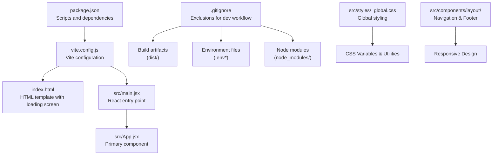
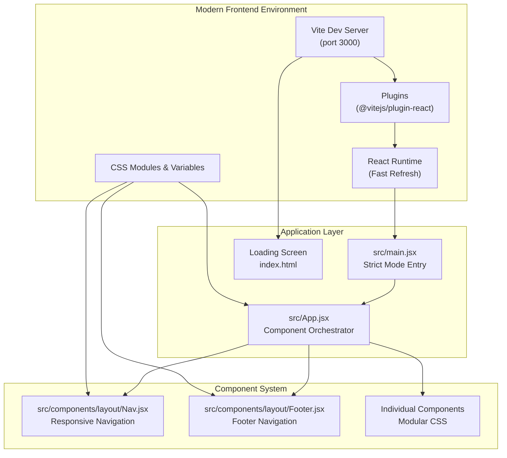
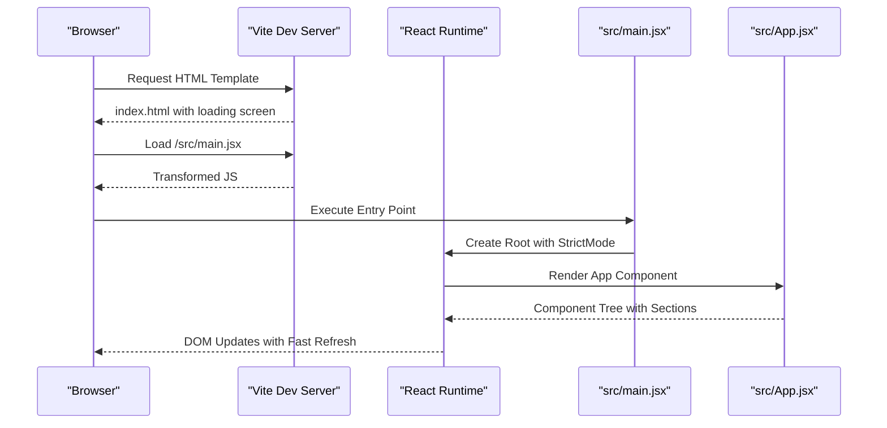
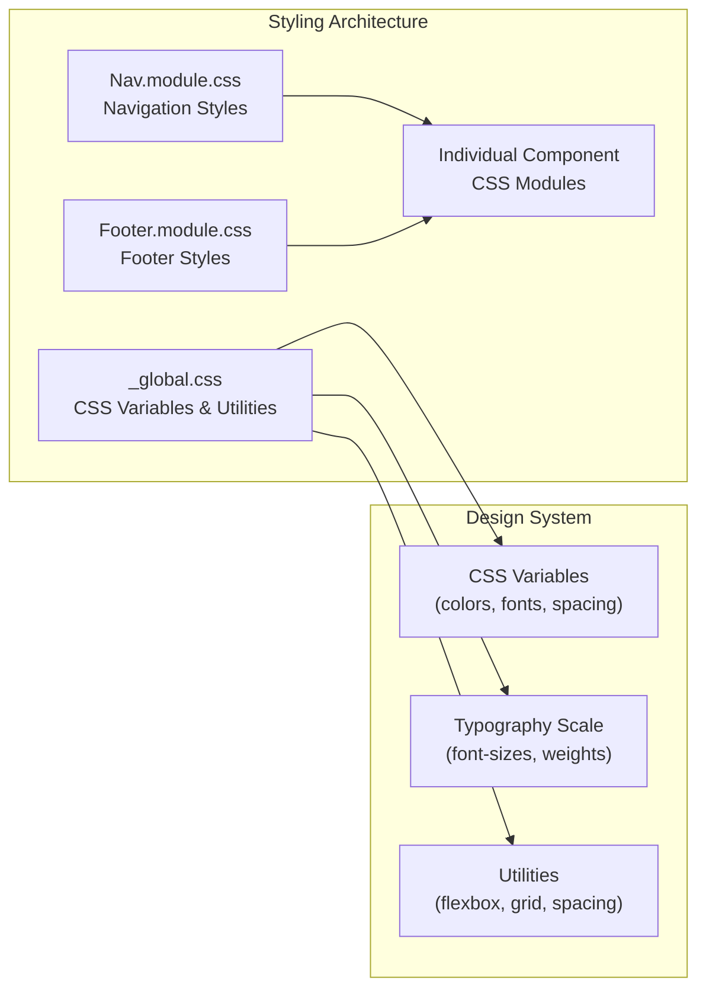
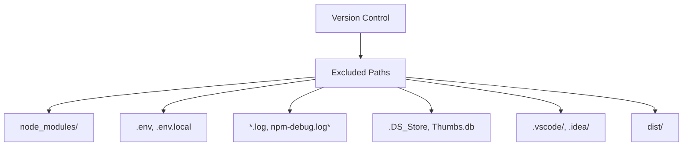
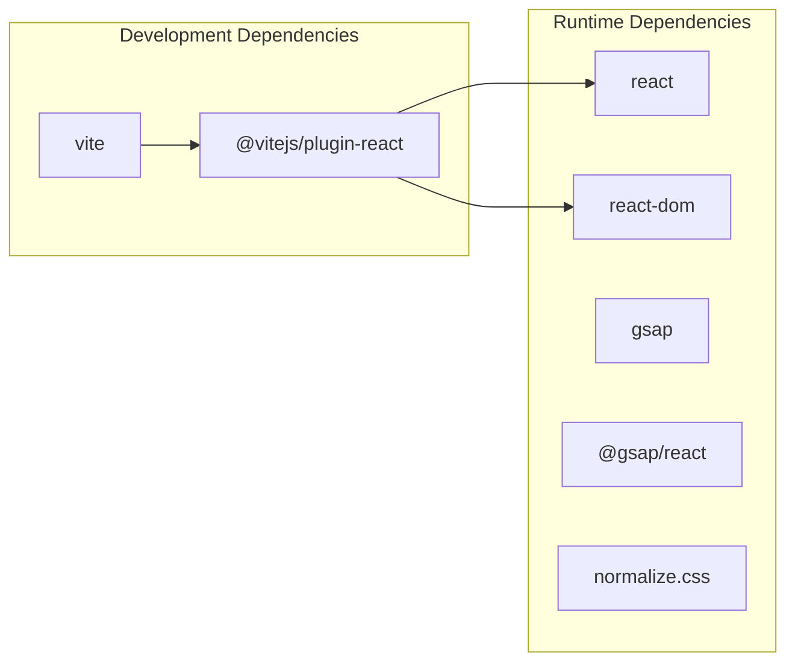

# Development Tools

<cite>
**Referenced Files in This Document**
- [package.json](file://package.json)
- [vite.config.js](file://vite.config.js)
- [.gitignore](file://.gitignore)
- [index.html](file://index.html)
- [src/main.jsx](file://src/main.jsx)
- [src/App.jsx](file://src/App.jsx)
- [src/styles/_global.css](file://src/styles/_global.css)
- [src/components/layout/Nav.jsx](file://src/components/layout/Nav.jsx)
- [src/components/layout/Footer.jsx](file://src/components/layout/Footer.jsx)
- [.github/workflows/deploy.yml](file://.github/workflows/deploy.yml)
- [scripts/deploy.sh](file://scripts/deploy.sh)
</cite>

## Update Summary
**Changes Made**
- Complete overhaul from Node.js/Express development workflow to React/Vite modern frontend environment
- Removed Express server configuration and backend debugging approaches
- Updated documentation to cover Vite configuration, React Fast Refresh, and hot module replacement
- Added comprehensive coverage of modern frontend tooling and deployment workflows
- Removed Model Context Protocol (MCP) configuration as it's no longer applicable

## Table of Contents
1. [Introduction](#introduction)
2. [Project Structure](#project-structure)
3. [Core Components](#core-components)
4. [Architecture Overview](#architecture-overview)
5. [Detailed Component Analysis](#detailed-component-analysis)
6. [Dependency Analysis](#dependency-analysis)
7. [Performance Considerations](#performance-considerations)
8. [Troubleshooting Guide](#troubleshooting-guide)
9. [Conclusion](#conclusion)

## Introduction
This document provides comprehensive documentation for the modern React/Vite development environment used in the project. It covers Vite configuration for development server settings, build optimization, and plugin integration; .gitignore configuration and its impact on development workflow; environment variable usage; development server hot reloading capabilities; debugging techniques; and the relationship between Vite and React development, build process optimization, and production deployment preparation. The project now follows a pure frontend development approach with React components, modern CSS modules, and automated deployment workflows.

## Project Structure
The project follows a modern React + Vite setup optimized for frontend development. Key files and their roles:
- package.json defines scripts, dependencies, and devDependencies for development and build tasks
- vite.config.js configures Vite with React plugin and development server settings
- .gitignore excludes build artifacts, environment files, and sensitive configuration
- index.html serves as the HTML template for the application with loading screen
- src/main.jsx is the React application entry point with strict mode
- src/App.jsx is the primary React component orchestrating all page sections
- src/styles/_global.css provides global styling with CSS variables and utilities

**Diagram sources**
- [package.json:1-23](file://package.json#L1-L23)
- [vite.config.js:1-11](file://vite.config.js#L1-L11)
- [.gitignore:1-25](file://.gitignore#L1-L25)
- [index.html:1-61](file://index.html#L1-L61)
- [src/main.jsx:1-11](file://src/main.jsx#L1-L11)
- [src/App.jsx:1-51](file://src/App.jsx#L1-L51)
- [src/styles/_global.css:1-46](file://src/styles/_global.css#L1-L46)

**Section sources**
- [package.json:1-23](file://package.json#L1-L23)
- [vite.config.js:1-11](file://vite.config.js#L1-L11)
- [.gitignore:1-25](file://.gitignore#L1-L25)
- [index.html:1-61](file://index.html#L1-L61)
- [src/main.jsx:1-11](file://src/main.jsx#L1-L11)
- [src/App.jsx:1-51](file://src/App.jsx#L1-L51)
- [src/styles/_global.css:1-46](file://src/styles/_global.css#L1-L46)

## Core Components
This section documents the core development tools and configurations that drive the project's modern React/Vite development environment.

- Vite Configuration
  - Plugin Integration: The React plugin is enabled to support JSX and React Fast Refresh during development
  - Development Server Settings: The server runs on port 3000 with automatic browser opening for immediate feedback
  - Build Output: Vite builds the application into the dist/ directory by default

- React Application
  - Entry Point: src/main.jsx initializes the React root with StrictMode and renders the App component
  - Component Structure: src/App.jsx defines the primary UI component orchestrating all page sections
  - Loading Screen: Built-in loading animation during initial page load

- Modern Styling
  - Global CSS: src/styles/_global.css provides CSS variables, typography, and utility classes
  - Modular CSS: Individual components use CSS modules for scoped styling
  - Responsive Design: Mobile-first approach with hamburger navigation

- Environment Management
  - .env and .env.local are ignored by .gitignore to prevent committing sensitive credentials
  - Node modules are excluded to avoid committing installed packages

- Build and Preview Scripts
  - Scripts defined in package.json enable development, building, and previewing the application

**Section sources**
- [vite.config.js:1-11](file://vite.config.js#L1-L11)
- [src/main.jsx:1-11](file://src/main.jsx#L1-L11)
- [src/App.jsx:1-51](file://src/App.jsx#L1-L51)
- [.gitignore:1-25](file://.gitignore#L1-L25)
- [package.json:6-10](file://package.json#L6-L10)
- [src/styles/_global.css:1-46](file://src/styles/_global.css#L1-L46)

## Architecture Overview
The development architecture integrates Vite for fast development and build processes, React for UI rendering, and modern CSS methodologies. The configuration ensures a streamlined workflow with automatic hot reloading and efficient production builds.

**Diagram sources**
- [vite.config.js:4-10](file://vite.config.js#L4-L10)
- [src/main.jsx:6-10](file://src/main.jsx#L6-L10)
- [src/App.jsx:17-48](file://src/App.jsx#L17-L48)
- [index.html:25-58](file://index.html#L25-L58)
- [src/components/layout/Nav.jsx:1-102](file://src/components/layout/Nav.jsx#L1-L102)
- [src/components/layout/Footer.jsx:1-52](file://src/components/layout/Footer.jsx#L1-L52)

## Detailed Component Analysis

### Vite Configuration
Vite is configured to integrate React and provide a fast development experience:
- Plugin: The React plugin enables JSX transformations and Fast Refresh
- Server: Port 3000 with auto-open for immediate feedback
- Build: Default output targets the dist/ directory

**Diagram sources**
- [vite.config.js:4-10](file://vite.config.js#L4-L10)

**Section sources**
- [vite.config.js:1-11](file://vite.config.js#L1-L11)

### React Integration
React is integrated through the Vite React plugin and the application entry point:
- Entry Point: src/main.jsx creates the React root with StrictMode and renders the App component
- Component: src/App.jsx provides the primary UI component orchestrating all page sections
- Loading Animation: Built-in loading screen in index.html with fade-out effect

**Diagram sources**
- [index.html:25-58](file://index.html#L25-L58)
- [src/main.jsx:6-10](file://src/main.jsx#L6-L10)
- [src/App.jsx:17-48](file://src/App.jsx#L17-L48)

**Section sources**
- [src/main.jsx:1-11](file://src/main.jsx#L1-L11)
- [src/App.jsx:1-51](file://src/App.jsx#L1-L51)
- [index.html:25-58](file://index.html#L25-L58)

### Modern Styling Architecture
The project implements a comprehensive styling system using modern CSS methodologies:
- Global CSS: src/styles/_global.css provides CSS variables, typography, and utility classes
- Modular CSS: Individual components use CSS modules for scoped styling
- Responsive Design: Mobile-first approach with hamburger navigation
- Accessibility: Proper ARIA labels and keyboard navigation

**Diagram sources**
- [src/styles/_global.css:1-46](file://src/styles/_global.css#L1-L46)
- [src/components/layout/Nav.jsx:5](file://src/components/layout/Nav.jsx#L5)
- [src/components/layout/Footer.jsx:2](file://src/components/layout/Footer.jsx#L2)

**Section sources**
- [src/styles/_global.css:1-46](file://src/styles/_global.css#L1-L46)
- [src/components/layout/Nav.jsx:1-102](file://src/components/layout/Nav.jsx#L1-L102)
- [src/components/layout/Footer.jsx:1-52](file://src/components/layout/Footer.jsx#L1-L52)

### .gitignore Configuration
The .gitignore file controls what gets excluded from version control:
- Dependencies: node_modules/ is excluded to avoid committing installed packages
- Environment: .env and .env.local are excluded to prevent secret leakage
- Logs: *.log and npm-debug.log* are excluded to keep the repository clean
- OS: .DS_Store and Thumbs.db are excluded for cross-platform compatibility
- IDE: .vscode/ and .idea/ are excluded to avoid IDE-specific metadata
- Build Artifacts: dist/ is excluded to keep the repository focused on source code

**Diagram sources**
- [.gitignore:1-25](file://.gitignore#L1-L25)

**Section sources**
- [.gitignore:1-25](file://.gitignore#L1-L25)

### Environment Variables and Secrets
- Environment Files: .env and .env.local are ignored by .gitignore to prevent committing secrets
- Best Practice: Store secrets in environment files and ensure they remain uncommitted

**Section sources**
- [.gitignore:4-7](file://.gitignore#L4-L7)

### Development Server Hot Reloading and Debugging
- Hot Reloading: Vite's React plugin enables Fast Refresh, allowing instant UI updates without full page reloads
- Debugging: Use browser developer tools to inspect React components, network requests, and console logs
- Development Workflow: Run npm run dev to start the Vite dev server on port 3000

**Section sources**
- [vite.config.js:6-9](file://vite.config.js#L6-L9)

### Build Process Optimization and Production Deployment
- Build Command: npm run build triggers Vite to compile assets into the dist/ directory
- Preview Command: npm run preview starts a local static server to preview the production build
- Optimization: Vite performs tree-shaking, code splitting, and asset optimization by default
- Automated Deployment: GitHub Actions workflow deploys to production server via SSH
- Manual Deployment: Shell script handles local deployment with rsync and verification

**Section sources**
- [package.json:8-9](file://package.json#L8-L9)
- [.github/workflows/deploy.yml:1-94](file://.github/workflows/deploy.yml#L1-L94)
- [scripts/deploy.sh:1-81](file://scripts/deploy.sh#L1-L81)

## Dependency Analysis
The project maintains a lean dependency graph with clear separation between runtime and development dependencies, optimized for modern React development.

**Diagram sources**
- [package.json:11-21](file://package.json#L11-L21)

**Section sources**
- [package.json:11-21](file://package.json#L11-L21)

## Performance Considerations
- Use Vite's built-in optimizations for production builds
- Keep dependencies minimal to reduce bundle size
- Leverage React Fast Refresh for rapid iteration during development
- Monitor build output in the dist/ directory to ensure optimal asset sizes
- Implement lazy loading for non-critical components
- Use CSS Grid and Flexbox for efficient layouts
- Optimize images and assets for web delivery

## Troubleshooting Guide
Common issues and resolutions:
- Port Conflicts: If port 3000 is in use, adjust the server.port setting in vite.config.js
- Missing Dependencies: Run npm install to ensure all dependencies and devDependencies are installed
- Environment Issues: Verify .env and .env.local are present and correctly formatted; ensure secrets are not committed
- Build Failures: Check the dist/ directory for errors and review the build command output
- Hot Reload Issues: Clear browser cache or restart Vite dev server
- CSS Module Problems: Ensure proper import syntax and file naming conventions
- Component Rendering Issues: Check React component imports and export statements

**Section sources**
- [vite.config.js:7](file://vite.config.js#L7)
- [package.json:18-21](file://package.json#L18-L21)

## Conclusion
This project provides a modern, streamlined development environment powered by Vite and React, with optimized performance and efficient development workflows. The configuration emphasizes simplicity, security (via .gitignore exclusions), and automated deployment processes. By leveraging Vite's hot reloading, React Fast Refresh, and modern CSS methodologies, developers can iterate quickly while maintaining a secure and organized development environment. The automated deployment workflows ensure reliable production deployments through both GitHub Actions and manual shell scripts.