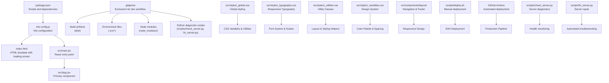
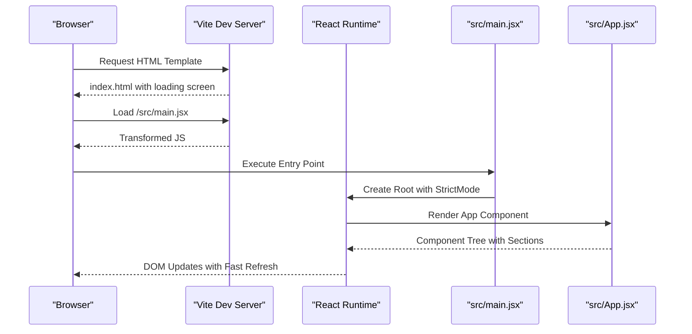
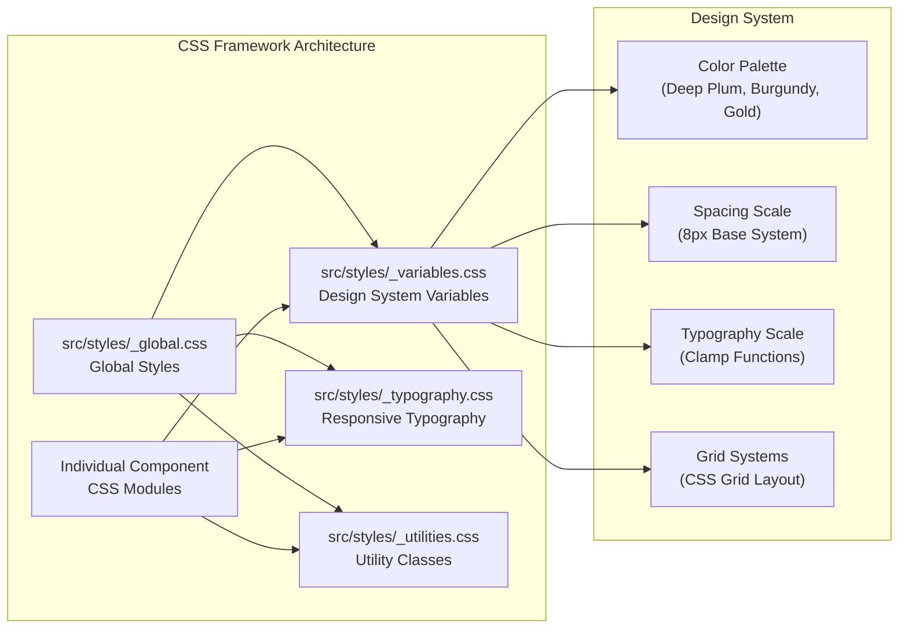
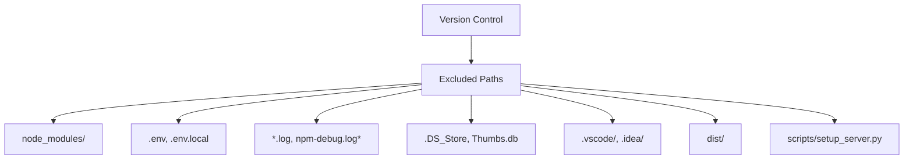
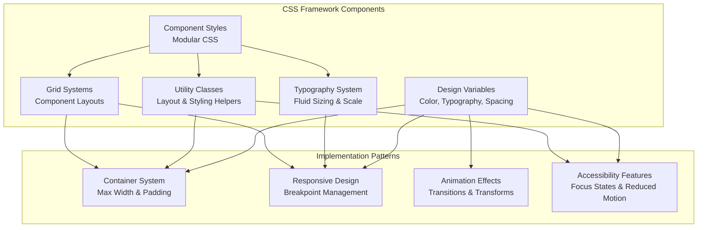
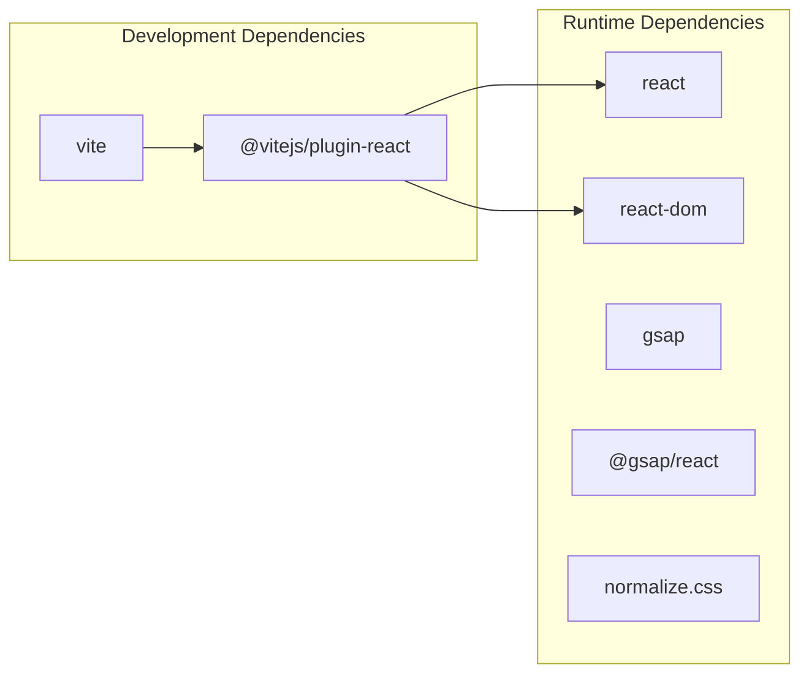
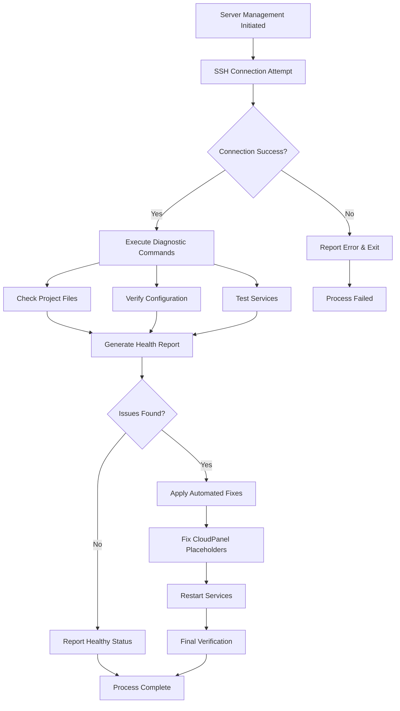
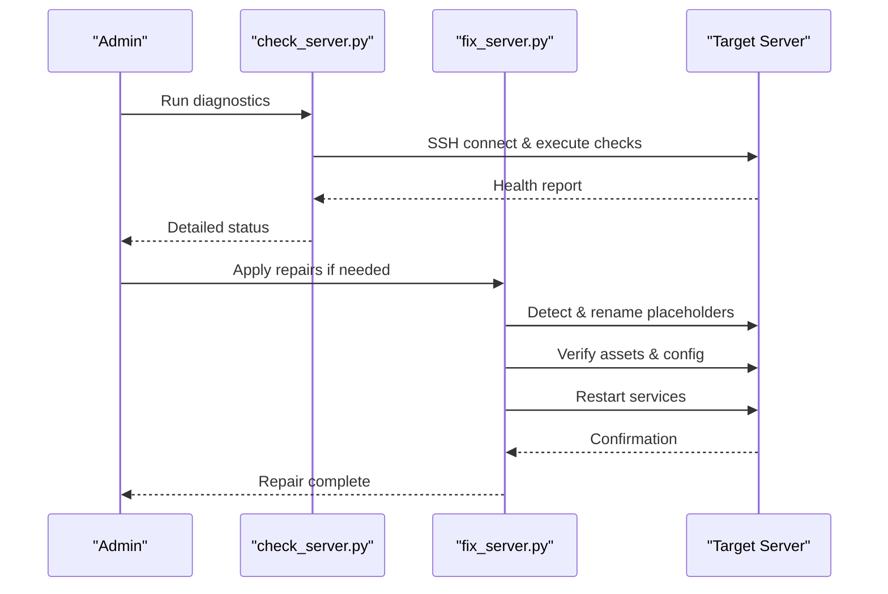

# Development Tools

<cite>
**Referenced Files in This Document**
- [package.json](file://package.json)
- [vite.config.js](file://vite.config.js)
- [.gitignore](file://.gitignore)
- [index.html](file://index.html)
- [src/main.jsx](file://src/main.jsx)
- [src/App.jsx](file://src/App.jsx)
- [src/styles/_global.css](file://src/styles/_global.css)
- [src/styles/_typography.css](file://src/styles/_typography.css)
- [src/styles/_utilities.css](file://src/styles/_utilities.css)
- [src/styles/_variables.css](file://src/styles/_variables.css)
- [src/components/layout/Nav.jsx](file://src/components/layout/Nav.jsx)
- [src/components/layout/Footer.jsx](file://src/components/layout/Footer.jsx)
- [src/components/common/SectionHeading.module.css](file://src/components/common/SectionHeading.module.css)
- [src/components/hero/HeroExperience.module.css](file://src/components/hero/HeroExperience.module.css)
- [src/components/layout/Nav.module.css](file://src/components/layout/Nav.module.css)
- [src/components/layout/Footer.module.css](file://src/components/layout/Footer.module.css)
- [.github/workflows/deploy.yml](file://.github/workflows/deploy.yml)
- [scripts/deploy.sh](file://scripts/deploy.sh)
- [scripts/check_server.py](file://scripts/check_server.py)
- [scripts/fix_server.py](file://scripts/fix_server.py)
</cite>

## Update Summary
**Changes Made**
- Enhanced CSS utility classes with new grid systems and typography utilities
- Expanded design system with comprehensive color palette and spacing scale
- Implemented advanced CSS Grid layouts in component modules
- Added responsive typography system with clamp() functions
- Integrated modern CSS features including backdrop-filter and CSS variables
- Enhanced accessibility with focus-visible states and reduced motion support

## Table of Contents
1. [Introduction](#introduction)
2. [Project Structure](#project-structure)
3. [Core Components](#core-components)
4. [Architecture Overview](#architecture-overview)
5. [Detailed Component Analysis](#detailed-component-analysis)
6. [Enhanced CSS Framework](#enhanced-css-framework)
7. [Dependency Analysis](#dependency-analysis)
8. [Performance Considerations](#performance-considerations)
9. [Security and Deployment Infrastructure](#security-and-deployment-infrastructure)
10. [Python Diagnostic and Repair Tools](#python-diagnostic-and-repair-tools)
11. [Troubleshooting Guide](#troubleshooting-guide)
12. [Conclusion](#conclusion)

## Introduction
This document provides comprehensive documentation for the modern React/Vite development environment used in the project. It covers Vite configuration for development server settings, build optimization, and plugin integration; .gitignore configuration and its impact on development workflow; environment variable usage; development server hot reloading capabilities; debugging techniques; and the relationship between Vite and React development, build process optimization, and production deployment preparation. The project now features an enhanced CSS framework with comprehensive utility classes, advanced grid systems, and modern design patterns that provide a robust foundation for scalable frontend development.

## Project Structure
The project follows a modern React + Vite setup optimized for frontend development with an enhanced CSS framework. Key files and their roles:
- package.json defines scripts, dependencies, and devDependencies for development and build tasks
- vite.config.js configures Vite with React plugin and development server settings
- .gitignore excludes build artifacts, environment files, and sensitive configuration including Python diagnostic scripts
- index.html serves as the HTML template for the application with loading screen
- src/main.jsx is the React application entry point with strict mode
- src/App.jsx is the primary React component orchestrating all page sections
- src/styles/_global.css provides global styling with CSS variables and utilities
- src/styles/_typography.css establishes responsive typography system
- src/styles/_utilities.css offers comprehensive utility classes for layout and styling
- src/styles/_variables.css defines the complete design system with CSS custom properties
- scripts/deploy.sh provides automated deployment with rsync and verification
- scripts/check_server.py provides comprehensive server diagnostics and health checking
- scripts/fix_server.py provides automated server repair and troubleshooting capabilities



**Diagram sources**
- [package.json:1-23](file://package.json#L1-L23)
- [vite.config.js:1-11](file://vite.config.js#L1-L11)
- [.gitignore:1-28](file://.gitignore#L1-L28)
- [index.html:1-61](file://index.html#L1-L61)
- [src/main.jsx:1-11](file://src/main.jsx#L1-L11)
- [src/App.jsx:1-51](file://src/App.jsx#L1-L51)
- [src/styles/_global.css:1-46](file://src/styles/_global.css#L1-L46)
- [src/styles/_typography.css:1-41](file://src/styles/_typography.css#L1-L41)
- [src/styles/_utilities.css:1-55](file://src/styles/_utilities.css#L1-L55)
- [src/styles/_variables.css:1-61](file://src/styles/_variables.css#L1-L61)
- [scripts/deploy.sh:1-81](file://scripts/deploy.sh#L1-L81)
- [scripts/check_server.py:1-45](file://scripts/check_server.py#L1-L45)
- [scripts/fix_server.py:1-46](file://scripts/fix_server.py#L1-L46)

**Section sources**
- [package.json:1-23](file://package.json#L1-L23)
- [vite.config.js:1-11](file://vite.config.js#L1-L11)
- [.gitignore:1-28](file://.gitignore#L1-L28)
- [index.html:1-61](file://index.html#L1-L61)
- [src/main.jsx:1-11](file://src/main.jsx#L1-L11)
- [src/App.jsx:1-51](file://src/App.jsx#L1-L51)
- [src/styles/_global.css:1-46](file://src/styles/_global.css#L1-L46)

## Core Components
This section documents the core development tools and configurations that drive the project's modern React/Vite development environment.

- Vite Configuration
  - Plugin Integration: The React plugin is enabled to support JSX and React Fast Refresh during development
  - Development Server Settings: The server runs on port 3000 with automatic browser opening for immediate feedback
  - Build Output: Vite builds the application into the dist/ directory by default

- React Application
  - Entry Point: src/main.jsx initializes the React root with StrictMode and renders the App component
  - Component Structure: src/App.jsx defines the primary UI component orchestrating all page sections
  - Loading Screen: Built-in loading animation during initial page load

- Enhanced CSS Framework
  - Global CSS: src/styles/_global.css provides CSS variables, typography, and utility classes
  - Typography System: src/styles/_typography.css establishes responsive font scales using clamp()
  - Utility Classes: src/styles/_utilities.css offers comprehensive layout helpers
  - Design Variables: src/styles/_variables.css defines complete design system
  - Modular CSS: Individual components use CSS modules for scoped styling with advanced grid layouts
  - Responsive Design: Mobile-first approach with sophisticated breakpoint management

- Environment Management
  - .env and .env.local are ignored by .gitignore to prevent committing sensitive credentials
  - Node modules are excluded to avoid committing installed packages
  - Python diagnostic scripts are excluded to prevent credential exposure

- Build and Preview Scripts
  - Scripts defined in package.json enable development, building, and previewing the application

**Section sources**
- [vite.config.js:1-11](file://vite.config.js#L1-L11)
- [src/main.jsx:1-11](file://src/main.jsx#L1-L11)
- [src/App.jsx:1-51](file://src/App.jsx#L1-L51)
- [.gitignore:1-28](file://.gitignore#L1-L28)
- [package.json:6-10](file://package.json#L6-L10)
- [src/styles/_global.css:1-46](file://src/styles/_global.css#L1-L46)
- [src/styles/_typography.css:1-41](file://src/styles/_typography.css#L1-L41)
- [src/styles/_utilities.css:1-55](file://src/styles/_utilities.css#L1-L55)
- [src/styles/_variables.css:1-61](file://src/styles/_variables.css#L1-L61)

## Architecture Overview
The development architecture integrates Vite for fast development and build processes, React for UI rendering, and an enhanced CSS methodology. The configuration ensures a streamlined workflow with automatic hot reloading and efficient production builds. The CSS framework now includes comprehensive utility classes, advanced grid systems, and modern design patterns that provide a robust foundation for scalable frontend development. The deployment infrastructure includes enhanced security measures with root SSH user configuration, automated server setup, and comprehensive Python-based diagnostic and repair tools for server maintenance.

```mermaid
graph TB
subgraph "Modern Frontend Environment"
V["Vite Dev Server<br/>(port 3000)"]
R["React Runtime<br/>(Fast Refresh)"]
P["Plugins<br/>(@vitejs/plugin-react)"]
CSS["Enhanced CSS Framework<br/>(Variables, Utilities, Grid)"]
end
subgraph "Application Layer"
M["src/main.jsx<br/>Strict Mode Entry"]
A["src/App.jsx<br/>Component Orchestrator"]
L["Loading Screen<br/>index.html"]
end
subgraph "Component System"
NAV["src/components/layout/Nav.jsx<br/>Responsive Navigation"]
FOOTER["src/components/layout/Footer.jsx<br/>Footer Navigation"]
COMP["Individual Components<br/>Advanced CSS Grid"]
END
subgraph "CSS Framework"
VARS["src/styles/_variables.css<br/>Design System Variables"]
TYPO["src/styles/_typography.css<br/>Responsive Typography"]
UTIL["src/styles/_utilities.css<br/>Utility Classes"]
GLOBAL["src/styles/_global.css<br/>Global Styles"]
END
subgraph "Deployment Infrastructure"
DEPLOY["scripts/deploy.sh<br/>Manual Deployment"]
GITHUB["GitHub Actions<br/>Automated Deployment"]
DIAG["scripts/check_server.py<br/>Server Diagnostics"]
REPAIR["scripts/fix_server.py<br/>Server Repair"]
end
subgraph "Security Measures"
SECURE["Enhanced Security<br/>Credential Protection"]
CLOUD["CloudPanel Detection<br/>Automatic Handling"]
end
V --> P
P --> R
R --> M
M --> A
V --> L
A --> NAV
A --> FOOTER
A --> COMP
COMP --> VARS
COMP --> TYPO
COMP --> UTIL
COMP --> GLOBAL
DEPLOY --> SECURE
GITHUB --> CLOUD
DIAG --> SECURE
REPAIR --> SECURE
```

**Diagram sources**
- [vite.config.js:4-10](file://vite.config.js#L4-L10)
- [src/main.jsx:6-10](file://src/main.jsx#L6-L10)
- [src/App.jsx:17-48](file://src/App.jsx#L17-L48)
- [index.html:25-58](file://index.html#L25-L58)
- [src/components/layout/Nav.jsx:1-102](file://src/components/layout/Nav.jsx#L1-L102)
- [src/components/layout/Footer.jsx:1-52](file://src/components/layout/Footer.jsx#L1-L52)
- [src/styles/_variables.css:1-61](file://src/styles/_variables.css#L1-L61)
- [src/styles/_typography.css:1-41](file://src/styles/_typography.css#L1-L41)
- [src/styles/_utilities.css:1-55](file://src/styles/_utilities.css#L1-L55)
- [src/styles/_global.css:1-46](file://src/styles/_global.css#L1-L46)
- [scripts/deploy.sh:1-81](file://scripts/deploy.sh#L1-L81)
- [scripts/check_server.py:1-45](file://scripts/check_server.py#L1-L45)
- [scripts/fix_server.py:1-46](file://scripts/fix_server.py#L1-L46)

## Detailed Component Analysis

### Vite Configuration
Vite is configured to integrate React and provide a fast development experience:
- Plugin: The React plugin enables JSX transformations and Fast Refresh
- Server: Port 3000 with auto-open for immediate feedback
- Build: Default output targets the dist/ directory


**Diagram sources**
- [vite.config.js:4-10](file://vite.config.js#L4-L10)

**Section sources**
- [vite.config.js:1-11](file://vite.config.js#L1-L11)

### React Integration
React is integrated through the Vite React plugin and the application entry point:
- Entry Point: src/main.jsx creates the React root with StrictMode and renders the App component
- Component: src/App.jsx provides the primary UI component orchestrating all page sections
- Loading Animation: Built-in loading screen in index.html with fade-out effect



**Diagram sources**
- [index.html:25-58](file://index.html#L25-L58)
- [src/main.jsx:6-10](file://src/main.jsx#L6-L10)
- [src/App.jsx:17-48](file://src/App.jsx#L17-L48)

**Section sources**
- [src/main.jsx:1-11](file://src/main.jsx#L1-L11)
- [src/App.jsx:1-51](file://src/App.jsx#L1-L51)
- [index.html:25-58](file://index.html#L25-L58)

### Enhanced CSS Framework Architecture
The project implements a comprehensive CSS framework using modern CSS methodologies with enhanced utility classes and grid systems:
- Design Variables: src/styles/_variables.css defines complete color palette, typography scales, spacing system, and layout constants
- Typography System: src/styles/_typography.css establishes responsive font scales using clamp() functions for fluid typography
- Utility Classes: src/styles/_utilities.css provides layout helpers including container, section padding, text alignment, and color utilities
- Global Styles: src/styles/_global.css integrates all CSS modules and provides base styles with accessibility features
- Component Integration: Individual components use CSS modules with advanced grid layouts and utility classes



**Diagram sources**
- [src/styles/_variables.css:1-61](file://src/styles/_variables.css#L1-L61)
- [src/styles/_typography.css:1-41](file://src/styles/_typography.css#L1-L41)
- [src/styles/_utilities.css:1-55](file://src/styles/_utilities.css#L1-L55)
- [src/styles/_global.css:1-46](file://src/styles/_global.css#L1-L46)

**Section sources**
- [src/styles/_variables.css:1-61](file://src/styles/_variables.css#L1-L61)
- [src/styles/_typography.css:1-41](file://src/styles/_typography.css#L1-L41)
- [src/styles/_utilities.css:1-55](file://src/styles/_utilities.css#L1-L55)
- [src/styles/_global.css:1-46](file://src/styles/_global.css#L1-L46)

### .gitignore Configuration
The .gitignore file controls what gets excluded from version control:
- Dependencies: node_modules/ is excluded to avoid committing installed packages
- Environment: .env and .env.local are excluded to prevent secret leakage
- Logs: *.log and npm-debug.log* are excluded to keep the repository clean
- OS: .DS_Store and Thumbs.db are excluded for cross-platform compatibility
- IDE: .vscode/ and .idea/ are excluded to avoid IDE-specific metadata
- Build Artifacts: dist/ is excluded to keep the repository focused on source code
- Security Scripts: scripts/setup_server.py is excluded to prevent credential exposure



**Diagram sources**
- [.gitignore:1-28](file://.gitignore#L1-L28)

**Section sources**
- [.gitignore:1-28](file://.gitignore#L1-L28)

### Environment Variables and Secrets
- Environment Files: .env and .env.local are ignored by .gitignore to prevent committing secrets
- Python Scripts: scripts/check_server.py and scripts/fix_server.py are excluded to prevent credential exposure
- Best Practice: Store secrets in environment files and ensure they remain uncommitted

**Section sources**
- [.gitignore:4-7](file://.gitignore#L4-L7)
- [.gitignore:27](file://.gitignore#L27)

### Development Server Hot Reloading and Debugging
- Hot Reloading: Vite's React plugin enables Fast Refresh, allowing instant UI updates without full page reloads
- Debugging: Use browser developer tools to inspect React components, network requests, and console logs
- Development Workflow: Run npm run dev to start the Vite dev server on port 3000

**Section sources**
- [vite.config.js:6-9](file://vite.config.js#L6-L9)

### Build Process Optimization and Production Deployment
- Build Command: npm run build triggers Vite to compile assets into the dist/ directory
- Preview Command: npm run preview starts a local static server to preview the production build
- Optimization: Vite performs tree-shaking, code splitting, and asset optimization by default
- Automated Deployment: GitHub Actions workflow deploys to production server via SSH with root user configuration
- Manual Deployment: Shell script handles local deployment with rsync and verification
- Enhanced Security: Python diagnostic and repair scripts are excluded from version control to prevent credential exposure
- CloudPanel Integration: Automatic detection and handling of CloudPanel placeholder files during deployment

**Section sources**
- [package.json:8-9](file://package.json#L8-L9)
- [.github/workflows/deploy.yml:1-100](file://.github/workflows/deploy.yml#L1-L100)
- [scripts/deploy.sh:1-81](file://scripts/deploy.sh#L1-L81)

## Enhanced CSS Framework

### Design System Variables
The CSS framework establishes a comprehensive design system through CSS custom properties:
- Color Palette: Deep plum (#3D1C3E), burgundy (#722F37), gold (#C5A55A), warm ivory (#FAF6F0), charcoal (#2C2C2C)
- Typography Scale: Font families for serif (Cormorant Garamond) and sans-serif (Inter), with clamp() functions for fluid sizing
- Spacing System: 8px base unit with xs to 3xl increments for consistent layout scaling
- Layout Constants: Container widths, navigation heights, and z-index layers for component positioning
- Transition Effects: Smooth animations with custom easing functions for interactive elements

### Responsive Typography System
The typography system uses modern CSS clamp() functions for fluid, responsive text sizing:
- Fluid Headings: h1, h2, h3 use clamp() to scale smoothly between minimum and maximum viewport sizes
- Body Text: Consistent 1rem base with 1.7 line-height for readability
- Interactive Elements: Navigation text and small text sizes optimized for different screen sizes
- Accessibility: Reduced motion support and focus-visible states for enhanced accessibility

### Advanced Utility Classes
The utility class system provides comprehensive layout and styling helpers:
- Container System: Flexible containers with max-width constraints and responsive padding
- Section Spacing: Consistent vertical rhythm with section-padding utility
- Text Alignment: Center alignment and font family utilities for typography control
- Color System: Background and text color utilities for consistent theming
- Accessibility: sr-only utility for screen reader optimization

### CSS Grid Integration
Components utilize advanced CSS Grid layouts for flexible, responsive designs:
- Hero Section: Two-column grid layout with sticky positioning for narrative content
- Card Systems: Responsive grid layouts with repeat() functions for dynamic column counts
- Timeline Layouts: Complex grid systems with custom positioning for historical timelines
- Media Grids: Flexible grid arrangements for book collections and award displays

### Component Styling Patterns
Individual components demonstrate modern CSS practices:
- Modular CSS: Component-specific styling with unique class names for scoping
- Responsive Breakpoints: Media queries integrated within component styles
- Advanced Effects: Backdrop filters, gradients, and transform animations
- Accessibility Features: Focus states, reduced motion support, and semantic markup



**Diagram sources**
- [src/styles/_variables.css:1-61](file://src/styles/_variables.css#L1-L61)
- [src/styles/_typography.css:1-41](file://src/styles/_typography.css#L1-L41)
- [src/styles/_utilities.css:1-55](file://src/styles/_utilities.css#L1-L55)
- [src/components/hero/HeroExperience.module.css:20-27](file://src/components/hero/HeroExperience.module.css#L20-L27)
- [src/components/common/SectionHeading.module.css:1-32](file://src/components/common/SectionHeading.module.css#L1-L32)

**Section sources**
- [src/styles/_variables.css:1-61](file://src/styles/_variables.css#L1-L61)
- [src/styles/_typography.css:1-41](file://src/styles/_typography.css#L1-L41)
- [src/styles/_utilities.css:1-55](file://src/styles/_utilities.css#L1-L55)
- [src/components/hero/HeroExperience.module.css:20-27](file://src/components/hero/HeroExperience.module.css#L20-L27)
- [src/components/common/SectionHeading.module.css:1-32](file://src/components/common/SectionHeading.module.css#L1-L32)

## Dependency Analysis
The project maintains a lean dependency graph with clear separation between runtime and development dependencies, optimized for modern React development.



**Diagram sources**
- [package.json:11-21](file://package.json#L11-L21)

**Section sources**
- [package.json:11-21](file://package.json#L11-L21)

## Performance Considerations
- Use Vite's built-in optimizations for production builds
- Keep dependencies minimal to reduce bundle size
- Leverage React Fast Refresh for rapid iteration during development
- Monitor build output in the dist/ directory to ensure optimal asset sizes
- Implement lazy loading for non-critical components
- Use CSS Grid and Flexbox for efficient layouts
- Optimize images and assets for web delivery
- Utilize CSS custom properties for efficient theme switching
- Implement reduced motion support for better accessibility performance

## Security and Deployment Infrastructure

### Enhanced Deployment Security
The project now implements enhanced security measures for deployment infrastructure:

- Root SSH User Configuration: Both manual and automated deployment scripts use root user for server access
- Credential Protection: Python diagnostic and repair scripts are excluded from version control to prevent credential exposure
- Automated Server Setup: Python-based diagnostic and repair scripts automate server preparation with proper permissions
- Multi-layered Verification: Deployment processes include multiple verification steps to ensure successful deployment
- CloudPanel Security: Automatic detection and handling of CloudPanel placeholder files prevents serving incorrect content

### Server Setup Automation
The deployment infrastructure includes comprehensive Python-based server management tools:

- **check_server.py**: Comprehensive server diagnostics that verifies project files, configuration, and service status
- **fix_server.py**: Automated server repair that handles CloudPanel placeholder detection and Nginx configuration fixes
- **Paramiko Integration**: Secure SSH connections with automatic policy handling for server communication
- **Multi-stage Verification**: Systematic checking of file presence, configuration correctness, and service availability



**Diagram sources**
- [scripts/check_server.py:28-44](file://scripts/check_server.py#L28-L44)
- [scripts/fix_server.py:26-45](file://scripts/fix_server.py#L26-L45)

**Section sources**
- [scripts/check_server.py:1-45](file://scripts/check_server.py#L1-L45)
- [scripts/fix_server.py:1-46](file://scripts/fix_server.py#L1-L46)
- [.gitignore:27](file://.gitignore#L27)

### Deployment Workflow Enhancements
The deployment infrastructure now includes several enhancements:

- Root User Access: Both manual and automated deployments use root user for elevated permissions
- Enhanced Verification: Multiple verification steps ensure deployment success
- Security Compliance: Python diagnostic and repair scripts are excluded from version control for security
- Automated Setup: Server preparation is automated through Python-based scripts
- CloudPanel Integration: Automatic detection and handling of CloudPanel placeholder files during deployment
- Service Management: Automated Nginx service restarts and configuration validation

**Section sources**
- [scripts/deploy.sh:14](file://scripts/deploy.sh#L14)
- [scripts/deploy.sh:54](file://scripts/deploy.sh#L54)
- [scripts/deploy.sh:68](file://scripts/deploy.sh#L68)
- [.github/workflows/deploy.yml:76-80](file://.github/workflows/deploy.yml#L76-L80)

## Python Diagnostic and Repair Tools

### Server Health Checking
The check_server.py script provides comprehensive server diagnostics:

- **File System Verification**: Checks for presence of index.html, index.php, and assets directory
- **Configuration Inspection**: Validates Nginx/Apache virtual host configurations
- **Service Monitoring**: Verifies CloudPanel vhost configurations and web root locations
- **Remote Execution**: Uses Paramiko SSH client to execute commands on remote servers
- **Structured Output**: Provides organized reporting of server status and configuration

### Automated Server Repair
The fix_server.py script provides automated server troubleshooting:

- **Placeholder Detection**: Automatically detects and renames CloudPanel index.php placeholders
- **Configuration Validation**: Verifies React app index.html is correctly served
- **Asset Verification**: Ensures all build assets are present and accessible
- **Service Restart**: Automatically restarts Nginx service to apply changes
- **Verification Loop**: Tests HTTP response codes and content to confirm fixes



**Diagram sources**
- [scripts/check_server.py:28-44](file://scripts/check_server.py#L28-L44)
- [scripts/fix_server.py:26-45](file://scripts/fix_server.py#L26-L45)

**Section sources**
- [scripts/check_server.py:1-45](file://scripts/check_server.py#L1-L45)
- [scripts/fix_server.py:1-46](file://scripts/fix_server.py#L1-L46)

## Troubleshooting Guide
Common issues and resolutions:
- Port Conflicts: If port 3000 is in use, adjust the server.port setting in vite.config.js
- Missing Dependencies: Run npm install to ensure all dependencies and devDependencies are installed
- Environment Issues: Verify .env and .env.local are present and correctly formatted; ensure secrets are not committed
- Build Failures: Check the dist/ directory for errors and review the build command output
- Hot Reload Issues: Clear browser cache or restart Vite dev server
- CSS Module Problems: Ensure proper import syntax and file naming conventions
- Component Rendering Issues: Check React component imports and export statements
- CSS Variable Issues: Verify CSS custom properties are properly defined in _variables.css
- Grid Layout Problems: Check CSS Grid syntax and ensure proper container/grid-template-columns declarations
- Typography Scaling: Verify clamp() functions are correctly implemented for responsive text sizing
- Utility Class Conflicts: Ensure utility classes are imported and used correctly in components
- Deployment Issues: Verify SSH credentials and server connectivity for both manual and automated deployments
- Python Script Errors: Ensure check_server.py and fix_server.py are not committed to version control and have proper execution permissions
- CloudPanel Issues: Use fix_server.py to automatically detect and resolve CloudPanel placeholder conflicts
- Server Health: Use check_server.py to diagnose server configuration problems and service status
- Nginx Service Problems: The fix_server.py script automatically restarts Nginx after making configuration changes

**Section sources**
- [vite.config.js:7](file://vite.config.js#L7)
- [package.json:18-21](file://package.json#L18-L21)
- [scripts/check_server.py:24](file://scripts/check_server.py#L24)
- [scripts/fix_server.py:26](file://scripts/fix_server.py#L26)

## Conclusion
This project provides a modern, streamlined development environment powered by Vite and React, with optimized performance and efficient development workflows. The configuration emphasizes simplicity, security (via .gitignore exclusions), and automated deployment processes. Recent enhancements include a comprehensive CSS framework with advanced utility classes, responsive typography system, and modern grid layouts that provide a robust foundation for scalable frontend development. The enhanced CSS framework features a complete design system with color palettes, spacing scales, and typography systems that ensure consistency across all components. The addition of Python-based server management tools provides developers with powerful diagnostic capabilities and automated repair mechanisms, significantly improving the reliability and maintainability of the production deployment pipeline. The combination of modern React development practices, advanced CSS methodologies, and comprehensive deployment automation creates a professional-grade development environment suitable for complex web applications.