# Frontend Components

<cite>
**Referenced Files in This Document**
- [package.json](file://package.json)
- [vite.config.js](file://vite.config.js)
- [src/main.jsx](file://src/main.jsx)
- [src/App.jsx](file://src/App.jsx)
- [src/App.module.css](file://src/App.module.css)
- [src/components/layout/Nav.jsx](file://src/components/layout/Nav.jsx)
- [src/components/layout/Nav.module.css](file://src/components/layout/Nav.module.css)
- [src/components/layout/Footer.jsx](file://src/components/layout/Footer.jsx)
- [src/components/layout/Footer.module.css](file://src/components/layout/Footer.module.css)
- [src/components/hero/HeroExperience.jsx](file://src/components/hero/HeroExperience.jsx)
- [src/components/hero/HeroExperience.module.css](file://src/components/hero/HeroExperience.module.css)
- [src/components/acts/ActSection.jsx](file://src/components/acts/ActSection.jsx)
- [src/components/acts/ActSection.module.css](file://src/components/acts/ActSection.module.css)
- [src/components/acts/Heartbeat.jsx](file://src/components/acts/Heartbeat.jsx)
- [src/components/acts/Heartbeat.module.css](file://src/components/acts/Heartbeat.module.css)
- [src/components/acts/RecognitionBadges.jsx](file://src/components/acts/RecognitionBadges.jsx)
- [src/components/acts/RecognitionBadges.module.css](file://src/components/acts/RecognitionBadges.module.css)
- [src/components/acts/TimelineStrip.jsx](file://src/components/acts/TimelineStrip.jsx)
- [src/components/acts/TimelineStrip.module.css](file://src/components/acts/TimelineStrip.module.css)
- [src/components/closing/ClosingSection.jsx](file://src/components/closing/ClosingSection.jsx)
- [src/components/closing/ClosingSection.module.css](file://src/components/closing/ClosingSection.module.css)
- [src/components/awards/AwardsRecognition.jsx](file://src/components/awards/AwardsRecognition.jsx)
- [src/components/awards/AwardsRecognition.module.css](file://src/components/awards/AwardsRecognition.module.css)
- [src/components/books/BooksPublications.jsx](file://src/components/books/BooksPublications.jsx)
- [src/components/books/BooksPublications.module.css](file://src/components/books/BooksPublications.module.css)
- [src/components/community/CommunityImpact.jsx](file://src/components/community/CommunityImpact.jsx)
- [src/components/community/CommunityImpact.module.css](file://src/components/community/CommunityImpact.module.css)
- [src/components/contact/Contact.jsx](file://src/components/contact/Contact.jsx)
- [src/components/contact/Contact.module.css](file://src/components/contact/Contact.module.css)
- [src/components/creativity/Creativity.jsx](file://src/components/creativity/Creativity.jsx)
- [src/components/creativity/Creativity.module.css](file://src/components/creativity/Creativity.module.css)
- [src/components/entrepreneurship/Entrepreneurship.jsx](file://src/components/entrepreneurship/Entrepreneurship.jsx)
- [src/components/entrepreneurship/Entrepreneurship.module.css](file://src/components/entrepreneurship/Entrepreneurship.module.css)
- [src/components/media/MediaHub.jsx](file://src/components/media/MediaHub.jsx)
- [src/components/media/MediaHub.module.css](file://src/components/media/MediaHub.module.css)
- [src/components/story/FrankieStory.jsx](file://src/components/story/FrankieStory.jsx)
- [src/components/story/FrankieStory.module.css](file://src/components/story/FrankieStory.module.css)
- [src/components/vision/FutureVision.jsx](file://src/components/vision/FutureVision.jsx)
- [src/components/vision/FutureVision.module.css](file://src/components/vision/FutureVision.module.css)
- [src/components/common/SectionHeading.jsx](file://src/components/common/SectionHeading.jsx)
- [src/components/common/SectionHeading.module.css](file://src/components/common/SectionHeading.module.css)
- [src/components/common/SectionIndicator.jsx](file://src/components/common/SectionIndicator.jsx)
- [src/components/common/SectionIndicator.module.css](file://src/components/common/SectionIndicator.module.css)
- [src/components/common/SiteLoader.jsx](file://src/components/common/SiteLoader.jsx)
- [src/components/common/SiteLoader.module.css](file://src/components/common/SiteLoader.module.css)
- [src/hooks/useActiveSection.js](file://src/hooks/useActiveSection.js)
- [src/hooks/useGsap.js](file://src/hooks/useGsap.js)
- [src/hooks/useParallax.js](file://src/hooks/useParallax.js)
- [src/hooks/useScrollReveal.js](file://src/hooks/useScrollReveal.js)
- [src/data/content.js](file://src/data/content.js)
- [src/styles/_variables.css](file://src/styles/_variables.css)
- [src/styles/_global.css](file://src/styles/_global.css)
- [src/styles/_typography.css](file://src/styles/_typography.css)
- [src/styles/_utilities.css](file://src/styles/_utilities.css)
- [.gitignore](file://.gitignore)
</cite>

## Update Summary
**Changes Made**
- Complete architectural overhaul from traditional multi-section layout to six-act narrative framework
- Added comprehensive documentation for new ActSection component system with theming and watermark features
- Documented Heartbeat transition components with animated storytelling elements
- Added RecognitionBadges display component for award recognition visualization
- Documented TimelineStrip presentation component for legacy event timeline
- Added ClosingSection component with interactive call-to-action and smooth scrolling
- Updated App.jsx to implement six-act narrative structure with ActSection wrappers
- Enhanced content.js data structure to support six-act framework with detailed act metadata
- Updated component architecture diagrams to reflect new act-based organization
- Enhanced styling system with act-specific theming variables and CSS custom properties

## Table of Contents
1. [Introduction](#introduction)
2. [Project Structure](#project-structure)
3. [Core Components](#core-components)
4. [Component Architecture](#component-architecture)
5. [Layout Components](#layout-components)
6. [Act-Based Narrative Framework](#act-based-narrative-framework)
7. [Content Components](#content-components)
8. [Shared Utilities](#shared-utilities)
9. [State Management and Hooks](#state-management-and-hooks)
10. [CSS Modules and Styling](#css-modules-and-styling)
11. [Typography System](#typography-system)
12. [Data Management](#data-management)
13. [Vite Integration](#vite-integration)
14. [Development Workflow](#development-workflow)
15. [Performance Considerations](#performance-considerations)
16. [Troubleshooting Guide](#troubleshooting-guide)
17. [Conclusion](#conclusion)

## Introduction
This document provides comprehensive documentation for the React frontend components and development setup. The project features a revolutionary six-act narrative framework that transforms traditional multi-section layouts into an immersive storytelling experience. The application showcases a sophisticated portfolio-style website with act-based organization, animated transitions, interactive storytelling elements, and a refined typography system using Cormorant Garamond and Inter fonts. The new architecture emphasizes narrative flow, thematic consistency, and enhanced user engagement through innovative component composition and seamless transitions between life chapters.

## Project Structure
The project follows a structured React + Vite setup with a revolutionary six-act narrative architecture:

```mermaid
graph TB
Root["Project Root"] --> Src["src/"]
Root --> Public["public/"]
Root --> Config["vite.config.js"]
Root --> Package["package.json"]
Src --> Main["main.jsx"]
Src --> App["App.jsx"]
Src --> Styles["styles/"]
Src --> Components["components/"]
Src --> Data["data/"]
Src --> Hooks["hooks/"]
Components --> Acts["acts/"]
Components --> Layout["layout/"]
Components --> Hero["hero/"]
Components --> Awards["awards/"]
Components --> Books["books/"]
Components --> Community["community/"]
Components --> Contact["contact/"]
Components --> Creativity["creativity/"]
Components --> Entrepreneurship["entrepreneurship/"]
Components --> Media["media/"]
Components --> Story["story/"]
Components --> Vision["vision/"]
Components --> Closing["closing/"]
Components --> Common["common/"]
Data --> Content["content.js"]
Hooks --> GSAP["useGsap.js"]
Hooks --> ActiveSection["useActiveSection.js"]
Hooks --> Parallax["useParallax.js"]
Hooks --> ScrollReveal["useScrollReveal.js"]
Styles --> Variables["_variables.css"]
Styles --> Global["_global.css"]
Styles --> Typography["_typography.css"]
Styles --> Utilities["_utilities.css"]
```



**Diagram sources**
- [src/main.jsx:1-11](file://src/main.jsx#L1-L11)
- [src/App.jsx:1-87](file://src/App.jsx#L1-L87)
- [src/components/acts/ActSection.jsx:1-34](file://src/components/acts/ActSection.jsx#L1-L34)
- [src/components/acts/Heartbeat.jsx:1-21](file://src/components/acts/Heartbeat.jsx#L1-L21)
- [src/components/closing/ClosingSection.jsx:1-43](file://src/components/closing/ClosingSection.jsx#L1-L43)

**Section sources**
- [src/main.jsx:1-11](file://src/main.jsx#L1-L11)
- [src/App.jsx:1-87](file://src/App.jsx#L1-L87)
- [vite.config.js:1-11](file://vite.config.js#L1-L11)
- [package.json:1-23](file://package.json#L1-L23)

## Core Components
The application is structured around a revolutionary six-act narrative framework that organizes content into interconnected life chapters:

### Entry Point: main.jsx
The application bootstraps through a minimal entry point that creates the React root and renders the main App component within strict mode for enhanced error detection.

### Primary Component: App.jsx
The main App component orchestrates the six-act narrative structure, implementing sophisticated loading sequences and coordinating all content sections. The component now features a completely rewritten architecture that implements the six-act framework with ActSection wrappers, Heartbeat transitions, and specialized components for each narrative act.

### SiteLoader Component (SiteLoader.jsx)
A sophisticated loading component that provides an elegant transition experience for first-time visitors. Features a fixed-position loader with fade-out animation, brand logo display, and gradient wordmark with decorative divider elements. Implements session storage to track visitor status and ensures optimal loading experience across visits.

**Section sources**
- [src/main.jsx:1-11](file://src/main.jsx#L1-L11)
- [src/App.jsx:25-87](file://src/App.jsx#L25-L87)
- [src/App.module.css:1-23](file://src/App.module.css#L1-L23)
- [src/components/common/SiteLoader.jsx:1-45](file://src/components/common/SiteLoader.jsx#L1-L45)
- [src/components/common/SiteLoader.module.css:1-86](file://src/components/common/SiteLoader.module.css#L1-L86)

## Component Architecture
The application employs a revolutionary six-act narrative architecture with sophisticated component composition and seamless transitions:

```mermaid
graph TD
App["App.jsx<br/>Six-Act Narrative"] --> SiteLoader["SiteLoader.jsx"]
App --> Nav["Nav.jsx"]
App --> Footer["Footer.jsx"]
App --> Hero["HeroExperience.jsx"]
App --> ActSection["ActSection.jsx<br/>Wrapper Component"]
App --> Heartbeat["Heartbeat.jsx<br/>Transition Component"]
App --> Closing["ClosingSection.jsx"]
App --> ActSection1["Act I: Becoming"]
App --> ActSection2["Act II: Building"]
App --> ActSection3["Act III: Amplifying"]
App --> ActSection4["Act IV: Creating"]
App --> ActSection5["Act V: Giving"]
App --> ActSection6["Act VI: Still Becoming"]
ActSection1 --> FrankieStory["FrankieStory.jsx"]
ActSection2 --> Entrepreneurship["Entrepreneurship.jsx"]
ActSection3 --> MediaHub["MediaHub.jsx"]
ActSection4 --> Creativity["Creativity.jsx"]
ActSection4 --> BooksPublications["BooksPublications.jsx"]
ActSection5 --> CommunityImpact["CommunityImpact.jsx"]
ActSection6 --> FutureVision["FutureVision.jsx"]
ActSection6 --> RecognitionBadges["RecognitionBadges.jsx"]
ActSection6 --> TimelineStrip["TimelineStrip.jsx"]
Heartbeat --> Heartbeat1["Heartbeat I"]
Heartbeat --> Heartbeat2["Heartbeat II"]
Heartbeat --> Heartbeat3["Heartbeat III"]
Heartbeat --> Heartbeat4["Heartbeat IV"]
Heartbeat --> Heartbeat5["Heartbeat V"]
Heartbeat --> Heartbeat6["Heartbeat VI"]
```



**Diagram sources**
- [src/App.jsx:45-76](file://src/App.jsx#L45-L76)
- [src/components/acts/ActSection.jsx:5-33](file://src/components/acts/ActSection.jsx#L5-L33)
- [src/components/acts/Heartbeat.jsx:5-20](file://src/components/acts/Heartbeat.jsx#L5-L20)
- [src/components/acts/RecognitionBadges.jsx:6-33](file://src/components/acts/RecognitionBadges.jsx#L6-L33)
- [src/components/acts/TimelineStrip.jsx:6-29](file://src/components/acts/TimelineStrip.jsx#L6-L29)

**Section sources**
- [src/App.jsx:1-87](file://src/App.jsx#L1-L87)
- [src/components/acts/ActSection.jsx:1-34](file://src/components/acts/ActSection.jsx#L1-L34)
- [src/components/acts/Heartbeat.jsx:1-21](file://src/components/acts/Heartbeat.jsx#L1-L21)
- [src/components/acts/RecognitionBadges.jsx:1-34](file://src/components/acts/RecognitionBadges.jsx#L1-L34)
- [src/components/acts/TimelineStrip.jsx:1-30](file://src/components/acts/TimelineStrip.jsx#L1-L30)

## Layout Components
The layout system provides consistent navigation and structural elements across all six acts with enhanced active section tracking and improved mobile responsiveness.

### Navigation Component (Nav.jsx)
Features responsive design with mobile-first approach, scroll-aware styling, and animated navigation items. Integrates with GSAP for smooth animations and uses the new useActiveSection hook for intelligent active section detection. The navigation now includes a comprehensive mobile menu with social links and contact button, featuring sophisticated GSAP animations for menu item entrance and exit. The desktop navigation system has been enhanced with a dedicated `desktopNav` class for improved cross-device functionality and better separation of desktop vs mobile styling.

### Footer Component (Footer.jsx)
Provides comprehensive footer navigation with brand information, copyright details, and accessible navigation controls. The footer has been transformed into a comprehensive brand showcase featuring a three-column grid layout on desktop with centered layout on mobile, including brand identity, navigation sections, and social media links.

### Section Indicator Component (SectionIndicator.jsx)
A floating navigation component that appears on mobile devices to provide quick access to different sections of the page. Features a vertical list of clickable dots that correspond to each major section, with automatic highlighting of the currently active section. Includes smooth scrolling functionality and responsive visibility control based on scroll position.

### SiteLoader Component (SiteLoader.jsx)
A sophisticated loading component that provides an elegant transition experience for first-time visitors. Features a fixed-position loader with fade-out animation, brand logo display, and gradient wordmark with decorative divider elements. Implements session storage to track visitor status and ensures optimal loading experience across visits.

**Section sources**
- [src/components/layout/Nav.jsx:1-152](file://src/components/layout/Nav.jsx#L1-L152)
- [src/components/layout/Nav.module.css:1-349](file://src/components/layout/Nav.module.css#L1-L349)
- [src/components/layout/Footer.jsx:1-59](file://src/components/layout/Footer.jsx#L1-L59)
- [src/components/layout/Footer.module.css:1-102](file://src/components/layout/Footer.module.css#L1-L102)
- [src/components/common/SectionIndicator.jsx:1-43](file://src/components/common/SectionIndicator.jsx#L1-L43)
- [src/components/common/SectionIndicator.module.css:1-60](file://src/components/common/SectionIndicator.module.css#L1-L60)
- [src/components/common/SiteLoader.jsx:1-45](file://src/components/common/SiteLoader.jsx#L1-L45)
- [src/components/common/SiteLoader.module.css:1-86](file://src/components/common/SiteLoader.module.css#L1-L86)

## Act-Based Narrative Framework
The revolutionary six-act framework organizes Frankie Picasso's life story into interconnected narrative chapters with sophisticated theming and transition elements.

### ActSection Component System
The ActSection component serves as the foundational wrapper for each narrative act, providing:
- Dynamic theming based on act-specific CSS variables
- Watermark system with act numbers for visual storytelling
- Scroll-triggered reveal animations
- Accessible labeling with act identification
- Container-based layout with proper spacing

### Heartbeat Transition System
The Heartbeat component provides animated transitions between narrative acts:
- Three-dot pulsing animation for visual continuity
- Inspirational quote display with serif typography
- Responsive design with fluid typography scaling
- Reduced motion support for accessibility
- Presentation role for semantic markup

### Act-Specific Components
Each act contains specialized components that showcase different aspects of Frankie's journey:
- **Act I (Becoming)**: FrankieStory component for early life narrative
- **Act II (Building)**: Entrepreneurship showcase with venture highlights
- **Act III (Amplifying)**: Media presence and platform building
- **Act IV (Creating)**: Creative endeavors and artistic pursuits
- **Act V (Giving)**: Community impact and social contribution
- **Act VI (Still Becoming)**: Current projects and ongoing legacy

**Section sources**
- [src/components/acts/ActSection.jsx:1-34](file://src/components/acts/ActSection.jsx#L1-L34)
- [src/components/acts/ActSection.module.css:1-91](file://src/components/acts/ActSection.module.css#L1-L91)
- [src/components/acts/Heartbeat.jsx:1-21](file://src/components/acts/Heartbeat.jsx#L1-L21)
- [src/components/acts/Heartbeat.module.css:1-50](file://src/components/acts/Heartbeat.module.css#L1-L50)
- [src/App.jsx:45-76](file://src/App.jsx#L45-L76)

## Content Components
The application features specialized content components organized within the six-act narrative framework, each designed to showcase specific aspects of Frankie Picasso's work and achievements.

### Hero Experience (HeroExperience.jsx)
Implements sophisticated animations including headline word-by-word reveal, parallax effects, and decorative motion elements. Uses GSAP for timeline-based animations and responsive design considerations. Features the new six-act narrative structure with "A Life in Six Acts" headline and enhanced typography system.

### Act-Specific Content Components
Each act contains carefully crafted components that align with the narrative theme:

#### RecognitionBadges Component
Displays award recognition with:
- Featured award highlighting with year, title, and organization
- Grid-based badge system for multiple recognitions
- Hover effects with subtle elevation and border transitions
- Responsive grid layout adapting to screen size
- Act-specific theming with accent colors

#### TimelineStrip Component
Presents legacy events in an innovative horizontal timeline:
- Scrollable strip with snap alignment
- Circular dot markers with gradient backgrounds
- Year, title, and description for each milestone
- Responsive design with adjustable item widths
- Smooth scrolling with momentum support

#### ClosingSection Component
Provides a reflective conclusion with:
- Interactive call-to-action button
- Inspirational quote display
- Heartbeat line for narrative continuity
- Smooth scrolling to contact section
- Elevated CTA button with hover effects

### Traditional Content Components
Several components maintain their existing functionality within the new framework:
- Awards Recognition with standardized spacing approach
- Legacy Timeline with enhanced visual storytelling
- Books Publications with expanded content showcase
- Community Impact with detailed initiative listings
- Future Vision with current project highlights
- Contact form with social media integration

**Section sources**
- [src/components/hero/HeroExperience.jsx:1-140](file://src/components/hero/HeroExperience.jsx#L1-L140)
- [src/components/acts/RecognitionBadges.jsx:1-34](file://src/components/acts/RecognitionBadges.jsx#L1-L34)
- [src/components/acts/RecognitionBadges.module.css:1-94](file://src/components/acts/RecognitionBadges.module.css#L1-L94)
- [src/components/acts/TimelineStrip.jsx:1-30](file://src/components/acts/TimelineStrip.jsx#L1-L30)
- [src/components/acts/TimelineStrip.module.css:1-103](file://src/components/acts/TimelineStrip.module.css#L1-L103)
- [src/components/closing/ClosingSection.jsx:1-43](file://src/components/closing/ClosingSection.jsx#L1-L43)
- [src/components/closing/ClosingSection.module.css:1-87](file://src/components/closing/ClosingSection.module.css#L1-L87)

## Shared Utilities
The application leverages several shared utility components and hooks to maintain consistency and reduce code duplication within the six-act framework.

### Scroll Reveal Hook (useScrollReveal.js)
Enhanced custom hook that provides sophisticated reveal animations:
- Fade-up animations for section headers
- Fade-in animations for transition elements
- Integration with Intersection Observer API
- Performance-optimized animation triggers
- Accessibility-compliant animation controls

### Section Indicator Component (SectionIndicator.jsx)
A floating navigation component that provides quick access to different sections of the page. Features a vertical list of clickable dots that correspond to each major section, with automatic highlighting of the currently active section. Includes smooth scrolling functionality and responsive visibility control based on scroll position.

### Section Heading (SectionHeading.jsx)
Reusable component for consistent heading presentation across all content sections. The component has been refactored to remove the decorative numbering system, simplifying the design to focus purely on title and subtitle presentation. Supports light/dark theme variants for different background contexts.

### SiteLoader Component (SiteLoader.jsx)
A sophisticated loading component that provides an elegant transition experience for first-time visitors. Features a fixed-position loader with fade-out animation, brand logo display, and gradient wordmark with decorative divider elements. Implements session storage to track visitor status and ensures optimal loading experience across visits.

**Section sources**
- [src/hooks/useScrollReveal.js:1-40](file://src/hooks/useScrollReveal.js#L1-L40)
- [src/components/common/SectionIndicator.jsx:1-43](file://src/components/common/SectionIndicator.jsx#L1-L43)
- [src/components/common/SectionIndicator.module.css:1-60](file://src/components/common/SectionIndicator.module.css#L1-L60)
- [src/components/common/SectionHeading.jsx:1-12](file://src/components/common/SectionHeading.jsx#L1-L12)
- [src/components/common/SectionHeading.module.css:1-32](file://src/components/common/SectionHeading.module.css#L1-L32)
- [src/components/common/SiteLoader.jsx:1-45](file://src/components/common/SiteLoader.jsx#L1-L45)
- [src/components/common/SiteLoader.module.css:1-86](file://src/components/common/SiteLoader.module.css#L1-L86)

## State Management and Hooks
The application implements a sophisticated state management approach using React hooks and custom hooks for enhanced functionality within the six-act framework.

### Custom Hooks
- **useGsap**: Centralized GSAP configuration with ScrollTrigger support
- **useActiveSection**: Tracks active navigation section using Intersection Observer technology
- **useParallax**: Implements parallax scrolling effects
- **useScrollReveal**: Enhanced scroll-triggered reveal animations with act-specific timing

### State Patterns
Components utilize useState for UI state management (mobile menu, scroll awareness), useEffect for side effects and cleanup, and useRef for DOM manipulation and animation references. The enhanced useScrollReveal hook provides sophisticated animation orchestration for the six-act narrative.

**Section sources**
- [src/hooks/useGsap.js:1-14](file://src/hooks/useGsap.js#L1-L14)
- [src/hooks/useActiveSection.js:1-36](file://src/hooks/useActiveSection.js#L1-L36)
- [src/hooks/useScrollReveal.js:1-40](file://src/hooks/useScrollReveal.js#L1-L40)
- [src/components/layout/Nav.jsx:1-152](file://src/components/layout/Nav.jsx#L1-L152)
- [src/components/common/SectionIndicator.jsx:1-43](file://src/components/common/SectionIndicator.jsx#L1-L43)

## CSS Modules and Styling
The application employs CSS Modules for scoped styling with a revolutionary six-act theming system that provides consistent visual identity across all narrative chapters.

### Enhanced Theming System
The six-act framework introduces sophisticated theming through CSS custom properties:
- Act-specific color variables (`--act-becoming`, `--act-building`, etc.)
- Dynamic accent color assignment based on act identity
- Responsive watermark system with act-number display
- Container-based layout with proper spacing and alignment

### Act-Specific Styling Architecture
Each act maintains its own visual identity while maintaining consistency:
- Watermark system with large, semi-transparent act numbers
- Themed accent colors for headers, borders, and decorative elements
- Responsive typography with act-appropriate font weights and sizes
- Content-specific layout adaptations for different narrative themes

### Enhanced Scroll Reveal Animations
The scroll reveal system provides sophisticated entrance animations:
- Fade-up animations for section headers with staggered timing
- Fade-in animations for transition elements and content blocks
- Performance-optimized animation triggers using Intersection Observer
- Accessibility compliance with reduced motion preferences

### Responsive Design Enhancements
The six-act framework maintains responsive design excellence:
- Fluid typography scaling using clamp functions
- Flexible grid layouts adapting to screen size
- Mobile-first approach with progressive enhancement
- Touch-friendly interaction patterns for all components

**Section sources**
- [src/App.module.css:1-23](file://src/App.module.css#L1-L23)
- [src/components/acts/ActSection.module.css:1-91](file://src/components/acts/ActSection.module.css#L1-L91)
- [src/components/acts/Heartbeat.module.css:1-50](file://src/components/acts/Heartbeat.module.css#L1-L50)
- [src/components/acts/RecognitionBadges.module.css:1-94](file://src/components/acts/RecognitionBadges.module.css#L1-L94)
- [src/components/acts/TimelineStrip.module.css:1-103](file://src/components/acts/TimelineStrip.module.css#L1-L103)
- [src/components/closing/ClosingSection.module.css:1-87](file://src/components/closing/ClosingSection.module.css#L1-L87)

## Typography System
The application features a refined typography system with two distinct font families and advanced responsive scaling using clamp functions, perfectly suited for the six-act narrative framework.

### Font Families
- **Serif Font**: Cormorant Garamond - Used for headings (h1-h3), quotes, and emphasized text
- **Sans-serif Font**: Inter - Used for body text, navigation, and interface elements

### Responsive Typography with Clamp Functions
The typography system implements fluid scaling using CSS clamp functions for optimal responsiveness across all six acts:

```css
--fs-display: clamp(3rem, 6vw, 6rem);
--fs-h1: clamp(2.25rem, 4vw, 4rem);
--fs-h2: clamp(1.75rem, 3vw, 2.75rem);
--fs-h3: clamp(1.25rem, 2vw, 1.75rem);
```

These clamp functions provide:
- **Minimum size**: Prevents text from becoming too small on mobile devices
- **Fluid scaling**: Uses viewport-relative units for smooth scaling across devices
- **Maximum size**: Ensures text remains readable on larger screens

### Act-Specific Typography
Each act maintains its own typographic identity:
- Headers use serif fonts with act-appropriate sizing and weights
- Body text uses sans-serif fonts for excellent readability
- Quotes and emphasized text use the serif font for visual distinction
- Navigation and interface elements use the sans-serif font for clarity

**Section sources**
- [src/styles/_variables.css:13-25](file://src/styles/_variables.css#L13-L25)
- [src/styles/_global.css:10-19](file://src/styles/_global.css#L10-L19)
- [src/styles/_typography.css:1-41](file://src/styles/_typography.css#L1-L41)

## Data Management
The application uses a centralized content management system through a dedicated data module with comprehensive six-act narrative structure and enhanced biographical storytelling.

### Enhanced Content Structure
The content.js file organizes all application data into a sophisticated six-act framework:
- Hero content with "A Life in Six Acts" headline and tagline
- **Comprehensive Act Data**: Six detailed acts with unique identities, themes, and color schemes
- **Enhanced Biography**: Expanded personal story with four-decade timeline covering all six acts
- **Detailed Venture Information**: Comprehensive lists of businesses, media platforms, and initiatives
- **Creative Portfolio**: Extensive showcase of books, art, writing, and media contributions
- **Recognition System**: Structured awards and recognition data with featured and regular entries
- **Legacy Timeline**: Chronological events spanning Frankie's entire career and impact
- **Current Projects**: Ongoing initiatives and future vision statements
- **Closing Content**: Reflective conclusion with call-to-action and inspirational messaging

### Act-Based Organization
Each act contains rich, interconnected data:
- **Identity Metadata**: Unique ID, number, title, tagline, and color scheme
- **Narrative Content**: Introductory paragraphs, philosophical insights, and heartbeat lines
- **Timeline Events**: Chronological milestones with year, title, and description
- **Achievement Data**: Ventures, shows, initiatives, and recognition details
- **Legacy Events**: Significant moments that define each act's impact

### Navigation and Section Management
Enhanced navigation system with six-act support:
- **Section IDs**: Comprehensive list including all six acts plus additional sections
- **Navigation Links**: Act-specific labels with appropriate section targeting
- **Color Mapping**: Direct correlation between acts and their visual themes
- **Accessibility Support**: Proper ARIA labels and semantic structure

**Section sources**
- [src/data/content.js:1-239](file://src/data/content.js#L1-L239)

## Vite Integration
The project leverages Vite for modern development workflow with optimized build processes and enhanced hot module replacement capabilities.

### Development Server
- Automatic browser opening on startup
- Hot module replacement for instant updates
- Fast refresh for React components
- Port configuration (default 3000)

### Build Process
- Optimized production builds
- Asset optimization and minification
- Environment-specific configurations
- Preview server for build validation

**Section sources**
- [vite.config.js:1-11](file://vite.config.js#L1-L11)
- [package.json:6-10](file://package.json#L6-L10)

## Development Workflow
The development environment supports rapid iteration and efficient debugging within the six-act framework.

### Fast Refresh
- Instant component updates without full page reload
- Preserves component state during development
- Seamless integration with React DevTools

### Animation Development
- GSAP timeline testing and debugging
- Scroll-triggered animations for six-act transitions
- Responsive design testing across act-specific breakpoints
- Accessibility testing integration with reduced motion support

### Component Development
- Modular component creation and testing within act framework
- CSS Modules hot reloading with theming system
- Data-driven content updates with six-act organization
- Accessibility testing integration across all narrative acts

**Section sources**
- [vite.config.js:6-9](file://vite.config.js#L6-L9)
- [src/hooks/useGsap.js:1-14](file://src/hooks/useGsap.js#L1-L14)

## Performance Considerations
The application implements several performance optimization strategies within the six-act framework.

### Enhanced Animation Optimization
- Reduced motion preference detection for all six acts
- Scroll-triggered animations for performance efficiency
- Efficient GSAP usage patterns with act-specific timing
- Cleanup of event listeners and observers on component unmount

### Intersection Observer Usage
Efficient active section tracking using Intersection Observer API:
- Low overhead compared to scroll event listeners
- Automatic cleanup of observers on component unmount
- Improved performance on mobile devices across all six acts

### Loading Strategy Optimization
Session storage-based visitor tracking reduces unnecessary loading animations:
- Optimized loader timing with minimum display duration
- Efficient fade-out animations using CSS transitions
- Minimal JavaScript overhead for loading experience

### Bundle Optimization
- Tree shaking for unused imports across six-act components
- Component splitting for large sections
- Minimal dependency footprint
- Efficient CSS Modules compilation with theming system

### Six-Act Performance Benefits
The six-act framework provides several performance advantages:
- **Modular Architecture**: Each act as a self-contained unit reduces render complexity
- **Theme Isolation**: CSS custom properties prevent cascade conflicts between acts
- **Lazy Loading Opportunities**: Act-specific components can be optimized individually
- **Animation Efficiency**: Scroll-triggered animations minimize unnecessary computations

## Troubleshooting Guide
Common development and runtime issues with solutions within the six-act framework.

### Component Rendering Issues
- **Blank screen on startup**: Verify DOM element existence and React version compatibility
- **Animation not working**: Check GSAP plugin registration and ScrollTrigger initialization
- **Navigation not responding**: Ensure section IDs match between content and navigation
- **Section indicator not appearing**: Verify mobile breakpoint conditions and scroll position detection
- **SiteLoader not displaying**: Check session storage availability and loader div presence
- **Act sections not rendering**: Verify act data structure and component prop passing
- **Heartbeat transitions not animating**: Check scroll reveal hook integration and intersection observer setup

### Styling Problems
- **Styles not applying**: Verify CSS Modules import syntax and class name matching
- **Animation conflicts**: Check for conflicting CSS properties and z-index stacking
- **Responsive issues**: Review media query breakpoints and viewport meta tags
- **Floating indicator positioning**: Check fixed positioning and z-index values
- **SiteLoader overlay issues**: Verify z-index stacking and transform properties
- **Act theming not working**: Check CSS custom property definitions and variable scope
- **Watermark positioning**: Verify absolute positioning and z-index layering
- **Timeline strip scrolling**: Check overflow properties and scroll snap configuration

### Typography Issues
- **Font not loading**: Verify Google Fonts import and network connectivity
- **Font fallback not working**: Check CSS font stack ordering
- **Typography inconsistencies**: Ensure CSS custom properties are properly defined
- **Act-specific font variations**: Verify font family assignments for each narrative act

### Data Management Issues
- **Act data not loading**: Verify content.js structure and export format
- **Missing act information**: Check act array indexing and property access
- **Navigation data mismatch**: Ensure section IDs match act IDs and navigation links
- **Award data not displaying**: Verify nested data structure and array mapping

### Six-Act Framework Issues
- **Act sections not displaying**: Verify ActSection component integration and props
- **Heartbeat transitions not working**: Check Heartbeat component implementation and timing
- **Recognition badges not rendering**: Verify award data structure and grid layout
- **Timeline strip not scrolling**: Check scroll container properties and snap alignment
- **Closing section not interactive**: Verify scroll-to functionality and event handlers

**Section sources**
- [src/main.jsx:6-10](file://src/main.jsx#L6-L10)
- [src/hooks/useGsap.js:6](file://src/hooks/useGsap.js#L6)
- [src/hooks/useActiveSection.js:6-32](file://src/hooks/useActiveSection.js#L6-L32)
- [src/hooks/useScrollReveal.js:6-35](file://src/hooks/useScrollReveal.js#L6-L35)
- [vite.config.js:7-8](file://vite.config.js#L7-L8)

## Conclusion
The React frontend components demonstrate a revolutionary six-act narrative framework that transforms traditional multi-section layouts into an immersive storytelling experience. The application showcases sophisticated animation integration, modular component design, and robust development tooling within a comprehensive six-act architecture. The enhanced mobile-first navigation system with GSAP animations, improved desktop layout for the hero section, redesigned awards recognition with laurel decorations, comprehensive brand-focused footer, and enhanced global styling system with improved CSS variables and responsive typography represent significant improvements in user experience and visual appeal.

The six-act framework provides a sophisticated organizational structure that tells Frankie Picasso's life story as a cohesive narrative, with each act representing a distinct chapter of her journey. The ActSection component system with dynamic theming, Heartbeat transition components with animated storytelling, RecognitionBadges display for award recognition, TimelineStrip presentation for legacy events, and ClosingSection with interactive call-to-action create a seamless and engaging user experience.

The implementation of CSS custom properties for act-specific theming, scroll-triggered animations, and responsive design patterns ensures optimal performance across all devices and screen sizes. The enhanced data management system with comprehensive six-act organization provides a solid foundation for content management and future expansion.

The revolutionary six-act narrative framework represents a significant advancement in digital storytelling, demonstrating how modern web technologies can be used to create meaningful, engaging, and technically sophisticated user experiences. The combination of innovative component architecture, thoughtful theming system, and seamless transitions creates a truly memorable and impactful digital portfolio experience.