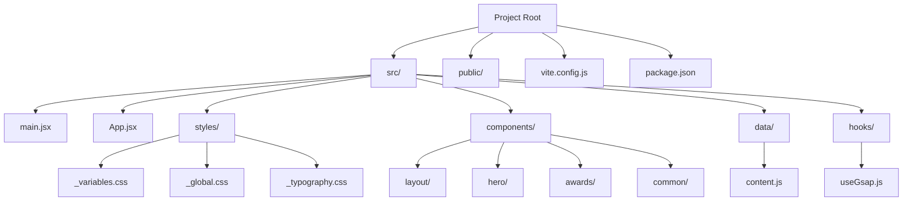
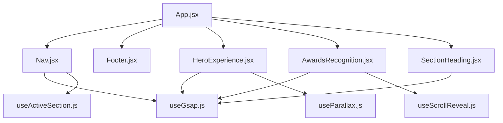

# Frontend Components

<cite>
**Referenced Files in This Document**
- [package.json](file://package.json)
- [vite.config.js](file://vite.config.js)
- [src/main.jsx](file://src/main.jsx)
- [src/App.jsx](file://src/App.jsx)
- [src/App.module.css](file://src/App.module.css)
- [src/components/layout/Nav.jsx](file://src/components/layout/Nav.jsx)
- [src/components/layout/Nav.module.css](file://src/components/layout/Nav.module.css)
- [src/components/layout/Footer.jsx](file://src/components/layout/Footer.jsx)
- [src/components/layout/Footer.module.css](file://src/components/layout/Footer.module.css)
- [src/components/hero/HeroExperience.jsx](file://src/components/hero/HeroExperience.jsx)
- [src/components/hero/HeroExperience.module.css](file://src/components/hero/HeroExperience.module.css)
- [src/components/awards/AwardsRecognition.jsx](file://src/components/awards/AwardsRecognition.jsx)
- [src/components/awards/AwardsRecognition.module.css](file://src/components/awards/AwardsRecognition.module.css)
- [src/components/common/SectionHeading.jsx](file://src/components/common/SectionHeading.jsx)
- [src/components/common/SectionHeading.module.css](file://src/components/common/SectionHeading.module.css)
- [src/hooks/useGsap.js](file://src/hooks/useGsap.js)
- [src/data/content.js](file://src/data/content.js)
- [src/styles/_variables.css](file://src/styles/_variables.css)
- [src/styles/_global.css](file://src/styles/_global.css)
- [src/styles/_typography.css](file://src/styles/_typography.css)
</cite>

## Update Summary
**Changes Made**
- Updated Navigation system documentation to reflect enhanced desktop navigation features with desktopNav class and improved cross-device functionality
- Enhanced Hero section documentation to reflect improved desktop layout, responsive padding, and overflow fixes
- Added documentation for new responsive typography system using clamp functions for fluid scaling
- Updated styling architecture to reflect enhanced responsive design patterns and improved visual design systems
- Enhanced component documentation to reflect recent improvements in CSS styling and responsive behavior

## Table of Contents
1. [Introduction](#introduction)
2. [Project Structure](#project-structure)
3. [Core Components](#core-components)
4. [Component Architecture](#component-architecture)
5. [Layout Components](#layout-components)
6. [Content Components](#content-components)
7. [Shared Utilities](#shared-utilities)
8. [State Management and Hooks](#state-management-and-hooks)
9. [CSS Modules and Styling](#css-modules-and-styling)
10. [Typography System](#typography-system)
11. [Data Management](#data-management)
12. [Vite Integration](#vite-integration)
13. [Development Workflow](#development-workflow)
14. [Performance Considerations](#performance-considerations)
15. [Troubleshooting Guide](#troubleshooting-guide)
16. [Conclusion](#conclusion)

## Introduction
This document provides comprehensive documentation for the React frontend components and development setup. The project features a modular component-based architecture with 11 distinct content sections, sophisticated animation integration using GSAP, and a robust CSS Modules styling system. The application showcases a professional portfolio-style website with smooth scrolling navigation, interactive animations, responsive design patterns, and a refined typography system using Cormorant Garamond and Inter fonts. Recent enhancements include improved desktop layouts, enhanced responsive typography using clamp functions, and refined cross-device functionality.

## Project Structure
The project follows a structured React + Vite setup with a comprehensive component hierarchy organized into logical modules:



**Diagram sources**
- [src/main.jsx:1-11](file://src/main.jsx#L1-L11)
- [src/App.jsx:1-51](file://src/App.jsx#L1-L51)
- [src/components/layout/Nav.jsx:1-98](file://src/components/layout/Nav.jsx#L1-L98)
- [src/components/hero/HeroExperience.jsx:1-140](file://src/components/hero/HeroExperience.jsx#L1-L140)

**Section sources**
- [src/main.jsx:1-11](file://src/main.jsx#L1-L11)
- [src/App.jsx:1-51](file://src/App.jsx#L1-L51)
- [vite.config.js:1-11](file://vite.config.js#L1-L11)
- [package.json:1-23](file://package.json#L1-L23)

## Core Components
The application is structured around several key architectural components that work together to create a cohesive user experience:

### Entry Point: main.jsx
The application bootstraps through a minimal entry point that creates the React root and renders the main App component within strict mode for enhanced error detection.

### Primary Component: App.jsx
The main App component orchestrates the entire application layout, managing the loading sequence and coordinating all content sections. It implements sophisticated loading animations and accessibility features.

### Layout System
The layout system consists of reusable components that provide consistent navigation, branding, and footer functionality across all pages.

**Section sources**
- [src/main.jsx:1-11](file://src/main.jsx#L1-L11)
- [src/App.jsx:17-51](file://src/App.jsx#L17-L51)
- [src/App.module.css:1-23](file://src/App.module.css#L1-L23)

## Component Architecture
The application employs a hierarchical component architecture with clear separation of concerns:



**Diagram sources**
- [src/App.jsx:2-14](file://src/App.jsx#L2-L14)
- [src/components/layout/Nav.jsx:1-5](file://src/components/layout/Nav.jsx#L1-L5)
- [src/components/common/SectionHeading.jsx:1-12](file://src/components/common/SectionHeading.jsx#L1-L12)

**Section sources**
- [src/App.jsx:1-51](file://src/App.jsx#L1-L51)
- [src/components/layout/Nav.jsx:1-98](file://src/components/layout/Nav.jsx#L1-L98)

## Layout Components
The layout system provides consistent navigation and structural elements across all pages.

### Navigation Component (Nav.jsx)
**Updated** Features responsive design with mobile-first approach, scroll-aware styling, and animated navigation items. Integrates with GSAP for smooth animations and uses custom hooks for active section detection. The navigation now includes a comprehensive mobile menu with social links and contact button, featuring sophisticated GSAP animations for menu item entrance and exit. The desktop navigation system has been enhanced with a dedicated `desktopNav` class for improved cross-device functionality and better separation of desktop vs mobile styling.

### Footer Component (Footer.jsx)
**Updated** Provides comprehensive footer navigation with brand information, copyright details, and accessible navigation controls. The footer has been transformed into a comprehensive brand showcase featuring a three-column grid layout on desktop with centered layout on mobile, including brand identity, navigation sections, and social media links.

**Section sources**
- [src/components/layout/Nav.jsx:1-152](file://src/components/layout/Nav.jsx#L1-L152)
- [src/components/layout/Nav.module.css:1-331](file://src/components/layout/Nav.module.css#L1-L331)
- [src/components/layout/Footer.jsx:1-59](file://src/components/layout/Footer.jsx#L1-L59)
- [src/components/layout/Footer.module.css:1-102](file://src/components/layout/Footer.module.css#L1-L102)

## Content Components
The application features 11 specialized content components, each designed to showcase specific aspects of Frankie Picasso's work and achievements.

### Hero Experience (HeroExperience.jsx)
**Updated** Implements sophisticated animations including headline word-by-word reveal, parallax effects, and decorative motion elements. Uses GSAP for timeline-based animations and responsive design considerations. Features the new typography system with Cormorant Garamond for headings and Inter for body text. The hero section now uses enhanced desktop layout with improved CSS styling, responsive padding that adapts to navigation height, and overflow fixes for better cross-device presentation. The component includes sophisticated responsive design patterns with optimized spacing and alignment for both desktop and mobile views.

### Awards Recognition (AwardsRecognition.jsx)
**Updated** Completely redesigned with new CSS styling featuring laurel decoration system, featured award highlighting, and responsive grid layout. The component now includes sophisticated GSAP ScrollTrigger animations for the featured award card with back.ease effect and scroll-triggered entrance animations.

### Section Heading (SectionHeading.jsx)
**Updated** Reusable component for consistent heading presentation across all content sections. The component has been refactored to remove the decorative numbering system, simplifying the design to focus purely on title and subtitle presentation. Supports light/dark theme variants for different background contexts.

**Section sources**
- [src/components/hero/HeroExperience.jsx:1-139](file://src/components/hero/HeroExperience.jsx#L1-L139)
- [src/components/hero/HeroExperience.module.css:1-227](file://src/components/hero/HeroExperience.module.css#L1-L227)
- [src/components/awards/AwardsRecognition.jsx:1-70](file://src/components/awards/AwardsRecognition.jsx#L1-L70)
- [src/components/awards/AwardsRecognition.module.css:1-295](file://src/components/awards/AwardsRecognition.module.css#L1-L295)
- [src/components/common/SectionHeading.jsx:1-12](file://src/components/common/SectionHeading.jsx#L1-L12)
- [src/components/common/SectionHeading.module.css:1-32](file://src/components/common/SectionHeading.module.css#L1-L32)

## Shared Utilities
The application leverages several shared utility components and hooks to maintain consistency and reduce code duplication.

### Section Heading (SectionHeading.jsx)
**Updated** Reusable component for consistent heading presentation across all content sections. The component has been refactored to remove the decorative numbering system, simplifying the design to focus purely on title and subtitle presentation. Supports light/dark theme variants for different background contexts.

### GSAP Hook (useGsap.js)
Centralized GSAP configuration with ScrollTrigger registration, default settings, and useGSAP wrapper for consistent animation behavior.

**Section sources**
- [src/components/common/SectionHeading.jsx:1-12](file://src/components/common/SectionHeading.jsx#L1-L12)
- [src/components/common/SectionHeading.module.css:1-32](file://src/components/common/SectionHeading.module.css#L1-L32)
- [src/hooks/useGsap.js:1-14](file://src/hooks/useGsap.js#L1-L14)

## State Management and Hooks
The application implements a sophisticated state management approach using React hooks and custom hooks for enhanced functionality.

### Custom Hooks
- **useGsap**: Centralized GSAP configuration with ScrollTrigger support
- **useActiveSection**: Tracks active navigation section based on scroll position
- **useParallax**: Implements parallax scrolling effects
- **useScrollReveal**: Manages scroll-triggered reveal animations

### State Patterns
Components utilize useState for UI state management (mobile menu, scroll awareness), useEffect for side effects and cleanup, and useRef for DOM manipulation and animation references.

**Section sources**
- [src/hooks/useGsap.js:1-14](file://src/hooks/useGsap.js#L1-L14)
- [src/components/layout/Nav.jsx:1-152](file://src/components/layout/Nav.jsx#L1-L152)

## CSS Modules and Styling
**Updated** The application employs CSS Modules for scoped styling, ensuring component isolation and preventing style conflicts.

### Styling Architecture
Each component maintains its own CSS Module file with component-specific classes, enabling:
- Local class name scoping
- Predictable styling inheritance
- Easy maintenance and modification
- Theme variable integration

### Design System
The styling system utilizes:
- CSS custom properties for theming
- Responsive design patterns with clamp functions for fluid typography
- Accessibility-focused color schemes
- Consistent spacing and typography scales

**Section sources**
- [src/App.module.css:1-23](file://src/App.module.css#L1-L23)
- [src/components/layout/Nav.jsx:5](file://src/components/layout/Nav.jsx#L5)

## Typography System
**Updated** The application now features a refined typography system with two distinct font families and advanced responsive scaling using clamp functions:

### Font Families
- **Serif Font**: Cormorant Garamond - Used for headings (h1-h3), quotes, and emphasized text
- **Sans-serif Font**: Inter - Used for body text, navigation, and interface elements

### Responsive Typography with Clamp Functions
The typography system implements fluid scaling using CSS clamp functions for optimal responsiveness:

```css
--fs-display: clamp(3rem, 6vw, 6rem);
--fs-h1: clamp(2.25rem, 4vw, 4rem);
--fs-h2: clamp(1.75rem, 3vw, 2.75rem);
--fs-h3: clamp(1.25rem, 2vw, 1.75rem);
```

These clamp functions provide:
- **Minimum size**: Prevents text from becoming too small on mobile devices
- **Fluid scaling**: Uses viewport-relative units for smooth scaling across devices
- **Maximum size**: Ensures text remains readable on larger screens

### Typography Implementation
The typography system is implemented through CSS custom properties in the variables file, providing consistent font sizing and spacing across all components:

```css
--font-serif: 'Cormorant Garamond', Georgia, serif;
--font-sans: 'Inter', system-ui, -apple-system, sans-serif;
```

### Component Integration
All content components now utilize the new responsive typography system:
- Headings use Cormorant Garamond for elegant serif typography with fluid scaling
- Body text uses Inter for excellent readability with clamp-based sizing
- Quotes and emphasized text use the serif font for visual distinction
- Navigation and interface elements use the sans-serif font for clarity

**Section sources**
- [src/styles/_variables.css:13-25](file://src/styles/_variables.css#L13-L25)
- [src/styles/_global.css:10-19](file://src/styles/_global.css#L10-L19)
- [src/styles/_typography.css:1-41](file://src/styles/_typography.css#L1-L41)

## Data Management
**Updated** The application uses a centralized content management system through a dedicated data module with enhanced biography narrative and expanded sections.

### Content Structure
The content.js file organizes all application data into logical categories with enhanced detail:
- Hero content with headline and tagline
- **Enhanced Biography**: Expanded personal story with four-decade timeline covering early career, sports promotion, government leadership, media empire building, and recognition
- **Expanded Entrepreneurship**: Six comprehensive ventures with detailed impact metrics and descriptions
- **Expanded Creativity**: Six distinct creative endeavors organized by category with type-specific icons
- Community initiatives and impact
- Media appearances and press coverage
- **Enhanced Books**: Featured book with detailed description and quote, plus expanded collection of published works
- Awards recognition with comprehensive history
- Legacy timeline with categorized events
- Future vision and current projects
- Contact information and social links

### Navigation Data
Separate arrays manage:
- sectionIds for scroll positioning
- navLinks for navigation structure with enhanced desktop navigation support
- Consistent labeling and routing

**Section sources**
- [src/data/content.js:1-183](file://src/data/content.js#L1-L183)

## Vite Integration
The project leverages Vite for modern development workflow with optimized build processes.

### Development Server
- Automatic browser opening on startup
- Hot module replacement for instant updates
- Fast refresh for React components
- Port configuration (default 3000)

### Build Process
- Optimized production builds
- Asset optimization and minification
- Environment-specific configurations
- Preview server for build validation

**Section sources**
- [vite.config.js:1-11](file://vite.config.js#L1-L11)
- [package.json:6-10](file://package.json#L6-L10)

## Development Workflow
The development environment supports rapid iteration and efficient debugging.

### Fast Refresh
- Instant component updates without full page reload
- Preserves component state during development
- Seamless integration with React DevTools

### Animation Development
- GSAP timeline testing and debugging
- Scroll-triggered animation development
- Responsive design testing across breakpoints

### Component Development
- Modular component creation and testing
- CSS Modules hot reloading
- Data-driven content updates
- Accessibility testing integration

**Section sources**
- [vite.config.js:6-9](file://vite.config.js#L6-L9)
- [src/hooks/useGsap.js:1-14](file://src/hooks/useGsap.js#L1-L14)

## Performance Considerations
The application implements several performance optimization strategies:

### Animation Optimization
- Reduced motion preference detection
- Scroll-triggered animations for performance
- Efficient GSAP usage patterns
- Cleanup of event listeners and observers

### Loading Strategies
- Sequential component loading
- Lazy loading for non-critical resources
- Optimized image handling
- CSS animation performance

### Bundle Optimization
- Tree shaking for unused imports
- Component splitting for large sections
- Minimal dependency footprint
- Efficient CSS Modules compilation

## Troubleshooting Guide
Common development and runtime issues with solutions:

### Component Rendering Issues
- **Blank screen on startup**: Verify DOM element existence and React version compatibility
- **Animation not working**: Check GSAP plugin registration and ScrollTrigger initialization
- **Navigation not responding**: Ensure section IDs match between content and navigation

### Styling Problems
- **Styles not applying**: Verify CSS Modules import syntax and class name matching
- **Animation conflicts**: Check for conflicting CSS properties and z-index stacking
- **Responsive issues**: Review media query breakpoints and viewport meta tags

### Typography Issues
- **Font not loading**: Verify Google Fonts import and network connectivity
- **Font fallback not working**: Check CSS font stack ordering
- **Typography inconsistencies**: Ensure CSS custom properties are properly defined

### Development Environment
- **Hot reload not working**: Restart Vite server and check plugin configurations
- **Build errors**: Verify Node.js version compatibility and dependency installation
- **Port conflicts**: Change server port in Vite configuration or kill conflicting processes

**Section sources**
- [src/main.jsx:6-10](file://src/main.jsx#L6-L10)
- [src/hooks/useGsap.js:6](file://src/hooks/useGsap.js#L6)
- [vite.config.js:7-8](file://vite.config.js#L7-L8)

## Conclusion
The React frontend components demonstrate a mature, scalable architecture with comprehensive animation integration, modular component design, and robust development tooling. The recent comprehensive redesign enhancements showcase the evolution toward a more sophisticated and visually engaging digital portfolio. The enhanced mobile-first navigation system with GSAP animations, improved desktop layout for the hero section with responsive padding and overflow fixes, redesigned awards recognition with laurel decorations, comprehensive brand-focused footer, and enhanced global styling system with improved CSS variables and responsive typography using clamp functions represent significant improvements in user experience and visual appeal. The 11-content component structure provides excellent organization for showcasing diverse aspects of Frankie Picasso's work while maintaining consistency and performance. The combination of CSS Modules, custom hooks, GSAP animations, and the refined responsive typography system creates a polished user experience with smooth interactions and professional presentation quality.