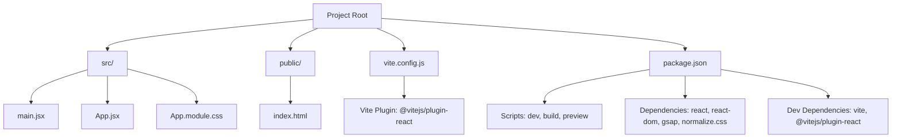
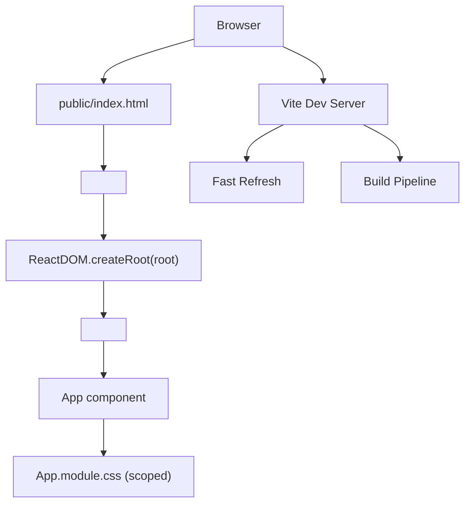

# Frontend Components

<cite>
**Referenced Files in This Document**
- [package.json](file://package.json)
- [vite.config.js](file://vite.config.js)
- [README.md](file://README.md)
- [public/index.html](file://public/index.html)
- [src/main.jsx](file://src/main.jsx)
- [src/App.jsx](file://src/App.jsx)
- [src/App.module.css](file://src/App.module.css)
</cite>

## Table of Contents
1. [Introduction](#introduction)
2. [Project Structure](#project-structure)
3. [Core Components](#core-components)
4. [Architecture Overview](#architecture-overview)
5. [Detailed Component Analysis](#detailed-component-analysis)
6. [Dependency Analysis](#dependency-analysis)
7. [Performance Considerations](#performance-considerations)
8. [Troubleshooting Guide](#troubleshooting-guide)
9. [Conclusion](#conclusion)

## Introduction
This document describes the React frontend components and development setup for the project. It focuses on the entry point and primary component, the component hierarchy, state management approach, and styling methodology using CSS modules. It also explains Vite integration for development and build processes, including hot module replacement and fast refresh capabilities. Guidance is provided on component composition, prop handling, styling patterns, and best practices for React development in this project context.

## Project Structure
The project follows a minimal React + Vite setup with a single-page application structure:
- Entry point initializes the React root and renders the primary App component.
- The App component uses CSS modules for scoped styling.
- Vite handles development server, fast refresh, and production builds.
- Public assets include a basic HTML template.

**Diagram sources**
- [src/main.jsx:1-11](file://src/main.jsx#L1-L11)
- [src/App.jsx:1-12](file://src/App.jsx#L1-L12)
- [src/App.module.css:1-4](file://src/App.module.css#L1-L4)
- [vite.config.js:1-11](file://vite.config.js#L1-L11)
- [package.json:1-23](file://package.json#L1-L23)
- [public/index.html:1-21](file://public/index.html#L1-L21)

**Section sources**
- [src/main.jsx:1-11](file://src/main.jsx#L1-L11)
- [src/App.jsx:1-12](file://src/App.jsx#L1-L12)
- [src/App.module.css:1-4](file://src/App.module.css#L1-L4)
- [vite.config.js:1-11](file://vite.config.js#L1-L11)
- [package.json:1-23](file://package.json#L1-L23)
- [public/index.html:1-21](file://public/index.html#L1-L21)

## Core Components
- Entry Point: Initializes the React root and renders the App component inside a strict mode wrapper. It also imports global styles.
- App Component: A functional component that renders a top-level container using CSS modules for scoping.
- CSS Modules: Scoped styles applied via a module import, ensuring local class names and predictable styling.

Key implementation references:
- Entry point render and imports: [src/main.jsx:1-11](file://src/main.jsx#L1-L11)
- App component definition and export: [src/App.jsx:1-12](file://src/App.jsx#L1-L12)
- App component scoped styles: [src/App.module.css:1-4](file://src/App.module.css#L1-L4)

**Section sources**
- [src/main.jsx:1-11](file://src/main.jsx#L1-L11)
- [src/App.jsx:1-12](file://src/App.jsx#L1-L12)
- [src/App.module.css:1-4](file://src/App.module.css#L1-L4)

## Architecture Overview
The runtime architecture centers around the React root and the App component. The Vite development server injects modules and enables fast refresh. CSS modules are processed at build time to provide scoped styles.

**Diagram sources**
- [src/main.jsx:1-11](file://src/main.jsx#L1-L11)
- [src/App.jsx:1-12](file://src/App.jsx#L1-L12)
- [src/App.module.css:1-4](file://src/App.module.css#L1-L4)
- [vite.config.js:1-11](file://vite.config.js#L1-L11)
- [public/index.html:1-21](file://public/index.html#L1-L21)

## Detailed Component Analysis

### Entry Point: main.jsx
Responsibilities:
- Creates the React root targeting the DOM element with id "root".
- Renders the App component wrapped in React.StrictMode.
- Imports global styles to establish baseline styles.

Rendering pattern:
- Single render call with the root element and the App component tree.

Best practices:
- Keep the entry point minimal and focused on mounting the app.
- Ensure the target DOM element exists in the HTML template.

References:
- [src/main.jsx:1-11](file://src/main.jsx#L1-L11)

**Section sources**
- [src/main.jsx:1-11](file://src/main.jsx#L1-L11)

### Primary Component: App.jsx
Responsibilities:
- Provides the top-level layout container for the application.
- Uses CSS modules to apply scoped styles.

Composition and props:
- Stateless functional component returning JSX.
- No props are currently used; can accept props for future expansion.

Styling approach:
- Imports styles from a CSS module file and applies a scoped class to the root element.

References:
- [src/App.jsx:1-12](file://src/App.jsx#L1-L12)
- [src/App.module.css:1-4](file://src/App.module.css#L1-L4)

**Section sources**
- [src/App.jsx:1-12](file://src/App.jsx#L1-L12)
- [src/App.module.css:1-4](file://src/App.module.css#L1-L4)

### CSS Modules: App.module.css
Responsibilities:
- Defines scoped styles for the App component.
- Ensures class names do not leak into the global stylesheet.

Usage:
- Imported in the App component and applied to the root element.

References:
- [src/App.module.css:1-4](file://src/App.module.css#L1-L4)

**Section sources**
- [src/App.module.css:1-4](file://src/App.module.css#L1-L4)

### Vite Integration and Development Workflow
Development server:
- Vite runs on port 3000 and automatically opens the browser.
- The plugin for React enables JSX transforms and fast refresh.

Build process:
- Production builds are generated via the configured build script.
- Preview serves the built assets locally.

Fast refresh:
- Changes to components trigger selective updates without full reloads.
- The browser reflects updates instantly during development.

References:
- [vite.config.js:1-11](file://vite.config.js#L1-L11)
- [package.json:6-10](file://package.json#L6-L10)
- [README.md:5-12](file://README.md#L5-L12)

**Section sources**
- [vite.config.js:1-11](file://vite.config.js#L1-L11)
- [package.json:6-10](file://package.json#L6-L10)
- [README.md:5-12](file://README.md#L5-L12)

### HTML Template: public/index.html
Responsibilities:
- Provides the base HTML scaffold with a div element whose id matches the React root mount target.
- Includes basic inline styles for a centered layout and dark theme.

References:
- [public/index.html:1-21](file://public/index.html#L1-L21)

**Section sources**
- [public/index.html:1-21](file://public/index.html#L1-L21)

## Dependency Analysis
External dependencies:
- React and ReactDOM: Core libraries for building the UI.
- GSAP and @gsap/react: Animation library integrations.
- normalize.css: Cross-browser baseline normalization.

Dev dependencies:
- vite: Build tool and dev server.
- @vitejs/plugin-react: Enables JSX transforms and fast refresh.

Script commands:
- dev: Starts the Vite development server.
- build: Produces optimized production assets.
- preview: Serves the built assets locally.

References:
- [package.json:11-22](file://package.json#L11-L22)

**Section sources**
- [package.json:11-22](file://package.json#L11-L22)

## Performance Considerations
- Keep the entry point minimal to reduce initial load overhead.
- Prefer CSS modules for component-scoped styles to avoid global conflicts and improve maintainability.
- Use Vite’s fast refresh to iterate quickly without full reloads.
- Avoid unnecessary re-renders by keeping components pure and passing only required props.

## Troubleshooting Guide
Common issues and resolutions:
- Blank screen after starting the dev server:
  - Verify the HTML template contains a div with id "root".
  - Confirm the entry point targets the correct DOM element.
  - References: [public/index.html:14-18](file://public/index.html#L14-L18), [src/main.jsx:6-10](file://src/main.jsx#L6-L10)

- Styles not applying:
  - Ensure the CSS module is imported and the class name matches the expected scope.
  - References: [src/App.jsx](file://src/App.jsx#L1), [src/App.module.css:1-4](file://src/App.module.css#L1-L4)

- Development server not starting:
  - Check that the dev script is configured and dependencies are installed.
  - References: [package.json:6-10](file://package.json#L6-L10), [README.md:7-12](file://README.md#L7-L12)

- Port conflicts:
  - Adjust the server port in the Vite configuration if needed.
  - References: [vite.config.js:6-9](file://vite.config.js#L6-L9)

**Section sources**
- [public/index.html:14-18](file://public/index.html#L14-L18)
- [src/main.jsx:6-10](file://src/main.jsx#L6-L10)
- [src/App.jsx](file://src/App.jsx#L1)
- [src/App.module.css:1-4](file://src/App.module.css#L1-L4)
- [package.json:6-10](file://package.json#L6-L10)
- [README.md:7-12](file://README.md#L7-L12)
- [vite.config.js:6-9](file://vite.config.js#L6-L9)

## Conclusion
The project employs a clean and minimal React + Vite setup. The entry point mounts the App component, which uses CSS modules for scoped styling. Vite provides a fast development experience with automatic server startup and hot module replacement. By adhering to the outlined patterns—keeping the entry point minimal, leveraging CSS modules, and using Vite’s fast refresh—the team can efficiently develop and scale the frontend while maintaining clarity and performance.