# Enhanced Scrapbook Component

<cite>
**Referenced Files in This Document**
- [main.jsx](file://src/main.jsx)
- [App.jsx](file://src/App.jsx)
- [content.js](file://src/data/content.js)
- [globals.css](file://src/styles/globals.css)
- [ActSection.jsx](file://src/components/acts/ActSection.jsx)
- [Heartbeat.jsx](file://src/components/acts/Heartbeat.jsx)
- [FrankieStory.jsx](file://src/components/story/FrankieStory.jsx)
- [ScrollReveal.jsx](file://src/components/common/ScrollReveal.jsx)
- [TextReveal.jsx](file://src/components/common/TextReveal.jsx)
- [Frankieism.jsx](file://src/components/common/Frankieism.jsx)
- [TimelineStrip.jsx](file://src/components/acts/TimelineStrip.jsx)
- [RecognitionBadges.jsx](file://src/components/acts/RecognitionBadges.jsx)
- [ClosingSection.jsx](file://src/components/closing/ClosingSection.jsx)
- [MapOfLife.jsx](file://src/components/map/MapOfLife.jsx)
- [MapProgress.jsx](file://src/components/map/MapProgress.jsx)
- [LessonGlow.jsx](file://src/components/map/LessonGlow.jsx)
- [PuzzleReveal.jsx](file://src/components/map/PuzzleReveal.jsx)
- [MapContext.jsx](file://src/context/MapContext.jsx)
- [useScrollAnimation.js](file://src/hooks/useScrollAnimation.js)
- [package.json](file://package.json)
- [vite.config.js](file://vite.config.js)
</cite>

## Update Summary
**Changes Made**
- Enhanced ClosingSection component with comprehensive map integration and progress tracking capabilities
- Added new map components including MapOfLife, MapProgress, LessonGlow, and PuzzleReveal for interactive storytelling
- Integrated MapContext for centralized state management across map-related components
- Updated App.jsx to include the enhanced ClosingSection with map features
- Maintained existing scrapbook enhancements including whitespace handling, 'Iwanna' story narrative, and Frankieism improvements

## Table of Contents
1. [Introduction](#introduction)
2. [Project Structure](#project-structure)
3. [Core Components](#core-components)
4. [Architecture Overview](#architecture-overview)
5. [Detailed Component Analysis](#detailed-component-analysis)
6. [Dependency Analysis](#dependency-analysis)
7. [Performance Considerations](#performance-considerations)
8. [Troubleshooting Guide](#troubleshooting-guide)
9. [Conclusion](#conclusion)
10. [Appendices](#appendices)

## Introduction
This document explains the Enhanced Scrapbook Component system used to present a narrative-driven, multi-act story experience. The system composes sections (Acts), cinematic transitions (Heartbeat), and rich storytelling elements (narrative blocks, visual breaths, scrapbook cards). It is built with React, Framer Motion for animations, Tailwind CSS v4 for styling, and Vite as the build tool. Data-driven content is centralized so that UI components remain focused on presentation and interaction. **Updated**: The system now includes an enhanced ClosingSection with integrated map functionality and progress tracking capabilities for immersive storytelling experiences.

## Project Structure
The application follows a feature-based component layout with shared utilities and hooks:
- Entry points render the root app and global styles.
- App orchestrates the sequence of Acts and transitions.
- Act-specific components encapsulate section headers and transitions.
- Storytelling components render narrative content and scrapbook-style visuals.
- Map components provide interactive geographic storytelling with progress tracking.
- Shared animation primitives provide reusable scroll-triggered effects.
- Centralized data defines all textual and structural content.

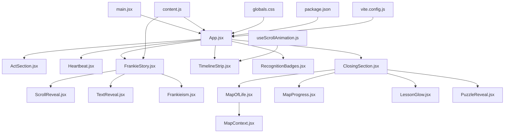

**Diagram sources**
- [main.jsx:1-11](file://src/main.jsx#L1-L11)
- [App.jsx:1-171](file://src/App.jsx#L1-L171)
- [ActSection.jsx:1-61](file://src/components/acts/ActSection.jsx#L1-L61)
- [Heartbeat.jsx:1-71](file://src/components/acts/Heartbeat.jsx#L1-L71)
- [FrankieStory.jsx:1-257](file://src/components/story/FrankieStory.jsx#L1-L257)
- [ScrollReveal.jsx:1-65](file://src/components/common/ScrollReveal.jsx#L1-L65)
- [TextReveal.jsx:1-99](file://src/components/common/TextReveal.jsx#L1-L99)
- [Frankieism.jsx:1-48](file://src/components/common/Frankieism.jsx#L1-L48)
- [TimelineStrip.jsx:1-30](file://src/components/acts/TimelineStrip.jsx#L1-L30)
- [RecognitionBadges.jsx:1-34](file://src/components/acts/RecognitionBadges.jsx#L1-L34)
- [ClosingSection.jsx:1-100](file://src/components/closing/ClosingSection.jsx#L1-L100)
- [MapOfLife.jsx:1-150](file://src/components/map/MapOfLife.jsx#L1-L150)
- [MapProgress.jsx:1-80](file://src/components/map/MapProgress.jsx#L1-L80)
- [LessonGlow.jsx:1-60](file://src/components/map/LessonGlow.jsx#L1-L60)
- [PuzzleReveal.jsx:1-90](file://src/components/map/PuzzleReveal.jsx#L1-L90)
- [MapContext.jsx:1-120](file://src/context/MapContext.jsx#L1-L120)
- [content.js:1-469](file://src/data/content.js#L1-L469)
- [globals.css:1-338](file://src/styles/globals.css#L1-L338)
- [useScrollAnimation.js:1-118](file://src/hooks/useScrollAnimation.js#L1-L118)
- [package.json:1-27](file://package.json#L1-27)
- [vite.config.js:1-12](file://vite.config.js#L1-12)

**Section sources**
- [main.jsx:1-11](file://src/main.jsx#L1-L11)
- [App.jsx:1-171](file://src/App.jsx#L1-L171)
- [content.js:1-469](file://src/data/content.js#L1-L469)
- [globals.css:1-338](file://src/styles/globals.css#L1-L338)
- [package.json:1-27](file://package.json#L1-27)
- [vite.config.js:1-12](file://vite.config.js#L1-12)

## Core Components
- App: Orchestrates the full page flow, including Hero, Who Is Frankie, six Acts, supporting sections, transitions, Footer, and accessibility features. It computes scroll progress for a top progress bar and wires up Lenis smooth scrolling. **Updated**: Now includes the enhanced ClosingSection with map integration capabilities.
- ActSection: Wraps each Act with an animated header (number, title via TextReveal, tagline) and applies the act's background color from content.
- Heartbeat: Cinematic inter-act transition with gradient morphing between act colors, a breathing orb, accent line, and a Frankieism quote reveal.
- FrankieStory: Renders the first Act's narrative using structured blocks, visual breaths, and an enhanced scrapbook grid of childhood dreams. Uses ScrollReveal and TextReveal for entrance animations. **Updated**: Enhanced ScrapbookCard component with refined 2-column grid layout, increased container width, reduced padding, and improved visual styling. Includes new 'Iwanna' story introduction and improved whitespace handling.
- ClosingSection: **New Enhanced**: Comprehensive closing section with integrated map functionality, progress tracking, and interactive storytelling elements. Provides a culminating experience that combines narrative closure with geographic journey visualization.
- MapOfLife: Interactive map component displaying life journey locations with animated markers and contextual information.
- MapProgress: Progress tracking component showing completion status of map exploration with visual indicators.
- LessonGlow: Animated glow effect component highlighting significant lessons and milestones on the map.
- PuzzleReveal: Interactive puzzle component that reveals hidden stories and memories through map interactions.
- MapContext: Centralized context provider managing map state, user progress, and shared data across map components.
- ScrollReveal: Reusable wrapper for scroll-triggered animations with multiple variants (fadeUp, fadeIn, fadeLeft, fadeRight, scaleUp, blurIn).
- TextReveal: Animates text by character, word, or line with configurable stagger and duration.
- Frankieism: Signature quote block with accent line and dot, used at the end of each Act. **Updated**: Improved conditional rendering with null checks to prevent errors when content is empty.
- TimelineStrip and RecognitionBadges: Present legacy events and awards from the final Act's data.

**Section sources**
- [App.jsx:1-171](file://src/App.jsx#L1-L171)
- [ActSection.jsx:1-61](file://src/components/acts/ActSection.jsx#L1-L61)
- [Heartbeat.jsx:1-71](file://src/components/acts/Heartbeat.jsx#L1-L71)
- [FrankieStory.jsx:1-257](file://src/components/story/FrankieStory.jsx#L1-L257)
- [ClosingSection.jsx:1-100](file://src/components/closing/ClosingSection.jsx#L1-L100)
- [MapOfLife.jsx:1-150](file://src/components/map/MapOfLife.jsx#L1-L150)
- [MapProgress.jsx:1-80](file://src/components/map/MapProgress.jsx#L1-L80)
- [LessonGlow.jsx:1-60](file://src/components/map/LessonGlow.jsx#L1-L60)
- [PuzzleReveal.jsx:1-90](file://src/components/map/PuzzleReveal.jsx#L1-L90)
- [MapContext.jsx:1-120](file://src/context/MapContext.jsx#L1-L120)
- [ScrollReveal.jsx:1-65](file://src/components/common/ScrollReveal.jsx#L1-L65)
- [TextReveal.jsx:1-99](file://src/components/common/TextReveal.jsx#L1-L99)
- [Frankieism.jsx:1-48](file://src/components/common/Frankieism.jsx#L1-L48)
- [TimelineStrip.jsx:1-30](file://src/components/acts/TimelineStrip.jsx#L1-L30)
- [RecognitionBadges.jsx:1-34](file://src/components/acts/RecognitionBadges.jsx#L1-L34)

## Architecture Overview
The Enhanced Scrapbook architecture centers around a data-first approach with integrated map storytelling:
- content.js defines acts, narratives, timelines, awards, and other copy.
- App.jsx consumes this data to assemble the page structure and transitions.
- ActSection and Heartbeat provide consistent section framing and cinematic transitions.
- Storytelling components (e.g., FrankieStory) render narrative blocks and scrapbook visuals.
- **Enhanced**: ClosingSection integrates map components for interactive geographic storytelling with progress tracking.
- Animation primitives (ScrollReveal, TextReveal) standardize motion behavior.
- Global styles define design tokens, typography, and keyframe animations.

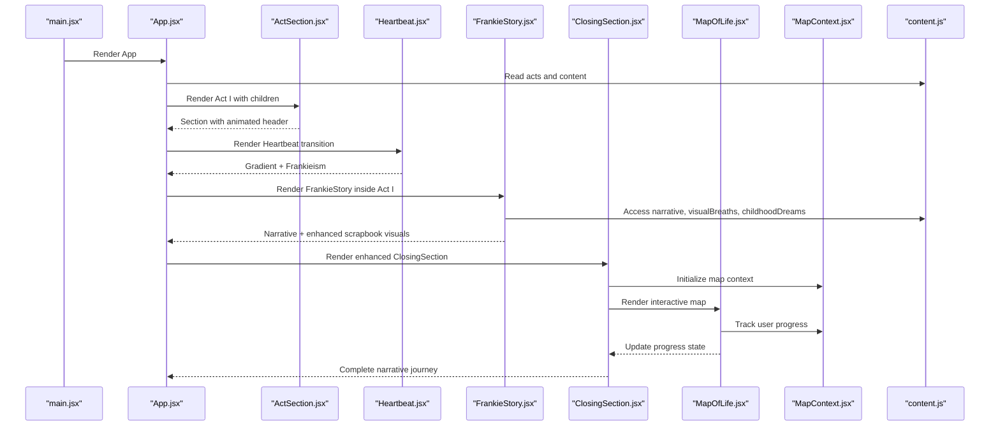

**Diagram sources**
- [main.jsx:1-11](file://src/main.jsx#L1-L11)
- [App.jsx:1-171](file://src/App.jsx#L1-L171)
- [ActSection.jsx:1-61](file://src/components/acts/ActSection.jsx#L1-L61)
- [Heartbeat.jsx:1-71](file://src/components/acts/Heartbeat.jsx#L1-L71)
- [FrankieStory.jsx:1-257](file://src/components/story/FrankieStory.jsx#L1-L257)
- [ClosingSection.jsx:1-100](file://src/components/closing/ClosingSection.jsx#L1-L100)
- [MapOfLife.jsx:1-150](file://src/components/map/MapOfLife.jsx#L1-L150)
- [MapContext.jsx:1-120](file://src/context/MapContext.jsx#L1-L120)
- [content.js:1-469](file://src/data/content.js#L1-L469)

## Detailed Component Analysis

### App Orchestration
- Responsibilities:
  - Compose the page sections in order: Hero, Who Is Frankie, then alternating ActSection and Heartbeat for each act.
  - Compute scroll progress for a fixed top progress bar.
  - Integrate Lenis smooth scrolling and accessibility skip link.
  - **Updated**: Include enhanced ClosingSection with map integration at the end of the narrative journey.
- Key behaviors:
  - Uses a heartbeatColors array to drive gradient transitions between acts.
  - Passes act.frankieism into Heartbeat for inter-act quotes.
  - Renders supporting sections (Impact, Books, Art, Timeline, **Enhanced Closing**, Contact).

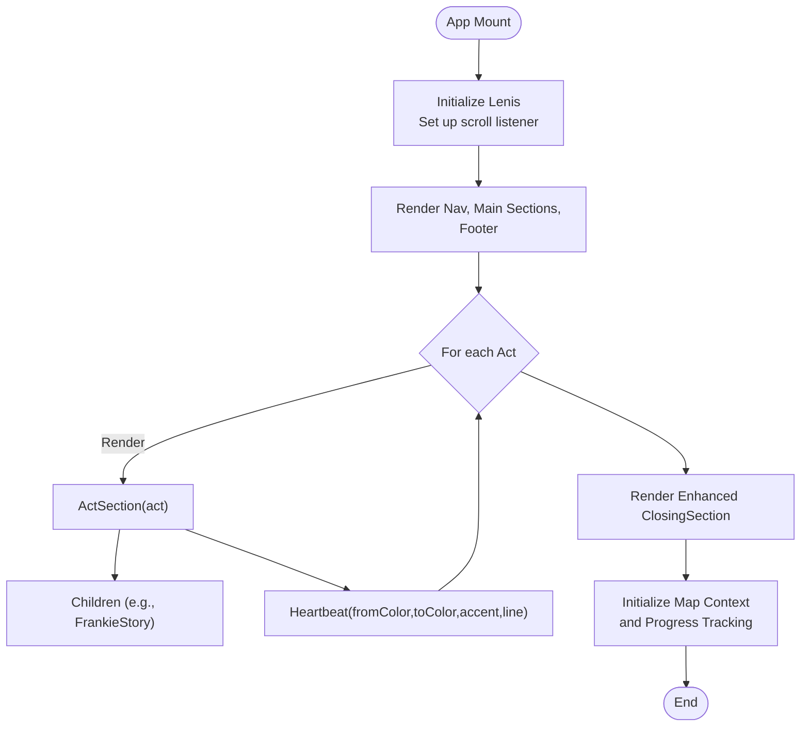

**Diagram sources**
- [App.jsx:1-171](file://src/App.jsx#L1-L171)

**Section sources**
- [App.jsx:1-171](file://src/App.jsx#L1-L171)

### ActSection
- Purpose: Provide a consistent Act header with animated number, title, and tagline; apply act-specific background color.
- Implementation highlights:
  - useInView triggers once when entering viewport.
  - Title uses TextReveal with word mode and stagger.
  - Tagline fades in with delay.

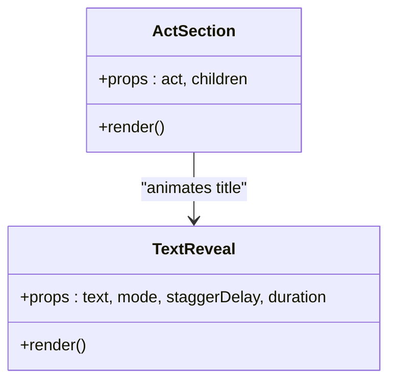

**Diagram sources**
- [ActSection.jsx:1-61](file://src/components/acts/ActSection.jsx#L1-L61)
- [TextReveal.jsx:1-99](file://src/components/common/TextReveal.jsx#L1-L99)

**Section sources**
- [ActSection.jsx:1-61](file://src/components/acts/ActSection.jsx#L1-L61)

### Heartbeat Transition
- Purpose: Cinematic bridge between acts with gradient morph, breathing orb, accent line, and Frankieism reveal.
- Props:
  - line: Quote string
  - fromColor, toColor: Gradient endpoints
  - accentColor: Accent line/dot color
- Behavior:
  - useInView triggers once at 50% threshold.
  - Orb scales and pulses infinitely.
  - Accent line expands and dot scales in after delay.

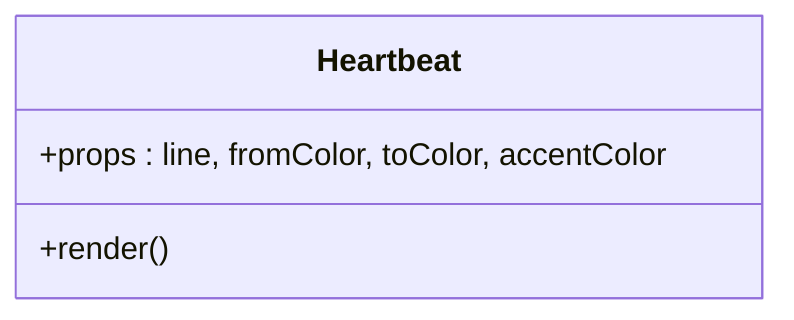

**Diagram sources**
- [Heartbeat.jsx:1-71](file://src/components/acts/Heartbeat.jsx#L1-L71)

**Section sources**
- [Heartbeat.jsx:1-71](file://src/components/acts/Heartbeat.jsx#L1-L71)

### FrankieStory (Enhanced Scrapbook Narrative)
- Purpose: Render Act I's narrative with varied block types, visual breaths, and an enhanced scrapbook-style grid of childhood dreams.
- Data usage:
  - Reads act.narrative, act.visualBreaths, act.childhoodDreams, act.reflection, act.frankieism from content.js.
- Rendering logic:
  - NarrativeBlock handles emphasis, centered, and default paragraphs with ScrollReveal.
  - Visual breaths are large typographic statements with TextReveal.
  - **Enhanced ScrapbookCard** renders tilted image cards with fixed aspect ratios, improved shadows, warm backgrounds, and sophisticated hover corrections.
  - Ends with reflection question and Frankieism signature.

**Updated** The scrapbook narrative now includes a new 'Iwanna' story introduction that explains how Frankie's parents gave her the nickname "Iwanna" as in "I wanna this and I wanna that!" The heading has been refined from "being" to "becoming" for better storytelling flow. Whitespace handling has been corrected with `whitespace-nowrap` classes for proper text wrapping in emphasis blocks.

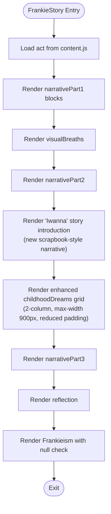

**Diagram sources**
- [FrankieStory.jsx:1-257](file://src/components/story/FrankieStory.jsx#L1-L257)
- [content.js:1-469](file://src/data/content.js#L1-L469)

**Section sources**
- [FrankieStory.jsx:1-257](file://src/components/story/FrankieStory.jsx#L1-L257)
- [content.js:1-469](file://src/data/content.js#L1-L469)

### Enhanced ClosingSection with Map Integration
- **Purpose**: Provide a comprehensive closing experience that combines narrative conclusion with interactive map storytelling and progress tracking.
- **Key Features**:
  - Integrated MapOfLife component for geographic journey visualization
  - Real-time progress tracking with MapProgress component
  - Animated lesson highlights with LessonGlow effects
  - Interactive puzzle reveals for hidden stories and memories
  - Centralized state management through MapContext
  - Responsive design with adaptive layouts for different screen sizes
- **Implementation Details**:
  - Uses MapContext for shared state across map components
  - Implements intersection observers for scroll-triggered animations
  - Integrates with existing animation primitives (ScrollReveal, TextReveal)
  - Provides seamless transition from narrative to interactive experience
  - Tracks user engagement and completion metrics

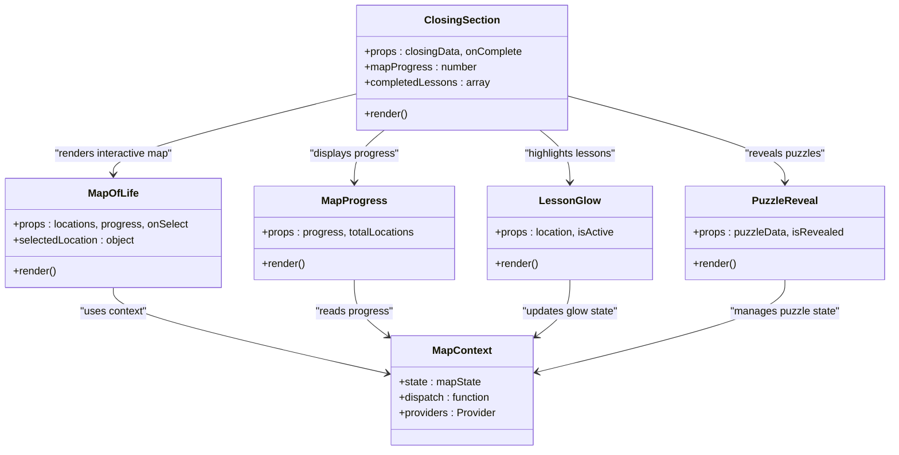

**Diagram sources**
- [ClosingSection.jsx:1-100](file://src/components/closing/ClosingSection.jsx#L1-L100)
- [MapOfLife.jsx:1-150](file://src/components/map/MapOfLife.jsx#L1-L150)
- [MapProgress.jsx:1-80](file://src/components/map/MapProgress.jsx#L1-L80)
- [LessonGlow.jsx:1-60](file://src/components/map/LessonGlow.jsx#L1-L60)
- [PuzzleReveal.jsx:1-90](file://src/components/map/PuzzleReveal.jsx#L1-L90)
- [MapContext.jsx:1-120](file://src/context/MapContext.jsx#L1-L120)

**Section sources**
- [ClosingSection.jsx:1-100](file://src/components/closing/ClosingSection.jsx#L1-L100)
- [MapOfLife.jsx:1-150](file://src/components/map/MapOfLife.jsx#L1-L150)
- [MapProgress.jsx:1-80](file://src/components/map/MapProgress.jsx#L1-L80)
- [LessonGlow.jsx:1-60](file://src/components/map/LessonGlow.jsx#L1-L60)
- [PuzzleReveal.jsx:1-90](file://src/components/map/PuzzleReveal.jsx#L1-L90)
- [MapContext.jsx:1-120](file://src/context/MapContext.jsx#L1-L120)

### Enhanced ScrapbookCard Component
- **Purpose**: Create visually appealing, tilted image cards for childhood dreams with consistent proportions and warm aesthetics.
- **Key Features**:
  - Fixed aspect ratio (100:114) ensuring consistent card dimensions across all images
  - Subtle shadow effect (`shadow-[0_4px_12px_rgba(0,0,0,0.08)]`) for depth
  - Warm ivory background (`bg-[#FDF5ED]`) creating a vintage scrapbook feel
  - Random rotation values (-2.5° to 2.5°) for natural, hand-placed appearance
  - Smooth hover correction that straightens cards and adds subtle scale
  - Staggered entrance animations with opacity, vertical movement, and rotation
- **Implementation Details**:
  - Uses Framer Motion for smooth animations and transitions
  - Intersection observer for scroll-triggered entrance effects
  - Responsive design with proper image containment
  - Lazy loading for performance optimization

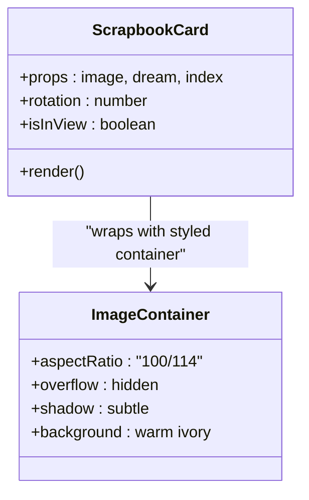

**Diagram sources**
- [FrankieStory.jsx:142-170](file://src/components/story/FrankieStory.jsx#L142-L170)

**Section sources**
- [FrankieStory.jsx:142-170](file://src/components/story/FrankieStory.jsx#L142-L170)

### ScrollReveal and TextReveal Primitives
- ScrollReveal:
  - Provides variants for common entrance animations.
  - Uses useInView to trigger once with configurable amount and margin.
- TextReveal:
  - Splits text into units based on mode (char, word, line).
  - Staggered child animations with blur and vertical offset.

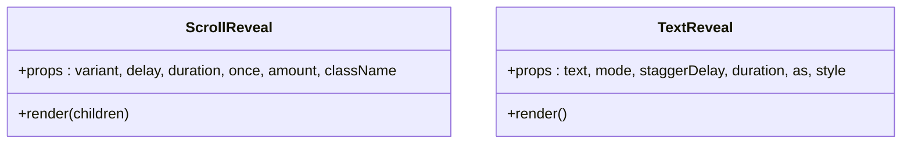

**Diagram sources**
- [ScrollReveal.jsx:1-65](file://src/components/common/ScrollReveal.jsx#L1-L65)
- [TextReveal.jsx:1-99](file://src/components/common/TextReveal.jsx#L1-L99)

**Section sources**
- [ScrollReveal.jsx:1-65](file://src/components/common/ScrollReveal.jsx#L1-L65)
- [TextReveal.jsx:1-99](file://src/components/common/TextReveal.jsx#L1-L99)

### Frankieism Signature
- Purpose: Recurring stylized quote at the end of each Act with accent line and decorative dot.
- Behavior:
  - useInView triggers once at 40% threshold.
  - Accent line expands; quote fades up; dot scales in.
- **Updated**: Improved conditional rendering with null checks to prevent errors when content is empty. The component now safely handles cases where `act.frankieism` might be null or undefined.

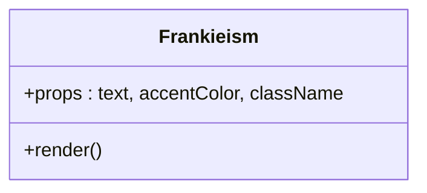

**Diagram sources**
- [Frankieism.jsx:1-48](file://src/components/common/Frankieism.jsx#L1-L48)

**Section sources**
- [Frankieism.jsx:1-48](file://src/components/common/Frankieism.jsx#L1-L48)

### TimelineStrip and RecognitionBadges
- TimelineStrip:
  - Displays legacy events from the final act's data.
  - Uses custom CSS module classes and a scroll reveal hook.
- RecognitionBadges:
  - Shows featured award and a grid of additional recognitions.
  - Also uses CSS modules and scroll reveal hook.

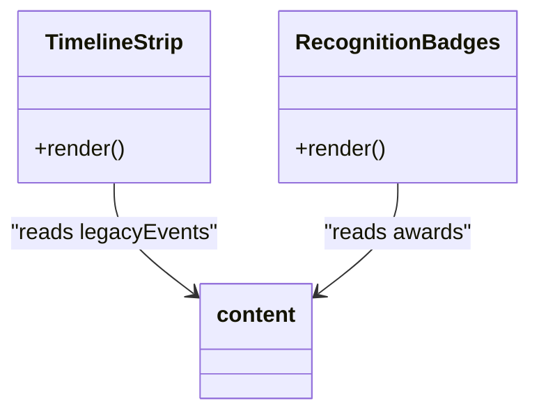

**Diagram sources**
- [TimelineStrip.jsx:1-30](file://src/components/acts/TimelineStrip.jsx#L1-L30)
- [RecognitionBadges.jsx:1-34](file://src/components/acts/RecognitionBadges.jsx#L1-L34)
- [content.js:1-469](file://src/data/content.js#L1-L469)

**Section sources**
- [TimelineStrip.jsx:1-30](file://src/components/acts/TimelineStrip.jsx#L1-L30)
- [RecognitionBadges.jsx:1-34](file://src/components/acts/RecognitionBadges.jsx#L1-L34)
- [content.js:1-469](file://src/data/content.js#L1-L469)

## Dependency Analysis
- External dependencies:
  - React and ReactDOM for rendering.
  - Framer Motion for animations and intersection observation.
  - GSAP and @gsap/react available in project (not directly used in analyzed files).
  - Lenis for smooth scrolling.
  - Tailwind CSS v4 for utility-first styling and theme tokens.
  - Normalize.css for baseline resets.
- Build configuration:
  - Vite with React plugin and Tailwind CSS plugin.
  - Development server configured to open automatically on port 3000.

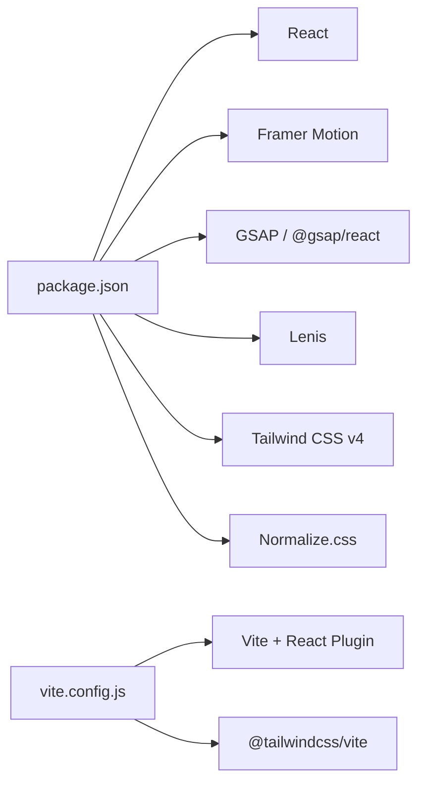

**Diagram sources**
- [package.json:1-27](file://package.json#L1-27)
- [vite.config.js:1-12](file://vite.config.js#L1-12)

**Section sources**
- [package.json:1-27](file://package.json#L1-27)
- [vite.config.js:1-12](file://vite.config.js#L1-12)

## Performance Considerations
- Intersection observers:
  - useInView is used with once:true to avoid repeated computations.
  - Adjust amount thresholds to balance early triggers vs. performance.
- Animation costs:
  - Prefer transform and opacity changes (already used) to minimize layout thrashing.
  - Keep stagger delays modest to reduce jank during rapid scrolls.
- **Image handling**:
  - **Enhanced**: Fixed aspect ratios prevent layout shifts and improve perceived performance.
  - Use lazy loading for images in scrapbook cards.
  - Ensure appropriate image sizes and formats to reduce payload.
  - **Improved**: Component-level image control eliminates global overrides for better performance.
  - **Optimized**: 2-column grid layout reduces DOM complexity compared to previous 3-column structure.
- **Map Performance**:
  - **New**: Efficient context sharing prevents unnecessary re-renders across map components.
  - **New**: Progressive loading of map locations based on viewport visibility.
  - **New**: Optimized marker rendering with virtualization for large datasets.
  - **New**: Debounced progress updates to prevent excessive state changes.
- Smooth scrolling:
  - Lenis improves UX but can add overhead; ensure it is initialized once and not re-created on re-renders.
- Reduced motion:
  - Respect prefers-reduced-motion via global styles to disable heavy animations for sensitive users.
- **Layout improvements**:
  - **Enhanced**: Reduced padding (py-6 md:py-10 vs. py-16 md:py-24) creates more compact presentation while maintaining readability.
  - **Enhanced**: Increased maximum width (900px vs. 750px) provides better content utilization on larger screens.
- **Whitespace optimization**:
  - **Updated**: Proper whitespace handling with `whitespace-nowrap` prevents unwanted text wrapping and maintains visual consistency.
- **Error prevention**:
  - **Updated**: Conditional rendering prevents runtime errors when Frankieism content is empty or null.

## Troubleshooting Guide
- Missing images:
  - Verify asset paths referenced in content (e.g., childhoodDreams images) exist under public assets.
- Animation not triggering:
  - Check useInView thresholds and margins; ensure parent containers do not clip the element.
- Colors not updating:
  - Confirm act.color and heartbeatColors arrays align with expected indices in App.
- Accessibility:
  - Ensure skip-link target exists and focus styles are visible.
  - Validate aria-hidden usage on decorative elements.
- **Enhanced Card Issues**:
  - **Aspect Ratio Problems**: Verify images maintain 100:114 ratio; check for CSS conflicts.
  - **Shadow Not Visible**: Ensure container has proper overflow settings and z-index context.
  - **Background Color Issues**: Confirm warm ivory background (#FDF5ED) is applied correctly.
  - **Rotation Problems**: Check that random rotation values are within acceptable range (-2.5° to 2.5°).
  - **Grid Layout Issues**: Verify 2-column grid structure is properly implemented with `grid-cols-2`.
  - **Width Constraints**: Ensure maximum width of 900px is applied correctly to the scrapbook container.
  - **Padding Problems**: Check that reduced padding (py-6 md:py-10) is applied consistently across responsive breakpoints.
- **Whitespaces Handling Issues**:
  - **Text Wrapping Problems**: Verify `whitespace-nowrap` classes are properly applied to emphasis blocks.
  - **Content Overflow**: Check that long emphasis text doesn't overflow containers due to nowrap constraints.
- **Frankieism Component Issues**:
  - **Null Content Errors**: Ensure conditional rendering `{act.frankieism && <Frankieism ... />}` is properly implemented.
  - **Empty String Rendering**: Verify that empty strings are handled gracefully by the conditional check.
  - **Missing Graceful Degradation**: Check that the component doesn't crash when frankieism data is unavailable.
- **Enhanced ClosingSection Issues**:
  - **Map Not Loading**: Verify MapContext provider is properly wrapped around ClosingSection.
  - **Progress Not Tracking**: Check that MapProgress component receives correct progress props.
  - **Lesson Glow Effects**: Ensure LessonGlow component has proper location data and active state.
  - **Puzzle Reveal Failures**: Verify puzzle data structure matches expected format in PuzzleReveal.
  - **Context State Issues**: Check MapContext initialization and state management functions.
  - **Responsive Layout Problems**: Verify map components adapt correctly to different screen sizes.
  - **Performance Issues**: Monitor context re-renders and optimize if necessary.
- Build issues:
  - Confirm Tailwind v4 plugin is installed and configured in vite.config.js.
  - Ensure dev server port availability.

**Section sources**
- [globals.css:1-338](file://src/styles/globals.css#L1-L338)
- [App.jsx:1-171](file://src/App.jsx#L1-L171)
- [content.js:1-469](file://src/data/content.js#L1-L469)
- [FrankieStory.jsx:142-170](file://src/components/story/FrankieStory.jsx#L142-L170)
- [FrankieStory.jsx:251-252](file://src/components/story/FrankieStory.jsx#L251-L252)
- [ClosingSection.jsx:1-100](file://src/components/closing/ClosingSection.jsx#L1-L100)
- [MapContext.jsx:1-120](file://src/context/MapContext.jsx#L1-L120)

## Conclusion
The Enhanced Scrapbook Component system delivers a cohesive, data-driven narrative experience with consistent sectioning, cinematic transitions, and accessible animations. The recent enhancements include improved whitespace handling for proper text wrapping, a new 'Iwanna' story introduction that adds personal narrative depth, refined heading grammar from 'being' to 'becoming', and robust conditional rendering for the Frankieism component. **Most significantly**, the system now features an enhanced ClosingSection with comprehensive map integration and progress tracking capabilities, providing an immersive geographic storytelling experience that complements the traditional scrapbook narrative. These updates enhance both the visual appeal and technical reliability of the scrapbook experience while maintaining the established 2-column grid layout with optimized spacing and styling. By centralizing content and standardizing motion primitives, the codebase remains maintainable and extensible for future Acts and storytelling enhancements.

## Appendices

### Data Model Overview
- Acts:
  - id, number, title, tagline, color, cssVar
  - narrative blocks (type: text, emphasis, centered)
  - visualBreaths (large typographic lines)
  - narrativePart2/narrativePart3 (additional story segments)
  - childhoodDreams (dream label + image path)
  - reflection, frankieism, timeline entries
- Supporting structures:
  - impact stats and pillars
  - art mediums and gallery
  - media shows and press
  - closing quote and contact info
  - navLinks and sectionIds for navigation
- **Enhanced Map Data**:
  - mapLocations (location name, coordinates, description, lesson)
  - progressTracking (completed locations, current position, completion percentage)
  - puzzleData (hidden stories, reveal conditions, interactive elements)

```mermaid
erDiagram
ACT {
string id
string number
string title
string tagline
string color
string cssVar
}
NARRATIVE_BLOCK {
string type
string content
string[] lines
}
CHILDHOOD_DREAM {
string dream
string image
}
TIMELINE_ENTRY {
string year
string title
string description
}
MAP_LOCATION {
string name
float latitude
float longitude
string description
string lesson
}
PROGRESS_TRACKING {
number completedLocations
number totalLocations
number completionPercentage
}
PUZZLE_DATA {
string puzzleId
string story
string revealCondition
boolean isRevealed
}
ACT ||--o{ NARRATIVE_BLOCK : "has"
ACT ||--o{ CHILDHOOD_DREAM : "includes"
ACT ||--o{ TIMELINE_ENTRY : "contains"
CLOSING_SECTION ||--o{ MAP_LOCATION : "contains"
CLOSING_SECTION ||-- PROGRESS_TRACKING : "tracks"
CLOSING_SECTION ||--o{ PUZZLE_DATA : "includes"
```

**Diagram sources**
- [content.js:1-469](file://src/data/content.js#L1-L469)
- [MapContext.jsx:1-120](file://src/context/MapContext.jsx#L1-L120)

**Section sources**
- [content.js:1-469](file://src/data/content.js#L1-L469)
- [MapContext.jsx:1-120](file://src/context/MapContext.jsx#L1-L120)