# Frontend Components

<cite>
**Referenced Files in This Document**
- [package.json](file://package.json)
- [vite.config.js](file://vite.config.js)
- [src/main.jsx](file://src/main.jsx)
- [src/App.jsx](file://src/App.jsx)
- [src/styles/globals.css](file://src/styles/globals.css)
- [src/components/layout/Nav.jsx](file://src/components/layout/Nav.jsx)
- [src/components/layout/Footer.jsx](file://src/components/layout/Footer.jsx)
- [src/components/hero/HeroExperience.jsx](file://src/components/hero/HeroExperience.jsx)
- [src/components/acts/ActSection.jsx](file://src/components/acts/ActSection.jsx)
- [src/components/acts/Heartbeat.jsx](file://src/components/acts/Heartbeat.jsx)
- [src/components/closing/ClosingSection.jsx](file://src/components/closing/ClosingSection.jsx)
- [src/components/story/FrankieStory.jsx](file://src/components/story/FrankieStory.jsx)
- [src/components/entrepreneurship/Entrepreneurship.jsx](file://src/components/entrepreneurship/Entrepreneurship.jsx)
- [src/components/community/CommunityImpact.jsx](file://src/components/community/CommunityImpact.jsx)
- [src/components/vision/FutureVision.jsx](file://src/components/vision/FutureVision.jsx)
- [src/components/media/MediaSection.jsx](file://src/components/media/MediaSection.jsx)
- [src/components/books/BooksPublications.jsx](file://src/components/books/BooksPublications.jsx)
- [src/components/art/Art.jsx](file://src/components/art/Art.jsx)
- [src/components/timeline/TimelineSection.jsx](file://src/components/timeline/TimelineSection.jsx)
- [src/components/contact/Contact.jsx](file://src/components/contact/Contact.jsx)
- [src/components/common/SiteLoader.jsx](file://src/components/common/SiteLoader.jsx)
- [src/components/common/Frankieism.jsx](file://src/components/common/Frankieism.jsx)
- [src/components/common/MagneticButton.jsx](file://src/components/common/MagneticButton.jsx)
- [src/components/common/TextReveal.jsx](file://src/components/common/TextReveal.jsx)
- [src/components/who/WhoIsFrankie.jsx](file://src/components/who/WhoIsFrankie.jsx)
- [src/hooks/useLenis.js](file://src/hooks/useLenis.js)
- [src/hooks/useActiveSection.js](file://src/hooks/useActiveSection.js)
- [src/data/content.js](file://src/data/content.js)
</cite>

## Update Summary
**Changes Made**
- HeroExperience component underwent complete visual redesign with new pastel purple/yellow gradient theme and enhanced identity presentation
- WhoIsFrankie component temporarily disabled in main application flow while preserving code for future integration
- Content structure expanded with new hero fields including identity, quote, quoteAttribution, and comprehensive preAct1Intro object
- Enhanced typography system with larger fonts, improved line heights, and refined color schemes throughout the application

## Table of Contents
1. [Introduction](#introduction)
2. [Project Structure](#project-structure)
3. [Core Components](#core-components)
4. [Component Architecture](#component-architecture)
5. [Layout Components](#layout-components)
6. [Cinematic Narrative Framework](#cinematic-narrative-framework)
7. [Interactive Content Components](#interactive-content-components)
8. [Shared Utilities](#shared-utilities)
9. [State Management and Hooks](#state-management-and-hooks)
10. [Tailwind CSS v4 Styling System](#tailwind-css-v4-styling-system)
11. [Typography System](#typography-system)
12. [Data Management](#data-management)
13. [Vite Integration](#vite-integration)
14. [Development Workflow](#development-workflow)
15. [Performance Considerations](#performance-considerations)
16. [Troubleshooting Guide](#troubleshooting-guide)
17. [Conclusion](#conclusion)

## Introduction
This document provides comprehensive documentation for the React frontend components and development setup. The project features a revolutionary six-act narrative framework that transforms traditional multi-section layouts into an immersive storytelling experience. The application showcases a sophisticated portfolio-style website with act-based organization, Framer Motion animations, interactive storytelling elements, and a refined typography system using Cormorant Garamond and Inter fonts. The new architecture emphasizes narrative flow, thematic consistency, and enhanced user engagement through innovative component composition and seamless transitions between life chapters.

**Updated** The application has undergone significant visual enhancements with the HeroExperience component receiving a complete redesign featuring a new pastel purple/yellow gradient theme, updated identity presentation, and enhanced typography. The WhoIsFrankie component has been temporarily disabled in the main application flow while preserving its code for future integration, allowing users to proceed directly from the hero section to Act 1 narrative content.

## Project Structure
The project follows a structured React + Vite setup with a revolutionary six-act narrative architecture and modern Tailwind CSS v4 integration:

```mermaid
graph TB
Root["Project Root"] --> Src["src/"]
Root --> Public["public/"]
Root --> Config["vite.config.js"]
Root --> Package["package.json"]
Src --> Main["main.jsx"]
Src --> App["App.jsx"]
Src --> Styles["styles/"]
Src --> Components["components/"]
Src --> Data["data/"]
Src --> Hooks["hooks/"]
Components --> Acts["acts/"]
Components --> Layout["layout/"]
Components --> Hero["hero/"]
Components --> Awards["awards/"]
Components --> Books["books/"]
Components --> Community["community/"]
Components --> Contact["contact/"]
Components --> Creativity["creativity/"]
Components --> Entrepreneurship["entrepreneurship/"]
Components --> Media["media/"]
Components --> Story["story/"]
Components --> Vision["vision/"]
Components --> Closing["closing/"]
Components --> Common["common/"]
Components --> Who["who/"]
Components --> Impact["impact/"]
Components --> Art["art/"]
Components --> Timeline["timeline/"]
Data --> Content["content.js"]
Hooks --> Lenis["useLenis.js"]
Hooks --> ActiveSection["useActiveSection.js"]
Styles --> Globals["globals.css"]
```



**Diagram sources**
- [src/main.jsx:1-11](file://src/main.jsx#L1-L11)
- [src/App.jsx:1-171](file://src/App.jsx#L1-L171)
- [src/components/acts/ActSection.jsx:1-61](file://src/components/acts/ActSection.jsx#L1-L61)
- [src/components/common/Frankieism.jsx:1-48](file://src/components/common/Frankieism.jsx#L1-L48)
- [src/components/common/MagneticButton.jsx:1-73](file://src/components/common/MagneticButton.jsx#L1-73)
- [src/components/common/TextReveal.jsx:1-99](file://src/components/common/TextReveal.jsx#L1-L99)
- [src/hooks/useLenis.js:1-38](file://src/hooks/useLenis.js#L1-L38)
- [src/hooks/useActiveSection.js:1-36](file://src/hooks/useActiveSection.js#L1-L36)

**Section sources**
- [src/main.jsx:1-11](file://src/main.jsx#L1-L11)
- [src/App.jsx:1-171](file://src/App.jsx#L1-L171)
- [vite.config.js:1-12](file://vite.config.js#L1-L12)
- [package.json:1-27](file://package.json#L1-L27)

## Core Components
The application is structured around a revolutionary six-act narrative framework that organizes content into interconnected life chapters with Framer Motion animations and Tailwind CSS styling.

### Entry Point: main.jsx
The application bootstraps through a minimal entry point that creates the React root and renders the main App component within strict mode for enhanced error detection. The entry point now imports the global Tailwind CSS styles instead of individual CSS modules.

### Primary Component: App.jsx
The main App component orchestrates the six-act narrative structure, implementing sophisticated loading sequences and coordinating all content sections. The component now features a completely rewritten architecture that implements the six-act framework with ActSection wrappers, Heartbeat transitions, and specialized components for each narrative act, all powered by Framer Motion animations.

**Updated** The WhoIsFrankie component has been temporarily disabled in the main application flow (commented out at line 74) with a note indicating it's "preserved for future placement." Users now proceed directly from the HeroExperience component to the first Act transition without encountering the "Who Is Frankie?" section. The component code remains intact and available for future integration.

### SiteLoader Component (SiteLoader.jsx)
A sophisticated loading component that provides an elegant transition experience for first-time visitors. Features a fixed-position loader with fade-out animation, brand logo display, and gradient wordmark with decorative divider elements. Implements session storage to track visitor status and ensures optimal loading experience across visits. Now built with Framer Motion's AnimatePresence for smooth exit animations.

**Section sources**
- [src/main.jsx:1-11](file://src/main.jsx#L1-L11)
- [src/App.jsx:37-171](file://src/App.jsx#L37-L171)
- [src/components/common/SiteLoader.jsx:1-55](file://src/components/common/SiteLoader.jsx#L1-L55)

## Component Architecture
The application employs a revolutionary six-act narrative architecture with sophisticated component composition and seamless Framer Motion transitions:

```mermaid
graph TD
App["App.jsx<br/>Six-Act Narrative"] --> SiteLoader["SiteLoader.jsx<br/>Framer Motion Loader"]
App --> Nav["Nav.jsx<br/>Navigation"]
App --> Footer["Footer.jsx<br/>Footer"]
App --> Hero["HeroExperience.jsx<br/>Hero Section"]
App -.-> WhoIsFrankie["WhoIsFrankie.jsx<br/>Personal Story<br/>(Temporarily Disabled)"]
App --> ActSection["ActSection.jsx<br/>Act Wrapper"]
App --> Heartbeat["Heartbeat.jsx<br/>Transition"]
App --> Closing["ClosingSection.jsx<br/>Closing"]
App --> Impact["Impact.jsx<br/>Statistics"]
App --> BooksPublications["BooksPublications.jsx<br/>Publications"]
App --> Art["Art.jsx<br/>Gallery"]
App --> TimelineSection["TimelineSection.jsx<br/>Timeline"]
App --> ClosingSection["ClosingSection.jsx<br/>Call to Action"]
App --> Contact["Contact.jsx<br/>Contact Form"]
ActSection --> FrankieStory["FrankieStory.jsx"]
ActSection --> Entrepreneurship["Entrepreneurship.jsx"]
ActSection --> MediaSection["MediaSection.jsx"]
ActSection --> Creativity["Creativity.jsx"]
ActSection --> CommunityImpact["CommunityImpact.jsx"]
ActSection --> FutureVision["FutureVision.jsx"]
Common --> Frankieism["Frankieism.jsx<br/>Quote Component"]
Common --> MagneticButton["MagneticButton.jsx<br/>Interactive Button"]
Common --> TextReveal["TextReveal.jsx<br/>Text Animation"]
```



**Diagram sources**
- [src/App.jsx:53-166](file://src/App.jsx#L53-L166)
- [src/components/acts/ActSection.jsx:9-60](file://src/components/acts/ActSection.jsx#L9-L60)
- [src/components/common/Frankieism.jsx:8-47](file://src/components/common/Frankieism.jsx#L8-L47)
- [src/components/common/MagneticButton.jsx:4-72](file://src/components/common/MagneticButton.jsx#L4-72)
- [src/components/common/TextReveal.jsx:17-98](file://src/components/common/TextReveal.jsx#L17-L98)

**Section sources**
- [src/App.jsx:1-171](file://src/App.jsx#L1-L171)
- [src/components/acts/ActSection.jsx:1-61](file://src/components/acts/ActSection.jsx#L1-L61)
- [src/components/acts/Heartbeat.jsx:1-21](file://src/components/acts/Heartbeat.jsx#L1-L21)

## Layout Components
The layout system provides consistent navigation and structural elements across all six acts with enhanced active section tracking, improved mobile responsiveness, and accessibility improvements.

### Navigation Component (Nav.jsx)
Features responsive design with mobile-first approach, scroll-aware styling, and animated navigation items. Integrates with Framer Motion for smooth animations and uses the useActiveSection hook for intelligent active section detection. The navigation includes a comprehensive mobile menu with social links and contact button, featuring sophisticated Framer Motion animations for menu item entrance and exit.

### Footer Component (Footer.jsx)
Provides comprehensive footer navigation with brand information, copyright details, and accessible navigation controls. The footer features a three-column grid layout on desktop with centered layout on mobile, including brand identity, navigation sections, and social media links.

### SiteLoader Component (SiteLoader.jsx)
A sophisticated loading component that provides an elegant transition experience for first-time visitors. Features a fixed-position loader with fade-out animation, brand logo display, and gradient wordmark with decorative divider elements. Implements Framer Motion's AnimatePresence for smooth exit animations and ensures optimal loading experience across visits.

**Section sources**
- [src/components/layout/Nav.jsx:1-172](file://src/components/layout/Nav.jsx#L1-L172)
- [src/components/layout/Footer.jsx:1-55](file://src/components/layout/Footer.jsx#L1-L55)
- [src/components/common/SiteLoader.jsx:1-55](file://src/components/common/SiteLoader.jsx#L1-L55)

## Cinematic Narrative Framework
The revolutionary six-act framework organizes Frankie Picasso's life story into interconnected narrative chapters with sophisticated theming and Framer Motion transitions.

### ActSection Component System
The ActSection component serves as the foundational wrapper for each narrative act, providing:
- Dynamic theming based on act-specific colors
- Scroll-triggered reveal animations using Framer Motion
- Accessible labeling with act identification
- Container-based layout with proper spacing
- Text reveal animations for act titles using TextReveal component

### Heartbeat Transition System
The Heartbeat component provides animated transitions between narrative acts:
- Three-dot pulsing animation for visual continuity
- Inspirational quote display with serif typography
- Responsive design with fluid typography scaling
- Reduced motion support for accessibility
- Presentation role for semantic markup

### New Cinematic Components
The framework now includes three powerful cinematic components:

#### Frankieism Component
A stylized quote component that serves as the recurring visual signature at the end of each Act. Features:
- Animated accent line with breathing effect
- Italic quote text with elegant typography
- Decorative dot element with scale animation
- Customizable accent colors and styling

#### MagneticButton Component
An interactive button component with magnetic hover effects:
- Spring-based magnetic movement following cursor
- Multiple size variants (sm, md, lg)
- Three style variants (primary, secondary, ghost)
- Smooth spring animations with configurable stiffness

#### TextReveal Component
A sophisticated text animation component supporting multiple modes:
- Character-by-character reveal animation
- Word-by-word animation with whitespace preservation
- Line-by-line animation for paragraph text
- Configurable stagger delays and animation durations
- Blur-to-sharp transition effects

**Section sources**
- [src/components/acts/ActSection.jsx:1-61](file://src/components/acts/ActSection.jsx#L1-L61)
- [src/components/acts/Heartbeat.jsx:1-21](file://src/components/acts/Heartbeat.jsx#L1-L21)
- [src/components/common/Frankieism.jsx:1-48](file://src/components/common/Frankieism.jsx#L1-L48)
- [src/components/common/MagneticButton.jsx:1-73](file://src/components/common/MagneticButton.jsx#L1-73)
- [src/components/common/TextReveal.jsx:1-99](file://src/components/common/TextReveal.jsx#L1-L99)

## Interactive Content Components
The application features sophisticated interactive components that leverage Framer Motion animations and scroll-triggered effects to create an engaging user experience within the six-act framework.

### HeroExperience Component
A visually stunning hero section that serves as the primary entry point to the six-act narrative. Features a complete visual redesign with a new pastel purple/yellow gradient theme (#F9F5D7 to #C9B6E6), enhanced typography with larger fonts and improved line heights, and an updated identity statement reading "Activist • Author • Artist • Humanist".

**Updated** The HeroExperience component has undergone a comprehensive visual transformation:
- **New Gradient Theme**: Pastel purple/yellow gradient background transitioning from #F9F5D7 to #C9B6E6
- **Enhanced Identity Statement**: Updated from professional focus to "Activist • Author • Artist • Humanist"
- **Seneca Quote Integration**: Added philosophical quote with proper attribution
- **Improved Typography**: Larger fonts with better line heights and enhanced readability
- **Purple Accent Scheme**: Updated scroll indicator colors to match the new purple accent (#8B5FB0)
- **Expanded Content Structure**: New fields including identity, quote, quoteAttribution, and comprehensive preAct1Intro object

### WhoIsFrankie Component
A deeply personal narrative component that presents Frankie's philosophy and values through an interactive storytelling format. Features sophisticated scroll-triggered animations, responsive typography, and elegant serif-based design with gold accents.

**Updated** The WhoIsFrankie component has been temporarily disabled in the main application flow but remains fully functional and preserved for future integration. The component code is intact and ready for reactivation when needed.

### Impact Component
A statistics-driven component showcasing Frankie's professional impact through animated counters and pillar-based organization. Features scroll-triggered stat animations with staggered delays and sophisticated grid layouts.

### Art Component
An interactive gallery component displaying Frankie's creative works through animated cards and medium-specific showcases. Features animated card reveals with staggered timing and sophisticated typography hierarchy.

### MediaSection Component
A comprehensive media hub presenting Frankie's broadcasting and press recognition through organized cards and lists. Features scroll-triggered media item animations and color-coded sections with themed accent colors.

### TimelineSection Component
An interactive timeline component showcasing key moments from Act VI (Still Becoming). Features animated timeline nodes with staggered entrance effects and vertical timeline with golden line and decorative dots.

**Section sources**
- [src/components/hero/HeroExperience.jsx:1-140](file://src/components/hero/HeroExperience.jsx#L1-L140)
- [src/components/who/WhoIsFrankie.jsx:1-145](file://src/components/who/WhoIsFrankie.jsx#L1-L145)
- [src/components/impact/Impact.jsx:1-93](file://src/components/impact/Impact.jsx#L1-L93)
- [src/components/art/Art.jsx:1-75](file://src/components/art/Art.jsx#L1-L75)
- [src/components/media/MediaSection.jsx:1-71](file://src/components/media/MediaSection.jsx#L1-L71)
- [src/components/timeline/TimelineSection.jsx:1-57](file://src/components/timeline/TimelineSection.jsx#L1-L57)

## Shared Utilities
The application leverages several shared utility components and hooks to maintain consistency and reduce code duplication within the six-act framework.

### Scroll Reveal Hook (useScrollReveal.js)
Enhanced custom hook that provides sophisticated reveal animations:
- Fade-up animations for section headers
- Fade-in animations for transition elements
- Integration with Intersection Observer API
- Performance-optimized animation triggers
- Accessibility-compliant animation controls

### Section Heading (SectionHeading.jsx)
Reusable component for consistent heading presentation across all content sections. Supports light/dark theme variants for different background contexts.

### SiteLoader Component (SiteLoader.jsx)
A sophisticated loading component that provides an elegant transition experience for first-time visitors. Features a fixed-position loader with fade-out animation, brand logo display, and gradient wordmark with decorative divider elements.

**Section sources**
- [src/hooks/useScrollReveal.js:1-40](file://src/hooks/useScrollReveal.js#L1-L40)
- [src/components/common/SectionHeading.jsx:1-12](file://src/components/common/SectionHeading.jsx#L1-L12)
- [src/components/common/SiteLoader.jsx:1-55](file://src/components/common/SiteLoader.jsx#L1-L55)

## State Management and Hooks
The application implements a sophisticated state management approach using React hooks and custom hooks for enhanced functionality within the six-act framework.

### Custom Hooks
- **useLenis**: Centralized smooth scrolling implementation with Lenis library
- **useActiveSection**: Tracks active navigation section using Intersection Observer technology
- **useParallax**: Implements parallax scrolling effects
- **useScrollReveal**: Enhanced scroll-triggered reveal animations with act-specific timing

### State Patterns
Components utilize useState for UI state management (mobile menu, scroll awareness), useEffect for side effects and cleanup, and useRef for DOM manipulation and animation references. The enhanced useScrollReveal hook provides sophisticated animation orchestration for the six-act narrative.

**Section sources**
- [src/hooks/useLenis.js:1-38](file://src/hooks/useLenis.js#L1-L38)
- [src/hooks/useActiveSection.js:1-36](file://src/hooks/useActiveSection.js#L1-L36)
- [src/hooks/useScrollReveal.js:1-40](file://src/hooks/useScrollReveal.js#L1-L40)

## Tailwind CSS v4 Styling System
The application employs a comprehensive Tailwind CSS v4 utility-first approach with extensive design tokens and theme configuration, replacing the previous CSS modules system.

### Theme Configuration
The Tailwind CSS v4 theme provides a sophisticated design system with:

#### Font Families
- **Serif Font**: Cormorant Garamond - Used for headings (h1-h3), quotes, and emphasized text
- **Sans-serif Font**: Inter - Used for body text, navigation, and interface elements  
- **Handwritten Font**: Caveat - Used for decorative elements and special accents

#### Color Palette
Comprehensive semantic color tokens including:
- Base palette with cream, peach, amber, orange, pink, teal, green, and charcoal variants
- Semantic tokens for backgrounds, text, and accents
- Act-specific color schemes for the six-act narrative framework

#### Typography System
Fluid typography using clamp functions for responsive scaling:
- Display sizes ranging from 3.5rem to 7rem
- Heading scales from h1 (2.5rem) to h4 (1.25rem)
- Body text with large and regular variants
- Small and extra-small text utilities

#### Spacing and Layout
- Section spacing with responsive clamp functions
- Container maximum widths for different layouts
- Border radius tokens for consistent corner treatments

#### Animation System
Custom animation definitions including:
- Float animations for floating elements
- Breathing animations for subtle motion
- Fade animations for reveal effects
- Bounce animations for interactive elements
- Shimmer animations for loading states

### Utility Classes
Custom utility classes for common patterns:
- Hover lift effects with shadow transitions
- Text gradient utilities for accent text
- Visual breath components for large typographic statements
- Frankieism styling for quote presentations

### Global Styles
Base reset and global styles including:
- Box-sizing normalization
- Smooth scroll behavior
- Selection styling with accent colors
- Focus-visible outlines for accessibility
- Image optimization defaults
- Link styling with transitions

**Updated** The styling system has been completely transformed from CSS modules to Tailwind CSS v4, providing a more efficient and maintainable approach to styling with comprehensive design tokens and utility-first methodology. Recent refinements have optimized spacing values, navigation heights, and typography scales for improved visual hierarchy and readability. The HeroExperience component's new pastel purple/yellow gradient theme integrates seamlessly with the existing design system.

**Section sources**
- [src/styles/globals.css:1-339](file://src/styles/globals.css#L1-L339)
- [vite.config.js:1-12](file://vite.config.js#L1-L12)

## Typography System
The application features a refined typography system with two distinct font families and advanced responsive scaling using clamp functions, perfectly suited for the six-act narrative framework.

### Font Families
- **Serif Font**: Cormorant Garamond - Used for headings (h1-h3), quotes, and emphasized text
- **Sans-serif Font**: Inter - Used for body text, navigation, and interface elements
- **Handwritten Font**: Caveat - Used for decorative elements and special accents

### Responsive Typography with Clamp Functions
The typography system implements fluid scaling using CSS clamp functions for optimal responsiveness across all six acts:

```css
--text-display: clamp(3.5rem, 7vw, 7rem);
--text-h1: clamp(2.5rem, 5vw, 4.5rem);
--text-h2: clamp(2rem, 4vw, 3.5rem);
--text-h3: clamp(1.5rem, 3vw, 2.25rem);
--text-h4: clamp(1.25rem, 2vw, 1.75rem);
```

These clamp functions provide:
- **Minimum size**: Prevents text from becoming too small on mobile devices
- **Fluid scaling**: Uses viewport-relative units for smooth scaling across devices
- **Maximum size**: Ensures text remains readable on larger screens

### Act-Specific Typography
Each act maintains its own typographic identity:
- Headers use serif fonts with act-appropriate sizing and weights
- Body text uses sans-serif fonts for excellent readability
- Quotes and emphasized text use the serif font for visual distinction
- Navigation and interface elements use the sans-serif font for clarity

### Interactive Component Typography
The new cinematic components implement sophisticated typography systems:
- **Frankieism**: Large italic serif quotes with decorative borders and elegant presentation
- **MagneticButton**: Medium-weight sans-serif text with tracking and responsive sizing
- **TextReveal**: Flexible typography supporting character, word, and line-based animations

**Updated** The typography system has been refined with improved line-heights and margins for enhanced readability. Headings now use tighter letter-spacing (-0.02em) and optimized line-heights (1.15) for better visual hierarchy. Body text maintains comfortable reading experience with 1.6 line-height and subtle letter-spacing adjustments. The HeroExperience component's enhanced typography features larger fonts and improved line heights for better visual impact.

**Section sources**
- [src/styles/globals.css:8-57](file://src/styles/globals.css#L8-L57)
- [src/styles/globals.css:149-166](file://src/styles/globals.css#L149-L166)

## Data Management
The application uses a centralized content management system through a dedicated data module with comprehensive six-act narrative structure and enhanced biographical storytelling.

### Enhanced Content Structure
The content.js file organizes all application data into a sophisticated six-act framework with significant updates to the hero section:

**Updated** The hero content structure has been significantly expanded:
- **Identity Field**: New `identity` field containing "Activist • Author • Artist • Humanist"
- **Quote Integration**: Added `quote` field with Seneca's wisdom: "Wherever there is a human being, there is an opportunity for a kindness."
- **Quote Attribution**: New `quoteAttribution` field crediting Lucius Annaeus Seneca
- **Pre-Act 1 Introduction**: Comprehensive `preAct1Intro` object containing narrative lines, Frankieism quotes, and transitional text
- **Preserved Original Content**: Original headline and subheadline preserved for potential reuse elsewhere

### Comprehensive Act Data
- **Complete Act Information**: Six detailed acts with unique identities, themes, and color schemes
- **Enhanced Biography**: Expanded personal story with four-decade timeline covering all six acts
- **Detailed Venture Information**: Comprehensive lists of businesses, media platforms, and initiatives
- **Creative Portfolio**: Extensive showcase of books, art, writing, and media contributions
- **Recognition System**: Structured awards and recognition data with featured and regular entries
- **Legacy Timeline**: Chronological events spanning Frankie's entire career and impact
- **Current Projects**: Ongoing initiatives and future vision statements
- **Closing Content**: Reflective conclusion with call-to-action and inspirational messaging
- **Interactive Content**: New data structures for WhoIsFrankie, Impact, Art, MediaSection, and TimelineSection components

### Act-Based Organization
Each act contains rich, interconnected data:
- **Identity Metadata**: Unique ID, number, title, tagline, and color scheme
- **Narrative Content**: Introductory paragraphs, philosophical insights, and heartbeat lines
- **Timeline Events**: Chronological milestones with year, title, and description
- **Achievement Data**: Ventures, shows, initiatives, and recognition details
- **Legacy Events**: Significant moments that define each act's impact

### Navigation and Section Management
Enhanced navigation system with six-act support:
- **Section IDs**: Comprehensive list including all six acts plus additional sections
- **Navigation Links**: Act-specific labels with appropriate section targeting
- **Color Mapping**: Direct correlation between acts and their visual themes
- **Accessibility Support**: Proper ARIA labels and semantic structure

**Section sources**
- [src/data/content.js:1-460](file://src/data/content.js#L1-L460)

## Vite Integration
The project leverages Vite for modern development workflow with optimized build processes and enhanced hot module replacement capabilities.

### Development Server
- Automatic browser opening on startup
- Hot module replacement for instant updates
- Fast refresh for React components
- Port configuration (default 3000)
- Tailwind CSS v4 integration for real-time styling updates

### Build Process
- Optimized production builds
- Asset optimization and minification
- Environment-specific configurations
- Preview server for build validation
- Tree shaking for unused imports

**Section sources**
- [vite.config.js:1-12](file://vite.config.js#L1-L12)
- [package.json:6-10](file://package.json#L6-L10)

## Development Workflow
The development environment supports rapid iteration and efficient debugging within the six-act framework.

### Fast Refresh
- Instant component updates without full page reload
- Preserves component state during development
- Seamless integration with React DevTools
- Real-time Tailwind CSS updates

### Animation Development
- Framer Motion animation testing and debugging
- Scroll-triggered animations for six-act transitions
- Responsive design testing across act-specific breakpoints
- Accessibility testing integration with reduced motion support

### Component Development
- Modular component creation and testing within act framework
- Tailwind CSS utility class hot reloading
- Data-driven content updates with six-act organization
- Accessibility testing integration across all narrative acts

### Interactive Component Development
- Framer Motion animation testing and refinement
- ScrollTrigger configuration and debugging
- Responsive breakpoint testing for all interactive components
- Cross-browser compatibility verification

**Section sources**
- [vite.config.js:6-9](file://vite.config.js#L6-L9)

## Performance Considerations
The application implements several performance optimization strategies within the six-act framework.

### Enhanced Animation Optimization
- Reduced motion preference detection for all six acts
- Scroll-triggered animations for performance efficiency
- Efficient Framer Motion usage patterns with act-specific timing
- Cleanup of event listeners and observers on component unmount

### Intersection Observer Usage
Efficient active section tracking using Intersection Observer API:
- Low overhead compared to scroll event listeners
- Automatic cleanup of observers on component unmount
- Improved performance on mobile devices across all six acts

### Loading Strategy Optimization
Session storage-based visitor tracking reduces unnecessary loading animations:
- Optimized loader timing with minimum display duration
- Efficient fade-out animations using CSS transitions
- Minimal JavaScript overhead for loading experience

### Bundle Optimization
- Tree shaking for unused imports across six-act components
- Component splitting for large sections
- Minimal dependency footprint
- Efficient Tailwind CSS compilation with design token system

### Six-Act Performance Benefits
The six-act framework provides several performance advantages:
- **Modular Architecture**: Each act as a self-contained unit reduces render complexity
- **Theme Isolation**: CSS custom properties prevent cascade conflicts between acts
- **Lazy Loading Opportunities**: Act-specific components can be optimized individually
- **Animation Efficiency**: Scroll-triggered animations minimize unnecessary computations

### Interactive Component Performance
The new cinematic components implement performance optimizations:
- **Framer Motion Optimization**: Efficient animation usage with proper cleanup
- **Tailwind CSS Performance**: Utility-first approach minimizes CSS bundle size
- **Responsive Image Handling**: Efficient image loading and lazy loading strategies
- **Memory Management**: Proper cleanup of animation references and event listeners

**Updated** Recent design system refinements have contributed to improved performance through optimized spacing calculations, reduced CSS specificity, and more efficient Tailwind CSS compilation. The tighter spacing values and optimized navigation heights contribute to faster rendering and smoother user interactions. The HeroExperience component's new gradient theme and enhanced typography maintain performance while delivering improved visual appeal.

### Section sources
- [src/main.jsx:6-10](file://src/main.jsx#L6-L10)
- [src/hooks/useLenis.js:8-10](file://src/hooks/useLenis.js#L8-L10)
- [src/hooks/useActiveSection.js:6-32](file://src/hooks/useActiveSection.js#L6-L32)
- [vite.config.js:7-8](file://vite.config.js#L7-L8)

## Troubleshooting Guide
Common development and runtime issues with solutions within the six-act framework.

### Component Rendering Issues
- **Blank screen on startup**: Verify DOM element existence and React version compatibility
- **Animation not working**: Check Framer Motion imports and animation configuration
- **Navigation not responding**: Ensure section IDs match between content and navigation
- **SiteLoader not displaying**: Check AnimatePresence usage and loader div presence
- **Act sections not rendering**: Verify act data structure and component prop passing
- **Heartbeat transitions not animating**: Check Framer Motion integration and intersection observer setup
- **Mobile menu not appearing**: Verify z-index hierarchy and fragment wrapper structure
- **Interactive components not animating**: Check Framer Motion initialization and scroll-trigger configuration
- **Scroll-triggered animations not firing**: Verify trigger elements and scroll positions

### Hero Experience Issues
- **Gradient theme not displaying**: Check CSS gradient syntax and color values in HeroExperience component
- **Identity text not showing**: Verify hero.identity data field exists in content.js
- **Seneca quote not rendering**: Ensure hero.quote and hero.quoteAttribution fields are properly configured
- **Scroll indicator not visible**: Check scroll indicator color values and animation configuration
- **Typography not scaling properly**: Verify responsive font-size classes and clamp function implementations

### WhoIsFrankie Component Issues
- **Component not rendering**: Check if component is commented out in App.jsx (expected behavior)
- **Future integration problems**: Verify component import and JSX structure when reactivating
- **Data mapping errors**: Ensure whoIsFrankie data structure matches component expectations

### Styling Problems
- **Styles not applying**: Verify Tailwind CSS import syntax and utility class names
- **Animation conflicts**: Check for conflicting CSS properties and z-index stacking
- **Responsive issues**: Review media query breakpoints and viewport meta tags
- **Floating indicator positioning**: Check fixed positioning and z-index values
- **SiteLoader overlay issues**: Verify z-index stacking and transform properties
- **Act theming not working**: Check CSS custom property definitions and variable scope
- **Watermark positioning**: Verify absolute positioning and z-index layering
- **Timeline strip scrolling**: Check overflow properties and scroll snap configuration
- **Interactive component styling issues**: Check Tailwind utility class consistency
- **Spacing inconsistencies**: Verify Tailwind CSS v4 spacing tokens and custom design variables

### Typography Issues
- **Font not loading**: Verify Google Fonts import and network connectivity
- **Font fallback not working**: Check CSS font stack ordering
- **Typography inconsistencies**: Ensure CSS custom properties are properly defined
- **Act-specific font variations**: Verify font family assignments for each narrative act
- **Responsive font scaling**: Check clamp function implementations and viewport units
- **Line-height problems**: Verify updated line-height values and spacing tokens

### Navigation Issues
- **Navigation height incorrect**: Check responsive height classes (mobile: 64px, desktop: 76px)
- **Menu positioning issues**: Verify z-index hierarchy and fixed positioning
- **Scroll behavior problems**: Check smooth scroll configuration and offset handling

### Data Management Issues
- **Act data not loading**: Verify content.js structure and export format
- **Missing act information**: Check act array indexing and property access
- **Navigation data mismatch**: Ensure section IDs match act IDs and navigation links
- **Award data not displaying**: Verify nested data structure and array mapping
- **Interactive component data issues**: Check content.js structure for new component data
- **Hero content not updating**: Verify hero object structure and field names in content.js

### Six-Act Framework Issues
- **Act sections not displaying**: Verify ActSection component integration and props
- **Heartbeat transitions not working**: Check Heartbeat component implementation and timing
- **Recognition badges not rendering**: Verify award data structure and grid layout
- **Timeline strip not scrolling**: Check scroll container properties and snap alignment
- **Closing section not interactive**: Verify scroll-to functionality and event handlers

### Framer Motion Issues
- **Animations not triggering**: Check motion component imports and animation configuration
- **Scroll animations not working**: Verify useInView hook usage and ref assignment
- **Staggered animations not working**: Check animation delay calculations and element selection
- **Hover effects not responding**: Check Framer Motion hover states and z-index layering
- **Responsive layout breaks**: Verify Tailwind responsive classes and media query breakpoints

### Tailwind CSS Issues
- **Utility classes not working**: Verify Tailwind CSS v4 configuration and import
- **Custom theme tokens not applying**: Check @theme block syntax and token definitions
- **Build errors**: Ensure proper Tailwind CSS v4 syntax and plugin configuration
- **Hot reload not working**: Verify Vite configuration and Tailwind integration
- **Design token conflicts**: Check for overlapping CSS custom properties and specificity issues

**Section sources**
- [src/main.jsx:6-10](file://src/main.jsx#L6-L10)
- [src/hooks/useLenis.js:8-10](file://src/hooks/useLenis.js#L8-L10)
- [src/hooks/useActiveSection.js:6-32](file://src/hooks/useActiveSection.js#L6-L32)
- [vite.config.js:7-8](file://vite.config.js#L7-L8)

## Conclusion
The React frontend components demonstrate a revolutionary six-act narrative framework that transforms traditional multi-section layouts into an immersive storytelling experience. The application showcases sophisticated Framer Motion animation integration, modular component design, and robust development tooling within a comprehensive six-act architecture. The modernized Tailwind CSS v4 styling system with comprehensive design tokens, improved responsive design patterns, and enhanced accessibility represent significant improvements in user experience and development workflow.

**Updated** The recent visual enhancements to the HeroExperience component and the strategic decision to temporarily disable the WhoIsFrankie component demonstrate the project's commitment to continuous improvement and user experience optimization. The new pastel purple/yellow gradient theme, enhanced typography, and expanded content structure create a more compelling and emotionally resonant entry point to the six-act narrative journey.

The complete architectural transformation from GSAP to Framer Motion and CSS modules to Tailwind CSS v4 represents a major modernization effort that enhances performance, maintainability, and developer experience. The introduction of new cinematic narrative components including Frankieism, MagneticButton, and TextReveal significantly expands the application's capabilities by providing sophisticated animation primitives and interactive elements that create a more engaging and dynamic storytelling experience.

The six-act framework provides a sophisticated organizational structure that tells Frankie Picasso's life story as a cohesive narrative, with each act representing a distinct chapter of her journey. The ActSection component system with dynamic theming, Heartbeat transition components with animated storytelling, and the new cinematic components create a seamless and engaging user experience powered by Framer Motion animations.

The implementation of Tailwind CSS v4 with comprehensive design tokens, scroll-triggered animations, and responsive design patterns ensures optimal performance across all devices and screen sizes. The enhanced data management system with comprehensive six-act organization and specialized content structures for interactive components provides a solid foundation for content management and future expansion.

**Updated** The recent design system refinements demonstrate the project's commitment to continuous improvement and attention to detail. The optimized navigation heights, consistent spacing reductions, and enhanced typography system contribute to a more polished and professional user experience. These changes ensure better visual hierarchy, improved readability, and more efficient use of screen space across all device sizes. The temporary disabling of the WhoIsFrankie component while preserving its code for future integration shows thoughtful consideration of user flow and narrative pacing.

The revolutionary six-act narrative framework with integrated cinematic components represents a significant advancement in digital storytelling, demonstrating how modern web technologies can be used to create meaningful, engaging, and technically sophisticated user experiences. The combination of innovative component architecture, thoughtful theming system, seamless transitions, and advanced animation capabilities creates a truly memorable and impactful digital portfolio experience.

The migration to Framer Motion and Tailwind CSS v4 demonstrates the project's commitment to modern web development practices, improved performance, and enhanced developer experience. These changes ensure better maintainability, faster development cycles, and a more scalable architecture for future growth and feature additions.

The five new cinematic components showcase the evolution of the application from a static six-act narrative into a dynamic, animated storytelling platform that leverages cutting-edge web technologies to create an immersive user experience. This transformation represents the future of digital portfolios and personal storytelling websites, combining technical excellence with artistic expression.