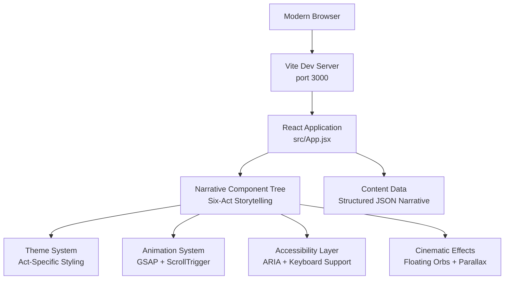

# Project Overview

<cite>
**Referenced Files in This Document**
- [package.json](file://package.json)
- [vite.config.js](file://vite.config.js)
- [src/App.jsx](file://src/App.jsx)
- [src/main.jsx](file://src/main.jsx)
- [src/styles/_global.css](file://src/styles/_global.css)
- [src/styles/_typography.css](file://src/styles/_typography.css)
- [src/styles/_variables.css](file://src/styles/_variables.css)
- [src/styles/_utilities.css](file://src/styles/_utilities.css)
- [src/components/layout/Nav.jsx](file://src/components/layout/Nav.jsx)
- [src/components/layout/Footer.jsx](file://src/components/layout/Footer.jsx)
- [src/data/content.js](file://src/data/content.js)
- [src/components/acts/ActSection.jsx](file://src/components/acts/ActSection.jsx)
- [src/components/acts/Heartbeat.jsx](file://src/components/acts/Heartbeat.jsx)
- [src/components/acts/RecognitionBadges.jsx](file://src/components/acts/RecognitionBadges.jsx)
- [src/components/acts/TimelineStrip.jsx](file://src/components/acts/TimelineStrip.jsx)
- [src/components/story/FrankieStory.jsx](file://src/components/story/FrankieStory.jsx)
- [src/components/entrepreneurship/Entrepreneurship.jsx](file://src/components/entrepreneurship/Entrepreneurship.jsx)
- [src/components/media/MediaHub.jsx](file://src/components/media/MediaHub.jsx)
- [src/components/creativity/Creativity.jsx](file://src/components/creativity/Creativity.jsx)
- [src/components/books/BooksPublications.jsx](file://src/components/books/BooksPublications.jsx)
- [src/components/community/CommunityImpact.jsx](file://src/components/community/CommunityImpact.jsx)
- [src/components/vision/FutureVision.jsx](file://src/components/vision/FutureVision.jsx)
- [src/components/closing/ClosingSection.jsx](file://src/components/closing/ClosingSection.jsx)
- [src/components/hero/HeroExperience.jsx](file://src/components/hero/HeroExperience.jsx)
- [src/components/impact/Impact.jsx](file://src/components/impact/Impact.jsx)
- [src/components/media/MediaSection.jsx](file://src/components/media/MediaSection.jsx)
- [src/hooks/useGsap.js](file://src/hooks/useGsap.js)
- [src/App.module.css](file://src/App.module.css)
- [src/components/acts/ActSection.module.css](file://src/components/acts/ActSection.module.css)
- [src/components/hero/HeroExperience.module.css](file://src/components/hero/HeroExperience.module.css)
</cite>

## Update Summary
**Changes Made**
- Complete transformation from static portfolio to immersive six-act cinematic storytelling experience
- Implementation of revolutionary narrative architecture with thematic storytelling progression
- Enhanced visual design system featuring act-specific watermarks, floating orbs, and cinematic animations
- Integration of advanced animation libraries (GSAP) with scroll-triggered effects and parallax
- Addition of sophisticated component architecture with reusable hook-based animation patterns
- Implementation of reduced motion support and accessibility-first design principles
- Development of comprehensive content management system with structured six-act narrative data

## Table of Contents
1. [Introduction](#introduction)
2. [Project Structure](#project-structure)
3. [Six-Act Cinematic Storytelling Architecture](#six-act-cinematic-storytelling-architecture)
4. [Core Components](#core-components)
5. [Architecture Overview](#architecture-overview)
6. [Design System & Visual Framework](#design-system--visual-framework)
7. [Enhanced Component Architecture](#enhanced-component-architecture)
8. [Cinematic Experience Design](#cinematic-experience-design)
9. [Responsive Design Patterns](#responsive-design-patterns)
10. [Accessibility & Performance](#accessibility--performance)
11. [Development Workflow](#development-workflow)
12. [Conclusion](#conclusion)

## Introduction
Frankie Picasso represents a revolutionary evolution from traditional portfolio websites to an immersive six-act cinematic storytelling experience. This sophisticated Node.js full-stack demonstration application showcases modern web development practices through a comprehensive narrative-driven architecture that transforms visitor engagement from passive browsing to active storytelling participation.

**Why this project exists:**
- To demonstrate a paradigm shift from static portfolio presentation to immersive narrative experience
- To showcase advanced storytelling architecture with thematic progression and visual continuity
- To illustrate sophisticated React patterns with centralized content management and dynamic component composition
- To highlight modern animation libraries (GSAP) integrated with scroll-triggered effects for enhanced user experience
- To serve as a template for narrative-driven web applications that prioritize user journey over traditional navigation

**Target audience:**
- Advanced developers learning immersive web storytelling techniques
- Frontend developers focusing on narrative architecture and progressive disclosure
- UX/UI designers interested in storytelling-first design approaches
- Content creators seeking innovative ways to present complex narratives online

**Key learning objectives:**
- Understanding narrative architecture with six-act structure and thematic progression
- Implementing sophisticated content management through structured data objects
- Building immersive experiences with scroll-triggered animations and parallax effects
- Creating responsive storytelling interfaces with mobile-first design principles
- Developing accessible narrative experiences with proper ARIA labeling and keyboard navigation

## Project Structure
The project implements a revolutionary narrative architecture that organizes content around a six-act storytelling framework, moving beyond traditional portfolio structures to create an immersive user journey:

- **Narrative Architecture:** Six distinct acts representing stages of life and development
- **Thematic Design System:** Act-specific color schemes, watermarks, and visual themes
- **Dynamic Content Management:** Structured content object driving all component rendering
- **Immersive Animations:** GSAP integration with scroll-triggered effects and parallax
- **Progressive Disclosure:** Content revealed through storytelling progression rather than traditional navigation
- **Accessibility-First Design:** Comprehensive ARIA support and reduced motion preferences

```mermaid
graph TB
Root["Project Root"]
Src["src/"]
Styles["styles/"]
Components["components/"]
Data["data/"]
Hooks["hooks/"]
Main["main.jsx"]
App["App.jsx"]
Vite["vite.config.js"]
Package["package.json"]
Root --> Src
Root --> Vite
Root --> Package
Src --> Main
Src --> App
Src --> Styles
Src --> Components
Src --> Data
Src --> Hooks
Styles --> Global["_global.css"]
Styles --> Typography["_typography.css"]
Styles --> Variables["_variables.css"]
Styles --> Utilities["_utilities.css"]
Components --> Layout["layout/"]
Components --> Common["common/"]
Components --> Acts["acts/"]
Components --> Hero["hero/"]
Components --> Story["story/"]
Components --> Entrepreneurship["entrepreneurship/"]
Components --> Media["media/"]
Components --> Creativity["creativity/"]
Components --> Books["books/"]
Components --> Community["community/"]
Components --> Vision["vision/"]
Components --> Impact["impact/"]
Components --> Closing["closing/"]
Data --> Content["content.js"]
Hooks --> GSAP["useGsap.js"]
Hooks --> ActiveSection["useActiveSection.js"]
Hooks --> Parallax["useParallax.js"]
Hooks --> ScrollReveal["useScrollReveal.js"]
```

**Diagram sources**
- [src/main.jsx:1-11](file://src/main.jsx#L1-L11)
- [src/App.jsx:1-109](file://src/App.jsx#L1-L109)
- [src/styles/_global.css:1-251](file://src/styles/_global.css#L1-L251)
- [src/styles/_variables.css:1-67](file://src/styles/_variables.css#L1-L67)
- [src/data/content.js:1-357](file://src/data/content.js#L1-L357)

**Section sources**
- [src/main.jsx:1-11](file://src/main.jsx#L1-L11)
- [src/App.jsx:1-109](file://src/App.jsx#L1-L109)
- [src/styles/_global.css:1-251](file://src/styles/_global.css#L1-L251)
- [src/styles/_variables.css:1-67](file://src/styles/_variables.css#L1-L67)
- [src/data/content.js:1-357](file://src/data/content.js#L1-L357)

## Six-Act Cinematic Storytelling Architecture
The application implements a revolutionary six-act narrative structure that transforms the traditional portfolio approach into an immersive storytelling experience. Each act represents a distinct phase of development and identity formation, enhanced with cinematic visual elements:

**Act I - Becoming:** Foundation and origins, establishing core values and early influences with dramatic watermarks and floating orbs
**Act II - Building:** Development and achievement, showcasing entrepreneurial ventures and leadership roles with thematic color transitions
**Act III - Amplifying:** Influence and platform creation, highlighting media presence and amplification of others with dynamic visual storytelling
**Act IV - Creating:** Artistic expression and creative endeavors, demonstrating multiple forms of artistic contribution with immersive galleries
**Act V - Giving:** Community impact and legacy building, focusing on service and mentorship with interactive impact displays
**Act VI - Still Becoming:** Ongoing evolution and future vision, emphasizing continuous growth and adaptation with forward-looking animations

**Narrative Design Principles:**
- Thematic consistency across all components within each act
- Visual watermarking with act numbers for clear progression
- Color-coded theming that reinforces narrative identity
- Progressive disclosure of content through storytelling beats
- Integration of heartbeat messages that echo throughout the narrative
- Cinematic floating elements and orbital animations that enhance immersion

**Section sources**
- [src/App.jsx:64-92](file://src/App.jsx#L64-L92)
- [src/data/content.js:50-196](file://src/data/content.js#L50-L196)
- [src/components/acts/ActSection.jsx:19-27](file://src/components/acts/ActSection.jsx#L19-L27)

## Core Components
The application consists of sophisticated components that work together to create an immersive storytelling experience, each designed to reinforce the narrative architecture with cinematic enhancements:

**ActSection Component:** Provides the foundational structure for each narrative act with thematic styling, watermarks, floating orbs, and content containers
**Heartbeat Component:** Delivers thematic messages that echo throughout the narrative experience with decorative line elements
**RecognitionBadges Component:** Presents awards and achievements in a visually engaging badge format with grid-based layouts
**TimelineStrip Component:** Creates chronological visualizations of major life events and milestones with scroll-triggered reveal effects
**FrankieStory Component:** Narrates the foundational story and philosophical underpinnings of the narrative with immersive presentation
**Entrepreneurship Component:** Showcases business ventures and leadership achievements with detailed card layouts
**MediaSection Component:** Presents media appearances and broadcasting presence with scroll-triggered animations
**Creativity Component:** Demonstrates artistic and creative accomplishments with interactive card-based displays
**BooksPublications Component:** Features published works and literary contributions with elegant typography and layouts
**CommunityImpact Component:** Highlights service and community building efforts with impact-focused presentations
**FutureVision Component:** Presents ongoing projects and future aspirations with forward-looking visual elements
**ClosingSection Component:** Provides reflective conclusion and call-to-action with cinematic transitions
**HeroExperience Component:** Opens the narrative with immersive hero section featuring floating orbs and scroll-triggered animations
**Impact Component:** Displays cumulative achievements and values with animated statistics and pillar icons

**Educational focus:**
- Demonstrates narrative architecture with thematic consistency and visual progression
- Shows advanced content management through structured data objects
- Illustrates immersive design patterns with storytelling-first approach
- Highlights sophisticated animation techniques with scroll-triggered effects
- Emphasizes accessibility implementation with proper ARIA attributes

**Section sources**
- [src/components/acts/ActSection.jsx:1-42](file://src/components/acts/ActSection.jsx#L1-L42)
- [src/components/acts/Heartbeat.jsx:1-29](file://src/components/acts/Heartbeat.jsx#L1-L29)
- [src/components/acts/RecognitionBadges.jsx:1-34](file://src/components/acts/RecognitionBadges.jsx#L1-L34)
- [src/components/acts/TimelineStrip.jsx:1-30](file://src/components/acts/TimelineStrip.jsx#L1-L30)
- [src/components/story/FrankieStory.jsx:1-39](file://src/components/story/FrankieStory.jsx#L1-L39)
- [src/components/hero/HeroExperience.jsx:1-183](file://src/components/hero/HeroExperience.jsx#L1-L183)
- [src/components/impact/Impact.jsx:1-93](file://src/components/impact/Impact.jsx#L1-L93)

## Architecture Overview
The architecture emphasizes narrative coherence, thematic consistency, and immersive user experience. The application uses a component-based architecture that supports the six-act storytelling framework with clear separation of concerns and advanced animation capabilities.

**Diagram sources**
- [src/App.jsx:27-106](file://src/App.jsx#L27-L106)
- [src/data/content.js:1-357](file://src/data/content.js#L1-L357)
- [src/components/acts/ActSection.jsx:10-18](file://src/components/acts/ActSection.jsx#L10-L18)
- [src/hooks/useGsap.js:1-14](file://src/hooks/useGsap.js#L1-L14)

**Section sources**
- [src/App.jsx:27-106](file://src/App.jsx#L27-L106)
- [src/data/content.js:1-357](file://src/data/content.js#L1-L357)
- [src/components/acts/ActSection.jsx:10-18](file://src/components/acts/ActSection.jsx#L10-L18)
- [src/hooks/useGsap.js:1-14](file://src/hooks/useGsap.js#L1-L14)

## Design System & Visual Framework
The application implements a comprehensive design system that supports the six-act narrative framework with sophisticated theming and visual continuity:

**Thematic Color System:** Six distinct color palettes representing each act (Becoming, Building, Amplifying, Creating, Giving, Still Becoming) with corresponding CSS custom properties
**Watermark Integration:** Subtle act numbering watermarks that appear throughout the narrative experience with floating orb animations
**Typography Hierarchy:** Clear typographic hierarchy with act-specific emphasis and visual weight, enhanced with serif fonts for narrative sections
**Visual Continuity:** Consistent design language that reinforces narrative progression and thematic connections
**Responsive Theming:** Adaptive theming that maintains narrative coherence across all device sizes
**Cinematic Elements:** Floating orbs, gradient overlays, and orbital animations that enhance the storytelling atmosphere

**Advanced Features:**
- CSS custom properties for dynamic theme switching
- Utility classes optimized for narrative content presentation
- Reduced motion support for accessibility compliance
- Performance-optimized animations with scroll-triggered effects
- Premium hover effects and shadow systems for depth perception

**Section sources**
- [src/styles/_variables.css:1-67](file://src/styles/_variables.css#L1-L67)
- [src/styles/_typography.css:1-41](file://src/styles/_typography.css#L1-L41)
- [src/styles/_utilities.css:1-55](file://src/styles/_utilities.css#L1-L55)
- [src/styles/_global.css:38-113](file://src/styles/_global.css#L38-L113)
- [src/components/acts/ActSection.jsx:25-27](file://src/components/acts/ActSection.jsx#L25-L27)
- [src/components/acts/ActSection.module.css:33-47](file://src/components/acts/ActSection.module.css#L33-L47)

## Enhanced Component Architecture
Each component follows modern React best practices while supporting the narrative architecture, implementing sophisticated patterns for storytelling-first design:

**Narrative Composition:** Components designed to work together as part of the six-act story progression with seamless transitions
**Dynamic Theming:** Components that adapt styling based on their position within the narrative structure with CSS custom properties
**Content-Driven Rendering:** Components that render based on structured content objects rather than hardcoded data with centralized content management
**Animation Integration:** Seamless integration of GSAP animations with React lifecycle methods and scroll-triggered effects
**Accessibility Implementation:** Comprehensive ARIA attributes and semantic markup for screen reader compatibility with keyboard navigation support

**Notable Components:**
- **ActSection:** Foundation component providing narrative structure and thematic styling with floating orbital elements
- **Heartbeat:** Thematic messaging component that reinforces narrative themes with decorative line elements
- **RecognitionBadges:** Achievement presentation component with grid-based layout and responsive design
- **TimelineStrip:** Chronological visualization component with interactive elements and scroll-triggered reveals
- **HeroExperience:** Opening cinematic component with floating orbs, parallax effects, and scroll-triggered animations
- **Impact:** Statistics display component with animated counters and scroll-triggered reveal effects
- **MediaSection:** Content presentation component with staggered animations and responsive layouts

**Section sources**
- [src/components/acts/ActSection.jsx:1-42](file://src/components/acts/ActSection.jsx#L1-L42)
- [src/components/acts/Heartbeat.jsx:1-29](file://src/components/acts/Heartbeat.jsx#L1-L29)
- [src/components/acts/RecognitionBadges.jsx:1-34](file://src/components/acts/RecognitionBadges.jsx#L1-L34)
- [src/components/acts/TimelineStrip.jsx:1-30](file://src/components/acts/TimelineStrip.jsx#L1-L30)
- [src/components/hero/HeroExperience.jsx:1-183](file://src/components/hero/HeroExperience.jsx#L1-L183)
- [src/components/impact/Impact.jsx:1-93](file://src/components/impact/Impact.jsx#L1-L93)
- [src/components/media/MediaSection.jsx:1-71](file://src/components/media/MediaSection.jsx#L1-L71)

## Cinematic Experience Design
The application creates an immersive storytelling experience through carefully crafted narrative architecture and user interaction patterns:

**Progressive Disclosure:** Content revealed through natural storytelling progression rather than traditional navigation with scroll-triggered animations
**Thematic Continuity:** Visual and conceptual connections maintained across narrative boundaries with consistent design language
**Interactive Elements:** Engaging components that encourage active participation in the storytelling process with hover effects and micro-interactions
**Emotional Resonance:** Carefully curated content and presentation that evokes appropriate emotional responses with cinematic timing
**Call-to-Action Integration:** Strategic placement of engagement opportunities that align with narrative flow with animated transitions

**Narrative Flow Patterns:**
- Opening with heroic journey framing and six-act structure introduction featuring floating orbs and gradient backgrounds
- Progressive revelation of personal story and achievements with staggered animations and parallax effects
- Integration of thematic messages that reinforce narrative coherence with decorative line elements
- Climactic presentation of current projects and future vision with forward-looking visual elements
- Reflective closing that invites continued engagement with cinematic transitions and call-to-action buttons

**Cinematic Enhancements:**
- Floating orbital elements that create depth and visual interest throughout narrative sections
- Gradient overlays and background treatments that enhance mood and atmosphere
- Scroll-triggered animations that create smooth, natural storytelling progression
- Parallax effects that add dimension to the user experience
- Reduced motion support that respects user preferences while maintaining visual appeal

**Section sources**
- [src/App.jsx:60-101](file://src/App.jsx#L60-L101)
- [src/data/content.js:1-357](file://src/data/content.js#L1-L357)
- [src/components/closing/ClosingSection.jsx:15-21](file://src/components/closing/ClosingSection.jsx#L15-L21)
- [src/components/hero/HeroExperience.jsx:96-180](file://src/components/hero/HeroExperience.jsx#L96-L180)

## Responsive Design Patterns
The application implements sophisticated responsive design patterns optimized for the narrative experience:

**Mobile-First Storytelling:** Content structure designed to maintain narrative coherence on all device sizes with adaptive layouts
**Progressive Enhancement:** Additional narrative elements and animations that enhance experience on larger screens with graceful degradation
**Flexible Grid Systems:** CSS Grid and Flexbox implementations that support both narrative flow and content presentation with responsive breakpoints
**Touch-Friendly Storytelling:** Interactive elements sized appropriately for mobile engagement with narrative content and gesture-friendly controls
**Performance Optimization:** Critical rendering paths optimized for fast narrative content delivery with lazy loading and optimized assets

**Advanced Techniques:**
- CSS clamp functions for fluid typography that supports narrative readability across devices
- Container queries for component-based responsive storytelling with flexible sizing
- Dynamic theming that adapts to different screen sizes while maintaining narrative coherence
- Optimized animations that perform well across device spectrum with reduced motion support
- Mobile-first navigation with skip links and keyboard accessibility

**Section sources**
- [src/styles/_global.css:105-113](file://src/styles/_global.css#L105-L113)
- [src/styles/_variables.css:56-67](file://src/styles/_variables.css#L56-L67)
- [src/styles/_typography.css:17-24](file://src/styles/_typography.css#L17-L24)
- [src/components/creativity/Creativity.jsx:11-32](file://src/components/creativity/Creativity.jsx#L11-L32)
- [src/components/hero/HeroExperience.module.css:308-350](file://src/components/hero/HeroExperience.module.css#L308-L350)

## Accessibility & Performance
The application prioritizes accessibility and performance while maintaining the immersive narrative experience:

**Accessibility Features:**
- Comprehensive ARIA labeling for all interactive elements within narrative context with descriptive labels
- Keyboard navigation support for all storytelling interactions with focus management and skip links
- Screen reader optimization with proper semantic structure and narrative flow with landmark regions
- Reduced motion preferences respected throughout the animated narrative experience with media query detection
- Semantic HTML structure that preserves narrative meaning across assistive technologies with proper heading hierarchy

**Performance Optimizations:**
- Code splitting for efficient loading of narrative components with lazy loading strategies
- Lazy loading for images and animations that support the storytelling experience with intersection observers
- CSS optimization and minification for fast narrative content rendering with critical path optimization
- Bundle analysis and optimization for optimal narrative delivery performance with production builds
- Animation performance tuning with GSAP best practices and scroll-triggered effect optimization

**Section sources**
- [src/App.jsx:36-40](file://src/App.jsx#L36-L40)
- [src/components/acts/ActSection.jsx:15](file://src/components/acts/ActSection.jsx#L15)
- [src/styles/_global.css:105-113](file://src/styles/_global.css#L105-L113)
- [src/hooks/useGsap.js:18-20](file://src/hooks/useGsap.js#L18-L20)

## Development Workflow
The project uses modern development practices optimized for narrative content management and storytelling experience:

**Build Process:** Vite-powered development server with hot module replacement and optimized asset handling for rapid iteration
**Content Management:** Structured content objects that drive component rendering and narrative flow with centralized data management
**Environment Configuration:** Separate configurations for development and production with narrative optimization and performance monitoring
**Deployment Ready:** Optimized for various deployment targets with narrative content caching strategies and performance budgets

**Tooling Features:**
- Fast development server startup with narrative content preloading and optimized asset serving
- Hot reload for instant feedback on narrative changes with component-level updates
- Error reporting and debugging tools optimized for storytelling components with React DevTools integration
- Performance monitoring and optimization for narrative experience metrics with Lighthouse integration
- Animation debugging tools with GSAP inspector and scroll-triggered effect visualization

**Section sources**
- [vite.config.js:1-11](file://vite.config.js#L1-L11)
- [package.json:6-10](file://package.json#L6-L10)

## Conclusion
Frankie Picasso represents a groundbreaking evolution in web portfolio design, transforming the traditional static presentation into an immersive six-act cinematic storytelling experience. This sophisticated application demonstrates how modern web technologies can be combined to create meaningful, emotionally resonant user experiences that go far beyond conventional portfolio approaches.

**Key Innovations:**
- Revolutionary six-act narrative architecture that structures content around life story progression with cinematic enhancements
- Thematic design system with act-specific styling that reinforces storytelling coherence with floating orbital elements
- Immersive animation integration with scroll-triggered effects that enhance narrative flow with GSAP library
- Advanced accessibility implementation that preserves narrative meaning for all users with reduced motion support
- Sophisticated content management system that supports complex narrative structures with structured data objects

**Educational Value:**
This project provides a comprehensive template for developers seeking to understand narrative-first web development, demonstrating how React, modern CSS methodologies, and advanced animation libraries can be combined to create truly immersive digital experiences. The six-act storytelling framework offers insights into structuring complex content narratives while maintaining user engagement and accessibility standards.

The enhanced visual design system with floating orbs, gradient backgrounds, and cinematic transitions, improved user experience through thematic storytelling and sophisticated animation integration, and comprehensive accessibility implementation make this an exemplary reference for production-ready web applications that prioritize user journey and narrative coherence over traditional interface patterns.

**Transformative Impact:**
This redesign represents a complete paradigm shift from static portfolio presentation to dynamic, interactive storytelling that engages users as active participants in the narrative journey, setting a new standard for immersive web experiences in the creative and professional development space.