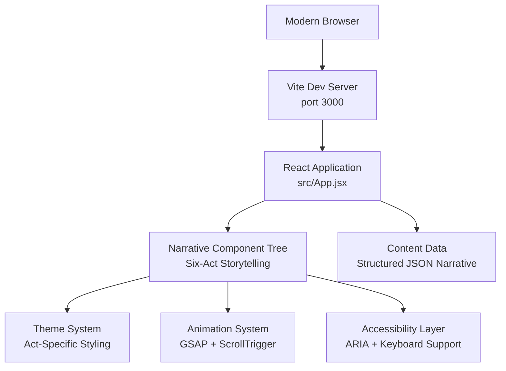

# Project Overview

<cite>
**Referenced Files in This Document**
- [package.json](file://package.json)
- [vite.config.js](file://vite.config.js)
- [src/App.jsx](file://src/App.jsx)
- [src/main.jsx](file://src/main.jsx)
- [src/styles/_global.css](file://src/styles/_global.css)
- [src/styles/_typography.css](file://src/styles/_typography.css)
- [src/styles/_variables.css](file://src/styles/_variables.css)
- [src/styles/_utilities.css](file://src/styles/_utilities.css)
- [src/components/layout/Nav.jsx](file://src/components/layout/Nav.jsx)
- [src/components/layout/Footer.jsx](file://src/components/layout/Footer.jsx)
- [src/data/content.js](file://src/data/content.js)
- [src/components/acts/ActSection.jsx](file://src/components/acts/ActSection.jsx)
- [src/components/acts/Heartbeat.jsx](file://src/components/acts/Heartbeat.jsx)
- [src/components/acts/RecognitionBadges.jsx](file://src/components/acts/RecognitionBadges.jsx)
- [src/components/acts/TimelineStrip.jsx](file://src/components/acts/TimelineStrip.jsx)
- [src/components/story/FrankieStory.jsx](file://src/components/story/FrankieStory.jsx)
- [src/components/entrepreneurship/Entrepreneurship.jsx](file://src/components/entrepreneurship/Entrepreneurship.jsx)
- [src/components/media/MediaHub.jsx](file://src/components/media/MediaHub.jsx)
- [src/components/creativity/Creativity.jsx](file://src/components/creativity/Creativity.jsx)
- [src/components/books/BooksPublications.jsx](file://src/components/books/BooksPublications.jsx)
- [src/components/community/CommunityImpact.jsx](file://src/components/community/CommunityImpact.jsx)
- [src/components/vision/FutureVision.jsx](file://src/components/vision/FutureVision.jsx)
- [src/components/closing/ClosingSection.jsx](file://src/components/closing/ClosingSection.jsx)
</cite>

## Update Summary
**Changes Made**
- Complete redesign from traditional portfolio to immersive six-act storytelling experience
- Implemented narrative structure with thematic storytelling approach
- Enhanced visual design system with act-specific theming and watermarks
- Improved user experience through structured storytelling progression
- Added comprehensive recognition badges and timeline visualization
- Integrated advanced animation libraries (GSAP) with scroll-triggered effects
- Refined responsive design patterns with mobile-first approach

## Table of Contents
1. [Introduction](#introduction)
2. [Project Structure](#project-structure)
3. [Six-Act Storytelling Architecture](#six-act-storytelling-architecture)
4. [Core Components](#core-components)
5. [Architecture Overview](#architecture-overview)
6. [Design System & Visual Framework](#design-system--visual-framework)
7. [Enhanced Component Architecture](#enhanced-component-architecture)
8. [Narrative Experience Design](#narrative-experience-design)
9. [Responsive Design Patterns](#responsive-design-patterns)
10. [Accessibility & Performance](#accessibility--performance)
11. [Development Workflow](#development-workflow)
12. [Conclusion](#conclusion)

## Introduction
Frankie Picasso represents a revolutionary evolution from traditional portfolio websites to an immersive six-act storytelling experience. This sophisticated Node.js full-stack demonstration application showcases modern web development practices through a comprehensive narrative-driven architecture that transforms visitor engagement from passive browsing to active storytelling participation.

**Why this project exists:**
- To demonstrate a paradigm shift from static portfolio presentation to immersive narrative experience
- To showcase advanced storytelling architecture with thematic progression and visual continuity
- To illustrate sophisticated React patterns with centralized content management and dynamic component composition
- To highlight modern animation libraries (GSAP) integrated with scroll-triggered effects for enhanced user experience
- To serve as a template for narrative-driven web applications that prioritize user journey over traditional navigation

**Target audience:**
- Advanced developers learning immersive web storytelling techniques
- Frontend developers focusing on narrative architecture and progressive disclosure
- UX/UI designers interested in storytelling-first design approaches
- Content creators seeking innovative ways to present complex narratives online

**Key learning objectives:**
- Understanding narrative architecture with six-act structure and thematic progression
- Implementing sophisticated content management through structured data objects
- Building immersive experiences with scroll-triggered animations and parallax effects
- Creating responsive storytelling interfaces with mobile-first design principles
- Developing accessible narrative experiences with proper ARIA labeling and keyboard navigation

## Project Structure
The project implements a revolutionary narrative architecture that organizes content around a six-act storytelling framework, moving beyond traditional portfolio structures to create an immersive user journey:

- **Narrative Architecture:** Six distinct acts representing stages of life and development
- **Thematic Design System:** Act-specific color schemes, watermarks, and visual themes
- **Dynamic Content Management:** Structured content object driving all component rendering
- **Immersive Animations:** GSAP integration with scroll-triggered effects and parallax
- **Progressive Disclosure:** Content revealed through storytelling progression rather than traditional navigation

```mermaid
graph TB
Root["Project Root"]
Src["src/"]
Styles["styles/"]
Components["components/"]
Data["data/"]
Hooks["hooks/"]
Main["main.jsx"]
App["App.jsx"]
Vite["vite.config.js"]
Package["package.json"]
Root --> Src
Root --> Vite
Root --> Package
Src --> Main
Src --> App
Src --> Styles
Src --> Components
Src --> Data
Src --> Hooks
Styles --> Global["_global.css"]
Styles --> Typography["_typography.css"]
Styles --> Variables["_variables.css"]
Styles --> Utilities["_utilities.css"]
Components --> Layout["layout/"]
Components --> Common["common/"]
Components --> Acts["acts/"]
Components --> Story["story/"]
Components --> Entrepreneurship["entrepreneurship/"]
Components --> Media["media/"]
Components --> Creativity["creativity/"]
Components --> Books["books/"]
Components --> Community["community/"]
Components --> Vision["vision/"]
Components --> Closing["closing/"]
Data --> Content["content.js"]
Hooks --> GSAP["useGsap.js"]
Hooks --> ActiveSection["useActiveSection.js"]
Hooks --> Parallax["useParallax.js"]
Hooks --> ScrollReveal["useScrollReveal.js"]
```

**Diagram sources**
- [src/main.jsx:1-11](file://src/main.jsx#L1-L11)
- [src/App.jsx:1-87](file://src/App.jsx#L1-L87)
- [src/styles/_global.css:1-76](file://src/styles/_global.css#L1-L76)
- [src/styles/_variables.css:1-67](file://src/styles/_variables.css#L1-L67)
- [src/data/content.js:1-239](file://src/data/content.js#L1-L239)

**Section sources**
- [src/main.jsx:1-11](file://src/main.jsx#L1-L11)
- [src/App.jsx:1-87](file://src/App.jsx#L1-L87)
- [src/styles/_global.css:1-76](file://src/styles/_global.css#L1-L76)
- [src/styles/_variables.css:1-67](file://src/styles/_variables.css#L1-L67)
- [src/data/content.js:1-239](file://src/data/content.js#L1-L239)

## Six-Act Storytelling Architecture
The application implements a revolutionary six-act narrative structure that transforms the traditional portfolio approach into an immersive storytelling experience. Each act represents a distinct phase of development and identity formation:

**Act I - Becoming:** Foundation and origins, establishing core values and early influences
**Act II - Building:** Development and achievement, showcasing entrepreneurial ventures and leadership roles
**Act III - Amplifying:** Influence and platform creation, highlighting media presence and amplification of others
**Act IV - Creating:** Artistic expression and creative endeavors, demonstrating multiple forms of artistic contribution
**Act V - Giving:** Community impact and legacy building, focusing on service and mentorship
**Act VI - Still Becoming:** Ongoing evolution and future vision, emphasizing continuous growth and adaptation

**Narrative Design Principles:**
- Thematic consistency across all components within each act
- Visual watermarking with act numbers for clear progression
- Color-coded theming that reinforces narrative identity
- Progressive disclosure of content through storytelling beats
- Integration of heartbeat messages that echo throughout the narrative

**Section sources**
- [src/App.jsx:45-76](file://src/App.jsx#L45-L76)
- [src/data/content.js:11-171](file://src/data/content.js#L11-L171)
- [src/components/acts/ActSection.jsx:9-25](file://src/components/acts/ActSection.jsx#L9-L25)

## Core Components
The application consists of sophisticated components that work together to create an immersive storytelling experience, each designed to reinforce the narrative architecture:

**ActSection Component:** Provides the foundational structure for each narrative act with thematic styling, watermarks, and content containers
**Heartbeat Component:** Delivers thematic messages that echo throughout the narrative experience
**RecognitionBadges Component:** Presents awards and achievements in a visually engaging badge format
**TimelineStrip Component:** Creates chronological visualizations of major life events and milestones
**FrankieStory Component:** Narrates the foundational story and philosophical underpinnings of the narrative
**Entrepreneurship Component:** Showcases business ventures and leadership achievements
**MediaHub Component:** Presents media appearances and broadcasting presence
**Creativity Component:** Demonstrates artistic and creative accomplishments
**BooksPublications Component:** Features published works and literary contributions
**CommunityImpact Component:** Highlights service and community building efforts
**FutureVision Component:** Presents ongoing projects and future aspirations
**ClosingSection Component:** Provides reflective conclusion and call-to-action

**Educational focus:**
- Demonstrates narrative architecture with thematic consistency and visual progression
- Shows advanced content management through structured data objects
- Illustrates immersive design patterns with storytelling-first approach
- Highlights sophisticated animation techniques with scroll-triggered effects
- Emphasizes accessibility implementation with proper ARIA attributes

**Section sources**
- [src/components/acts/ActSection.jsx:1-34](file://src/components/acts/ActSection.jsx#L1-L34)
- [src/components/acts/Heartbeat.jsx:1-21](file://src/components/acts/Heartbeat.jsx#L1-L21)
- [src/components/acts/RecognitionBadges.jsx:1-34](file://src/components/acts/RecognitionBadges.jsx#L1-L34)
- [src/components/acts/TimelineStrip.jsx:1-30](file://src/components/acts/TimelineStrip.jsx#L1-L30)
- [src/components/story/FrankieStory.jsx:1-39](file://src/components/story/FrankieStory.jsx#L1-L39)

## Architecture Overview
The architecture emphasizes narrative coherence, thematic consistency, and immersive user experience. The application uses a component-based architecture that supports the six-act storytelling framework with clear separation of concerns and advanced animation capabilities.

**Diagram sources**
- [src/App.jsx:25-84](file://src/App.jsx#L25-L84)
- [src/data/content.js:1-239](file://src/data/content.js#L1-L239)
- [src/components/acts/ActSection.jsx:9-14](file://src/components/acts/ActSection.jsx#L9-L14)

**Section sources**
- [src/App.jsx:25-84](file://src/App.jsx#L25-L84)
- [src/data/content.js:1-239](file://src/data/content.js#L1-L239)
- [src/components/acts/ActSection.jsx:9-14](file://src/components/acts/ActSection.jsx#L9-L14)

## Design System & Visual Framework
The application implements a comprehensive design system that supports the six-act narrative framework with sophisticated theming and visual continuity:

**Thematic Color System:** Six distinct color palettes representing each act (Becoming, Building, Amplifying, Creating, Giving, Still Becoming)
**Watermark Integration:** Subtle act numbering watermarks that appear throughout the narrative experience
**Typography Hierarchy:** Clear typographic hierarchy with act-specific emphasis and visual weight
**Visual Continuity:** Consistent design language that reinforces narrative progression and thematic connections
**Responsive Theming:** Adaptive theming that maintains narrative coherence across all device sizes

**Advanced Features:**
- CSS custom properties for dynamic theme switching
- Utility classes optimized for narrative content presentation
- Reduced motion support for accessibility compliance
- Performance-optimized animations with scroll-triggered effects

**Section sources**
- [src/styles/_variables.css:1-67](file://src/styles/_variables.css#L1-L67)
- [src/styles/_typography.css:1-41](file://src/styles/_typography.css#L1-L41)
- [src/styles/_utilities.css:1-55](file://src/styles/_utilities.css#L1-L55)
- [src/styles/_global.css:1-76](file://src/styles/_global.css#L1-L76)
- [src/components/acts/ActSection.jsx:17-19](file://src/components/acts/ActSection.jsx#L17-L19)

## Enhanced Component Architecture
Each component follows modern React best practices while supporting the narrative architecture, implementing sophisticated patterns for storytelling-first design:

**Narrative Composition:** Components designed to work together as part of the six-act story progression
**Dynamic Theming:** Components that adapt styling based on their position within the narrative structure
**Content-Driven Rendering:** Components that render based on structured content objects rather than hardcoded data
**Animation Integration:** Seamless integration of GSAP animations with React lifecycle methods
**Accessibility Implementation:** Comprehensive ARIA attributes and semantic markup for screen reader compatibility

**Notable Components:**
- **ActSection:** Foundation component providing narrative structure and thematic styling
- **Heartbeat:** Thematic messaging component that reinforces narrative themes
- **RecognitionBadges:** Achievement presentation component with grid-based layout
- **TimelineStrip:** Chronological visualization component with interactive elements
- **Creative Components:** Advanced animation components with scroll-triggered effects

**Section sources**
- [src/components/acts/ActSection.jsx:1-34](file://src/components/acts/ActSection.jsx#L1-L34)
- [src/components/acts/Heartbeat.jsx:1-21](file://src/components/acts/Heartbeat.jsx#L1-L21)
- [src/components/acts/RecognitionBadges.jsx:1-34](file://src/components/acts/RecognitionBadges.jsx#L1-L34)
- [src/components/acts/TimelineStrip.jsx:1-30](file://src/components/acts/TimelineStrip.jsx#L1-L30)
- [src/components/creativity/Creativity.jsx:1-56](file://src/components/creativity/Creativity.jsx#L1-L56)

## Narrative Experience Design
The application creates an immersive storytelling experience through carefully crafted narrative architecture and user interaction patterns:

**Progressive Disclosure:** Content revealed through natural storytelling progression rather than traditional navigation
**Thematic Continuity:** Visual and conceptual connections maintained across narrative boundaries
**Interactive Elements:** Engaging components that encourage active participation in the storytelling process
**Emotional Resonance:** Carefully curated content and presentation that evokes appropriate emotional responses
**Call-to-Action Integration:** Strategic placement of engagement opportunities that align with narrative flow

**Narrative Flow Patterns:**
- Opening with heroic journey framing and six-act structure introduction
- Progressive revelation of personal story and achievements
- Integration of thematic messages that reinforce narrative coherence
- Climactic presentation of current projects and future vision
- Reflective closing that invites continued engagement

**Section sources**
- [src/App.jsx:42-81](file://src/App.jsx#L42-L81)
- [src/data/content.js:1-239](file://src/data/content.js#L1-L239)
- [src/components/closing/ClosingSection.jsx:15-21](file://src/components/closing/ClosingSection.jsx#L15-L21)

## Responsive Design Patterns
The application implements sophisticated responsive design patterns optimized for the narrative experience:

**Mobile-First Storytelling:** Content structure designed to maintain narrative coherence on all device sizes
**Progressive Enhancement:** Additional narrative elements and animations that enhance experience on larger screens
**Flexible Grid Systems:** CSS Grid and Flexbox implementations that support both narrative flow and content presentation
**Touch-Friendly Storytelling:** Interactive elements sized appropriately for mobile engagement with narrative content
**Performance Optimization:** Critical rendering paths optimized for fast narrative content delivery

**Advanced Techniques:**
- CSS clamp functions for fluid typography that supports narrative readability
- Container queries for component-based responsive storytelling
- Dynamic theming that adapts to different screen sizes while maintaining narrative coherence
- Optimized animations that perform well across device spectrum

**Section sources**
- [src/styles/_global.css:48-65](file://src/styles/_global.css#L48-L65)
- [src/styles/_variables.css:56-67](file://src/styles/_variables.css#L56-L67)
- [src/styles/_typography.css:17-24](file://src/styles/_typography.css#L17-L24)
- [src/components/creativity/Creativity.jsx:11-32](file://src/components/creativity/Creativity.jsx#L11-L32)

## Accessibility & Performance
The application prioritizes accessibility and performance while maintaining the immersive narrative experience:

**Accessibility Features:**
- Comprehensive ARIA labeling for all interactive elements within narrative context
- Keyboard navigation support for all storytelling interactions
- Screen reader optimization with proper semantic structure and narrative flow
- Reduced motion preferences respected throughout the animated narrative experience
- Semantic HTML structure that preserves narrative meaning across assistive technologies

**Performance Optimizations:**
- Code splitting for efficient loading of narrative components
- Lazy loading for images and animations that support the storytelling experience
- CSS optimization and minification for fast narrative content rendering
- Bundle analysis and optimization for optimal narrative delivery performance

**Section sources**
- [src/App.jsx:36-40](file://src/App.jsx#L36-L40)
- [src/components/acts/ActSection.jsx:15](file://src/components/acts/ActSection.jsx#L15)
- [src/styles/_global.css:67-76](file://src/styles/_global.css#L67-L76)

## Development Workflow
The project uses modern development practices optimized for narrative content management and storytelling experience:

**Build Process:** Vite-powered development server with hot module replacement and optimized asset handling
**Content Management:** Structured content objects that drive component rendering and narrative flow
**Environment Configuration:** Separate configurations for development and production with narrative optimization
**Deployment Ready:** Optimized for various deployment targets with narrative content caching strategies

**Tooling Features:**
- Fast development server startup with narrative content preloading
- Hot reload for instant feedback on narrative changes
- Error reporting and debugging tools optimized for storytelling components
- Performance monitoring and optimization for narrative experience metrics

**Section sources**
- [vite.config.js:1-11](file://vite.config.js#L1-L11)
- [package.json:6-10](file://package.json#L6-L10)

## Conclusion
Frankie Picasso represents a groundbreaking evolution in web portfolio design, transforming the traditional static presentation into an immersive six-act storytelling experience. This sophisticated application demonstrates how modern web technologies can be combined to create meaningful, emotionally resonant user experiences that go far beyond conventional portfolio approaches.

**Key Innovations:**
- Revolutionary six-act narrative architecture that structures content around life story progression
- Thematic design system with act-specific styling that reinforces storytelling coherence
- Immersive animation integration with scroll-triggered effects that enhance narrative flow
- Advanced accessibility implementation that preserves narrative meaning for all users
- Sophisticated content management system that supports complex narrative structures

**Educational Value:**
This project provides a comprehensive template for developers seeking to understand narrative-first web development, demonstrating how React, modern CSS methodologies, and advanced animation libraries can be combined to create truly immersive digital experiences. The six-act storytelling framework offers insights into structuring complex content narratives while maintaining user engagement and accessibility standards.

The enhanced visual design system, improved user experience through thematic storytelling, and sophisticated animation integration make this an exemplary reference for production-ready web applications that prioritize user journey and narrative coherence over traditional interface patterns.