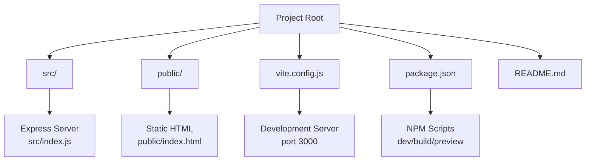
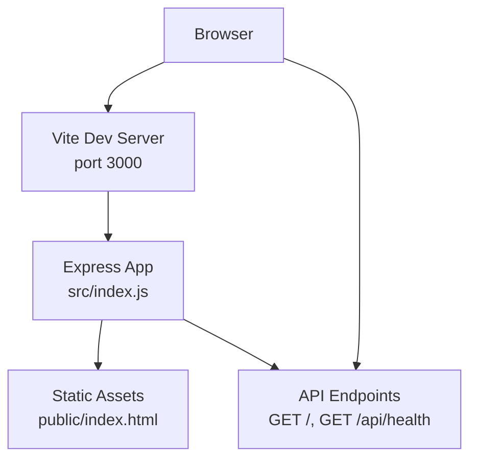
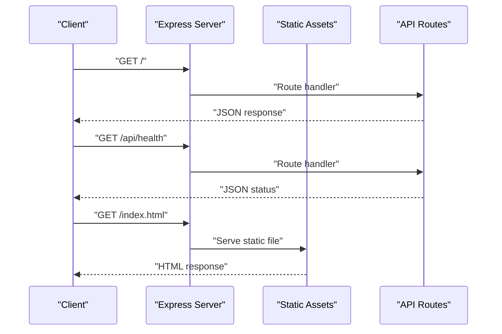
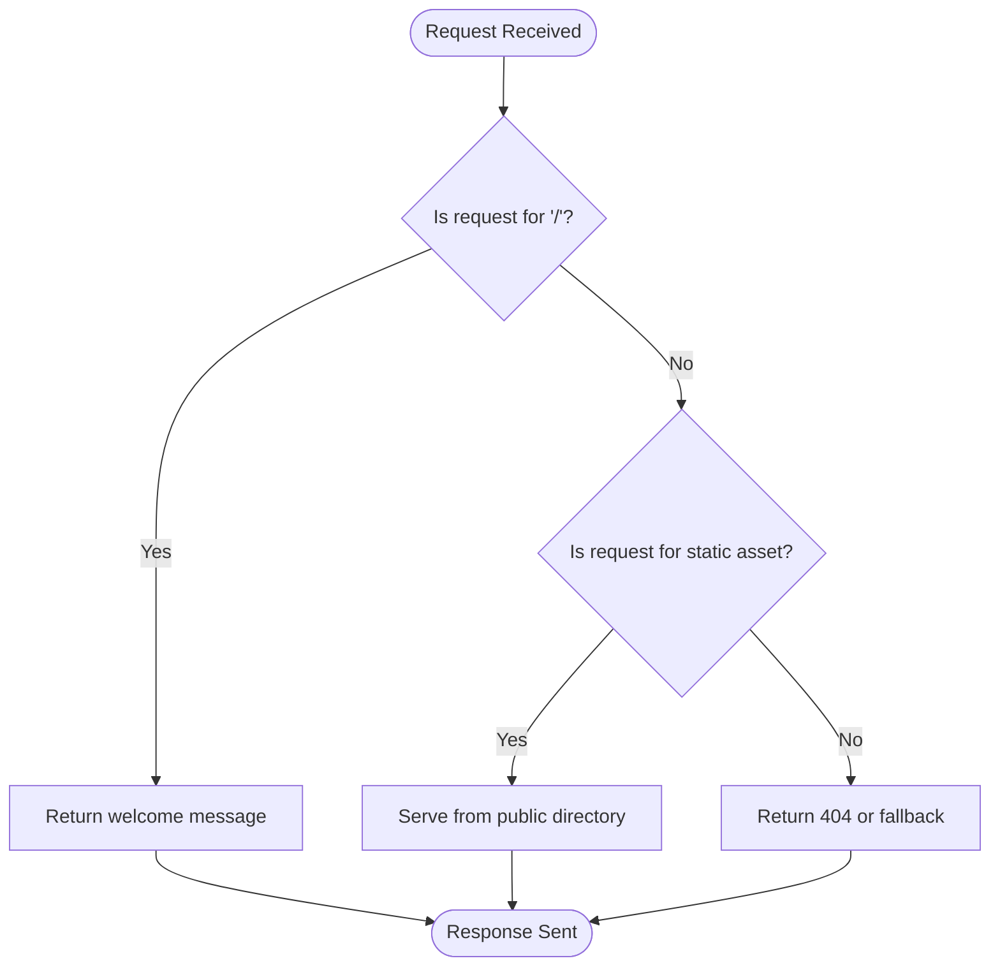
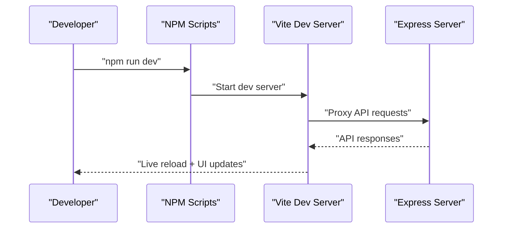
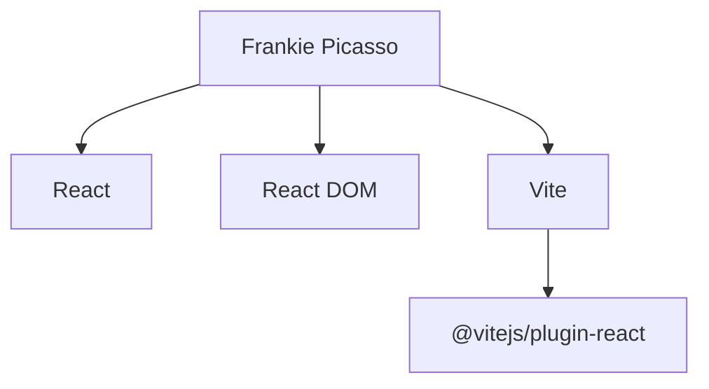

# Project Overview

<cite>
**Referenced Files in This Document**
- [README.md](file://README.md)
- [package.json](file://package.json)
- [vite.config.js](file://vite.config.js)
- [src/index.js](file://src/index.js)
- [public/index.html](file://public/index.html)
</cite>

## Table of Contents
1. [Introduction](#introduction)
2. [Project Structure](#project-structure)
3. [Core Components](#core-components)
4. [Architecture Overview](#architecture-overview)
5. [Detailed Component Analysis](#detailed-component-analysis)
6. [Dependency Analysis](#dependency-analysis)
7. [Performance Considerations](#performance-considerations)
8. [Troubleshooting Guide](#troubleshooting-guide)
9. [Conclusion](#conclusion)

## Introduction
Frankie Picasso is a Node.js full-stack demonstration application designed to showcase modern web development fundamentals through a practical, hands-on example. The project serves as an educational resource for beginners learning contemporary web technologies, combining a lightweight Express.js backend with a React frontend served through Vite’s development server. Its primary goal is to provide a clear, minimal foundation that demonstrates essential concepts such as server setup, static asset serving, basic routing, and client-server communication patterns.

Why this project exists:
- To demonstrate a streamlined full-stack architecture using widely adopted technologies
- To serve as a learning scaffold for newcomers to modern web development
- To illustrate how a simple Express server integrates with a React application during development
- To highlight best practices for local development workflows and project structure

Target audience:
- Beginners learning modern web development
- Students and educators seeking a practical example of Express and React integration
- Developers transitioning from traditional server-side rendering to modern client-side frameworks

Key learning objectives:
- Understanding Express middleware and static file serving
- Implementing basic GET routes and JSON responses
- Configuring a development server with Vite and React
- Building a minimal yet functional full-stack application
- Recognizing the separation of concerns between backend and frontend assets

## Project Structure
The project follows a straightforward, beginner-friendly structure that separates backend logic from frontend assets:

- Backend entry point: Express server configured in the root module
- Frontend assets: Static HTML and styles located under the public directory
- Build tooling: Vite handles development server and bundling for the React application
- Package scripts: npm scripts orchestrate development, building, and previewing

**Diagram sources**
- [src/index.js:1-31](file://src/index.js#L1-L31)
- [public/index.html:1-21](file://public/index.html#L1-L21)
- [vite.config.js:1-11](file://vite.config.js#L1-L11)
- [package.json:1-20](file://package.json#L1-L20)

**Section sources**
- [README.md:1-13](file://README.md#L1-L13)
- [package.json:1-20](file://package.json#L1-L20)
- [vite.config.js:1-11](file://vite.config.js#L1-L11)
- [src/index.js:1-31](file://src/index.js#L1-L31)
- [public/index.html:1-21](file://public/index.html#L1-L21)

## Core Components
This project centers around two core components that demonstrate complementary aspects of modern web development:

- Express.js backend: Provides a lightweight server with JSON middleware, static asset serving, and basic health endpoints
- React frontend: Served statically via the Express server during development, showcasing a minimal client-side interface

Educational focus:
- Demonstrates how a Node.js server can serve both API endpoints and static frontend assets
- Highlights the role of Vite in development mode for rapid iteration
- Offers a template for extending with additional routes, middleware, and frontend components

**Section sources**
- [src/index.js:1-31](file://src/index.js#L1-L31)
- [public/index.html:1-21](file://public/index.html#L1-L21)
- [vite.config.js:1-11](file://vite.config.js#L1-L11)

## Architecture Overview
The architecture is intentionally minimal to emphasize clarity and teachability. The Express server acts as both an API gateway and a static file server, while Vite manages the React development environment. During development, Vite runs on port 3000 and serves the React application, while the Express server listens on the same port to handle API requests and static assets.

**Diagram sources**
- [src/index.js:17-28](file://src/index.js#L17-L28)
- [public/index.html:1-21](file://public/index.html#L1-L21)
- [vite.config.js:6-9](file://vite.config.js#L6-L9)

**Section sources**
- [src/index.js:17-28](file://src/index.js#L17-L28)
- [public/index.html:1-21](file://public/index.html#L1-L21)
- [vite.config.js:6-9](file://vite.config.js#L6-L9)

## Detailed Component Analysis

### Express Server
The Express server provides:
- JSON and URL-encoded body parsing middleware
- Static asset serving from the public directory
- Two primary routes:
  - Root route returning a welcome message
  - Health endpoint returning service status and timestamp
- Port configuration supporting environment variables

**Diagram sources**
- [src/index.js:17-28](file://src/index.js#L17-L28)

**Section sources**
- [src/index.js:1-31](file://src/index.js#L1-L31)

### Frontend Asset Serving
The public directory hosts a minimal HTML page that displays a simple message. During development, the Express server serves this static file alongside API responses, enabling a unified development experience on port 3000.

**Diagram sources**
- [src/index.js:17-18](file://src/index.js#L17-L18)
- [src/index.js:14](file://src/index.js#L14)

**Section sources**
- [public/index.html:1-21](file://public/index.html#L1-L21)
- [src/index.js:14](file://src/index.js#L14)

### Development Workflow
The project uses Vite for development, which:
- Runs a fast development server on port 3000
- Enables hot module replacement and JSX support via the React plugin
- Integrates seamlessly with the Express server for API requests

**Diagram sources**
- [package.json:6-10](file://package.json#L6-L10)
- [vite.config.js:6-9](file://vite.config.js#L6-L9)

**Section sources**
- [package.json:6-10](file://package.json#L6-L10)
- [vite.config.js:1-11](file://vite.config.js#L1-L11)

## Dependency Analysis
The project maintains a minimal dependency footprint focused on education and simplicity:

- Runtime dependencies:
  - React and React DOM for the frontend framework
- Development dependencies:
  - Vite for the build tool and development server
  - @vitejs/plugin-react for React JSX support

**Diagram sources**
- [package.json:11-18](file://package.json#L11-L18)

**Section sources**
- [package.json:11-18](file://package.json#L11-L18)

## Performance Considerations
- Lightweight architecture: Minimal middleware and routes reduce overhead for learning scenarios
- Static asset serving: Efficient delivery of frontend resources from the Express server
- Development-first design: Vite’s fast rebuilds and hot reloading optimize developer productivity
- Scalability note: This project is intentionally simple; production deployments would benefit from additional middleware, caching, and security configurations

## Troubleshooting Guide
Common setup and runtime issues:
- Port conflicts: The server and Vite both use port 3000; ensure no other process occupies this port
- Missing dependencies: Run the installation script before starting development
- Static asset not loading: Verify the public directory structure and Express static middleware configuration
- API route errors: Confirm route handlers are defined and Express middleware is applied

**Section sources**
- [README.md:7-12](file://README.md#L7-L12)
- [src/index.js:12-14](file://src/index.js#L12-L14)
- [vite.config.js:6-9](file://vite.config.js#L6-L9)

## Conclusion
Frankie Picasso exemplifies a clean, educational approach to modern web development. By combining Express.js, React, and Vite, it offers beginners a practical foundation for understanding full-stack development workflows. The project’s minimal design emphasizes clarity and teachability, making it an ideal starting point for learners to explore server-side routing, static asset serving, and client-server communication patterns. As students progress, they can extend the server with additional routes and middleware, and enhance the React frontend with components and state management, building upon the solid foundation established here.