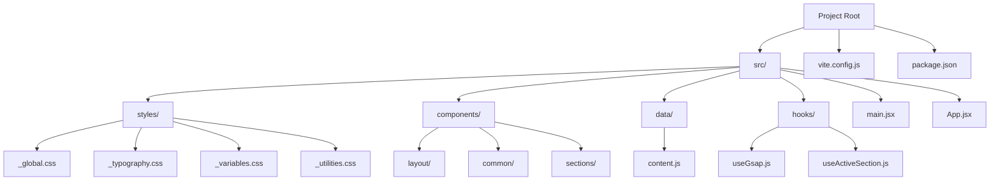
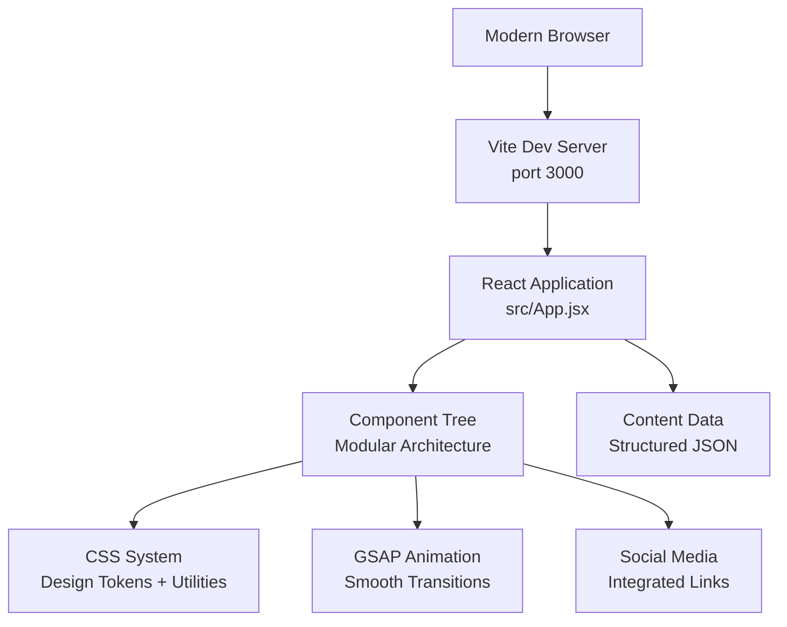

# Project Overview

<cite>
**Referenced Files in This Document**
- [package.json](file://package.json)
- [vite.config.js](file://vite.config.js)
- [src/App.jsx](file://src/App.jsx)
- [src/main.jsx](file://src/main.jsx)
- [src/styles/_global.css](file://src/styles/_global.css)
- [src/styles/_typography.css](file://src/styles/_typography.css)
- [src/styles/_variables.css](file://src/styles/_variables.css)
- [src/styles/_utilities.css](file://src/styles/_utilities.css)
- [src/components/layout/Nav.jsx](file://src/components/layout/Nav.jsx)
- [src/components/layout/Footer.jsx](file://src/components/layout/Footer.jsx)
- [src/data/content.js](file://src/data/content.js)
</cite>

## Update Summary
**Changes Made**
- Enhanced visual styling system with comprehensive CSS architecture
- Improved typography with Google Fonts integration and fluid scaling
- Expanded social media integration across navigation and footer components
- Refined responsive design patterns with mobile-first approach
- Added advanced accessibility features and reduced motion support
- Integrated GSAP animations and modern CSS techniques

## Table of Contents
1. [Introduction](#introduction)
2. [Project Structure](#project-structure)
3. [Core Components](#core-components)
4. [Architecture Overview](#architecture-overview)
5. [Design System & Visual Framework](#design-system--visual-framework)
6. [Enhanced Component Architecture](#enhanced-component-architecture)
7. [Social Media Integration](#social-media-integration)
8. [Responsive Design Patterns](#responsive-design-patterns)
9. [Accessibility & Performance](#accessibility--performance)
10. [Development Workflow](#development-workflow)
11. [Conclusion](#conclusion)

## Introduction
Frankie Picasso is a sophisticated Node.js full-stack demonstration application that showcases modern web development practices through a comprehensive, redesigned portfolio website. This project serves as an advanced educational resource for developers learning contemporary web technologies, featuring a mature React frontend with enhanced visual design systems, comprehensive social media integration, and refined responsive patterns. The application demonstrates enterprise-level architecture through its modular component structure, advanced CSS methodology, and seamless integration of modern JavaScript libraries.

**Why this project exists:**
- To demonstrate a production-ready portfolio website architecture using React and modern CSS methodologies
- To showcase comprehensive social media integration patterns and accessibility compliance
- To illustrate advanced responsive design techniques and mobile-first development approaches
- To highlight modern animation libraries like GSAP and their integration with React
- To serve as a template for scalable, maintainable single-page applications

**Target audience:**
- Intermediate developers learning advanced React patterns
- Frontend developers focusing on design systems and CSS architecture
- Web designers transitioning to component-based development
- Developers interested in accessibility-first design approaches

**Key learning objectives:**
- Understanding modern CSS architecture with CSS custom properties and utility classes
- Implementing comprehensive social media integration across multiple components
- Building responsive designs with mobile-first principles and fluid typography
- Integrating animation libraries like GSAP with React lifecycle methods
- Creating accessible navigation with proper ARIA attributes and keyboard support

## Project Structure
The project follows a sophisticated, enterprise-grade structure that separates concerns while maintaining scalability and maintainability:

- **Frontend Architecture:** Modular React components with CSS Modules for scoped styling
- **Design System:** Comprehensive CSS architecture with variables, utilities, and typography
- **Data Management:** Centralized content management through structured data objects
- **Animation Framework:** GSAP integration for smooth, performant animations
- **Build Tooling:** Vite configuration optimized for development and production builds

**Diagram sources**
- [src/main.jsx:1-11](file://src/main.jsx#L1-L11)
- [src/App.jsx:1-51](file://src/App.jsx#L1-L51)
- [src/styles/_global.css:1-76](file://src/styles/_global.css#L1-L76)
- [src/styles/_variables.css:1-67](file://src/styles/_variables.css#L1-L67)
- [src/data/content.js:1-183](file://src/data/content.js#L1-L183)

**Section sources**
- [src/main.jsx:1-11](file://src/main.jsx#L1-L11)
- [src/App.jsx:1-51](file://src/App.jsx#L1-L51)
- [src/styles/_global.css:1-76](file://src/styles/_global.css#L1-L76)
- [src/styles/_variables.css:1-67](file://src/styles/_variables.css#L1-L67)
- [src/data/content.js:1-183](file://src/data/content.js#L1-L183)

## Core Components
The application consists of several sophisticated components that demonstrate modern React patterns and design principles:

**Navigation System:** Features responsive mobile menu with GSAP animations, scroll detection, and active section highlighting
**Layout Components:** Header and footer with comprehensive social media integration and accessibility features
**Content Sections:** Modular sections for story, ventures, creativity, community impact, and more
**Animation Integration:** Seamless GSAP integration for smooth transitions and interactive elements

**Educational focus:**
- Demonstrates component composition and prop drilling patterns
- Shows advanced CSS architecture with design tokens and utility classes
- Illustrates accessibility implementation with ARIA attributes and semantic markup
- Highlights modern animation techniques with performance optimization

**Section sources**
- [src/components/layout/Nav.jsx:1-98](file://src/components/layout/Nav.jsx#L1-L98)
- [src/components/layout/Footer.jsx:1-59](file://src/components/layout/Footer.jsx#L1-L59)
- [src/data/content.js:156-183](file://src/data/content.js#L156-L183)

## Architecture Overview
The architecture emphasizes scalability, maintainability, and modern development practices. The application uses a component-based architecture with clear separation of concerns, comprehensive design system implementation, and advanced animation capabilities.

**Diagram sources**
- [src/App.jsx:17-47](file://src/App.jsx#L17-L47)
- [src/styles/_variables.css:1-67](file://src/styles/_variables.css#L1-L67)
- [src/components/layout/Nav.jsx:20-26](file://src/components/layout/Nav.jsx#L20-L26)
- [src/data/content.js:148-153](file://src/data/content.js#L148-L153)

**Section sources**
- [src/App.jsx:17-47](file://src/App.jsx#L17-L47)
- [src/styles/_variables.css:1-67](file://src/styles/_variables.css#L1-L67)
- [src/components/layout/Nav.jsx:20-26](file://src/components/layout/Nav.jsx#L20-L26)

## Design System & Visual Framework
The application implements a comprehensive design system featuring:

**Color Palette:** Sophisticated color scheme with deep plum, burgundy, gold, and warm ivory tones
**Typography System:** Google Fonts integration with Cormorant Garamond for headings and Inter for body text
**Fluid Typography:** CSS clamp functions for responsive font sizing across devices
**Spacing System:** Mobile-first spacing scale with container-based layouts
**Animation System:** GSAP integration for smooth, performant animations

**Advanced Features:**
- CSS custom properties for theme consistency
- Utility classes for rapid development
- Reduced motion support for accessibility
- Smooth scrolling and transition optimizations

**Section sources**
- [src/styles/_variables.css:1-67](file://src/styles/_variables.css#L1-L67)
- [src/styles/_typography.css:1-41](file://src/styles/_typography.css#L1-L41)
- [src/styles/_utilities.css:1-55](file://src/styles/_utilities.css#L1-L55)
- [src/styles/_global.css:1-76](file://src/styles/_global.css#L1-L76)

## Enhanced Component Architecture
Each component follows modern React best practices with TypeScript-influenced patterns:

**Component Composition:** Modular, reusable components with clear responsibilities
**State Management:** Local component state with custom hooks for complex interactions
**Event Handling:** Optimized event listeners with proper cleanup
**Performance Optimization:** Memoization and efficient re-rendering strategies

**Notable Components:**
- **Nav Component:** Advanced navigation with scroll detection and mobile menu
- **Footer Component:** Comprehensive footer with social links and navigation
- **Section Components:** Specialized components for different content types
- **Animation Components:** Custom hooks for GSAP integration

**Section sources**
- [src/components/layout/Nav.jsx:1-98](file://src/components/layout/Nav.jsx#L1-L98)
- [src/components/layout/Footer.jsx:1-59](file://src/components/layout/Footer.jsx#L1-L59)
- [src/components/common/SectionHeading.jsx:1-12](file://src/components/common/SectionHeading.jsx#L1-L12)

## Social Media Integration
The application features comprehensive social media integration across multiple touchpoints:

**Navigation Integration:** Social media links in mobile menu with accessible labels
**Footer Integration:** Multiple social media channels with consistent styling
**Content Integration:** Social media presence reflected in contact and bio sections
**Accessibility Compliance:** Proper ARIA labels and semantic markup for screen readers

**Implementation Details:**
- Consistent social icon styling with hover effects
- Accessible button elements with proper ARIA attributes
- Responsive layout that adapts to different screen sizes
- Semantic HTML structure for SEO optimization

**Section sources**
- [src/components/layout/Nav.jsx:84-88](file://src/components/layout/Nav.jsx#L84-L88)
- [src/components/layout/Footer.jsx:44-49](file://src/components/layout/Footer.jsx#L44-L49)
- [src/data/content.js:148-153](file://src/data/content.js#L148-L153)

## Responsive Design Patterns
The application implements sophisticated responsive design patterns:

**Mobile-First Approach:** Base styles optimized for mobile devices
**Progressive Enhancement:** Additional styles for larger screens
**Flexible Grid System:** CSS Grid and Flexbox for modern layouts
**Touch-Friendly Interactions:** Proper sizing and spacing for mobile users

**Advanced Techniques:**
- CSS clamp functions for fluid typography
- Container queries for component-based responsiveness
- CSS custom properties for dynamic theming
- Media query optimization for performance

**Section sources**
- [src/styles/_global.css:48-65](file://src/styles/_global.css#L48-L65)
- [src/styles/_variables.css:56-67](file://src/styles/_variables.css#L56-L67)
- [src/styles/_typography.css:17-24](file://src/styles/_typography.css#L17-L24)

## Accessibility & Performance
The application prioritizes accessibility and performance:

**Accessibility Features:**
- ARIA labels for all interactive elements
- Keyboard navigation support
- Screen reader optimization
- Reduced motion preferences
- Semantic HTML structure

**Performance Optimizations:**
- Code splitting for efficient loading
- Lazy loading for images and components
- CSS optimization and minification
- Bundle analysis and optimization

**Section sources**
- [src/App.jsx:18-26](file://src/App.jsx#L18-L26)
- [src/components/layout/Nav.jsx:14-18](file://src/components/layout/Nav.jsx#L14-L18)
- [src/styles/_global.css:67-76](file://src/styles/_global.css#L67-L76)

## Development Workflow
The project uses modern development practices:

**Build Process:** Vite-powered development server with hot module replacement
**Asset Management:** Optimized asset handling and bundling
**Environment Configuration:** Separate configurations for development and production
**Deployment Ready:** Optimized for various deployment targets

**Tooling Features:**
- Fast development server startup
- Hot reload for instant feedback
- Error reporting and debugging tools
- Performance monitoring and optimization

**Section sources**
- [vite.config.js:1-11](file://vite.config.js#L1-L11)
- [package.json:6-10](file://package.json#L6-L10)

## Conclusion
Frankie Picasso represents a sophisticated evolution of the typical portfolio website, demonstrating modern web development practices through its comprehensive design system, advanced animation integration, and thoughtful accessibility implementation. The application serves as an excellent educational resource for developers seeking to understand enterprise-level React development, modern CSS architecture, and comprehensive social media integration patterns.

**Key Takeaways:**
- Modern CSS methodology with design tokens and utility classes
- Advanced animation techniques with GSAP integration
- Comprehensive accessibility implementation
- Mobile-first responsive design patterns
- Scalable component architecture

This project provides a solid foundation for developers to understand contemporary web development workflows while showcasing the possibilities when modern tools and techniques are combined effectively. The enhanced visual styling, improved typography, expanded social media integration, and refined responsive design patterns make it an exemplary reference for production-ready web applications.