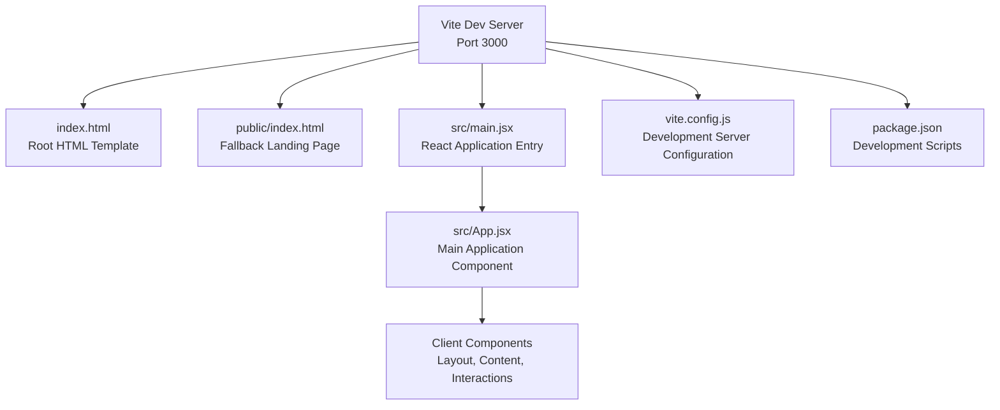
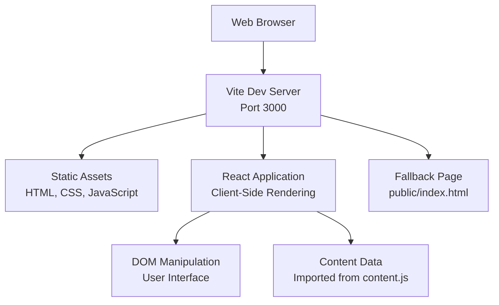
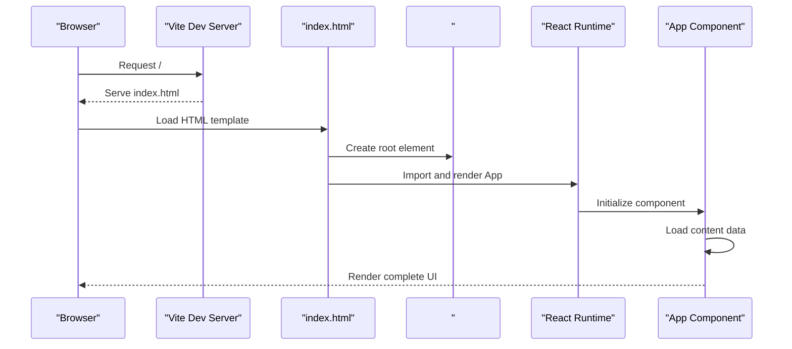
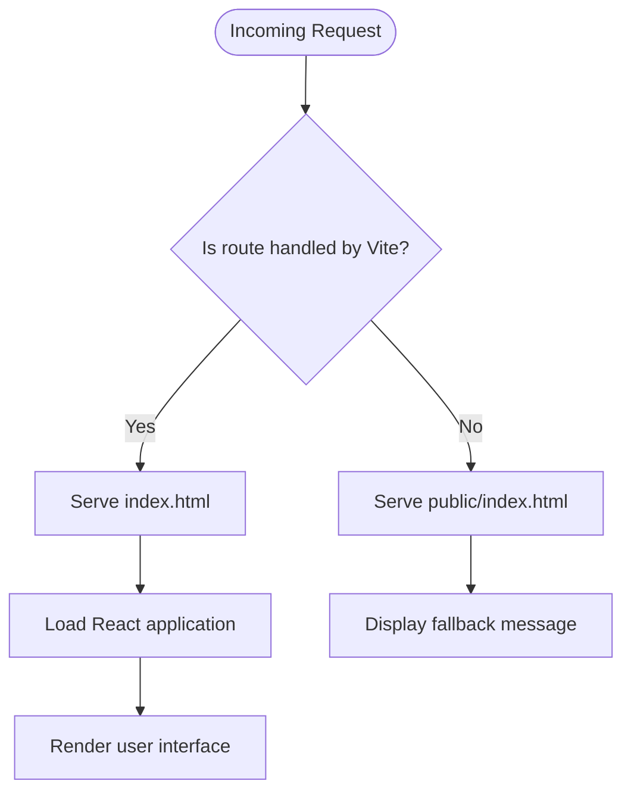
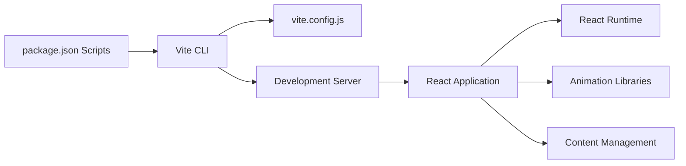

# Server Components

<cite>
**Referenced Files in This Document**
- [package.json](file://package.json)
- [vite.config.js](file://vite.config.js)
- [index.html](file://index.html)
- [public/index.html](file://public/index.html)
- [src/main.jsx](file://src/main.jsx)
- [src/App.jsx](file://src/App.jsx)
- [src/data/content.js](file://src/data/content.js)
</cite>

## Update Summary
**Changes Made**
- Removed all references to Express.js server components and backend architecture
- Updated architecture overview to reflect client-side only React application
- Removed server configuration, middleware, and route handler documentation
- Revised troubleshooting guide to focus on frontend development issues
- Updated all diagrams to show client-side architecture only

## Table of Contents
1. [Introduction](#introduction)
2. [Project Structure](#project-structure)
3. [Core Components](#core-components)
4. [Architecture Overview](#architecture-overview)
5. [Detailed Component Analysis](#detailed-component-analysis)
6. [Dependency Analysis](#dependency-analysis)
7. [Performance Considerations](#performance-considerations)
8. [Troubleshooting Guide](#troubleshooting-guide)
9. [Conclusion](#conclusion)
10. [Appendices](#appendices)

## Introduction
This document explains the client-side architecture and runtime behavior of the Frankie Picasso portfolio website. The repository contains a frontend-only React application built with Vite. The development environment runs on port 3000 and serves the React application along with static assets. There is no server-side architecture, Express.js server, or backend functionality present in this codebase. The application is entirely client-rendered using React and served statically by Vite's development server.

## Project Structure
The repository follows a modern React + Vite architecture with a focus on client-side rendering:
- Client-side React application under src/ with component-based structure
- Static HTML templates under public/ and at the repository root
- Vite configuration defining development server settings and plugin stack
- Package scripts for development, building, and previewing the application

**Diagram sources**
- [vite.config.js:4-10](file://vite.config.js#L4-L10)
- [package.json:6-10](file://package.json#L6-L10)
- [index.html:55-59](file://index.html#L55-L59)
- [public/index.html:14-18](file://public/index.html#L14-L18)
- [src/main.jsx:1-11](file://src/main.jsx#L1-L11)
- [src/App.jsx:1-51](file://src/App.jsx#L1-L51)

**Section sources**
- [package.json:1-23](file://package.json#L1-L23)
- [vite.config.js:1-11](file://vite.config.js#L1-L11)
- [index.html:1-61](file://index.html#L1-L61)
- [public/index.html:1-21](file://public/index.html#L1-L21)
- [src/main.jsx:1-11](file://src/main.jsx#L1-L11)
- [src/App.jsx:1-51](file://src/App.jsx#L1-L51)

## Core Components
The application consists entirely of client-side components and static assets:

- **Vite Development Server**: Runs on port 3000 with auto-open enabled, serving static assets and handling hot module replacement
- **React Application**: Client-side React app that renders the complete user interface
- **Static HTML Templates**: Two HTML files - root index.html for the main application and public/index.html as a fallback landing page
- **Component Architecture**: Modular React components organized by feature (layout, content sections, interactive elements)

Key runtime characteristics:
- All routing is handled client-side using React Router concepts
- State management occurs within React component hierarchy
- Data is managed through React hooks and imported content modules
- No server-side rendering or backend API calls are implemented

**Section sources**
- [vite.config.js:4-10](file://vite.config.js#L4-L10)
- [src/main.jsx:1-11](file://src/main.jsx#L1-L11)
- [src/App.jsx:17-51](file://src/App.jsx#L17-L51)
- [index.html:55-59](file://index.html#L55-L59)
- [public/index.html:14-18](file://public/index.html#L14-L18)

## Architecture Overview
The architecture is purely client-side with Vite serving as both development server and asset manager. The React application handles all user interactions and content presentation without any server-side processing.

**Diagram sources**
- [vite.config.js:6-9](file://vite.config.js#L6-L9)
- [src/main.jsx:6-10](file://src/main.jsx#L6-L10)
- [src/App.jsx:17-48](file://src/App.jsx#L17-L48)
- [src/data/content.js:1-185](file://src/data/content.js#L1-L185)
- [public/index.html:14-18](file://public/index.html#L14-L18)

## Detailed Component Analysis

### Vite Development Server Configuration
The development server is configured through Vite with minimal but essential settings:
- **Port**: 3000 (standard development port)
- **Auto-open**: Enabled (browser opens automatically)
- **Plugins**: React plugin integration for JSX support and HMR

This configuration provides the foundation for the development environment and hot module replacement capabilities.

**Section sources**
- [vite.config.js:4-10](file://vite.config.js#L4-L10)

### React Application Initialization
The React application bootstraps through a simple but effective pattern:
- Creates a root element in the DOM for React to manage
- Renders the App component within React.StrictMode
- Imports global styles before mounting the application

**Diagram sources**
- [index.html:55-59](file://index.html#L55-L59)
- [src/main.jsx:6-10](file://src/main.jsx#L6-L10)
- [src/App.jsx:17-48](file://src/App.jsx#L17-L48)

**Section sources**
- [index.html:55-59](file://index.html#L55-L59)
- [src/main.jsx:1-11](file://src/main.jsx#L1-L11)
- [src/App.jsx:17-48](file://src/App.jsx#L17-L48)

### Static HTML Templates
Two HTML templates serve different purposes in the application lifecycle:

**Root index.html**: Contains the main application shell with:
- Meta tags for SEO and social media optimization
- Loading screen implementation with CSS animations
- Root element (#root) for React application mounting
- Script tag loading the React application bundle

**Public index.html**: Minimal fallback page displayed when:
- Development server is not running
- Direct access to non-existent routes
- Production deployment without proper server configuration

**Diagram sources**
- [index.html:55-59](file://index.html#L55-L59)
- [public/index.html:14-18](file://public/index.html#L14-L18)

**Section sources**
- [index.html:1-61](file://index.html#L1-L61)
- [public/index.html:1-21](file://public/index.html#L1-L21)

## Dependency Analysis
The application maintains a lean dependency graph focused entirely on client-side functionality:

- **Production Dependencies**: React ecosystem (react, react-dom) and animation libraries (gsap, @gsap/react)
- **Development Dependencies**: Vite for build tooling and the React plugin for JSX support
- **Package Scripts**: Three essential scripts for development, building, and previewing

**Diagram sources**
- [package.json:6-10](file://package.json#L6-L10)
- [vite.config.js:1-11](file://vite.config.js#L1-L11)
- [src/main.jsx:1-3](file://src/main.jsx#L1-L3)

**Section sources**
- [package.json:1-23](file://package.json#L1-L23)
- [vite.config.js:1-11](file://vite.config.js#L1-L11)
- [src/main.jsx:1-3](file://src/main.jsx#L1-L3)

## Performance Considerations
Client-side React applications offer several performance advantages and considerations:

- **Development Experience**: Hot module replacement provides instant feedback during development
- **Bundle Size**: Keep React components modular to enable code splitting and lazy loading
- **Animation Performance**: GSAP provides optimized animations that run efficiently in browsers
- **Build Optimization**: Production builds minimize bundle size and optimize asset delivery
- **Memory Management**: React's virtual DOM minimizes direct DOM manipulation overhead

## Troubleshooting Guide
Common issues and solutions for the client-side React application:

**Development Server Issues**:
- **Server fails to start**: Verify Node.js version compatibility and run `npm install` to install dependencies
- **Port conflicts**: Change port number in vite.config.js if 3000 is unavailable
- **Hot reload not working**: Check browser console for JavaScript errors preventing HMR

**Application Rendering Issues**:
- **Blank page on load**: Verify #root element exists in HTML and React can mount successfully
- **Components not displaying**: Check browser console for import errors or missing dependencies
- **Animations not working**: Ensure GSAP libraries are properly imported and initialized

**Build and Deployment Issues**:
- **Build failures**: Run `npm run build` to test production compilation
- **Missing assets**: Verify static files are properly referenced in HTML templates
- **Content not loading**: Check that content.js exports are properly structured and imported

**Section sources**
- [vite.config.js:6-9](file://vite.config.js#L6-L9)
- [index.html:55-59](file://index.html#L55-L59)
- [src/App.jsx:17-48](file://src/App.jsx#L17-L48)

## Conclusion
This repository contains a fully client-side React application powered by Vite. The architecture eliminates all server-side concerns, focusing entirely on delivering an interactive web experience through client-side rendering. The development server provides a seamless development experience with hot module replacement, while the production build delivers optimized static assets. All functionality, from routing to content management, operates within the browser using React and its ecosystem of libraries.

## Appendices
- Development server configuration includes port 3000 and auto-open settings
- React application uses strict mode for development error detection
- Content management leverages imported data modules for dynamic content
- Animation library integration provides smooth user interactions

**Section sources**
- [vite.config.js:6-9](file://vite.config.js#L6-L9)
- [src/main.jsx:7-9](file://src/main.jsx#L7-L9)
- [src/data/content.js:1-185](file://src/data/content.js#L1-L185)