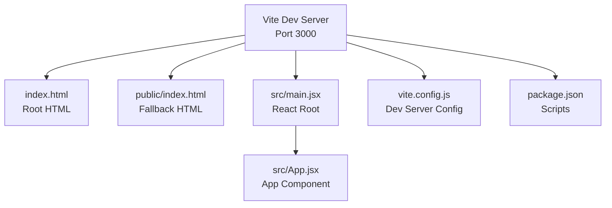
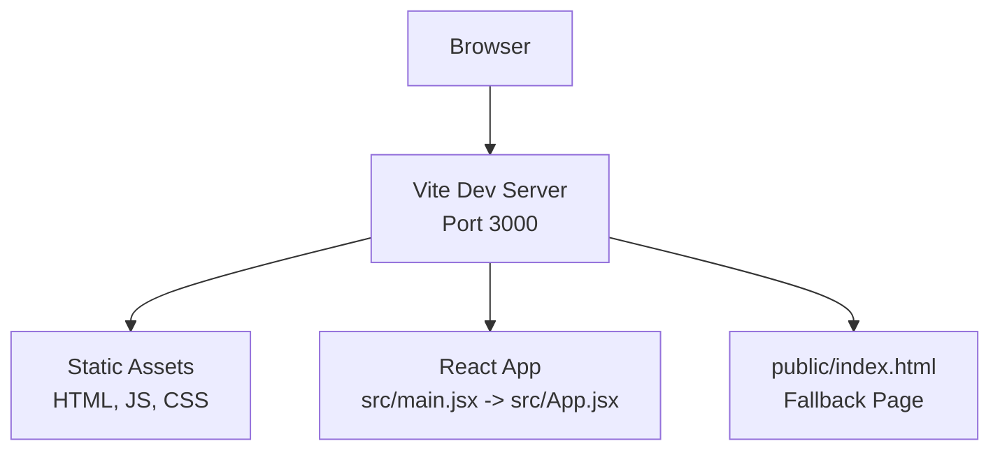
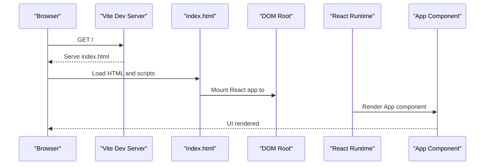
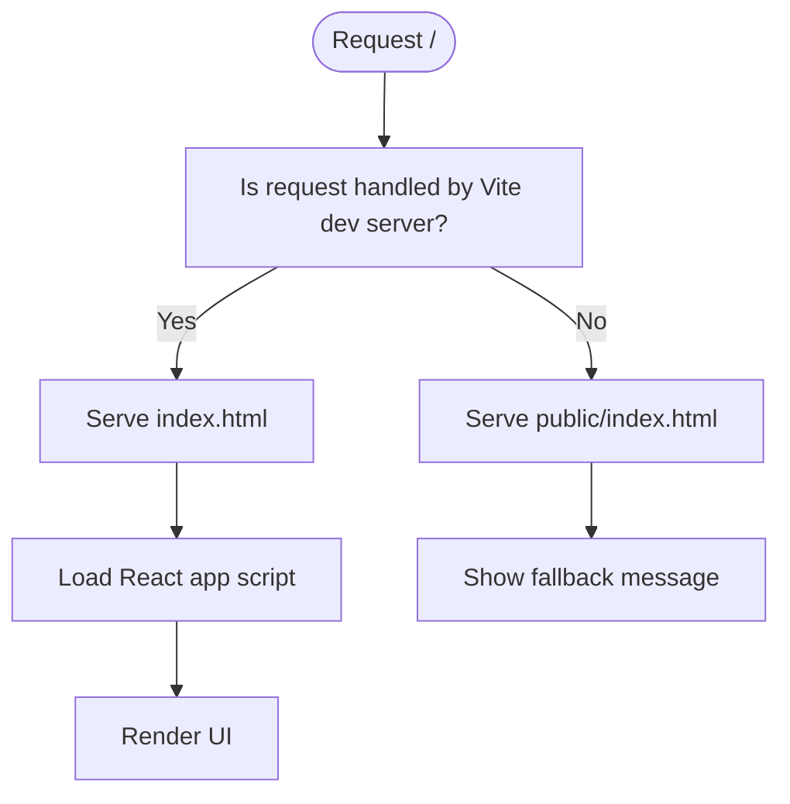
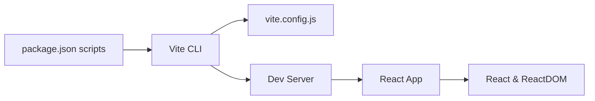

# Server Components

<cite>
**Referenced Files in This Document**
- [README.md](file://README.md)
- [package.json](file://package.json)
- [vite.config.js](file://vite.config.js)
- [index.html](file://index.html)
- [public/index.html](file://public/index.html)
- [src/main.jsx](file://src/main.jsx)
- [src/App.jsx](file://src/App.jsx)
</cite>

## Table of Contents
1. [Introduction](#introduction)
2. [Project Structure](#project-structure)
3. [Core Components](#core-components)
4. [Architecture Overview](#architecture-overview)
5. [Detailed Component Analysis](#detailed-component-analysis)
6. [Dependency Analysis](#dependency-analysis)
7. [Performance Considerations](#performance-considerations)
8. [Troubleshooting Guide](#troubleshooting-guide)
9. [Conclusion](#conclusion)
10. [Appendices](#appendices)

## Introduction
This document explains the server components and runtime behavior of the project. The repository is a frontend-focused React application built with Vite. The development server runs on port 3000 and serves the React app. There is no Express.js server present in this repository. Instead, Vite’s development server handles static assets and hot module replacement. The README indicates the server starts at http://localhost:3000.

## Project Structure
The repository is organized around a Vite + React application:
- Frontend entry points and components under src/
- Static HTML pages under public/ and at the repository root
- Vite configuration defines the development server port and plugin stack
- Scripts in package.json launch the Vite dev server

**Diagram sources**
- [vite.config.js:1-11](file://vite.config.js#L1-L11)
- [package.json:1-23](file://package.json#L1-L23)
- [index.html:1-61](file://index.html#L1-L61)
- [public/index.html:1-21](file://public/index.html#L1-L21)
- [src/main.jsx:1-10](file://src/main.jsx#L1-L10)
- [src/App.jsx:1-11](file://src/App.jsx#L1-L11)

**Section sources**
- [README.md:1-13](file://README.md#L1-L13)
- [vite.config.js:1-11](file://vite.config.js#L1-L11)
- [package.json:1-23](file://package.json#L1-L23)
- [index.html:1-61](file://index.html#L1-L61)
- [public/index.html:1-21](file://public/index.html#L1-L21)
- [src/main.jsx:1-10](file://src/main.jsx#L1-L10)
- [src/App.jsx:1-11](file://src/App.jsx#L1-L11)

## Core Components
- Vite Dev Server: Runs the development server on port 3000, enables automatic browser opening, and integrates the React plugin.
- React Application: The React app is mounted at the DOM root element and renders the App component.
- Static HTML Pages: Two HTML pages exist—one at the repository root and another under public/. The root HTML loads the React app via a script tag; the public page acts as a fallback landing page.

Key runtime behaviors:
- The development server serves static assets and proxies API requests if configured.
- The React app initializes in Strict Mode and mounts to the DOM root element.

**Section sources**
- [vite.config.js:1-11](file://vite.config.js#L1-L11)
- [src/main.jsx:1-10](file://src/main.jsx#L1-L10)
- [src/App.jsx:1-11](file://src/App.jsx#L1-L11)
- [index.html:55-59](file://index.html#L55-L59)
- [public/index.html:14-18](file://public/index.html#L14-L18)

## Architecture Overview
The runtime architecture is client-side focused. The Vite dev server serves the React application and static assets. No Express.js server is present in this repository.

**Diagram sources**
- [vite.config.js:6-9](file://vite.config.js#L6-L9)
- [src/main.jsx:6-10](file://src/main.jsx#L6-L10)
- [src/App.jsx:3-9](file://src/App.jsx#L3-L9)
- [public/index.html:14-18](file://public/index.html#L14-L18)

## Detailed Component Analysis

### Vite Dev Server Configuration
- Port: 3000
- Auto-open: Enabled
- Plugins: React plugin integrated

This configuration determines how the development server behaves and where it listens for requests.

**Section sources**
- [vite.config.js:4-10](file://vite.config.js#L4-L10)

### React Application Initialization
- The React app is rendered inside the DOM root element.
- The App component is a simple container that displays the site title.

**Diagram sources**
- [index.html:55-59](file://index.html#L55-L59)
- [src/main.jsx:6-10](file://src/main.jsx#L6-L10)
- [src/App.jsx:3-9](file://src/App.jsx#L3-L9)

**Section sources**
- [index.html:55-59](file://index.html#L55-L59)
- [src/main.jsx:6-10](file://src/main.jsx#L6-L10)
- [src/App.jsx:3-9](file://src/App.jsx#L3-L9)

### Static HTML Pages
- Root index.html: Loads the React app via a script tag and sets up a loading screen.
- public/index.html: A minimal fallback page displayed when the app is not served by the dev server.

**Diagram sources**
- [index.html:55-59](file://index.html#L55-L59)
- [public/index.html:14-18](file://public/index.html#L14-L18)

**Section sources**
- [index.html:1-61](file://index.html#L1-L61)
- [public/index.html:1-21](file://public/index.html#L1-L21)

## Dependency Analysis
- The project relies on Vite for development and build tooling.
- The React application depends on React and ReactDOM.
- The development server is configured via vite.config.js and launched via npm scripts.

**Diagram sources**
- [package.json:6-10](file://package.json#L6-L10)
- [vite.config.js:1-11](file://vite.config.js#L1-L11)
- [src/main.jsx:1-3](file://src/main.jsx#L1-L3)

**Section sources**
- [package.json:1-23](file://package.json#L1-L23)
- [vite.config.js:1-11](file://vite.config.js#L1-L11)
- [src/main.jsx:1-3](file://src/main.jsx#L1-L3)

## Performance Considerations
- Enable auto-open during development to reduce manual steps.
- Keep the React app tree shallow and avoid unnecessary re-renders.
- Use production builds for performance profiling and testing.

## Troubleshooting Guide
- Server does not start: Verify Node.js and npm installation, then run the dev script.
- Port conflict: Change the port in vite.config.js if 3000 is in use.
- Blank page: Confirm the DOM root element exists and React is rendering to it.
- Fallback page shown: Ensure the dev server is running and serving the React app.

**Section sources**
- [README.md:7-12](file://README.md#L7-L12)
- [vite.config.js:6-9](file://vite.config.js#L6-L9)
- [index.html:55-59](file://index.html#L55-L59)

## Conclusion
This repository is a frontend-only React application powered by Vite. The development server runs on port 3000 and serves the React app along with static assets. There is no Express.js server in this codebase. The documentation outlines how the dev server, React app, and static HTML pages work together to deliver the user interface.

## Appendices
- Development server port and auto-open are defined in the Vite configuration.
- The React app is initialized in the root HTML file and renders the App component.

**Section sources**
- [vite.config.js:6-9](file://vite.config.js#L6-L9)
- [index.html:55-59](file://index.html#L55-L59)
- [src/App.jsx:3-9](file://src/App.jsx#L3-L9)